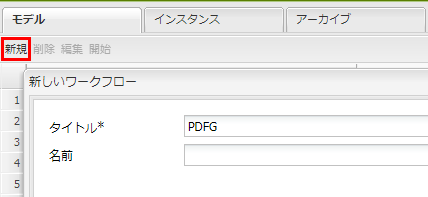

# AEM Forms の監視フォルダー{#watched-folder-in-aem-forms}

管理者は、ネットワークフォルダーを監視フォルダーとして設定することにより、ユーザーが任意のファイル（例えば PDF ファイル）を監視フォルダーに追加した時点から、事前に設定されたワークフロー、サービス、またはスクリプティング操作を開始し、追加されたファイルを処理することができます。指定された操作をサービスが実行した後、指定された出力フォルダーに出力ファイルが保存されます。ワークフロー、サービス、スクリプトについて詳しくは、「[さまざまなファイル処理方法](#variousmethodsforprocessingfiles)」を参照してください。

## 監視フォルダーの作成 {#create-a-watched-folder}

以下の方法のいずれか 1 つを使用して、監視フォルダーをファイルシステムに作成できます。

* 監視フォルダー設定ノードのプロパティの設定中に、親ディレクトリのフルパスを folderPath プロパテイに入力し、作成する監視フォルダーの名前を追加します（例：`C:/MyPDFs/MyWatchedFolder`）。`MyWatchedFolder` フォルダーが存在しない場合、AEM Forms は指定したパスでフォルダの作成を試みます。

* ファイルシステム上にフォルダーを作成してから監視フォルダーエンドポイントを設定し、folderPath プロパティにフルパスを入力します。folderPath プロパティについて詳しくは、「[監視フォルダーのプロパティ](#watchedfolderproperties)」を参照してください。

>[!NOTE]
>
>クラスター環境では、監視フォルダーとして使用されるフォルダーは、ファイルシステムまたはネットワーク上でアクセス、書き込み、共有が有効になっている必要があります。クラスターの各アプリケーションサーバーインスタンスは同じ共有フォルダーにアクセスできる必要があります。Windows の場合は、すべてのサーバー上にマッピングされたネットワークドライブを作成し、マッピングされたネットワークドライブのパスを folderPath プロパティで指定します。

## 監視フォルダー設定ノードの作成 {#create-watched-folder-configuration-node}

監視フォルダーを設定するには、監視フォルダー設定ノードを作成します。次の手順を実行して、設定ノードを作成します。

1. CRX-DE lite に管理者としてログインし、/etc/fd/watchfolder/config フォルダーに移動します。 

1. Create a node of type `nt:unstructured`. 名称は仮に watchedfolder としておきましょう。 

   >[!NOTE]
   >
   >監視フォルダーノードの名前には空白や特殊文字を含めることができません。

1. この  ノードに次のプロパティを追加します。

   * `folderPath`
   * `inputProcessorType`
   * `inputProcessorId`
   * `outputFilePattern`
   サポートされているプロパティの完全なリストについては、「[監視フォルダーのプロパティ](#watchedfolderproperties)」を参照してください。

1. 「**すべて保存**」をクリックします。ノードの作成後、プロパティが保存されます。The `input`, `result`, `failure`, `preserve`, and `stage`folders are created at the path specified in the `folderPath` property.

   定義した時間間隔でスキャンジョブが監視フォルダのスキャンを開始します。

## 監視フォルダーのプロパティ {#watchedfolderproperties}

監視フォルダーに対し、以下のプロパティを設定できます。

* **folderPath（文字列型）**：定義した時間間隔でスキャンする対象のフォルダーパスです。クラスター環境では、フォルダーが共有場所に存在し、すべてのサーバーが対象のサーバーに対するフルアクセス権を持っている必要があります。これは必須プロパティです。
* **inputProcessorType（文字列型）**：開始するプロセスのタイプです。ワークフロー、スクリプト、またはサービスを指定できます。これは必須プロパティです。
* **inputProcessorId（文字列型）**：inputProcessorId プロパティの動作は、inputProcessorType プロパティに指定した値に基づきます。これは必須プロパティです。以下のリストは、inputProcessorType プロパティに指定できるすべての値と、それに対応する inputProcessorType プロパティの必要条件です。

   * ワークフローに関しては、実行するワークフローモデルを指定します。例：/etc/workflow/models/&lt;workflow_name>/jcr:content/model
   * スクリプトに関しては、実行するスクリプトの JCR パスを指定します。例えば、/etc/fd/watchfolder/test/testScript.ecma などを指定します。
   * サービスの場合は、OSGi サービスの特定に使用するフィルターを指定します。サービスは com.adobe.aemfd.watchfolder.service.api.ContentProcessor インターフェイスの実装として登録されます。

* **runModes（文字列型）**：ワークフロー実行に許可する実行モードのカンマ区切りリストです。以下にいくつか例を挙げます。

   * author

   * publish

   * author, publish

   * publish, author

**注意**：*監視フォルダーをホストしているサーバーで実行モードが指定されていない場合、サーバー上の実行モードにかかわらず、監視フォルダーはアクティブになります。*

* **outputFilePattern（文字列型）**：出力ファイルのパターンです。フォルダーパターンまたはファイルパターンを 1 つ指定できます。フォルダーパターンを指定した場合は、出力ファイル名はワークフローでの設定に従います。ファイルパターンを指定した場合は、出力ファイル名はファイルパターンでの設定に従います。[ファイルパターンおよびフォルダーパターン](../../forms/using/watched-folder-in-aem-forms.md#p-file-and-folder-patterns-p)から、出力ファイルのディレクトリ構造を指定することもできます。これは必須プロパティです。

* **stageFileExpirationDuration（長整数型、デフォルト値は -1）**：任意の入力ファイルまたは入力フォルダーが処理を開始してから、タイムアウトし処理に失敗したと判定されるまでの待機時間の秒数。時間制限はこのプロパティの値が正である場合にのみ有効になります。

   **注意：***この機能によってタイムアウトとマークされた入力がバックグラウンドで処理され続ける場合がありますが、しばらくすると停止します。タイムアウト機能が起動する前に入力コンテンツが消費された場合、後になって処理が完了し、結果フォルダーに出力がダンプされることがあります。タイムアウト前にコンテンツが消費されなかった場合、後でコンテンツの消費を試行する際にエラーが発生する可能性が高くなります。このエラーは同じ入力の失敗フォルダーにも記録されます。一方、ジョブまたはワークフローの断続的な失敗によって入力処理が実行されなかった場合（これが時間制限により解決しようとしている状態です）、前述のどちらの結果にも至りません。したがって、失敗フォルダー内でタイムアウトによる失敗とマークされたすべてのエントリー（失敗ログ内の「ファイルが一定時間経過しても処理されなかったため、失敗としてマークされました」というフォームのメッセージを参照）については、結果フォルダー（および、同じ入力の他のエントリー用の失敗フォルダー自体）をスキャンして、事前に設定されたイベントがすべて実際に発生したかどうか確認することを推奨します。*

* 
* **deleteExpiredStageFileOnlyWhenThrottled（ブール型、デフォルト値は true）**：監視フォルダーに制限がある場合にのみタイムアウト機能を有効にするかどうか指定します。この機能は制限のある監視フォルダーにはより重要です。制限が有効になっている場合、（ジョブまたはワークフローの断続的失敗により）未処理状態で待機している少数のファイルが、バッチ全体の処理を停止させるおそれがあるためです。このプロパティの値に true（デフォルト値）を指定すると、制限のない監視フォルダーに対して時間制限が有効になりません。このプロパティの値に false を指定すると、stageFileExpirationDuration プロパティの値が正の数になっている限り、この機能が常に有効になります。

* **pollInterval（長整数型）**：入力用の監視フォルダーをスキャンする間隔（秒）。「ジョブ数を制限」設定が無効になっている場合、平均的なジョブの処理にかかる時間よりも長い時間を pollInterval に指定する必要があります。そうしないと、システムが過負荷になるおそれがあります。デフォルト値は 5 です。詳しくは、batchSize の説明を参照してください。pollInterval には 1 以上の値を指定する必要があります。
* **excludeFilePattern（文字列型）**：スキャンおよび取得の対象から除外するファイルとフォルダーを決めるために監視フォルダーで使用されるパターンのセミコロン（;）区切りのリストです。このパターンに当てはまるファイルまたはフォルダーは、スキャンの対象外となります。この設定は、複数のファイルが存在するフォルダーが入力に使用される場合に便利です。フォルダーの内容を任意の名前のフォルダーにコピーし、監視フォルダーの取得対象に含めることができます。これにより、フォルダーが入力フォルダーに完全にコピーされる前に監視フォルダーがフォルダーを取得することを回避できます。デフォルト値は null です。You can use [file patterns](../../forms/using/watched-folder-in-aem-forms.md#p-file-and-folder-patterns-p) to exclude:

   * 特定の拡張子をファイル名に持つファイル。例えば *.dat、*.xml、*.pdf、*
   * 特定の文字列をファイル名に持つファイル。例えば data* を指定すると、data1、data2 などの名前を持つファイルおよびフォルダーが除外されます。
   * 次のような名前および拡張子が混在する式に一致するファイル。

      * Data[0-9][0-9][0-9].[dD][aA]&#39;port&#39;
      * *.[dD][Aa]&#39;port&#39;
      * *.[Xx][Mm][Ll]

ファイルパターンについて詳しくは、「[ファイルパターンについて](../../forms/using/watched-folder-in-aem-forms.md#p-file-and-folder-patterns-p)」を参照してください。

* **includeFilePattern（文字列型）**：スキャンおよび取得の対象に含めるフォルダーおよびファイルを決めるために、監視フォルダーで使用されるパターンのセミコロン（;）区切りのリストです。例えば、IncludeFilePattern に input* を指定すると、input* に一致する名前を持つすべてのファイルおよびフォルダーが取得されます。input1、input2 などの名前を持つファイルおよびフォルダーが含まれます。デフォルト値は * です。すべてのファイルとフォルダーが対象となります。次のように、含めるファイルパターンを指定できます。

   * 特定の拡張子をファイル名に持つファイル。例えば *.dat、*.xml、*.pdf、*
   * data.* を指定すると、data1 や data2 などの名前を持つファイルおよびフォルダーが対象に含まれます。

* 次のような名前および拡張子が混在する式に一致するファイル。

   * Data[0-9][0-9][0-9].[dD][aA]&#39;port&#39;

      * *.[dD][Aa]&#39;port&#39;
      * *.[Xx][Mm][Ll]

ファイルパターンについて詳しくは、「[ファイルパターンについて](../../forms/using/watched-folder-in-aem-forms.md#p-file-and-folder-patterns-p)」を参照してください。

* **waitTime（長整数型）**：フォルダーまたはファイルの作成からスキャンするまでの待機時間（ミリ秒）です。例えば、待機時間が 3,600,000 ミリ秒（1 時間）のときにファイルが 1 分前に作成されている場合、59 分以上経過するとこのファイルが取得されます。デフォルト値は 0 です。この設定は、ファイルまたはフォルダーを入力フォルダーにコピーする処理を確実に完了するために役立ちます。例えば、処理の対象となるファイルが大きく、そのファイルをダウンロードするのに 10 分かかる場合は、待機時間を 10*60*1000 ミリ秒に設定します。この設定により、ファイルが作成されてから 10 分が経過していない場合は、監視フォルダーはそのファイルをスキャンしなくなります。
* **purgeDuration（長整数型）**：結果フォルダー内にこの値より古いファイルおよびフォルダーがある場合、それらは削除されます。この値の単位は日です。この設定は、結果フォルダーに常に空き容量を確保しておきたい場合に役立ちます。-1 を指定すると、結果フォルダーの削除は行われません。デフォルト値は -1 です。
* **resultFolderName（文字列型）**：保存結果を格納するフォルダーです。結果がこのフォルダーに表示されない場合は、失敗フォルダーを確認してください。読み取り専用ファイルは処理されず、失敗フォルダーに保存されます。絶対パスまたは相対パスを次のファイルパターンを使用して指定できます。

   * %F = ファイル名プレフィックス
   * %E = ファイル拡張子
   * %Y = 年（4 桁表記）
   * %y = 年（下 2 桁）
   * %M = 月
   * %D = 日（1～31）
   * %d = 日（通日）
   * %H = 時（24 時間）
   * %h = 時（12 時間）
   * %m = 分
   * %s = 秒
   * %l = ミリ秒
   * %R = 乱数（0～9）
   * %P = プロセス ID またはジョブ ID
   例えば、2009 年 7 月 17 日午後 8 時に C:/Test/WF0/failure/%Y/%M/%D/%H/ と指定した場合、結果フォルダーは C:/Test/WF0/failure/2009/07/17/20 となります。

   絶対パスではなく相対パスを指定すると、そのフォルダーは監視フォルダーの中に作成されます。デフォルト値は result/%Y/%M/%D/ であり、監視フォルダー内の結果フォルダーです。ファイルパターンについて詳しくは、「[ファイルパターンについて](../../forms/using/watched-folder-in-aem-forms.md#p-file-and-folder-patterns-p)」を参照してください。

>[!NOTE]
>
>結果フォルダーのサイズを小さくすればするほど、監視フォルダーの動作は向上します。例えば、監視フォルダーの推定負荷が毎時 1000 個のファイルである場合、result/%Y%M%D%H のようなパターンを使用して、1 時間ごとに新しいサブフォルダーが作成されるようにします。これよりも負荷が小さい場合（例えば、1 日に 1000 個のファイル）、result/%Y%M%D のようなパターンを使用することもできます。

* **failureFolderName（文字列型）**：失敗ファイルが保存されるフォルダーです。この場所は、常に監視フォルダーからの相対パスで指定します。「結果フォルダー」で説明したファイルパターンを使用できます。読み取り専用ファイルは処理されず、失敗フォルダーに保存されます。デフォルト値は「failure/%Y/%M/%D/」です。
* **preserveFolderName（文字列型）**：正常に処理され、保存されたファイルの保存場所です。相対パス、絶対パスまたは null のディレクトリパスを指定できます。「結果フォルダー」で説明したファイルパターンを使用できます。デフォルト値は「preserve/%Y/%M/%D/」です。
* **batchSize（長整数型）**：1 回のスキャンで取得されるファイルまたはフォルダーの数です。この設定を使用して、システムが過負荷の状態になるのを防ぎます。一度にスキャンするファイル数が多すぎる場合、クラッシュする可能性があります。デフォルト値は 2 です。

    pollInterval 設定と batchSize 設定では、監視フォルダーがスキャンごとに取得するファイルの数を指定します。監視フォルダーは、Quartz スレッドプールを使用して入力フォルダーをスキャンします。スレッドプールは他のサービスと共有されます。スキャンの間隔が小さいと、スレッドによって入力フォルダーが頻繁にスキャンされます。ファイルが頻繁に監視フォルダーに配置される場合は、スキャンの間隔を小さくする必要があります。ファイルが頻繁には配置されない場合は、他のサービスがスレッドを使用できるように、スキャンの間隔を長くとります。

   配置されるファイル数が多い場合は、バッチサイズを大きくします。例えば、監視フォルダーエンドポイントによって開始されるサービスが毎分 700 個のファイルを処理でき、これと同じ速度でユーザーが入力フォルダーにファイルを配置するとします。このとき、batchSize に 350 を、pollInterval に 30 秒を指定すると、過度に頻繁に監視フォルダーをスキャンするコストを発生させることなく、監視フォルダーのパフォーマンスを向上させることができます。

    ファイルが監視フォルダーに配置されると、監視フォルダーは入力中のファイルのリストを作成します。これにより、スキャンが 1 秒ごとに行われている場合、パフォーマンスが低下するおそれがあります。スキャンの間隔を長くすると、パフォーマンスが向上する可能性があります。配置されるファイルの量が少ない場合は、それに従って batchSize と pollInterval の値を調整します。例えば、毎秒 10 個のファイルが配置される場合は、pollInterval に 1 秒を、batchSize に 10 を指定します。

* **throttleOn（ブール型）**：このオプションを選択すると、AEM Forms で同時に処理できる監視フォルダーのジョブ数が制限されます。ジョブの最大数は、バッチサイズ値によって決まりますデフォルト値は true です。（「[ジョブ数の制限について](../../forms/using/watched-folder-in-aem-forms.md#p-about-throttling-p)」を参照）。

* **overwriteDuplicateFilename（ブール型）**：この値を True に設定すると、結果フォルダーと保存用フォルダーにあるファイルが上書きされます。「False」に設定すると、ファイル名とフォルダー名の最後に数字のインデックスが付加されます。デフォルト値は False です。
* **preserveOnFailure（ブール型）**：サービスで操作の実行に失敗した場合に、入力ファイルを保存します。デフォルト値は true です。
* **inputFilePattern（文字列型）**：監視フォルダー向けに入力ファイルのパターンを指定します。ファイルのホワイトリストを作成します。
* **asynch（ブール型）**：呼び出しを非同期型にするか同期型にするかを指定します。デフォルト値は true（非同期型）です。ファイル処理はリソースを消費するタスクです。asynch フラグの値を true のままにして、スキャンジョブのメインスレッドが停止しないようにしてください。クラスター環境では、フラグを true のままにしておいて、利用可能なサーバー間で処理されているファイルのロードバランシング機能を有効化することが非常に重要です。フラグを false に設定すると、スキャンジョブは、トップレベルのファイルまたはフォルダーを順にそれぞれのスレッド内で処理しようとします。単一のサーバー環境上でワークフローベースの処理を行うなど、特別な理由がある場合を除き、フラグは false に設定しないでください。

>[!NOTE]
>
>設計仕様により、ワークフローは非同期型です。たとえ値に false を指定したとしても、ワークフローは非同期モードで開始されます。

* **enabled（ブール型）**：監視フォルダーのスキャンを有効化または無効化します。監視フォルダーのスキャンを開始するには、enabled に true を指定します。デフォルト値は true です。
* **payloadMapperFilter**：特定のフォルダーを監視フォルダーとして設定すると、その監視フォルダー内にフォルダー構造が作成されます。このフォルダー構造には、入力データを提供するフォルダー、出力（処理の実行結果）を受信するフォルダー、障害データを保存するフォルダー、長期間にわたって実行される処理のデータを保存するフォルダー、各種ステージのデータを保存するフォルダーが格納されます。監視フォルダーのフォルダー構造は、Forms 中心のワークフローのペイロードとして使用することができます。ペイロードマッパーにより、入力、出力、処理で監視フォルダーを使用するペイロードの構造を定義することができます。For example, if you use the default mapper, it maps content of Watched Folder with [payload]\input and [payload]\output folder. すぐに使用できる 2 つのペイロードマッパー実装が用意されています。[カスタムのマッパー実装](../../forms/using/watched-folder-in-aem-forms.md#creating-a-custom-payload-mapper-filter)がない場合は、用意されている 2 つのマッパー実装のいずれかを使用してください。

   * **デフォルトのマッパー：**&#x200B;デフォルトのペイロードマッパーを使用して、監視フォルダーの入力と出力の内容をペイロード内の別々の入出力フォルダーに保存します。Also, in payload path of a workflow, use [payload]/input/ and [payload]/output paths to retrive and save content.

   * **単純なファイルベースのペイロードマッパー：**&#x200B;入力と出力の内容をペイロードフォルダーに直接保存するには、単純なファイルベースのペイロードマッパーを使用してください。デフォルトのマッパーのような追加の階層は作成されません。

### カスタム設定パラメーター {#custom-configuration-parameters}

上記の一覧で示した監視フォルダー設定プロパティの他に、カスタム設定パラメーターを指定することができます。カスタム設定パラメーターはファイル処理コードに渡されます。これにより、パラメーターの値に基づいてコードの動作を変更することができます。パラメーターを指定するには：

1. CRXDE-Lite にログインし、監視フォルダー設定ノードへ移動します。
1. プロパティパラメーター&lt;property_name> を監視フォルダー設定ノードに 1 つ追加します。追加できるプロパティのタイプは、ブール型、日付型、10 進数型、倍精度浮動小数点数型、長整数型、文字列型のみです。単一の値をとるプロパティおよび複数の値をとるプロパティを指定できます。

**注意：**&#x200B;プロパティのデータ型が倍精度浮動小数点数型である場合は、そのようなプロパティの値に小数点を入力してください。倍精度浮動小数点数型のプロパティの値に小数点が入力されていない場合は、そのプロパティは長整数型に変換されます。

以上のプロパティは、Map&lt;String, Object> 型の不変マップとして、処理コードに渡されます。処理コードには、ECMAScript、ワークフロー、サービスのいずれかを使用できます。プロパティに指定した値は、マップ内では、キーと値のペアの形式で扱うことができます。キーはプロパティ名であり、値はプロパティの値です。カスタム設定パラメーターについて詳しくは、以下の画像を参照してください。


必須プロパテイの他、いくつかのオプションのパラメータと設定パラメーターが存在する監視フォルダ設定ノードのサンプル

#### ワークフロー向けの可変変数 {#mutable-variables-for-workflows}

ワークフローベースのファイル処理方法を実行するため、可変変数を作成できます。これらの変数は、ワークフローのステップに基づくデータフローのコンテナの役割を果たします。そのような変数を作成するには：

1. CRXDE-Lite にログインし、監視フォルダー設定ノードへ移動します。

1. プロパティ workflow.var.&lt;variable_name> を監視フォルダー設定ノードに追加します。

   追加できるプロパティのタイプは、ブール型、日付型、10 進数型、倍精度浮動小数点数型、長整数型、文字列型のみです。複数の値をとるプロパティもサポートされます。複数の値をとるプロパティの場合、ワークフローのステップに使用される値は、指定した型の配列をとります。

   >[!NOTE]
   >
   >倍精度浮動小数点数型のプロパティの場合は、値に小数点を指定します。倍精度浮動小数点数型のプロパティの値に小数点が入力されていない場合は、そのプロパティは長整数型に変換されます。

>[!NOTE]
>
>JCR 仕様により、プロパティにはデフォルト値が指定されます。デフォルト値は処理ワークフローの各ステップで使用できます。このため、正しいデフォルト値を指定してください。


## さまざまなファイル処理方法 {#variousmethodsforprocessingfiles}

ワークフロー、サービス、またはスクリプトを開始して、監視フォルダーに置かれたドキュメントを処理できます。

### サービスを使用した監視フォルダーのファイルの処理 {#using-a-service-to-process-files-of-a-watched-folder-nbsp}

サービスは `com.adobe.aemfd.watchfolder.service.api.ContentProcessor` インターフェイスのカスタム実装です。いくつかのカスタムプロパティと一緒に OSGi に登録されています。カスタムプロパティにより一意の実装を作成できるため、実装を特定するのに役立ちます。

#### ContentProcessor インターフェイスのカスタム実装 {#custom-implementation-of-the-contentprocessor-interface}

カスタム実装は、処理のコンテキスト（タイプ com.adobe.aemfd.watchfolder.service.api.ProcessorContext のオブジェクト）を受け取り、入力ドキュメントと設定パラメーターをコンテキストから読み取って入力を処理し、出力をコンテキストに追加します。ProcessorContext には、以下の API が用意されています。

* **getWatchFolderId**：監視フォルダーの ID を返します。
* **getInputMap**：Map 型のマップを返します。マップのキーは、入力ファイルのファイル名と、ファイルのコンテンツを含むドキュメントオブジェクトです。入力ファイルを読み取るには、getinputMap API を使用します。
* **getConfigParameters**：Map 型の不変マップを返します。マップには監視フォルダーの設定パラメーターが含まれています。

* **setResult**：この API は、ContentProcessor 実装が出力ドキュメントを結果フォルダーに書き出す際に使用されます。setResult API には出力ファイルの名前を指定できます。この API は、指定された出力フォルダーパターンまたは出力ファイルパターンに応じて、提供されたファイルを使用または無視する場合があります。フォルダーパターンを指定した場合は、出力ファイル名はワークフローでの設定に従います。ファイルパターンを指定した場合は、出力ファイル名はファイルパターンでの設定に従います。

例えば、以下のコードはカスタムの foo=bar プロパティを持つ ContentProcessor インターフェイスのカスタム実装です。

```java
@Component(metatype = true, immediate = true, label = "WF Test Service", description = "WF Test Service")
@Service(value = {OutputWriter.class, ContentProcessor.class})
@Property(name = "foo", value = "bar")
public class OutputWriter implements ContentProcessor {
```

[監視フォルダーの設定](../../forms/using/watched-folder-in-aem-forms.md#p-create-watched-folder-configuration-node-p)中、inputProcessorId プロパティを（foo=bar）として指定し、inputProcessorType プロパティをサービスとして指定した場合、上記のサービス（カスタム実装）は、監視フォルダーの入力ファイルの処理に使用されます。

以下の例も ContentProcessor インターフェイスのカスタム実装です。この例では、サービスは入力ファイルを受け取り、ファイルを一時領域にコピーして、ファイルのコンテンツを持つドキュメントオブジェクトを返します。ドキュメントオブジェクトのコンテンツは結果フォルダーに保存されます。結果フォルダーの物理パスは、[監視フォルダー設定ノード](../../forms/using/watched-folder-in-aem-forms.md#p-create-watched-folder-configuration-node-p)に設定されます。

```java
@Component(immediate = true)
@Service(value = ContentProcessor.class)
@Property(name = "serviceSelector", value = "testProcessor1")
public class TestContentProcessor1 implements ContentProcessor {
    @Override
    public void processInputs(ProcessorContext context) throws Exception {
        Map.Entry<String, Document> e = context.getInputMap().entrySet().iterator().next();
        File f = new File((String) context.getConfigParameters().get("tempDir"),
                context.getConfigParameters().get("outPrefix") + e.getKey());
        e.getValue().copyToFile(f);
        context.setResult(f.getName(), new Document(f, true));
    }
}
```

### スクリプトを使用した監視フォルダーのファイルの処理 {#using-scripts-to-process-files-of-a-watched-folder}

監視フォルダーに置かれたドキュメントの処理に使用されるスクリプトは、ECMAScript 準拠カスタムコードです。スクリプトは JCR ノードとして表されます。標準的な ECMAScript 変数（log、sling など）に加えて、スクリプトでは processorContext 変数を使用できます。この変数のデータ型は ProcessorContext です。ProcessorContext には、以下の API が用意されています。

* **getWatchFolderId**：監視フォルダーの ID を返します。
* **getInputMap**：Map 型のマップを返します。マップのキーは、入力ファイルのファイル名と、ファイルのコンテンツを含むドキュメントオブジェクトです。入力ファイルを読み取るには、getinputMap API を使用します。
* **getConfigParameters**：Map 型の不変マップを返します。マップには監視フォルダーの設定パラメーターが含まれています。
* **setResult**：この API は、ContentProcessor 実装が出力ドキュメントを結果フォルダーに書き出す際に使用されます。setResult API には出力ファイルの名前を指定できます。この API は、指定された出力フォルダーパターンまたは出力ファイルパターンに応じて、提供されたファイルを使用または無視する場合があります。フォルダーパターンを指定した場合は、出力ファイル名はワークフローでの設定に従います。ファイルパターンを指定した場合は、出力ファイル名はファイルパターンでの設定に従います。

以下のコードは ECMAScript の一例です。入力ファイルを受け取ると、ファイルを一時領域にコピーし、ファイルのコンテンツを持つドキュメントオブジェクトを返します。ドキュメントオブジェクトのコンテンツは結果フォルダーに保存されます。結果フォルダーの物理パスは、[監視フォルダー設定ノード](../../forms/using/watched-folder-in-aem-forms.md#p-create-watched-folder-configuration-node-p)に設定されます。

>[!NOTE]
>
>出力フォルダーおよびファイル名のプレフィックスは、監視フォルダー設定パラメーターに基づいて決定されます。

```java
var inputMap = processorContext.getInputMap();
var params = processorContext.getConfigParameters();
var entry = inputMap.entrySet().iterator().next();
var tempFile = new Packages.java.io.File(params.get("tempDir"), params.get("outPrefix") + entry.getKey());
entry.getValue().copyToFile(tempFile);
processorContext.setResult(tempFile.getName(), new Packages.com.adobe.aemfd.docmanager.Document(tempFile, true));
```

#### スクリプトの場所とセキュリティ上の考慮事項 {#location-of-scripts-and-security-considerations}

デフォルトでは、コンテナフォルダーが提供されており、ユーザーはこのフォルダーにスクリプトを配置することができます。また、監視フォルダーのフレームワークによって使用されるデフォルトのサービスユーザーには、この場所からスクリプトを読み取るために必要な権限が付与されています。

スクリプトをカスタムの場所に配置する予定の場合、デフォルトのサービスユーザーには、カスタムの場所に対する読み取り権限がない可能性があります。 その場合、次の手順を実行して必要な権限をカスタムの場所に入力します。

1. Create a system user programmatically or via the console https://&#39;[server]:[port]&#39;/crx/explorer. 既存のシステムユーザーを使用することもできます。ここでは、通常のユーザーではなく、システムユーザーを使用することが重要です。
1. カスタムの場所（ここにスクリプトが保存されます）にある新規作成したシステムユーザーまたは既存のシステムユーザーに読み取り権限を与えます。カスタムの場所は複数持つことができます。すべてのカスタムの場所に少なくとも読み取り権限を付与します。
1. Felix Configuration Console（/system/console/configMgr）で、監視フォルダーのサービスユーザーマッピングを検索します。このマッピングは「Mapping: adobe-aemds-core-watch-folder=...」のようになります。
1. このマッピングをクリックします。「adobe-aemds-core-watch-folder:scripts=fd-service」というエントリで、fd-serviceをカスタムシステムユーザーのIDに変更します。 「保存」をクリックします。

これで、構成済みのカスタムの場所を使用してスクリプトを保存することができるようになります。

### ワークフローを使用した監視フォルダーのファイルの処理 {#using-a-workflow-to-process-files-of-a-watched-folder}

ワークフローにより、Experience Manager のアクティビティを自動化できます。ワークフローは、特定の順序で実行される一連のステップで構成されます。各ステップで、ページのアクティベートや電子メールメッセージの送信など、個別のアクティビティが実行されます。ワークフローでは、リポジトリ内のアセット、ユーザーアカウントおよび Experience Manager サービスとやり取りができます。したがって、ワークフローでは複雑な連携を行わせることができます。

* ワークフローを作成する前に、次の点を考慮してください。
* 任意のステップの出力は、すべての後続のステップで使用できるようにしておく必要があります。前の手順で生成された既存の出力を更新（または削除）できる必要があります。
* 可変変数は、各ステップ間におけるカスタムダイナミックデータの受け渡しに使用されます。

ワークフローを使用してファイルを処理するには、次の手順を実行します。

1. `com.adobe.aemfd.watchfolder.workflow.api.WorkflowContextProcessor` インターフェイスの実装を作成します。これはサービスのために作成した実装と同様です。

   >[!NOTE]
   >
   >ECMAScript を全面的に使用した完全な実装を作成することができます。

1. ワークフローの任意のステップで、タイプ com.adobe.aemfd.watchfolder.workflow.api.WorkflowContextService の OSGi サービスの場所を指定し、サービスの execute() メソッドを呼び出して以下の引数を指定します。

   * WorkflowContextProcessor インターフェイスのカスタム実装
   * workItem
   * workflowSession
   * メタデータ

ワークフローの実装に Java プログラム言語を使用する場合は、AEM ワークフローエンジンから workItem、workflowSession、metadata 変数の値が提供されます。これらの変数は、WorkflowProcess カスタム実装の execute() メソッドに引数として渡されます。

ワークフローの実装に ECMAScript を使用する場合は、AEM ワークフローエンジンから graniteWorkItem、graniteWorkflowSession、metadata 変数の値が提供されます。これらの変数は、WorkflowContextService.execute() メソッドに引数として渡されます。

processWorkflowContext() へ渡される引数は、タイプ com.adobe.aemfd.watchfolder.workflow.api.WorkflowContext のオブジェクトです。上記のワークフロー固有の考慮事項をサポートするため、WorkflowContext インターフェイスには以下の API が用意されています。

* getWorkItem：WorkItem 変数の値を返します。各変数は WorkflowContextService.execute() メソッドに渡されます。
* getWorkflowSession：WorkflowSession 変数の値を返します。各変数は WorkflowContextService.execute() メソッドに渡されます。
* getMetadata：metadata 変数の値を返します。各変数は WorkflowContextService.execute() メソッドに渡されます。
* getCommittedVariables：読み取り専用オブジェクトマップを返します。マップには以前のステップで設定された変数が表示されます。変数が以前のステップで変更されていない場合、監視フォルダーの設定時に指定したデフォルトの値を返します。
* getCommittedResults：読み取り専用のドキュメントマップを返します。マップには以前のステップで生成された出力ファイルが表示されます。
* setVariable：WorkflowContextProcessor 実装はこの変数を使用して、各ステップ間で受け渡されるカスタムダイナミックデータを表す変数を操作します。変数の名前とデータ型は、[監視フォルダーの設定](../../forms/using/watched-folder-in-aem-forms.md#p-configure-the-watched-folder-p)時に指定した変数名と一致します。変数の値を変更するには、setVariable API を呼び出し、null でない値を指定します。変数を消去するには、setVariable() を呼び出し、値に nulll を指定します。

以下の ProcessorContext API も使用可能です。

* getWatchFolderId：監視フォルダーの ID を返します。
* getInputMap：タイプ Map&lt;String, Document> のマップを返します。マップのキーは、入力ファイルのファイル名と、ファイルのコンテンツを含むドキュメントオブジェクトです。入力ファイルを読み取るには、getinputMap API を使用します。
* getConfigParameters：タイプ Map&lt;String, Object> の不変マップを返します。マップには監視フォルダーの設定パラメーターが含まれています。
* setResult：この API は、ContentProcessor 実装が出力ドキュメントを結果フォルダーに書き出す際に使用されます。setResult API には出力ファイルの名前を指定できます。この API は、指定された出力フォルダーパターンまたは出力ファイルパターンに応じて、提供されたファイルを使用または無視する場合があります。フォルダーパターンを指定した場合は、出力ファイル名はワークフローでの設定に従います。ファイルパターンを指定した場合は、出力ファイル名はファイルパターンでの設定に従います。

setResult APIの考慮事項(ワークフローで使用する場合):

* ワークフローの出力全体に影響する新しい出力ドキュメントを追加するには、setResult API を呼び出す際に、以前のステップで出力ファイル名として使用されていないファイル名を指定します。
* 以前のステップで生成された出力を更新するには、setResult API を呼び出す際に、以前のステップで使用したファイル名を指定します。
* 以前のステップで生成された出力を削除するには、setResult を呼び出す際に、以前のステップで使用したファイル名を指定し、null をコンテンツとして指定します。

>[!NOTE]
>
>他のシナリオにおいて setResult API の呼び出し時に null コンテンツを指定すると、エラーが発生します。

以下は、ワークフローのステップの実装例です。この例では、ECMAscript で可変の stepCount を使用して、現在のワークフローインスタンスにおけるステップの呼び出し回数を追跡しています。出力フォルダー名は、現在のステップの呼び出し回数、元のファイル名、outPrefix パラメーターに指定したプレフィックスを組み合わせたものになっています。

ECMAScript により、ワークフローコンテキストサービスの参照が取得され、WorkflowContextProcessor インターフェイスの実装が作成されます。WorkflowContextProcessor の実装は入力ファイルを受け取り、ファイルを一時領域にコピーし、コピーされたファイルに相当するドキュメントを返します。現在のワークフローインスタンスにおいて同じステップの開始時に生成されていた直近の出力を、ブール型変数 purgePrevious の値に基づいて現在のステップで削除します。最後に、wfSvc.execute メソッドを呼び出して WorkflowContextProcessor 実装を実行します。出力ドキュメントのコンテンツは、監視フォルダー設定ノードで指定された物理パスの結果フォルダーに保存されます。

```java
log.error("Watch-folder workflow script called for step: " + graniteWorkItem.getNode().getTitle());
var wfSvc = sling.getService(Packages.com.adobe.aemfd.watchfolder.workflow.api.WorkflowContextService);
// Custom WorkflowContextProcessor implementation which defines the processWorkflowContext() method purely in JS
var impl = { processWorkflowContext: function (wfContext) {
    var wfId = wfContext.getWatchFolderId();
    var inputMap = wfContext.getInputMap();
    var paramMap = wfContext.getConfigParameters();
    var preResults = wfContext.getCommittedResults();
    var preVars = wfContext.getCommittedVariables();
    log.info("WF ID: " + wfId); // workflowId of type String
    log.info("Inputs: " + inputMap); // Input map of type Map<String, Document>
    log.info("Params: " + paramMap); // Config params of type Map<String, Object>
    log.info("Old results: " + preResults);
    log.info("Old variables: " + preVars);
    var currStepNumber = new Packages.java.lang.Long(new Packages.java.lang.Long(preVars.get("stepCount")).longValue() + 1);
    log.info("Current step number: " + currStepNumber);
    wfContext.setVariable("stepCount", currStepNumber);
    var entry = inputMap.entrySet().iterator().next();
    var tempFile = new Packages.java.io.File(paramMap.get("tempDir"), paramMap.get("outPrefix") + "STEP-" + currStepNumber + "-" + entry.getKey());
    entry.getValue().copyToFile(tempFile);
    var fName = tempFile.getName();
    var outDoc = new Packages.com.adobe.aemfd.docmanager.Document(tempFile, true);
    wfContext.setResult(tempFile.getName(), outDoc);
    var prevStepOutName = paramMap.get("outPrefix") + "STEP-" + (currStepNumber - 1) + "-" + entry.getKey();
    if (preResults.containsKey(prevStepOutName) && paramMap.get("purgePrevious").booleanValue()) {
        log.info("Purging previous step output " + prevStepOutName);
        wfContext.setResult(prevStepOutName, null);
    }
} }
wfSvc.execute(impl, graniteWorkItem, graniteWorkflowSession, metaData);
log.info("Exiting workflow script!")
```

### 監視フォルダーの構造をワークフローのペイロードにマッピングするために、ペイロードマッパーフィルターを作成します。 {#create-payload-mapper-filter-to-map-structure-of-a-watched-folder-to-the-payload-of-a-workflow}

監視フォルダーを作成すると、監視対象のフォルダーの中にフォルダー構造を作成します。フォルダー構造には stage、result、preserve、input、failure フォルダーが含まれます。このフォルダー構造はワークフローへの入力ペイロードとして使用され、ワークフローからの出力を受け取ります。また、失敗ポイントのリストも作成します（存在する場合）。

ペイロードの構造が監視フォルダーの構造と異なる場合、監視フォルダーの構造をペイロードにマッピングするために、カスタムのスクリプトを作成することができます。このようなスクリプトは、ペイロードマッパーフィルターと呼ばれます。デフォルトでは、AEM Forms には監視フォルダーの構造をペイロードにマッピングするためペイロードマッパーフィルターが用意されています。

#### カスタムペイロードマッパーフィルターの作成 {#creating-a-custom-payload-mapper-filter}

1. [Adobe Client SDK](https://repo.adobe.com/nexus/content/groups/public/com/adobe/aemfd/aemfd-client-sdk/6.3.0/aemfd-client-sdk-6.3.0.jar) をダウンロードします。
1. maven ベースのプロジェクトのビルドパスに Client SDK をセットアップします。はじめに、選択した IDE で次の maven ベースのプロジェクトをダウンロードして開きます。
1. サンプルバンドル内のペイロードマッパーフィルターコードを要件に合わせて編集します。
1. maven を使用して、カスタムのペイロードマッパーフィルターのバンドルを作成します。
1. バンドルをインストールするには、[AEM バンドルコンソール](https://localhost:4502/system/console/bundles)を使用します。

   これで、カスタムのペイロードマッパーフィルターが AEM 監視フォルダー UI にリストされます。これをワークフローで使用することができます。

   次のサンプルコードでは、シンプルなファイルベースのマッパーを、ペイロードに関連して保存されたファイルに実装します。これを使用して今すぐ始めることができます。

   ```java
   package com.adobe.aemfd.watchfolder.workflow;
   import com.adobe.aemfd.docmanager.Document;
   import com.adobe.aemfd.watchfolder.workflow.api.payload.PayloadMapper;
   import com.adobe.aemfd.watchfolder.workflow.api.payload.WorkflowExecutionContext;
   import com.adobe.aemfd.watchfolder.workflow.api.payload.WorkflowInitializationContext;
   import com.adobe.aemfd.watchfolder.workflow.api.payload.WorkflowVariable;
   import com.adobe.granite.workflow.exec.Workflow;
   import org.apache.felix.scr.annotations.Component;
   import org.apache.felix.scr.annotations.Service;
   import org.apache.sling.api.resource.ResourceResolver;
   import javax.jcr.Binary;
   import javax.jcr.Node;
   import java.util.Collection;
   import java.util.HashMap;
   import java.util.Map;
   @Component(immediate = true)
   @Service(value = PayloadMapper.class)
   public class SimpleFileBasedPayloadMapper implements PayloadMapper {
   @Override
   public Node createPayload(WorkflowInitializationContext wfInitCtxt, Node stagingFolder, String uniquePayloadName,
   Map<String, Binary> inputs, Collection<WorkflowVariable> variableDefs) throws Exception {
   Node dirNode = stagingFolder.addNode(uniquePayloadName, "sling:Folder");
   for (Map.Entry<String, Binary> bins: inputs.entrySet()) {
   Node fileNode = dirNode.addNode(bins.getKey(), "nt:file");
   Node resNode = fileNode.addNode ("jcr:content", "nt:resource");
   resNode.setProperty("jcr:data", bins.getValue());
   }
   return dirNode;
   }
   @Override
   public Map<String, Document> getInputs(WorkflowInitializationContext wfInitCtxt, WorkflowExecutionContext wfExecCtxt,
   Node payload, ResourceResolver resourceResolver) throws Exception {
   return null; //To change body of implemented methods use File | Settings | File Templates.
   }
   @Override
   public void setOutput(WorkflowInitializationContext wfInitCtxt, WorkflowExecutionContext wfExecCtxt, Node payload,
   String fileName, Binary contents, int outputMode) throws Exception {
   //To change body of implemented methods use File | Settings | File Templates.
   }
   @Override
   public Map<String, Document> getIntermediateOutputs(WorkflowInitializationContext wfInitCtxt,
   WorkflowExecutionContext wfExecCtxt, Node payload,
   ResourceResolver resourceResolver) throws Exception {
   return null; //To change body of implemented methods use File | Settings | File Templates.
   }
   @Override
   public Map<String, Document> getFinalOutputs(WorkflowInitializationContext wfInitCtxt, Workflow workflow, Node payload,
   ResourceResolver resourceResolver) throws Exception {
   Map<String, Object> params = wfInitCtxt.getConfigParameters();
   Map<String, Document> result = new HashMap<String, Document>();
   for (Map.Entry<String, Object> me: params.entrySet()) {
   String key = me.getKey();
   if (key.startsWith("pm.outfile.")) {
   String fName = (String) me.getValue();
   Document d = new Document(payload.getPath() + "/" + fName, resourceResolver);
   result.put(fName, d);
   }
   }
   return result;
   }
   @Override
   public void setVariable(WorkflowInitializationContext wfInitCtxt, WorkflowExecutionContext wfExecCtxt, Node payload,
   WorkflowVariable variable) throws Exception {
   //To change body of implemented methods use File | Settings | File Templates.
   }
   @Override
   public Map<String, Object> getVariables(WorkflowInitializationContext wfInitCtxt, WorkflowExecutionContext wfExecCtxt,
   Node payload) throws Exception {
   return null; //To change body of implemented methods use File | Settings | File Templates.
   }
   }
   ```

## ユーザーが監視フォルダーとやり取りする方法 {#how-users-interact-with-a-watched-folder}

監視フォルダーエンドポイントが 1 つである場合、入力ファイルまたはフォルダーをデスクトップから監視フォルダーへコピーまたはドラッグすることによって、ファイル処理操作を開始できます。ファイルは到着順に処理されます。

監視フォルダーエンドポイントが複数ある場合、ジョブに必要な入力ファイルが 1 つのみである場合は、そのファイルを監視フォルダーのルートにコピーします。

ジョブに複数の入力ファイルが含まれる場合は、すべての必要なファイルを含めるフォルダーを監視フォルダー階層の外部に作成する必要があります。この新しいフォルダーには入力ファイルを含める必要があります（プロセスで必要になる場合は DDX ファイルも含めます）。ジョブフォルダーを構築したら、そのフォルダーを監視フォルダーの入力フォルダーにコピーします。

>[!NOTE]
>
>アプリケーションサーバーによって監視フォルダー内のファイルへのアクセスが削除されたことを確認してください。AEM Forms がスキャン済みファイルを入力フォルダーから削除できない場合、関連付けられたプロセスが無制限に開始されます。

## 監視フォルダーに関する追加情報 {#additional-information-about-the-watched-folders}

### ジョブ数の制限について {#about-throttling}

監視フォルダーエンドポイントのジョブ数の制限を有効にすると、任意の時点で処理される監視フォルダーのジョブ数が制限されます。ジョブの最大数はバッチサイズ値によって決まり、監視フォルダーエンドポイントでも設定できます。ジョブ数の上限に達すると、監視フォルダーの入力ディレクトリにドキュメントが入ってもポーリングされません。また、このようなドキュメントは、他の監視フォルダージョブが完了し、別のポーリングが実施されるまで、入力ディレクトリに残ります。同期処理の場合、ジョブが単一のスレッドで連続処理されたとしても、1 回のポーリングで処理されるすべてのジョブが、ジョブ数の制限対象としてカウントされます。

>[!NOTE]
>
>ジョブ数の制限がクラスターに合わせて調整されることはありません。ジョブ数の制限が有効である場合、クラスター全体で同時に処理するジョブの数がバッチサイズに指定されている数を超えることはありません。この制限はクラスター全体に及ぶものであり、クラスターの各ノードに固有のものではありません。例えば、バッチサイズが 2 の場合、単一のノードがジョブを 2 つ処理するとジョブ数の制限に達するため、どちらかのジョブが完了するまで他のノードは入力ディレクトリをポーリングしません。

#### ジョブ数制限の仕組み {#how-throttling-works}

監視フォルダーは、pollInterval が呼び出されるたびに入力フォルダーをスキャンし、batchSize で指定された数のファイルを取得し、これらのファイルごとにターゲットサービスを呼び出します。例えば、各スキャンで batchSize に 4 が指定されている場合、監視フォルダーは 4 つのファイルを取得し、4 つの呼び出し要求を作成して、ターゲットサービスを呼び出します。これらの要求が完了する前に監視フォルダーが呼び出された場合、前回の 4 つのジョブが完了しているかどうかに関係なく、監視フォルダーは 4 つのジョブの処理を再び開始します。

ジョブ数の制限を有効にすると、前回のジョブが完了していない場合には、監視フォルダーが新たにジョブを呼び出さないようになります。監視フォルダーは、進行中のジョブを検出し、進行中のジョブを batchSize から差し引いた値に基づいて新しいジョブを処理します。例えば、2 回目の呼び出しを実行したとき、完了したジョブの数が 3 つで、まだ進行中のジョブが 1 つある場合、監視フォルダーはジョブを 3 つのみ呼び出します。

* 監視フォルダーは、ステージフォルダーに存在しているファイルの数に基づいて進行中のジョブがいくつあるかを判断します。ステージフォルダーにファイルが未処理のまま残っている場合、監視フォルダーはそれ以上ジョブを呼び出しません。例えば、バッチサイズが 4 で、3 つのジョブが停止している場合、監視フォルダーは以降の呼び出しでジョブを 1 つのみ呼び出します。ステージフォルダーにファイルが未処理のまま残る原因として、いくつかのシナリオが考えられます。ジョブが停止している場合、管理者は Process Management の管理ページでプロセスを終了できるため、監視フォルダーはステージフォルダーからファイルを移動することができます。
* 監視フォルダーがジョブを呼び出す前に AEM Forms サーバーがダウンした場合は、管理者がステージフォルダーからファイルを移動できます。詳しくは、「[失敗ポイントおよび回復](../../forms/using/watched-folder-in-aem-forms.md#p-failure-points-and-recoveryfailure-points-and-recovery-p)」を参照してください。
* サービスが正しい順序で開始されず、Job Manager サービスのコールバックが発生したとき、AEM Forms サーバーが動作している一方で監視フォルダーが動作していない場合は、管理者がステージフォルダーからファイルを移動できます。詳しくは、「[失敗ポイントおよび回復](../../forms/using/watched-folder-in-aem-forms.md#p-failure-points-and-recoveryfailure-points-and-recovery-p)」を参照してください。

### 失敗ポイントおよび回復 {#failure-points-and-recoveryfailure-points-and-recovery}

ポーリングイベントごとに、監視フォルダーは入力フォルダーをロックし、「ファイルパターンを含める」に一致するファイルをステージフォルダーに移動してから、入力フォルダーのロックを解除します。ロックは、2 つのスレッドが同じファイルを取得して同時に処理することを防ぐために必要となります。pollInterval により小さな値を指定し、batchSize により大きな値を指定すると、このような状況は発生しやすくなります。ファイルがステージフォルダーに移動されると、入力フォルダーのロックが解除され、他のスレッドが入力フォルダーをスキャンできるようになります。この手順により、あるスレッドがファイルを処理している間に他のスレッドがスキャンを実行できるため、高いスループットを実現できます。

ファイルがステージフォルダーに移動すると、ファイルごとに呼び出し要求が作成され、ターゲットのサービスが呼び出されます。監視フォルダーがステージフォルダー内のファイルを回復できない場合があります。

* 監視フォルダーが呼び出し要求を作成する前にサーバーがダウンした場合、ステージフォルダー内のファイルはステージフォルダーに残り、回復されません。

* 監視フォルダーがステージフォルダー内のファイルごとに呼び出し要求を正常に作成した後でサーバーがクラッシュした場合、呼び出しタイプに基づいて動作が次の 2 つに分かれます。

   * **同期**：監視フォルダーがサービスを同期的に呼び出すように設定されている場合、ステージフォルダー内のファイルはすべて未処理のままステージフォルダーに残ります。
   * **非同期**：この場合、監視フォルダーは Job Manager サービスに依存します。Job Manager サービスが監視フォルダーをコールバックした場合、ステージフォルダー内のファイルは呼び出しの結果に基づいて保存フォルダーまたは失敗フォルダーに移動されます。Job Manager サービスが監視フォルダーをコールバックしない場合、ファイルは未処理のままステージフォルダーに残ります。この状況が発生するのは、Job Manager がコールバックしようとしたときに監視フォルダーが動作していない場合です。

#### ステージフォルダーに未処理のまま残っているソースファイルの回復 {#recover-unprocessed-source-files-in-the-stage-folder}

監視フォルダーでステージフォルダー内のソースファイルを処理できない場合、未処理のファイルを回復できます。

1. アプリケーションサーバーまたはノードを再起動します。

1. 監視フォルダーが新しい入力ファイルを処理しないようにします。この手順をスキップすると、どのファイルがステージフォルダーに未処理のまま残っているのかを判断するのが非常に難しくなります。監視フォルダーが新しい入力ファイルを処理できないようにするには、次のタスクのいずれかを実行します。

   * 監視フォルダーに対する includeFilePattern プロパティを、どの新しい入力ファイルにも一致しない値に変更します（例えば、NOMATCH と入力します）。
   * 新しい入力ファイルを作成しているプロセスを休止します。
   AEM Forms がすべてのファイルを回復して処理するまで待機します。ファイルの大多数は回復され、新しい入力ファイルは正しく処理されます。監視フォルダーがファイルを回復し、処理するまでの待機時間の長さは、呼び出す操作の長さおよび回復するファイルの数によって異なります。

1. 処理できないファイルを特定します。適切な待機時間が経過し、前の手順を完了した上、ステージフォルダーに未処理のファイルが残っている場合は、次の手順に進みます。

   >[!NOTE]
   >
   >ステージディレクトリのファイルの日付およびタイムスタンプを確認できます。ファイルの数および通常の処理時間から、どのファイルが古く、停止していると考えられるかを判断できます。

1. ステージディレクトリから入力ディレクトリに未処理のファイルをコピーします。

1. 手順 2 で監視フォルダーが新しい入力ファイルを処理できないようにした場合は、「ファイルパターンを含める」を前の値に戻すか、または無効にしたプロセスを再度有効にします。

### 複数の監視フォルダーの連鎖 {#chain-watched-folders-together}

複数の監視フォルダーを連結することにより、ある監視フォルダーの結果ドキュメントを次の監視フォルダーの入力ドキュメントにすることができます。監視フォルダーごとに異なるサービスを呼び出すことができます。この方法で監視フォルダーを設定すると、複数のサービスを呼び出すことができます。例えば、1 つの監視フォルダーでは PDF ファイルを Adobe PostScript® 形式に変換し、別の監視フォルダーでは PostScript ファイルを PDF/A 形式に変換できます。そのためには、最初のエンドポイントで定義される監視フォルダーの結果フォルダーを、次のエンドポイントで定義される監視フォルダーの入力フォルダーに設定します。

そうすると、最初の変換処理からの出力は、\path\result に送られます。2 回目の変換処理に対する入力は \path\result になり、2 回目の変換処理からの出力は \path\result\result（または 2 回目の変換処理用に「結果フォルダー」ボックスで定義したディレクトリ）に送られます。

### ファイルとフォルダーのパターン {#file-and-folder-patterns}

管理者は、サービスを呼び出すことができるファイルのタイプを指定できます。監視フォルダーごとに複数のファイルパターンを作成できます。ファイルパターンは、次のファイルプロパティのいずれかになります。

* 特定の拡張子をファイル名に持つファイル。例えば *.dat、*.xml、*.pdf、*
* data.*
* 次のような名前および拡張子が混在する式に一致するファイル。

   * Data[0-9][0-9][0-9].[dD][aA]&#39;port&#39;
   * *.[dD][Aa]&#39;port&#39;
   * *.[Xx][Mm][Ll]

* 結果を保存する出力フォルダーのファイルパターンを定義できます。出力フォルダー（結果、保存および失敗）には、次のファイルパターンのいずれでも指定できます。
* %Y = 年（4 桁表記）
* %y = 年（下 2 桁）
* %M = 月
* %D = 日（1～31）
* %d = 日（通日）
* %h = 時
* %m = 分
* %s = 秒
* %R = 乱数（0～9）
* %J = ジョブ名

例えば、結果フォルダーへのパスを C:\Adobe\Adobe LiveCycle ES4\BarcodedForms\%y\%m\%d とすることができます。

出力パラメーターのマッピングでは、さらに次のパターンを指定できます。

* %F = ソースファイル名
* %E = ソースファイル拡張子

出力パラメーターのマッピングパターンが「File.separator」（つまり、パスセパレーター）で終わる場合、フォルダーが作成され、コンテンツがそのフォルダーにコピーされます。パターンが「File.separator」で終わらない場合、コンテンツ（結果ファイルまたはフォルダー）がその名前で作成されます。

## PDF Generator と監視フォルダーの連携 {#using-pdf-generator-with-a-watched-folder}

監視フォルダーの設定により、ワークフロー、サービス、またはスクリプトを開始して入力ファイルを処理することができます。以下のセクションでは、監視フォルダーを設定して ECMAScript を開始します。ECMAScript で PDF Generator を使用して Microsoft Word ドキュメント（.docx）を PDF ドキュメントに変換させます。

PDF Generator と連携するように監視フォルダーを設定するには、以下の手順を実行します。

1. [ECMAScript の作成](../../forms/using/watched-folder-in-aem-forms.md#p-create-an-ecmascript-p)
1. [ワークフローの作成](../../forms/using/watched-folder-in-aem-forms.md#p-create-a-workflow-p)
1. [監視フォルダーの設定](../../forms/using/watched-folder-in-aem-forms.md#p-configure-the-watched-folder-p)

### ECMAScript の作成 {#create-an-ecmascript}

ECMAScript で PDF Generator の createPDF API を使用して、Microsoft Word ドキュメント（.docx）を PDF ドキュメントに変換します。そのようなスクリプトを作成するには、以下の手順を実行します。

1. ブラウザーウィンドウで CRXDE lite を開きます。The URL is https://&#39;[server]:[port]&#39;/crx/de.

1. /etc/workflow/scripts に移動し、PDFG という名前のフォルダーを作成します。

1. PDFG フォルダーで pdfg-openOffice-sample.ecma という名前のファイルを作成し、以下のコードをファイルに追加します。

   ```java
   var wfSvc = sling.getService(Packages.com.adobe.aemfd.watchfolder.workflow.api.WorkflowContextService);
   // Custom ContentProcessor implementation which defines the processInputs() method purely in JS
   var impl = { processWorkflowContext: function (wrkfContext) {
   
     //  var logger = Packages.org.slf4j.LoggerFactory.getLogger("cmb-mergeandprint-sample.ecma");
                   var inputMap=wrkfContext.getInputMap();
   
                   var distiller = sling.getService(com.adobe.pdfg.service.api.DistillerService);
                   var generatePDF = sling.getService(com.adobe.pdfg.service.api.GeneratePDFService);
                   var pdfgConfig = sling.getService(com.adobe.pdfg.service.api.PDFGConfigService);
       var result = new Packages.java.util.HashMap();
       var entry = inputMap.entrySet().iterator().next();
       var pdfgOut = generatePDF.createPDF(entry.getValue(), ".docx", "Standard OpenOffice", "Standard", "No Security", null, null);
                   var convertedDoc = pdfgOut.get("ConvertedDoc");
   //   logger.info("SuccessFully saved the document to Ouput Node");
       wrkfContext.setResult(entry.getKey().substring(0, entry.getKey().lastIndexOf('.'))+".pdf",convertedDoc); // Ownership flag set to true for auto temp-file deletion.
   
   } }
   
   wfSvc.execute(impl, graniteWorkItem, graniteWorkflowSession, metaData);
   ```

1.  ファイルを保存して閉じます。

### ワークフローの作成 {#create-a-workflow}

1. ブラウザーウィンドウで「AEM ワークフロー」UI を開きます。https://[servername]:&#39;port&#39;/worklow

1. モデルビューで、「**新規**」をクリックします。新しいワークフローダイアログで、「**タイトル**」を指定し、「**OK**」をクリックします。

   

1. 新規作成されたワークフローを選択し、「**編集**」をクリックします。新しいウィンドウでワークフローが開きます。

1. デフォルトのワークフローステップを削除します。サイドキックから「プロセスステップ」をワークフローにドラッグ＆ドロップします。

   

1. 「プロセスステップ」を右クリックし、「**編集**」を選択します。ステップのプロパテイウィンドウが表示されます。

1. 「プロセス」タブで ECMAScript を選択します。For example, the pdfg-openOffice-sample.ecma script created in [Create an ECMAScript](#p-create-an-ecmascript-p). 「**ハンドラー処理の設定**」オプションを有効にして「**OK**」をクリックします。

   

### 監視フォルダーの設定 {#configure-the-watched-folder}

1. ブラウザーウィンドウで CRXDE lite を開きます。https://&#39;[server]:[port]&#39;/crx/de/

1. /etc/fd/watchfolder/config/フォルダーに移動し、nt:unstructuredというタイプのノードを作成します。

   

1. この  ノードに次のプロパティを追加します。

   * folderPath（文字列型）：定義した時間間隔でスキャンする対象のフォルダーパスです。フォルダーが共有場所に存在し、すべてのサーバーが対象のサーバーに対するフルアクセス権を持っている必要があります。inputProcessorType（文字列型）：開始するプロセスのタイプです。このチュートリアルでは、workflow を指定します。

   * inputProcessorId（文字列型）：inputProcessorId プロパティの動作は、inputProcessorType プロパティに指定した値に基づきます。この例では、inputProcessorType プロパテイの値は workflow です。そのため inputProcessorId プロパティに PDFG ワークフローの次のパスを指定します。/etc/workflow/models/pdfg/jcr:content/model

   * outputFilePattern（文字列型）：出力ファイルのパターンです。フォルダーパターンまたはファイルパターンを 1 つ指定できます。フォルダーパターンを指定した場合は、出力ファイル名はワークフローでの設定に従います。ファイルパターンを指定した場合は、出力ファイル名はファイルパターンでの設定に従います。
   上記の必須プロパティに加えて、監視フォルダーはオプションのプロパティもいくつかサポートしています。オプションのプロパティの完全な一覧と説明については、「[監視フォルダーのプロパティ](#watchedfolderproperties)」を参照してください。

