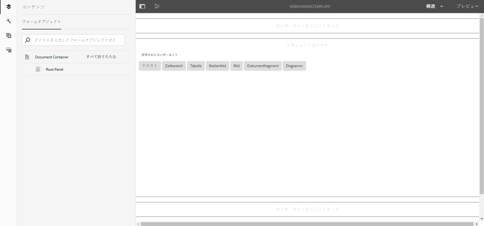
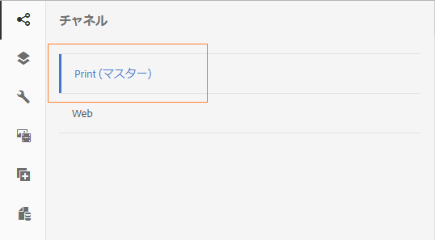

# 印刷チャネルと Web チャネル{#print-channel-and-web-channel}

インタラクティブ通信は、印刷チャネルと Web チャネルという 2 つのチャネルを使用して配信することができます。印刷チャネルは、PDF や紙ベースの通信手段（保険料の支払いを通知する印刷書類など）を作成する場合に使用され、Web チャネルは、オンライン情報（Web サイト上で表示されるクレジットカードの取引明細など）を配信する場合に使用されます。

Interactive Communicationの作成者は、ドキュメントフラグメントや画像などのアセットを再利用して、印刷版とWeb版の両方のInteractive Communicationを作成できます。

One of the prerequisites for [Creating an Interactive Communication](../../forms/using/create-interactive-communication.md) is to have the templates for print and/or web channel available on the server. テンプレート作成者は、AEM自体でWebチャネルテンプレートを作成しますが、印刷チャネルテンプレートXDPはAdobeFormsデザイナーで作成され、サーバーにアップロードされます。

## 印刷チャネル {#printchannel}

Interactive Communicationの印刷チャネルは、XFAフォームテンプレートXDPを使用します。 XDP は Adobe Forms Designer でデザインできます。For more information on creating print channel templates, see [Layout Design](../../forms/using/layout-design-details.md). Interactive Communicationで印刷チャネルテンプレートを使用するには、テンプレートをAEM Formsサーバにアップロードする必要があります。

### インタラクティブ通信の印刷チャネルテンプレートのアップロード {#upload-interactive-communication-print-channel-template}

テンプレートをアップロードするには、forms-user グループのメンバーになっている必要があります。印刷チャネルテンプレート（XDP）を AEM Forms にアップロードするには、以下の手順を実行します。

1. **[!UICONTROL フォーム]**／**[!UICONTROL フォームとドキュメント]**&#x200B;を選択します。

1. **[!UICONTROL 作成]**／**[!UICONTROL ファイルのアップロード]**&#x200B;の順にタップします。

   Navigate and select the appropriate print channel template (XDP) and tap **[!UICONTROL Open]**.

## Web チャネル {#web-channel}

テンプレートの作成者と管理者は、テンプレートの作成、編集、有効化を行うことができます。それ以外のユーザーが Web テンプレートを作成できるようにするには、そのユーザーに対して権限を設定する必要があります。For more information, see [User, Group and Access Rights Administration](/help/sites-administering/user-group-ac-admin.md).

### Web チャネルテンプレートの作成 {#authoring-web-channel-template}

Web チャネルテンプレートを作成するには、最初にテンプレートフォルダーを作成する必要があります。テンプレートフォルダー内にWebテンプレートを作成したら、フォームユーザーがテンプレートに基づいてインタラクティブ通信のWebチャネルを作成できるように、テンプレートを有効にする必要があります。

Webチャネルテンプレートを作成するには、次の手順を実行します。

1. Interactive Communication Webテンプレートがまだない場合は、テンプレートフォルダを作成して保存します。 For more information, see Template Folders in [Page Templates - Editable](/help/sites-developing/page-templates-editable.md).

   1. **[!UICONTROL ツール]** 設定ブラウザーをタップします ****。
      * See the [Configuration Browser](/help/sites-administering/configurations.md) documentation for more information.
   1. In the Configuration Browser page, tap **[!UICONTROL Create]**.
   1. In the Create Configuration dialog, specify a title for the folder, check **[!UICONTROL Editable Templates]**, and tap **[!UICONTROL Create]**.

      フォルダーが作成され、Configuration Browserページに表示されます。

1. 目的のテンプレートフォルダーに移動して、Web チャネルテンプレートを作成します。

   1. Navigate to the appropriate template folder by selecting **[!UICONTROL Tools]** > **[!UICONTROL Templates]** > **`[Folder]`**.
   1. 「**[!UICONTROL 作成]**」をタップします。
   1. Select **[!UICONTROL Interactive Communication - Web Channel]** and tap **[!UICONTROL Next]**.
   1. テンプレートのタイトルと説明を入力して「**[!UICONTROL 作成]**」をタップします。

      作成されたテンプレートがダイアログに表示されます。

   1. 「**[!UICONTROL 開く]**」をタップして、作成したテンプレートをテンプレートエディターで開きます。

      テンプレートエディターが表示されます。

      

      テンプレートの作成者は、テンプレートの作成や編集を行う際に、様々な要素を定義することができます。テンプレートの作成と編集は、ページの作成に似ています。For more information, see Editing Templates - Template Authors in [Creating Page Templates](/help/sites-authoring/templates.md).

1. Interactive Communicationの作成時にこのテンプレートを使用できるようにするには、テンプレートを有効にします。

   1. **[!UICONTROL ツール]** /  / **[!UICONTROL テンプレートをタップします]**。
   1. Navigate to the appropriate template, select it, and tap **[!UICONTROL Enable]** and in the alert message, tap **[!UICONTROL Enable]**.

      これでテンプレートが有効になり、テンプレートのステータスとして「有効」が表示されます。新しく作成した Web チャネルテンプレートを使用して、インタラクティブ通信を作成することができます。

### 「印刷チャネルを Web チャネルのマスターとして使用する」オプション{#print-channel-as-master-for-web-channel}

インタラクティブ通信を作成する際に、「印刷チャネルを Web チャネルのマスターとして使用する」オプションを選択すると、印刷チャネルに同期された Web チャネルを作成することができます。印刷チャネルを Web チャネルのマスターとして使用すると、Web チャネルに連結されたコンテンツ、継承設定、データが印刷チャネルから取得され、印刷チャネルに対する変更内容が Web チャネルに反映されます。ただし、インタラクティブ通信の作成者は、必要に応じて、Web チャネル内の特定のコンポーネントの継承設定を解除することができます。

