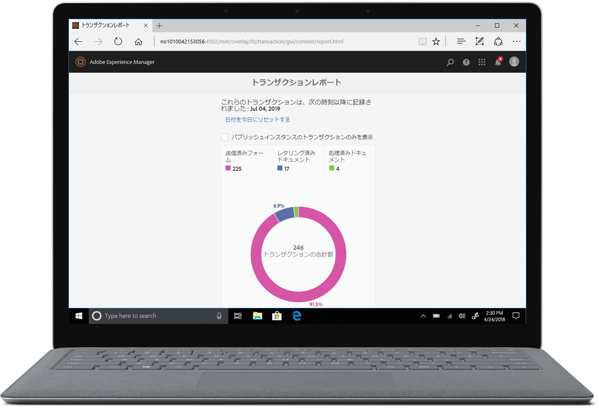

# 新機能の概要 | AEM 6.5 Forms{#new-features-summary-aem-forms}

## トランザクションレポート {#transaction-reports}

トランザクションレポートを使用すると、送信されたフォーム、処理されたドキュメント、レンダリングされたドキュメントの数を取得し、追跡できます。 これらのトランザクションの追跡の目的は、製品の使用状況に関する十分な情報を得た上で判断し、ハードウェアとソフトウェアに対する投資の再バランシングを行うことです。 トランザクションの例を次に示します。

* アダプティブフォーム、HTML5フォームまたはフォームセットの送信
* インタラクティブな通信の印刷またはWebバージョンのレンディション
* あるファイル形式から別のドキュメント形式への変換

トランザクションレポートの設定と使用に関する詳細は、「トランザクションレポ [ートの概要」を参照してくださ](../../forms/using/transaction-reports-overview.md)い。

## インタラクティブコミュニケーション {#interactive-communications}

**データ表示パターンの定義**

Interactive Communicationの作成者は、フィールド、変数 [、およびフォームデータ](create-interactive-communication.md#datadisplaypatterns) モデル要素のデータ表示パターンを定義できるようになりました。 例えば、日付、通貨、電話の形式などです。

**新しいタイプのグラフの使用**

複数のシリーズを含む四半円グ [ラフやチャートを](../../forms/using/chart-component-interactive-communications.md) 、Interactive Communicationsに追加できるようになりました。

**表の列の並べ替え**

インタラクティブ通 [信でテーブルの列を並べ替え](../../forms/using/create-interactive-communication.md#sortcolumns) ることができるようになりました。 表の列をスタティックテキストまたはデータモデルオブジェクトで連結し、並べ替えることができます。

**Webコンポーネントでの新しいコンポーネントのチャネル**

Webコンポーネントにボタンとセパレーターのコンポーネントを追加できるようになりました。チャネル 詳しくは、Webチャネルの [追加ButtonコンポーネントとSeparatorコンポーネントを参照し](../../forms/using/create-interactive-communication.md#add-button-component-to-the-web-channel) てください 。

**コンポーネントのサイズを変更するレイアウトモード**

WYSIWYGインターフェイスを使用して、 [Webチャネル内のコンポーネントのサイズを変更する](../../forms/using/resize-using-layout-mode.md) 、レイアウトモードに切り替えることができるようになりました。

**ユーザビリティの向上**

インタラクティブコミュニケーションの作成者は、通信を作成する際に、使いやすい様々な操作を利用できるようになりました。 操作のリストには、次のものが含まれます。

* [印刷およびWebチャネルで元に戻す/やり直し操作を実行](../../forms/using/create-interactive-communication.md#undoredoactions)
* [@記追加号を使用したドキュメントフラグメント内の変数](../../forms/using/texts-interactive-communications.md#searchvariables)
* [@記追加号を使用したドキュメントフラグメント内のデータモデル要素](../../forms/using/texts-interactive-communications.md#searchdatamodelproperties)
* [既存のInteractive Communicationに対するWebチャネルの削除または追加](../../forms/using/create-interactive-communication.md#edit-interactive-communication-properties)
* [ドラッグ&amp;ドロップ操作を使用した、データソース要素とフィールドおよび変数の連結](../../forms/using/create-interactive-communication.md#binddatasourceelements)
* [Interactive Communicationの作成時に、連結されていないフィールドと変数を強調表示する](../../forms/using/create-interactive-communication.md#distinguishunboundfields)
* [Webチャネル内の継承されたコンポーネントに対して、コピー、グループなどの追加のアクションを実行します](../../forms/using/create-interactive-communication.md#componenttoolbar)

**同期プロセスの改善**

印刷レイアウトを使用して自動生成されるWebチャネルのレイアウトに、いくつかの改善点があります。チャネル

## アダプティブフォーム {#adaptive-forms}

### アダプティブフォームでのAdobe Signのクラウドベースの電子署名の使用 {#use-adobe-sign-s-cloud-based-digital-signatures-in-adaptive-forms}

[クラウドベースの電子署名](https://helpx.adobe.com/sign/kb/digital-certificate-providers.html) （リモート署名）は、デスクトップ、モバイル、Webで機能する新しい世代の電子署名です。 署名者の認証に関する最高レベルのコンプライアンスと保証を満たします。 Cloudベースの電子署 [名を使用して](../../forms/using/working-with-adobe-sign.md) 、アダプティブフォームに署名できるようになりました。

#### Embed an Adaptive Form or Interactive Communication in AEM Sites Single Page Applications {#embed-an-adaptive-form-or-interactive-communcation-in-aem-sites-single-page-applications}

AEM Formsを使用すると、アダプティブフ  ォームまたはインタラクティブ通信をAEM Sitesのシングルページアプリケーション(SPA)にシームレスに埋め込むことができます。 埋め込まれたアダプティブフォームとインタラクティブ通信は完全に機能し、ユーザーはページを離れることなくフォームに入力して送信できます。 Webページ上の他の要素のコンテキストを維持し、アダプティブフォームやInteractive Communicationと同時にやり取りするのに役立ちます。

#### アダプティブフォームテーブルの列の並べ替え {#sort-columns-of-adaptive-form-tables}

アダプティブ [フォームテーブルの任意の列を昇順または降順](../../forms/using/adaptive-forms-tables.md#sortcolumnstable) で並べ替えることができます。 静的テキストを含むテーブル列、データモデルオブジェクトプロパティ、または静的テキストとデータモデルオブジェクトプロパティの組み合わせに対して、並べ替えを適用できます。

#### アダプティブフォームのテンプレートの可用性を特定のパスに制限する {#restrict-the-availability-of-adaptive-forms-templates-to-specific-paths}

アダプティブフォームでは、cq:allowedPathsプロパティのサポートが追加されました。 このプロパティは、 [アダプティブフォームのテンプレートの利用を特定のパスに制限しま](creating-adaptive-form.md#adaptive-form-templates)す。

#### ダイナミ追加ックなアダプティブフォームのチェックボックス {#add-check-boxes-to-the-adaptive-form-dynamically}

カスタム関数、フォームオブジェクトまたは [オブジェクトのプロパティに基づいて](../../forms/using/rule-editor.md#setpropertyrule) 、アダプティブフォームにチェックボックスを動的に追加するルールを定義できるようになりました。

## AEM ワークフロー {#aem-workflows}

### AEM変数の使用ワークフロー {#use-variables-in-aem-workflows}

変数を使用すると、ワークフローステップで、実行時にワークフローステップ間でメタデータを保持および渡すことができます。 様々なタイプの変数を作成して、様々なタイプのデータを保存できます。例えば、整数、文字列、ドキュメント、フォームデータモデルのインスタンスなど。 一般に、変数または変数のコレクションを使用するのは、変数が保持する値に基づいて決定する必要がある場合、またはプロセスで後で必要になる情報を保存する場合です。

変数は、前のバージョンで使 [用可能な](https://helpx.adobe.com/experience-manager/6-5/sites/developing/using/reference-materials/javadoc/com/adobe/granite/workflow/metadata/MetaDataMap.html) MetaDataMapインターフェイスの拡張です。 メタデータ値の取得と更新に使用するカスタムECMAScriptコードの開発に費やす時間を節約できます。 引き続きMetaDataMapインターフェイスとECMAScriptコードを使用して、メタデータを操作します。 MetaDataMapやECMAScriptよりも変数を使用する利点は、次のとおりです。

* カスタムコードに依存せずに、ワークフロー全体で変数に格納された値を動的に保存、更新、使用する
* 送信されたフォームのフォームデータモデルおよびデータファイル(XML/JSON)に対して値を直接取得し、更新する
* 完全なドキュメントを変数に格納して、ドキュメント処理を実行

「移動先」または「分割」の手順と、すべてのAEM Formsワークフローの手順で変数がサポートされています。 MetaDataMapインターフェイスを使用して、変数をネイティブでサポートしていないワークフロー手順の変数にアクセスできます。 詳しくは、AEM変数の変数を参 [照してください](../../forms/using/variable-in-aem-workflows.md)。

#### 別のアダプティブフォームでのワークフローの使用 {#use-a-workflow-with-different-adaptive-forms}

アダプティブ [フォームは、割り当てタスク](../../forms/using/aem-forms-workflow-step-reference.md#assign-task-step) 、および実行時のフォーム中心ワークフローの記録ステップのドキュメントに指定できます。 ワークフローで様々なアダプティブフォームを使用できます。 ワークフローのデザイン中に、アダプティブフォームを選択する方法を決定できます。 アダプティブフォームは、絶対パスに配置したり、ワークフローのペイロードとして送信したり、変数を使用して計算されたパスで使用したりできます。

#### フォーム中心のワークフロー手順の拡張ログ機能を使用する {#use-enhanced-logging-capabilities-of-forms-centric-workflow-steps}

フォーム中心のワークフローステップのログ機能は標準化されています。 現在は、フォーム中心のすべてのワークフローステップで、同様に標準化されたログが生成されます。 デバッグ速度の向上に役立ちます。

## データ統合 {#data-integration}

次の操作が可能になりました。

* [制約のリストに基づいて](../../forms/using/work-with-form-data-model.md#automated-validation-of-input-data) 、入力データを検証します。 有効なデータのみがデータソースに送信されることを確認するのに役立ちます。
* [WSDL(Web Services Description Language](../../forms/using/configure-data-sources.md#configure-soap-web-services) )ファイルで定義されたデフォルトのエンドポイントを上書きします。

* [Swagger定義ファ](../../forms/using/configure-data-sources.md#configure-restful-web-services) イルで定義されたデフォルトのスキーム  、ホスト、ベースパスを上書きします。

## プラットフォームとセキュリティの更新 {#platform-and-security-updates}

### 主なプラットフォームの更新 {#major-platform-updates}

サポート対象のオペレーティングシステム、アプリケーションサーバー、データベース、データベースドライバー、JDK サーバー、LDAP サーバー、電子メールサーバーを自由に組み合わせて、AEM Forms をセットアップすることができます。The following are the major changes in [supported platforms](../../forms/using/aem-forms-jee-supported-platforms.md):

<table>
 <tbody>
  <tr>
   <td>コンポーネント</td>
   <td>サポート対象から除外</td>
  </tr>
  <tr>
   <td>オペレーティングシステム</td>
   <td>
    <ul>
     <li>Microsoft Windows Server 2012 R2</li>
     <li>IBM AIX*</li>
     <li>Sun Solaris*</li>
    </ul> </td>
  </tr>
  <tr>
   <td>アプリケーションサーバー  </td>
   <td>
    <ul>
     <li>Oracle Weblogic</li>
    </ul> </td>
  </tr>
  <tr>
   <td>データベース</td>
   <td>
    <ul>
     <li>IBM DB2   </li>
     <li>Oracle RAC</li>
    </ul> </td>
  </tr>
  <tr>
   <td>LDAP サーバー</td>
   <td>
    <ul>
     <li>Microsoft Active Directory 2012</li>
     <li>Novell eDirectory 8.8.7 </li>
     <li>IBM Lotus Domino 8.5.0 </li>
    </ul> </td>
  </tr>
  <tr>
   <td>電子メールサーバー</td>
   <td>
    <ul>
     <li>IBM Lotus Domino 8.5.0 </li>
    </ul> </td>
  </tr>
  <tr>
   <td>コネクタ</td>
   <td>
    <ul>
     <li>Connector for Microsoft Sharepoint 2013</li>
     <li>Connector for EMC Documentum 7.0</li>
    </ul> </td>
  </tr>
  <tr>
   <td>AEM Forms アプリケーション  </td>
   <td>
    <ul>
     <li>Windows 8.1のサポート</li>
    </ul> </td>
  </tr>
  <tr>
   <td>Java </td>
   <td>
    <ul>
     <li>Java 11</li>
    </ul> </td>
  </tr>
 </tbody>
</table>

*別のプラットフォームへの移行に関する情報については、アドビサポートにお問い合わせください。

#### 新しいHTML5ベースのUI {#new-html-based-uis}

Adobe Flash Playerの計画的なEOLと、Flashベースのコンテンツをオープンスタンダードに移行する全体的な方向性に従って、AEM 6.5 Formsは、ヘルスモニターのFlashベースのUI、Process Management、Reader Extension、およびJEE上のAEM Formsのカテゴリ管理UIをHTML5ベースのUIに置き換えました。

#### セキュリティの強化 {#security-improvements}

* JEE上のAEM 6.5 Forms管理コンソールUIは、Apache Struts 2.5をベースにしています。
* AEM 6.5 Formsでは、jQueryを3.2.1およびjQuery UI 1.12.1に使用するようになりました。変更の影響につい [ては、](/help/forms/home.md) 「アップグレードドキュメント」を参照してください。

#### アクセシビリティの改善 {#accessibility-improvements}

AEM 6.5 Formsでは、AEM Forms Workspaceのアクセシビリティが向上しました。
