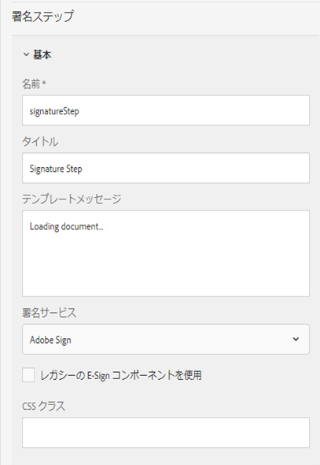

# アダプティブフォーム{#using-adobe-sign-in-an-adaptive-form}での[!DNL Adobe Sign]の使用

[!DNL Adobe Sign] アダプティブフォームのe署名ワークフローを有効にします。電子署名により、法務、販売、給与、人事管理などに関するドキュメントを処理するためのワークフローが改善されます。

一般的な[!DNL Adobe Sign]およびアダプティブフォームのシナリオでは、ユーザーはアダプティブフォームに入力し、サービスに申し込みます。 例えば、住宅ローンアプリケーションやクレジットカードアプリケーションを使用する場合、すべての借り手とその申し込み者から、正しい署名を取得する必要があります。同様のシナリオで電子署名ワークフローを有効にするには、[!DNL Adobe Sign]をAEM [!DNL Forms]と統合します。 その他の例をいくつか挙げます。[!DNL Adobe Sign]を使って、次のことができます。

* 完全に自動化された提案プロセス、見積りプロセス、契約プロセスを使用して、任意のデバイスで契約を締結する。
* 人事プロセスを短時間で完了し、従業員に対してデジタルエクスペリエンスを提供する。
* 契約のサイクルタイムを短縮し、ベンダーとの取引を早期に開始する。
* 共通するプロセスを自動化するためのデジタルワークフローを作成する。

[!DNL Adobe Sign] aemとの統合では、次の機能が [!DNL Forms] サポートされます。

* 単一ユーザーと複数ユーザーの署名ワークフローを処理する機能
* 順次署名と同時署名のワークフロー
* フォーム内とフォーム外での署名機能
* 匿名ユーザーまたはログインユーザーとしてフォームを署名する機能
* 動的署名プロセス(AEM [!DNL Forms]ワークフローとの統合)
* ナレッジベース、電話、ソーシャルプロファイルによる認証機能

## 前提条件 {#prerequisites}

アダプティブフォームで[!DNL Adobe Sign]を使用する前に：

* AEM [!DNL Forms]クラウドサービスが[!DNL Adobe Sign]を使用するように設定されていることを確認します。 詳細については、「[Adobe Sign を AEM Forms に統合する](../../forms/using/adobe-sign-integration-adaptive-forms.md)」を参照してください。
* 署名者のリストを準備してください。少なくとも、各署名者の電子メールアドレスが必要になります。

## アダプティブフォーム{#configure-adobe-sign-for-an-adaptive-form}に対する[!DNL Adobe Sign]の設定

次の手順を実行して、アダプティブフォームの[!DNL Adobe Sign]を設定します。

1. [Adobe署名用のアダプティブフォームプロパティの編集](../../forms/using/working-with-adobe-sign.md#enableadobesign)
1. [Adobe Sign のフィールドをアダプティブフォームに追加する](../../forms/using/working-with-adobe-sign.md#addadobesignfieldstoanadaptiveform)
1. [アダプティブフォームに対して Adobe Sign を有効にする](../../forms/using/working-with-adobe-sign.md#enableadobsignforanadaptiveform)
1. [アダプティブフォームに対して Adobe Sign クラウドサービスを選択する](../../forms/using/working-with-adobe-sign.md#selectadobesigncloudserviceforanadaptiveform)

1. [アダプティブフォームに Adobe Sign の署名者を追加する](../../forms/using/working-with-adobe-sign.md#addsignerstoanadaptiveform)
1. [アダプティブフォームに対して送信アクションを選択する](../../forms/using/working-with-adobe-sign.md#selectsubmitactionforanadaptiveform)

### [!DNL Adobe Sign] {#enableadobesign}のアダプティブフォームプロパティの編集

既存または新しいアダプティブフォームに対して[!DNL Adobe Sign]のアダプティブフォームプロパティを設定します。

[Adobe](../../forms/using/working-with-adobe-sign.md#create-an-adaptive-form-for-adobe-sign) 署名用のアダプティブフォームの作成では、基本的なアダプティブフォームを作成する手順について説明します。アダプティブフォームの作成中に使用できるその他のオプションについては、「[アダプティブフォームの作成](../../forms/using/creating-adaptive-form.md)」を参照してください。

#### [!DNL Adobe Sign] {#create-an-adaptive-form-for-adobe-sign}用のアダプティブフォームの作成

署名が有効なアダプティブフォームを作成するには、次の手順を実行します。

1. **[!UICONTROL Adobe Experience Manager]** > **[!UICONTROL Forms]** > **[!UICONTROL Forms&amp;ドキュメント]**&#x200B;に移動します。
1. 「**[!UICONTROL 作成]**」をタップして、「**[!UICONTROL アダプティブフォーム]**」を選択します。テンプレートのリストが表示されます。 テンプレートを選択し、「**[!UICONTROL 次へ]**」をタップします。
1. 「**[!UICONTROL 基本]**」タブで、次の操作を行います。

   1. アダプティブフォームの&#x200B;**[!UICONTROL 名前]**&#x200B;と&#x200B;**[!UICONTROL タイトル]**&#x200B;を指定します。

   1. AEM [!DNL Forms]で[!DNL Adobe Sign]を設定する際に作成した[設定コンテナ](../../forms/using/adobe-sign-integration-adaptive-forms.md#configure-adobe-sign-with-aem-forms)を選択します。

      >[!NOTE]
      >
      >**[!UICONTROL Adobe SignCloud Service]**&#x200B;ドロップダウンリストには、このフィールドで選択した設定コンテナで設定されたクラウドサービスが表示されます。 **[!UICONTROL Adobe SignCloud Service]**&#x200B;ドロップダウンリストは、「**[!UICONTROL Adobe Signを有効にする]**」オプションを選択した場合に、アダプティブフォームプロパティの「**[!UICONTROL 電子署名]**」セクションで利用できます。

1. 「**[!UICONTROL フォームモデル]**」タブで、次のいずれかのオプションを選択します。

   * 「**[!UICONTROL レコードテンプレートのドキュメントとしてフォームテンプレートを関連付ける]**」オプションを選択し、レコードテンプレートのドキュメントを選択します。 フォームテンプレートベースのアダプティブフォームを使用する場合、署名用に送信されたドキュメントには、関連付けられたフォームテンプレートに基づくフィールドのみが表示されます。 アダプティブフォームのすべてのフィールドを表示するわけではありません。

   * 「**[!UICONTROL レコードのドキュメントを生成]**」オプションを選択します。 「レコードのドキュメント」オプションを有効にしているアダプティブフォームを使用する場合、署名用に送信されたドキュメントには、アダプティブフォームのすべてのフィールドが表示されます。

1. 「**[!UICONTROL 作成」をタップします。]** 署名が有効なアダプティブフォームが作成され、 [!DNL Adobe Sign] フィールドを追加する際に使用できます。

#### [!DNL Adobe Sign] {#editafsign}のアダプティブフォームの編集

既存のアダプティブフォームで[!DNL Adobe Sign]を使用するには、次の手順を実行します。

1. **[!UICONTROL Adobe Experience Manager]** > **[!UICONTROL Forms]** > **[!UICONTROL Forms&amp;ドキュメント]**&#x200B;に移動します。
1. アダプティブフォームを選択し、「**[!UICONTROL プロパティ]**」をタップします。
1. 「**[!UICONTROL 基本]**」タブで、AEM [!DNL Forms]で[!DNL Adobe Sign]を設定する際に作成した[設定コンテナ](../../forms/using/adobe-sign-integration-adaptive-forms.md#configure-adobe-sign-with-aem-forms)を選択します。
1. 「**[!UICONTROL フォームモデル]**」タブで、次のいずれかのオプションを選択します。

   * 「**[!UICONTROL レコードテンプレートのドキュメントとしてフォームテンプレートを関連付ける]**」オプションを選択し、レコードテンプレートのドキュメントを選択します。 フォームテンプレートベースのアダプティブフォームを使用する場合、署名用に送信されたドキュメントには、関連付けられたフォームテンプレートに基づくフィールドのみが表示されます。 アダプティブフォームのすべてのフィールドを表示するわけではありません。

   * 「**[!UICONTROL レコードのドキュメントを生成]**」オプションを選択します。 「レコードのドキュメント」オプションを有効にしているアダプティブフォームを使用する場合、署名用に送信されたドキュメントには、アダプティブフォームのすべてのフィールドが表示されます。

1. 「**[!UICONTROL 保存して閉じる]**」をタップします。アダプティブフォームは[!DNL Adobe Sign]に対して有効になっています。

### Adobe Sign のフィールドをアダプティブフォームに追加する {#addadobesignfieldstoanadaptiveform}

[!DNL Adobe Sign] には、アダプティブフォーム上に配置できるさまざまなフィールドが用意されています。これらのフィールドには、署名、イニシャル、会社名、タイトルなど、さまざまなタイプのデータを入力することができます。このため、署名が行われる際に署名だけでなく追加情報を収集できます。[!DNL Adobe Sign]ブロックコンポーネントを使用すると、アダプティブフォームの様々な場所に[!DNL Adobe Sign]フィールドを配置できます。

アダプティブフォームにフィールドを追加し、それらのフィールドに関する各種のオプションをカスタマイズするには、以下の手順を実行します。

1. **[!UICONTROL Adobe Sign ブロック]**&#x200B;コンポーネントを、コンポーネントブラウザーからアダプティブフォームにドラッグアンドドロップします。[!DNL Adobe Sign]ブロックコンポーネントには、サポートされるすべての[!DNL Adobe Sign]フィールドがあります。 デフォルトでは、アダプティブフォームに&#x200B;**署名**&#x200B;フィールドが追加されます。

   

   デフォルトでは、発行されたアダプティブフォームに[!DNL Adobe Sign]ブロックは表示されません。 Adobe Sign ブロックが表示されるのは、署名ドキュメントだけです。[!DNL Adobe Sign]ブロックの表示/非表示は、[!DNL Adobe Sign]ブロックコンポーネントのプロパティから変更できます。

   >[!NOTE]
   >
   >    * [!DNL Adobe Sign]ブロックの使用は、アダプティブフォームで[!DNL Adobe Sign]を使用する場合に必須ではありません。 [!DNL Adobe Sign]ブロックを使用せずに署名者にフィールドを追加した場合は、デフォルトの署名フィールドが署名ドキュメントの下部に表示されます。
   >    * [!DNL Adobe Sign]ブロックは、レコードのドキュメントを自動的に生成するアダプティブフォームに対してのみ使用します。 レコードのドキュメントの生成にカスタムXDPを使用する場合、またはアダプティブフォームに基づくフォームテンプレートを使用する場合は、[!DNL Adobe Sign]ブロックは不要です。

1. **[!UICONTROL Adobe Signブロック]**&#x200B;コンポーネントを選択し、**編集** アイコンをタップします。 フィールドを追加したり、フィールドの表示形式を設定したりするためのオプションが表示されます。

   

   **A.** フィールドを選択して追加 [!DNL Adobe Sign] します。**B.** ブロックをフルスクリーン [!DNL Adobe Sign] 表示に拡張する

1. **[!UICONTROL Adobe Sign]フィールド** アイコンをタップします。 [!DNL Adobe Sign]フィールドを選択して追加するためのオプションが表示されます。

   「**[!UICONTROL タイプ]**」ドロップダウンフィールドを展開して[!DNL Adobe Sign]フィールドを選択し、「完了」アイコンをタップして、選択したフィールドを[!DNL Adobe Sign]ブロックに追加します。 「**[!UICONTROL タイプ]**」ドロップダウンフィールドには、「署名」タイプ、「署名者の情報」タイプ、「データフィールド」タイプが表示されます。[!DNL Adobe Sign] 「Typedrop」ダウンボックスにリストされているAEM [!DNL Forms] サポートフィールドとの  み統合できます。[!DNL Adobe Sign]フィールドについて詳しくは、[Adobe Signのドキュメント](https://helpx.adobe.com/sign/help/field-types.html)を参照してください。

   

   フィールドには一意の名前を付ける必要があります。 フィールドを必須フィールドとしてマークするための必須オプションを選択することもできます。 の一部のフィールドには、「**[!UICONTROL 名前]**」オプションと「**[!UICONTROL 必須]**」オプションのほかに、追加のオプションが用意されています。[!DNL Adobe Sign]例えば、マスクオプや複数行のオプションなどです。また、各[!DNL Adobe Sign]フィールドには、同じ[!DNL Adobe Sign]ブロック内に存在するか異なる&lt;a1/>ブロック内に存在するかに関係なく、一意の名前を指定します。

   ドロップダウンリストから「**[!UICONTROL デジタル署名]**」を選択すると、アダプティブフォームに電子署名を適用できます。

   * 信頼サービスプロバイダーがホストする[デジタルID](https://helpx.adobe.com/sign/kb/digital-certificate-providers.html)で署名するためのクラウド署名を使用したオンライン。
   * スマートカード、USBトークン、またはファイルベースのデジタルIDを使用して、Adobe AcrobatまたはReaderと共にドキュメントをローカルにダウンロードする。

### アダプティブフォーム{#enableadobsignforanadaptiveform}に対して[!DNL Adobe Sign]を有効にする

デフォルトでは、[!DNL Adobe Sign]はアダプティブフォームに対しては有効になっていません。 Adobe Sign を有効にするには、以下の手順を実行します。

1. コンテンツブラウザーで、**[!UICONTROL フォームコンテナ]**&#x200B;をタップし、**[!UICONTROL 設定]** アイコンをタップします。 この操作により、アダプティブフォームのコンテナプロパティを表示するプロパティブラウザーが開きます。
1. このプロパティブラウザーで「**[!UICONTROL 電子署名]**」アコーディオンを展開し、「**[!UICONTROL Adobe Sign を有効にする]**」オプションを選択します。これはアダプティブフォームの[!DNL Adobe Sign]を有効にします。

### [!DNL Adobe Sign]Cloud Serviceと署名順序{#selectadobesigncloudserviceforanadaptiveform}を選択

AEM [!DNL Forms]のインスタンスに対して複数の[!DNL Adobe Sign]サービスを設定できます。 関数（人事、金融など）ごとに別々のサービスセットを用意することをお勧めします。 これにより、署名済みドキュメントの追跡とレポートが容易になります。 例えば、1つの銀行に複数の部門があるとします。 これらの部署ごとに個別の設定を指定することにより、ドキュメントを正しく追跡できるようになります。

また、1 つのドキュメントに対して複数の署名者を設定することができます。例えば、クレジットカード申込フォームに複数の申込者がいる場合があります。 銀行は、これらの申し込みの処理を開始する前に、すべての申し込み者の署名を取得する必要があります。このように複数の署名者を処理するシナリオの場合、各ドキュメントを順に署名することも、順不同で同時に署名することもできます。

クラウドサービスと署名順を選択するには、以下の手順を実行します。

1. コンテンツブラウザーで、**[!UICONTROL フォームコンテナ]**&#x200B;をタップし、**[!UICONTROL 設定]** アイコンをタップします。 この操作により、アダプティブフォームのコンテナプロパティを表示するプロパティブラウザーが開きます。
1. このプロパティブラウザーで「**[!UICONTROL 電子署名]**」アコーディオンを展開し、「**[!UICONTROL Adobe Sign を有効にする]**」オプションを選択します。これはアダプティブフォームの[!DNL Adobe Sign]を有効にします。
1. 既に設定済みの[!DNL Adobe Sign]Cloud Servicesのリストからクラウドサービスを選択します。

   **[!UICONTROL Adobe SignCloud Service]**&#x200B;リストが空の場合は、「[Adobe SignをAEM Formsと構成](../../forms/using/adobe-sign-integration-adaptive-forms.md)」の記事に従ってサービスを構成します。

   ツール/**[!UICONTROL Cloud Services]**/**[!UICONTROL Adobe Sign]**&#x200B;の`global`フォルダーに存在するクラウドサービスをリストするドロップダウンフォルダーです。 また、このドロップダウンには、アダプティブフォームの作成時に「**[!UICONTROL 設定コンテナ]**」フィールドで選択したフォルダーに存在するクラウドサービスもリストされます。

1. 「**[!UICONTROL 署名者は署名できます]**」ダイアログボックスで、署名順序を選択します。[!DNL Adobe Sign] の署名者は、アダプティブフォームを&#x200B;**[!UICONTROL 連続]**&#x200B;して（署名者順に）署名することも、**[!UICONTROL 「同時」]**&#x200B;に（順不同で）署名することもできます。

   順に署名する場合は、1 人の署名者が、署名用のフォームを一度に 1 つずつ受け取ります。最初の署名者によるフォームの署名が完了すると、フォームが次の署名者に送信され、最後の署名者になるまでこの手順が繰り返されます。

   同時に署名する場合は、複数の署名者がフォームを同時に署名することができます。

1. [アダプティブ](../../forms/using/working-with-adobe-sign.md#addsignerstoanadaptiveform) フォームに署名する追加ユーザーは、「  save」アイコンをタップして変更を保存します。

### アダプティブフォームに署名者を追加する {#addsignerstoanadaptiveform}

1 つのアダプティブフォームに対して、署名者を 1 人だけ設定することも、複数の署名者を設定することもできます。署名者を追加する際に、その署名者の詳細な認証情報を設定することもできます。また、フォームの入力者と署名者を同じユーザーにするかどうかを選択することもできます。署名者に関する各種の詳細情報の追加と指定を行うには、以下の手順を実行します。

1. コンテンツブラウザーで、**[!UICONTROL フォームコンテナ]**&#x200B;をタップし、**[!UICONTROL 設定]** アイコンをタップします。 この操作により、アダプティブフォームのコンテナプロパティを表示するプロパティブラウザーが開きます。
1. このプロパティブラウザーで「**[!UICONTROL 電子署名]**」アコーディオンを展開し、「**[!UICONTROL Adobe Sign を有効にする]**」オプションを選択します。これはアダプティブフォームの[!DNL Adobe Sign]を有効にします。
1. **[!UICONTROL 署名者追加の設定]**&#x200B;の下の&#x200B;**[!UICONTROL 署名者]**&#x200B;をタップします。 これにより、署名者がアダプティブフォームに追加されます。 アダプティブフォームには、複数の[!DNL Adobe Sign]署名者を追加できます。
   

1. **編集** アイコンをクリックし、署名者に関する次の情報を指定します。

   * **[!UICONTROL タイトル]：署名者を一意に識別するためのタイトルを** 指定します。

   * **[!UICONTROL 署名者とフォームの入力者が同じですか？]:** フォームの入力者と最初の署名者が同じ人物の場合は **、「はい**」を選択します。このオプションを「**いいえ**」に設定した場合は、アダプティブフォームの署名ステップコンポーネントは使用しないでください。フォームに署名手順コンポーネントが含まれる場合、フィールドは自動的に「はい」に設定されます。

   * **[!UICONTROL 署名者の電子メールアドレス]：署名者の電子メールアドレスを** 指定します。署名者は、ここで指定した電子メールアドレスで、署名する必要があるドキュメントやフォームを受信します。フォームフィールドで指定した電子メールアドレスを使用することも、ログインユーザーの AEM ユーザープロファイルで指定した電子メールアドレスを使用することも、電子メールアドレスを手動で入力することもできます。このステップは、必ず実行する必要があります。最初の署名者または唯一の署名者の電子メールアドレス（単一の署名者の場合）が、AEMクラウドサービスの設定に使用された[!DNL Adobe Sign]アカウントと一致していないことを確認します。

   * **[!UICONTROL 署名者の認証方法]：署名用にフォームを開く前にユーザーを認証する方法を** 指定します。電話による認証、ナレッジベースによる認証、ソーシャル ID に基づく認証のいずれかを選択することができます。
   >[!NOTE]
   >
   >    * ソーシャル ID に基づく認証の場合、Facebook、Google、LinkedIn を使用した認証オプションがデフォルトで用意されています。[!DNL Adobe Sign]サポートに問い合わせて、他のソーシャル認証プロバイダーを有効にすることができます。

   * **[!DNL Adobe Sign]入力または署名するフィールド：署名者の**  [!DNL Adobe Sign] フィールドを選択します。アダプティブフォームには複数の[!DNL Adobe Sign]フィールドを含めることができます。 署名者用に特定のフィールドを有効にすることができます。このフィールドには、使用可能なすべての[!DNL Adobe Sign]ブロックが表示されます。 いずれかのブロックを選択すると、そのブロックのすべてのフィールドが選択されます。Xアイコンを使用して、フィールドの選択を解除できます。

   

   上の図には、[!DNL Adobe Sign]ブロックの例が2つあります。個人情報およびオフィスの詳細

   「完了」アイコンをタップします。 署名者が追加され、設定されます。

### アダプティブフォームに対して送信アクションを選択する {#selectsubmitactionforanadaptiveform}

アダプティブフォームに[!DNL Adobe Sign]フィールドを追加し、フォームコンテナから[!DNL Adobe Sign]を有効にし、[!DNL Adobe Sign]Cloud Serviceを選択し、[!DNL Adobe Sign]署名者を追加した後、アダプティブフォームに適した送信アクションを選択します。 アダプティブフォームの送信アクションについて詳しくは、「[送信アクションの設定](../../forms/using/configuring-submit-actions.md)」を参照してください。

また、[!DNL Adobe Sign]が有効なアダプティブフォームは、すべての署名者がフォームに署名した後でのみ送信されます。 一部の署名者しか署名していないフォームは、フォームポータルの「保留中の署名」セクションで表示することができます。[!DNL Adobe Sign] 構成サービスは、ポーリング [!DNL Adobe Sign] サーバーを [定期的な](../../forms/using/adobe-sign-integration-adaptive-forms.md) 間隔で保持し、署名のステータスを検証します。すべての署名者がフォームの署名を完了すると、送信アクションサービスが起動してフォームが送信されます。カスタム送信アクションを使用していて、フォームで[!DNL Adobe Sign]が使用されている場合は、カスタム送信アクションを更新して送信アクションサービスを使用します。

<!-- Remove when forms portal goes live
>[!NOTE]
>
>Data of the adaptive form is stored temporarily on Forms Portal. It is recommended to use [custom storage for Forms Portal](/help/forms/using/configuring-draft-submission-storage.md). It ensures that the PII (personally identifiable information) data is not stored on AEM servers. 
-->

これで、フォームに署名するための準備が整いました。フォームのプレビューを表示して、署名の方法を確認することができます。発行済みのフォームでは、署名者が電子メール経由で署名用のフォームを受け取ると、[!DNL Adobe Sign]ブロックフィールドが表示されます。 この動作を、フォーム外署名機能といいます。最初の署名者に対して、フォーム内署名機能を設定することもできます。詳しい手順については、「[フォーム内署名機能の設定](../../forms/using/working-with-adobe-sign.md#create-in-form-signing-experience)」を参照してください。

## アダプティブフォームのクラウド署名の設定{#configure-cloud-signatures-for-an-adaptive-form}

クラウドベースのデジタル署名またはリモート署名は、デスクトップ、モバイル、Web上で機能する新しい世代のデジタル署名で、署名者の認証に関する最高レベルのコンプライアンスと保証を満たします。 クラウドベースの電子署名を使用してアダプティブフォームに署名することができます。

[Adobe署名](../../forms/using/working-with-adobe-sign.md#enableadobesign)のアダプティブフォームプロパティの編集後、次の手順を実行してアダプティブフォームにクラウド署名フィールドを追加します。

1. **[!UICONTROL Adobe Sign ブロック]**&#x200B;コンポーネントを、コンポーネントブラウザーからアダプティブフォームにドラッグアンドドロップします。[!UICONTROL Adobe Signブロック]コンポーネントには、サポートされるすべての[!DNL Adobe Sign]フィールドが含まれています。 デフォルトでは、アダプティブフォームに&#x200B;**[!UICONTROL 署名]**&#x200B;フィールドが追加されます。

   

1. **[!UICONTROL Adobe Signブロック]**&#x200B;コンポーネントを選択し、**編集** アイコンをタップします。 フィールドを追加したり、フィールドの表示形式を設定したりするためのオプションが表示されます。

   

   **A.** フィールドを選択して追加 [!DNL Adobe Sign] します。**B.** ブロックをフルスクリーン [!DNL Adobe Sign] 表示に拡張する

1. **[!UICONTROL Adobe Signフィールド]** アイコンをタップします。 [!DNL Adobe Sign]フィールドを選択して追加するためのオプションが表示されます。

   「**[!UICONTROL 種類]**」ドロップダウンフィールドを展開して「**[!UICONTROL デジタル署名]**」を選択し、**完了**&#x200B;アイコンをタップして、選択したフィールドを[!DNL Adobe Sign]ブロックに追加します。

   

   フィールドには一意の名前を付ける必要があります。

   次を使用して、アダプティブフォームに電子署名を適用します。

   * Cloud signatures:信頼サービスプロバイダーがホストする[デジタルID](https://helpx.adobe.com/sign/kb/digital-certificate-providers.html)で署名します。
   * Adobe AcrobatまたはReader:Adobe AcrobatまたはReaderでドキュメントをダウンロードして開き、スマートカード、USBトークン、またはファイルベースのデジタルIDを使用して署名します。

   クラウド署名フィールドをアダプティブフォームに追加した後、次の手順を実行して設定プロセスを完了します。

   * [アダプティブフォームに対して Adobe Sign を有効にする](../../forms/using/working-with-adobe-sign.md#enableadobsignforanadaptiveform)
   * [アダプティブフォームに対して Adobe Sign クラウドサービスを選択する](../../forms/using/working-with-adobe-sign.md#selectadobesigncloudserviceforanadaptiveform)
   * [アダプティブフォームに Adobe Sign の署名者を追加する](../../forms/using/working-with-adobe-sign.md#addsignerstoanadaptiveform)
   * [アダプティブフォームに対して送信アクションを選択する](../../forms/using/working-with-adobe-sign.md#selectsubmitactionforanadaptiveform)

## フォーム内署名機能の設定 {#create-in-form-signing-experience}

フォームの入力時に、アダプティブフォームに署名することもできます。この動作を、フォーム内署名機能といいます。フォーム内署名機能は、複数の署名者が存在する場合に、最初の署名者のみ使用することができます。アダプティブフォームに対してフォーム内署名機能を設定するには、以下の手順を実行します。

1. [署名ステップコンポーネントの追加と設定](../../forms/using/working-with-adobe-sign.md#add-and-configure-the-signature-step-component)を行います。
1. [概要ステップコンポーネントを追加](../../forms/using/working-with-adobe-sign.md#configure-the-thank-you-page-or-summary-step-component)します。

### 署名ステップコンポーネントの追加と設定 {#add-and-configure-the-signature-step-component}

署名ステップコンポーネントを使用して、入力済みのフォームに電子的に署名するための領域を指定します。署名ステップコンポーネントが含まれているセクションをレンダリングすると、入力済みフォームの署名可能な PDF バージョンが表示されます。署名ステップコンポーネントは、フォームの幅いっぱいに表示されます。そのため、署名ステップコンポーネントが含まれているセクションに他のコンポーネントを配置しないようにすることをお勧めします。

署名ステップコンポーネントを設定するには、以下の手順を実行します。

1. **[!UICONTROL 署名ステップ]**&#x200B;コンポーネントを、コンポーネントブラウザーからフォームにドラッグアンドドロップします。
1. 新しく追加された署名手順コンポーネントを選択し、**設定**アイコンをタップします。 この操作により、署名ステップのプロパティを表示するプロパティブラウザーが開きます。以下のプロパティを設定します。

   * **[!UICONTROL 名前]**:コンポーネントの名前を指定します。

   * **[!UICONTROL タイトル]：コンポーネントの一意のタイトルを** 指定します。
   * **[!UICONTROL テンプレートメッセージ]：署名PDFの読み込み中に表示するメッセージを** 指定します。[!DNL Adobe Sign] サービスによる署名 PDF の準備と読み込みには、ある程度の時間がかかります。
   * **[!UICONTROL Signing Service]：この** オプション **[!DNL Adobe Sign]** を選択します。

   * **[!UICONTROL レガシーの E-Sign コンポーネントを使用]**：[AEM Workspace](../../forms/using/introduction-html-workspace.md)[!DNL Forms] または AEM Forms アプリケーションで個別のアダプティブフォームを使用する場合や、ベースとなるアダプティブフォームにレガシーの E-Sign コンポーネントが含まれている場合は、「**レガシーの E-Sign コンポーネントを使用**」オプションを選択します。

   * **[!UICONTROL 設定]**:設定([!DNL Adobe Sign] Cloud Service)を選択します。このドロップダウンボックスは、「**レガシーE署名コンポーネントを使用**」オプションが有効な場合にのみ使用できます。

   * **[!UICONTROL CSSクラス]**:コンポーネントのCSSクラスを指定します。

   を完了アイコンをタップして、変更を保存します。

   

   >[!NOTE]
   >
   > * **[!UICONTROL 署名者ステップ]**&#x200B;コンポーネントをフォームにドラッグアンドドロップすると、「**[!UICONTROL 署名者とフォーム記入者は同一ですか？]**」オプションが自動的に「**はい**」に設定されます。フォームの動作を維持する必要があります。
      >
      > 
   * 最適なエクスペリエンスを得るには、署名手順コンポーネントの後に概要手順コンポーネントを使用します。 概要手順では、署名手順コンポーネントでフォームの署名を完了した後、自動的に直ちにフォームが送信されます。 要約手順を使用しない場合、[Adobe Sign構成サービス](../../forms/using/adobe-sign-integration-adaptive-forms.md#configure-adobe-sign-scheduler-to-sync-the-signing-status)を使用して設定された間隔の後でのみ、自動送信がトリガーされます。
      > いくつかのベストプラクティスを次に示します。
   > * 署名手順を含むアダプティブフォームパネルは、常にアダプティブフォームの最後または2番目の最後のパネルにあります。 最後のパネルの2番目に最後のパネルになるのは、最後のパネルに概要手順が含まれている場合のみです。
   > * 署名または概要ステップのコンポーネントを含むパネルに、他のコンポーネントを含めることはできません。
   > * 署名手順を含むアダプティブフォームには、送信ボタンを含めることはできません。 送信は、バックグラウンドサービスまたは概要手順で処理されます。
   > * 署名または概要の手順を含むパネルから戻れないようにフォームをデザインします。

### 「ありがとうございます」ページまたは概要ステップコンポーネントの設定{#configure-the-thank-you-page-or-summary-step-component}

**概要ステップ**&#x200B;コンポーネントにより、フォームが自動的に送信され、カスタマイズ後の概要ページに情報が取り込まれ、送信されたフォームの概要情報が表示されます。また、リターンマップ内の必須情報も取得されます。概要ステップコンポーネントは、フォームで使用可能な全幅を占めます。 「概要手順」コンポーネントを含むセクションには、他のコンポーネントを含めないことをお勧めします。

これで、フォーム内署名機能を使用するための準備が整いました。フォームのプレビューを表示して、署名の方法を確認することができます。

## よくある質問 {#frequently-asked-questions}

**Q：アダプティブフォーム** は、別のアダプティブフォームに埋め込むことができます。埋め込まれたアダプティブフォームを[!DNL Adobe Sign]有効にできますか？
**A:**[!DNL Forms] いいえ。AEM では、 が有効になっているアダプティブフォームが埋め込まれているアダプティブフォームを使用して署名することはできません。[!DNL Adobe Sign]

**Q：高度なテンプレートを使用してアダプティブフォームを作成し、それを開いて編集すると、「電子署名または署名者が正しく設定されていません」というエラーメッセージが表示されます。** 表示されます。このエラーメッセージを解決するにはどうすればよいですか？**Ans：高度なテンプレートを使用して作成された** アダプティブフォームは、を使用するように設定されてい [!DNL Adobe Sign]ます。このエラーを解決するには、[!DNL Adobe Sign]クラウド設定を作成して選択し、アダプティブフォームの[!DNL Adobe Sign]署名者を設定します。

**Q：アダプティブフォーム** のスタティックテキストコンポーネントで [!DNL Adobe Sign] テキストタグを使用できますか。**A:**[!DNL Adobe Sign] はい。テキストコンポーネントでテキストタグを使用して、 のフィールドを[レコードのドキュメント](../../forms/using/generate-document-of-record-for-non-xfa-based-adaptive-forms.md)（「自動生成されたレコードのドキュメント」オプション）が有効になっているアダプティブフォームに追加することができます。テキストタグを作成する手順とルールについては、[Adobe Sign のドキュメント](https://helpx.adobe.com/jp/sign/using/text-tag.html)を参照してください。アダプティブフォームでは、テキストタグを使用する場合に制限があることにも注意してください。テキストタグを使用して作成できるのは、[Adobe Sign ブロック](../../forms/using/working-with-adobe-sign.md#configure-cloud-signatures-for-an-adaptive-form)がサポートされているフィールドだけです。

**Q:** AEMには、 [!DNL Forms] Adobe Sign [!UICONTROL ブロックと署名手順の両方のコンポーネントが] 用意されています。アダプティブフォームで両方を同時に使用することはできますか？**A:**&#x200B;はい。フォーム内で両方のコンポーネントを同時に使用することができます。これらのコンポーネントを使用する場合は、以下の推奨事項を参照してください。

**Adobe Signブロック：** Adobe Sign [!UICONTROL ブロックを使用して、アダプティブフォームの任意の場所に] Adobe  署名フィールドを追加できます。また、特定のフィールドを署名者に割り当てることもできます。アダプティブフォームがプレビューまたは発行された場合、デフォルトでは[!UICONTROL Adobe Sign]ブロックは表示されません。 これらのブロックは、署名ドキュメント内でのみ使用することができます。署名ドキュメント内では、署名者に割り当てられているフィールド以外は使用できません。[!UICONTROL Adobe Sign ブロックは、最初の署名者だけでなく、後続の署名者も使用することができます。]

**署名ステップコンポーネント：**&#x200B;署名ステップコンポーネントを使用すると、フォーム内署名機能を設定することができます。この機能では、最初の署名者のみ、フォームの入力時に署名を行うことができます。署名ステップコンポーネントが含まれているセクションをレンダリングすると、フォームの署名可能な PDF バージョンが表示されます。通常、フォームの最後または最後のセクションに続き、フォームの概要コンポーネントが表示されます。

## トラブルシューティング {#troubleshoot}

### [!DNL Adobe Sign] 契約不履行  {#adobe-sign-agreement-failures}

****
問題アダプティブフォームに [!DNL Adobe Sign] 対してサービスが設定されている場合、サービスは基になるアダプティブフォームに対する [!DNL Adobe Sign] 契約の作成に失敗します。

**解像度**

* アダプティブフォームで使用されているAdobe Signクラウドサービス](../../forms/using/adobe-sign-integration-adaptive-forms.md)の[設定を確認します。
* [!DNL Adobe Sign] Cloudサービスの設定に使用する[!DNL Adobe Sign]サーバー上のAPIアプリケーションに、必要な権限があることを確認します。
* 複数の[!DNL Adobe Sign]クラウドサービスを使用している場合は、すべてのサービスの&#x200B;**[!UICONTROL 認証URL]**&#x200B;を同じ&#x200B;**[!UICONTROL Adobe Signシャード]**&#x200B;に指定します。

* [!DNL Adobe Sign]アカウントと、最初の署名者と単一の署名者を設定するには、別々の電子メールアドレスを使用します。 最初の署名者の電子メールアドレスまたは唯一の署名者（単一の署名者の場合）は、AEMクラウドサービスの設定に使用される[!DNL Adobe Sign]アカウントと同一にできません。

### [!DNL Adobe Sign]が有効なアダプティブフォームに対して構成されたAEM [!DNL Forms]ワークフローが開始{#adobe-sign-aem-form-workflow-failures}に対応していません

****
問題アダプティブフォーム [!DNL Adobe Sign] に対して設定さ [!DNL Forms] れている場合、「ワークフローを呼び出し」オプションを使用して設定されたワークフローには開始がありません。

**解像度**

* 署名手順を行わないで[!DNL Adobe Sign]を使用する場合、またはフォームで複数の人の署名が必要な場合、AEM [!DNL Forms]サーバーはスケジューラーがフォームに署名したかどうかを確認するのを待ちます。 スケジューラーは、アダプティブフォームの送信が成功した後でのみ、全員が署名を完了した後、およびワークフロー開始を完了した後にアダプティブフォームを送信します。 [スケジューラー](adobe-sign-integration-adaptive-forms.md)の間隔を短くして、フォーム署名の状態をすばやく確認し、フォームの送信を締め付けることができます。

## 関連記事 {#related-articles}

* [Adobe Sign を AEM Forms に統合する](../../forms/using/adobe-sign-integration-adaptive-forms.md)
* [アダプティブフォームで Adobe Sign を使用する](../../forms/using/working-with-adobe-sign.md)
* [Adobe SignとAEM Formsの併用（ビデオ）](https://helpx.adobe.com/experience-manager/kt/forms/using/adobe-sign-integration-feature-video.html)
