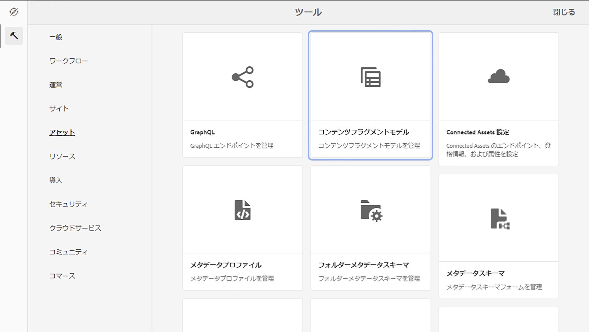

# AEMでのコンテンツフラグメントモデルの作成について説明します。 {#architect-headless-content-fragment-models}

## 今までの話 {#story-so-far}

の最初 [AEMヘッドレスコンテンツ作成者ジャーニー](overview.md) の [AEMを使用したヘッドレス向けコンテンツモデリングの基本](basics.md) ヘッドレス向けのオーサリングに関連する基本概念と用語について説明しました。

この記事はこれらを基に構築され、AEMヘッドレスプロジェクト用に独自のコンテンツフラグメントモデルを作成する方法を理解できます。

## 目的 {#objective}

* **オーディエンス**：初心者
* **目的**:コンテンツフラグメントモデルを使用したヘッドレス CMS のコンテンツのモデリングの概念と仕組み

<!-- which persona does this? -->
<!-- and who allows the configuration on the folders? -->

<!--
## Enabling Content Fragment Models {#enabling-content-fragment-models}

At the very start you need to enable Content Fragment Models for your site, this is done in the Configuration Browser; under Tools -> General -> Configuration Browser. You can either select to configure the global entry, or create a new configuration. For example:

>[!NOTE]
>
>See Additional Resources - Content Fragments in the Configuration Browser
-->

## コンテンツフラグメントモデルの作成 {#creating-content-fragment-models}

その後、コンテンツフラグメントモデルを作成し、構造を定義できます。これは、ツール／アセット／コンテンツフラグメントモデルで実行できます。

これを選択した後、モデルの場所に移動し、「 」を選択します。 **作成**. ここでは、様々なキーの詳細を入力できます。

オプション **モデルを有効にする** は、デフォルトで有効になっています。 つまり、モデルは、保存されるとすぐに（コンテンツフラグメントの作成で）使用できるようになります。 必要に応じて、この機能を無効にすることができます。既存のモデルを後で有効（または無効）にすることもできます。

次で確認： **作成** そうすれば **開く** 構造の定義を開始するモデル。

## コンテンツフラグメントモデルの定義 {#defining-content-fragment-models}

最初に新しいモデルを開くと、左側に大きな空白スペースと、 **データタイプ** 右：

では、何をすればよいのでしょうか。

インスタンスを **データタイプ** を左側のスペースに配置します。既にモデルを定義しています。

データタイプを追加したら、 **プロパティ** そのフィールドの これらは、使用するタイプによって異なります。 次に例を示します。

フィールドは必要な数だけ追加できます。 次に例を示します。

### コンテンツ作成者 {#your-content-authors}

コンテンツ作成者には、モデルの作成に使用した実際のデータタイプとプロパティが表示されません。 つまり、特定のフィールドに対するヘルプと情報を提供する必要が生じる場合があります。 基本情報にはフィールドラベルとデフォルト値を使用できますが、プロジェクト固有のドキュメントを検討する必要がある場合もあります。

>[!NOTE]
>
>「その他のリソース - コンテンツフラグメントモデル」を参照してください。

## コンテンツフラグメントモデルの管理 {#managing-content-fragment-models}

<!-- needs more details -->

コンテンツフラグメントモデルの管理には、次のものが含まれます。

* これらを有効（または無効）にする — 作成者はコンテンツフラグメントを作成する際に使用できます。
* 削除 — 削除は常に必要ですが、コンテンツフラグメントに既に使用されているモデル、特に公開済みのフラグメントの削除に注意する必要があります。

## 公開 {#publishing}

<!-- needs more details -->

コンテンツフラグメントモデルは、依存するコンテンツフラグメントの公開時または公開前に公開する必要があります。

>[!NOTE]
>
>作成者が、モデルがまだ公開されていないコンテンツフラグメントを公開しようとすると、選択リストにその旨が表示され、モデルはフラグメントと共に公開されます。

モデルが公開されるとすぐに、 *ロック済み* 作成者の読み取り専用モードに切り替えます。 これは、特にパブリッシュ環境で、既存の GraphQL スキーマやクエリにエラーを引き起こす変更を防ぐことを目的としています。 コンソールには次のように示されます。 **ロック済み**.

モデルが **ロック済み** （読み取り専用モードで）モデルの内容と構造を表示できますが、直接編集することはできません。ただし、 **ロック済み** モデルをコンソールまたはモデルエディターから取得します。

## 次の手順 {#whats-next}

これで基本を学習したので、次の手順は独自のコンテンツフラグメントモデルの作成を開始することです。

## その他のリソース {#additional-resources}

* [オーサリングに関する概念](/help/sites-authoring/author.md)

* [基本操作](/help/sites-authoring/basic-handling.md)  — このページは主に次の項目に基づいています **サイト** コンソールですが、ほとんどの機能は、に移動したり、アクションを実行したりする場合にも関連します。 **コンテンツフラグメントモデル** の下に **Assets** コンソール。

* [コンテンツフラグメントの操作](/help/assets/content-fragments/content-fragments.md)

   * [コンテンツフラグメントモデル](/help/assets/content-fragments/content-fragments-models.md)

      * [コンテンツフラグメントモデルの定義](/help/assets/content-fragments/content-fragments-models.md#defining-your-content-fragment-model)

      * [コンテンツフラグメントモデルの有効化または無効化](/help/assets/content-fragments/content-fragments-models.md#enabling-disabling-a-content-fragment-model)

      * [アセットフォルダーでのコンテンツフラグメントモデルの許可](/help/assets/content-fragments/content-fragments-models.md#allowing-content-fragment-models-assets-folder)

      * [コンテンツフラグメントモデルの削除](/help/assets/content-fragments/content-fragments-models.md#deleting-a-content-fragment-model)

      * [コンテンツフラグメントモデルの公開](/help/assets/content-fragments/content-fragments-models.md#publishing-a-content-fragment-model)

      * [コンテンツフラグメントモデルを非公開にする](/help/assets/content-fragments/content-fragments-models.md#unpublishing-a-content-fragment-model)

      * [ロック（公開）されたコンテンツフラグメントモデル](/help/assets/content-fragments/content-fragments-models.md#locked-published-content-fragment-models)

* 「はじめる前に」ガイド 

   * [コンテンツフラグメントモデルのヘッドレス作成のクイック開始ガイド](/help/sites-developing/headless/getting-started/create-content-model.md)
