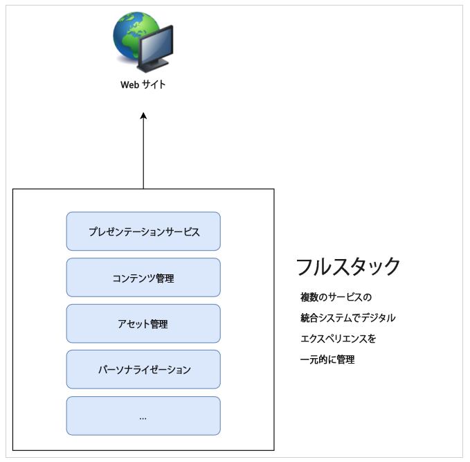
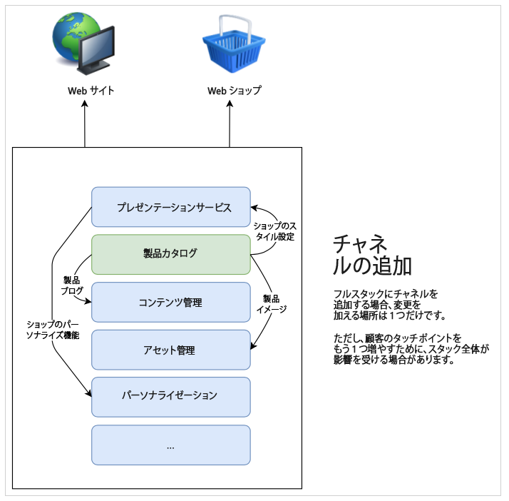

# CMS ヘッドレス開発について {#learn-about}

[AEM ヘッドレスデベロッパージャーニー](overview.md)のこの部分では、ヘッドレステクノロジーと、それを使用する理由について説明します。

## 目的 {#objective}

このドキュメントでは、ヘッドレスコンテンツ配信と、それを使用する理由を説明します。ドキュメントを読めば、以下が可能です。

* ヘッドレスコンテンツ配信の基本概念と用語を理解する
* ヘッドレスがなぜ必要なのか、また、いつ必要なのかを理解する
* ヘッドレスの概念の用途とその相互関係の概要を理解する

## フルスタックコンテンツ配信 {#full-stack}

使いやすい大規模なコンテンツ管理システム（CMS）が登場して以来、多くの組織はメッセージング、ブランディング、コミュニケーションを管理する一元的な場所としてコンテンツ管理システムを活用してきました。CMS をエクスペリエンス管理の中心として使用することで、異なるシステムでタスクを重複させる必要がなくなり、効率が向上しました。

フルスタック CMS では、コンテンツを操作する機能はすべて CMS 内にあります。 システムの機能は、CMS スタックの異なるコンポーネントを構成します。フルスタックソリューションには多くの利点があります。

* 維持するシステムは 1 つである。
* コンテンツを一元的に管理できる。
* システムのすべてのサービスが統合されている。
* コンテンツのオーサリングはシームレスである。

したがって、新しいチャネルを追加したり、新しいタイプのエクスペリエンスをサポートしたりする場合、1 つ以上の新しいコンポーネントをスタックに追加することができ、変更を加える場所は 1 つだけです。

しかし、スタック内の他の項目を、変更に合わせて調整する必要があり、スタック内の依存関係の複雑さがすぐに明らかになります。

## フルスタック配信の限界 {#limits}

フルスタックアプローチは本質的に、すべてのエクスペリエンスが 1 つのシステムに格納されるサイロを形成します。サイロのコンポーネントの変更や追加には、他のコンポーネントへの変更が必要になり、時間やコストがかかる場合があります。

これは特にプレゼンテーションシステムに当てはまります。従来の設定では、プレゼンテーションシステムは CMS に強く結び付いています。新しいチャネルは、通常、プレゼンテーションシステムのアップデートを意味し、他のすべてのチャネルに影響を与える可能性があります。

この自然発生的なサイロの限界は明らかです。スタックのすべてのコンポーネント間で変更を調整するために多くの労力を費やすことになります。

ユーザーは、プラットフォームやタッチポイントに関係なく、エンゲージメントを期待しているので、エクスペリエンスの提供方法に機敏性を必要とします。このマルチチャネルアプローチは、デジタルエクスペリエンスの標準であり、フルスタックアプローチは、ある状況下ではは柔軟性に欠けます。

## ヘッドレスのヘッド {#the-head}

システムのヘッドは、通常、そのシステムの出力レンダラーです。一般的には、GUI やその他のグラフィカル出力の形式です。

例えば、ヘッドレスサーバーは、サーバールーム内のラックに設置され、モニターが取り付けられていない可能性があります。 アクセスするには、リモートで接続する必要があります。この場合、サーバーの出力のレンダリングを処理するモニターがヘッドです。サービスを利用するコンシューマーは、リモートから接続する際に、自分のヘッド（モニター）を提供します。

ヘッドレス CMS では、CMS がコンテンツを管理し、コンシューマーに配信します。ただし、ヘッドレス CMS では、標準化された方法で&#x200B;**コンテンツ**&#x200B;を配信だけで、最終的な出力のレンダリングは省略され、コンテンツの&#x200B;**プレゼンテーション**&#x200B;は消費サービスに委ねられます。

消費サービスは、AR エクスペリエンス、Web ショップ、モバイルエクスペリエンス、プログレッシブ Web アプリ (PWA) などであれ、ヘッドレス CMS からコンテンツを取り込み、独自のレンダリングを提供します。 ヘッドレス CMS は、コンテンツに合わせて独自のヘッドを提供します。

ヘッドを省略することで、複雑さが減り、CMS をシンプルになります。また、コンテンツのレンダリングの責任は、実際にコンテンツを必要とするサービスに移ります。多くの場合、サービスのほうがレンダリングに適しています。

## 分離 {#decoupling}

ヘッドレス配信は、すべてのエクスペリエンスを利用できる堅牢で柔軟なアプリケーションプログラミングインターフェイス（API）のセットを公開することで可能になります。API は、サービス間の共通言語として機能し、標準化されたコンテンツ配信によってコンテンツレベルでサービスを連結しますが、独自のソリューションを柔軟に実装することもできます。

ヘッドレスは、コンテンツをプレゼンテーションから分離する例です。より一般的な意味では、フロントエンドをサービススタックのバックエンドから分離します。ヘッドレスでは、プレゼンテーションシステム（ヘッド）がコンテンツ管理（テール）から切り離されます。この 2 つは、API 呼び出しを介してのみやり取りします。

この分離により、各消費サービス（フロントエンド）は、API を介して提供される同一コンテンツに基づいてエクスペリエンスを構築でき、コンテンツの再利用と一貫性が確保されます。消費サービスは独自のプレゼンテーションシステムを実装することができ、コンテンツ管理スタック（バックエンド）は簡単に拡張することができます。

## 技術基盤 {#technology}

ヘッドレスアプローチを使用すると、将来のデジタルエクスペリエンスの要件に簡単かつ迅速に対応できるテクノロジースタックを構築できます。

以前の CMS 向けの API は主に REST ベースでした。Representational State Transfer（REST）は、ステートレス方式でリソースをテキストとして提供します。これにより、リソースを読み取り、事前に定義された一連の操作で変更できます。REST は、コンテンツのステートレス表現を確保することで、Web 上のサービス間で大きな相互運用性を確保できます。

堅牢な REST API はまだ必要です。ただし、REST リクエストは大きくて冗長になることがあります。複数のコンシューマーがすべてのチャネルに対して REST 呼び出しを実行すると、この冗長性が積み重なって、パフォーマンスに影響を与える可能性があります。

ヘッドレスコンテンツ配信は、多くの場合、GraphQL API を利用します。GraphQL では、ステートレス転送と同様の処理が可能ですが、ターゲットをより絞り込んだクエリが可能になるため、必要なクエリの合計数が減り、パフォーマンスが向上します。REST と GraphQL を混在させたソリューションをよく見かけますが、基本的には目的に応じて最適なツールを選択することになります。

選択した API が何であれ、共通の API に基づいてヘッドレスシステムを定義することで、最新のブラウザーやプログレッシブ web アプリ（PWA）などの他の web テクノロジーを使用できます。API は、拡張性や適応性に優れた標準的なインターフェースを実現します。

一般的に、コンテンツはクライアントサイドでレンダリングされます。つまり、誰かがモバイルデバイスでコンテンツを呼び出し、CMS がコンテンツを配信し、次にモバイルデバイス（クライアント）が、配信されたコンテンツのレンダリングを担当します。デバイスが古い場合や低速の場合、デジタルエクスペリエンスも低調になります。

コンテンツとプレゼンテーションを分離すると、このようなクライアントサイドのパフォーマンスの問題をより詳細にコントロールできます。サーバーサイドレンダリング（SSR）は、コンテンツのレンダリングをクライアントのブラウザーからサーバーに移行します。これにより、コンテンツプロバイダーは、必要に応じて、オーディエンスに対して一定のパフォーマンスを保証できます。

## 組織の課題 {#organization}

ヘッドレスにより、柔軟にデジタルエクスペリエンスを配信できる世界が広がります。しかし、この柔軟性によって、別の課題も生まれます。

様々なチャネルがある場合、それぞれが独自のプレゼンテーションシステムを持つ可能性があります。すべてのユーザーが同じ API を使用して同じコンテンツを消費していていても、プレゼンテーションが異なるので、エクスペリエンスが異なる場合があります。顧客体験の一貫性を維持するための配慮と注意が必要です。

慎重なデザインシステムを実装し、パターンライブラリを共有し、再利用可能なデザインコンポーネントと確立されたオープンなクライアント側フレームワークを使用することで、一貫したエクスペリエンスを確保できますが、計画する必要があります。

## 未来はヘッドレス、未来につながる現在 {#future}

デジタルエクスペリエンスでは、ブランドと顧客との関わり方は継続的に変化するでしょう。ヘッドレスデザインの魅力は、顧客の期待の進化に応える柔軟性です。

未来を予測するのは不可能ですが、ヘッドレスであればどんな未来にも対応できる俊敏性を獲得できます。

## AEM とヘッドレス {#aem-and-headless}

このデベロッパージャーニーを通じて、AEM がフルスタック配信と共にヘッドレス配信をサポートする方法を学びます。

アドビは、デジタルエクスペリエンス管理の業界リーダーとして、エクスペリエンスクリエイターが直面する現実世界の課題に対する理想的なソリューションは、二者択一ではないと考えています。AEM が、両方のモデルをサポートするだけでなく、ヘッドレスとフルスタックの利点を組み合わせたシームレスなハイブリッドの組み合わせを可能にし、コンテンツのコンシューマーがどこにいても最適なサービスを提供できるのは、そのためです。

このジャーニーでは、ヘッドレスのみのコンテンツ配信モデルに焦点を当てます。しかし、この基本的な知識を学べば、両方のモデルを活用する方法をさらに詳しく学ぶことができます。

## 次のステップ {#what-is-next}

AEM ヘッドレスジャーニーを開始していただきありがとうございます。ドキュメントを読んだので、次を理解しているはずです。

* ヘッドレスコンテンツ配信の基本概念と用語を理解する。
* ヘッドレスがなぜ必要なのか、また、いつ必要なのかを理解する。
* ヘッドレスの概念の用途とその相互関係の概要を理解する。

この知識に基づき、次に「[AEM Headless - はじめに](getting-started.md)」を確認して必要なツールの設定方法や、AEM によるコンテンツ配信とその前提条件に関する考え方を学び、AEM ヘッドレスのジャーニーを継続してください。

## その他のリソース {#additional-resources}

「 [AEM Headless - はじめに](getting-started.md)」ドキュメントを確認して、ヘッドレス開発のジャーニーの次のパートに進むことをお勧めしますが、以下のリソースではこのドキュメントで取り上げた概念についてより詳しく説明しています。追加的なオプションであり、ジャーニーを続ける上で必須のリソースではありません。

* An [AEM as a Headless CMS の概要](/help/sites-developing/headless/introduction.md)
* The [AEM Developer Portal](https://experienceleague.adobe.com/landing/experience-manager/headless/developer.html?lang=ja)
* [AEM ヘッドレスチュートリアル](https://experienceleague.adobe.com/docs/experience-manager-learn/getting-started-with-aem-headless/overview.html?lang=ja) - これらの実践チュートリアルでは、AEM を使用してヘッドレスエンドポイントにコンテンツを配信するための様々なオプションの使用方法と、適切なオプションを選択する方法を調べます。
