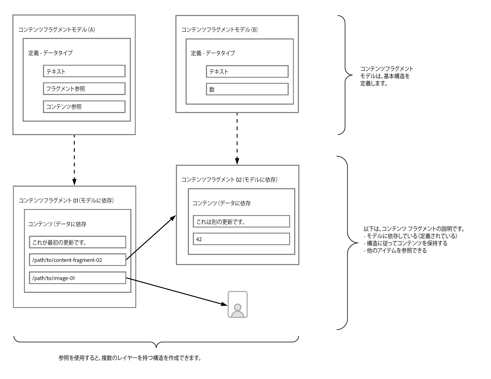
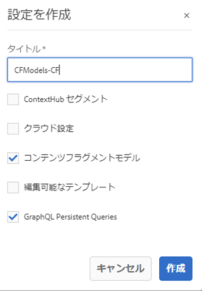
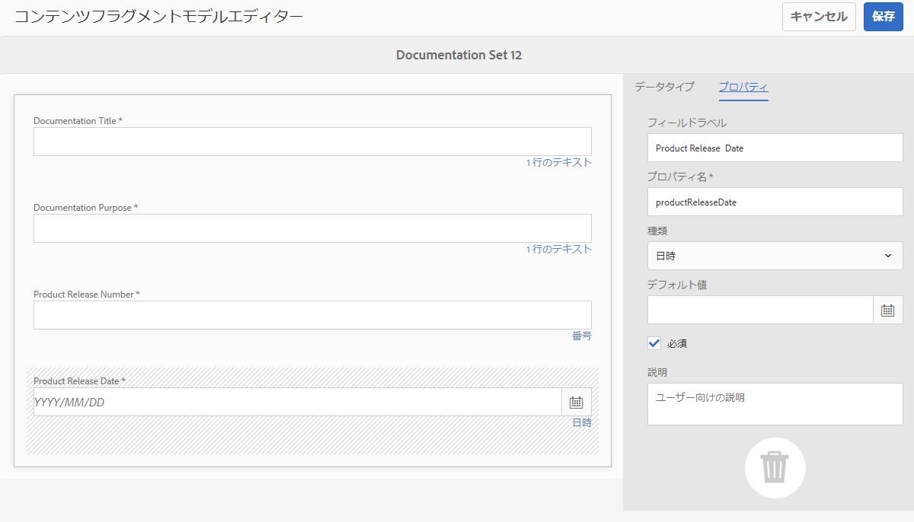
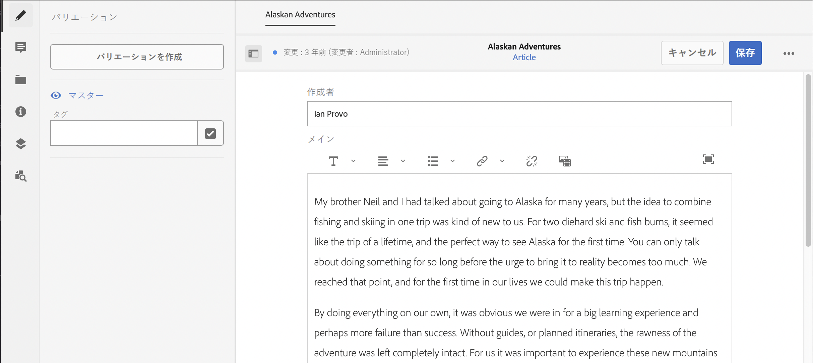

# コンテンツをモデル化する方法 {#model-your-content}

[AEM ヘッドレスデベロッパージャーニー](overview.md)のこの部分では、コンテンツ構造をモデル化する方法について説明します。次に、チャネル間での再利用のために、コンテンツフラグメントモデルとコンテンツフラグメントを使用したAdobe Experience Manager(AEM) の構造を実現します。

## これまでの説明内容 {#story-so-far}

最初に [CMS ヘッドレス開発の詳細](learn-about.md) ヘッドレスコンテンツ配信の説明と、その使用理由について説明しています。 「[AEM ヘッドレスの概要](getting-started.md)」では、独自のプロジェクトのコンテキストで AEM ヘッドレスについて説明しました。

以前の AEM ヘッドレスジャーニードキュメント（「[AEM ヘッドレスを使用した初めてのエクスペリエンスへのパス](path-to-first-experience.md)」）では、初めてのプロジェクトの実装に必要な手順について説明しました。読み終えたら、次の操作を実行する必要があります。

* コンテンツを設計する際の計画に関する重要な考慮事項を理解する
* 統合レベルの要件に応じて、ヘッドレスを実装する手順を理解する
* 必要なツールを設定し AEM の設定を行う
* ヘッドレスジャーニーをスムーズにし、コンテンツ生成の効率を維持し、コンテンツを迅速に配信するためのベストプラクティスを理解する

この記事は、これらの基本事項に基づいて構築されており、独自の AEM ヘッドレスプロジェクトを準備する方法を理解できます。

## 目的 {#objective}

* **対象読者**：初心者
* **目的**：コンテンツ構造をモデル化し、AEM コンテンツフラグメントモデルとコンテンツフラグメントを使用して構造を実現する方法を説明します。
   * データ／コンテンツモデリングに関連する概念と用語を紹介します。
   * ヘッドレスコンテンツ配信にコンテンツモデリングが必要な理由を説明します。
   * AEM コンテンツフラグメントモデルを使用してこの構造を実現する（およびコンテンツフラグメントを使用してコンテンツを作成する）方法を説明します。
   * コンテンツをモデル化する方法を説明します（原則と基本サンプル）。

>[!NOTE]
>
>データモデリングは、リレーショナルデータベースを開発する際に使用される大きなフィールドです。 多くの本やオンライン情報源が利用可能です。
>
>AEMヘッドレスで使用するデータをモデリングする際に重要な側面は、考慮されるだけです。

## コンテンツモデリング {#content-modeling}

*外の世界は大きくて邪悪だ（It&#39;s a big, bad world out there)*。

多分、そうではないかもしれないが、確かに大きい ***複雑*** 世界はあそこにいる。 データモデリングは、特定の目的に必要な特定の情報を使用して、非常に（非常に）小さなサブセクションの簡略表現を定義するために使用します。

>[!NOTE]
>
>AEMがコンテンツを扱う場合、データモデリングはコンテンツモデリングと呼ばれます。

次に例を示します。

学校は多数ありますが、いろいろな共通点があります。

* 場所
* 教頭
* 多くの教師
* 多くの非教職員
* 多くの生徒
* 多くの元教師
* 多くの元生徒
* 多くの教室
* 多くの（多くの）本
* 多くの（多くの）機器
* 多くのカリキュラム外活動
* など...

このような小さな例でも、リストは無限に見える可能性があります。 ただし、アプリケーションで単純なタスクを実行するだけの場合は、情報を基本事項に制限できます。

例えば、地域内のすべての学校向けに特別なイベントを広告します。

* 学校名
* 学校の場所
* 教頭
* イベントのタイプ
* イベントの日付
* イベントを主催する教師

### 概念  {#concepts}

説明する内容は、 **エンティティ**  — 基本的に、情報を保存したい「モノ」です。

これらに関して保存する情報は、 **属性** （プロパティ）名前、教員の資格など。

次に、エンティティ間に様々な&#x200B;**関係**&#x200B;があります。例えば、通常、学校には教頭が 1 人しかいませんが、多くの教師（教頭も教師）がいます。

この情報を分析し定義するプロセスは、**コンテンツモデリング**&#x200B;と呼ばれます。

### 基本 {#basics}

多くの場合、 **概念スキーマ** エンティティとその関係について説明します。 通常、これは概要レベル（概念的）のものです。

これが安定したら、エンティティを記述する&#x200B;**論理スキーマ**&#x200B;に、属性と関係と共にモデルを変換できます。このレベルでは、重複を排除し、設計を最適化するために、定義を詳細に調べます。

>[!NOTE]
>
>シナリオの複雑さに応じて、これら 2 つの手順が結合される場合があります。

例えば、`Head Teacher` と `Teacher` に別々のエンティティが必要ですか。それとも、`Teacher` モデルの追加属性だけが必要ですか。

### データの整合性の確保 {#data-integrity}

ライフサイクル全体にわたってコンテンツの正確性と一貫性を保証するには、データの整合性が必要です。これには、コンテンツ作成者が何を保存するかを容易に理解できるようにすることが含まれます。そのため、次のことが重要です。

* 明確な構造
* 可能な限り簡潔な構造（精度を犠牲にすることなく）
* 個々のフィールドの検証
* 必要に応じて、特定のフィールドの内容を意味のある内容に制限する

### データの冗長性を排除 {#data-redundancy}

データの冗長性は、同じ情報がコンテンツ構造内に 2 回格納される場合に発生します。コンテンツの作成時に混乱が生じ、クエリ時にエラーが生じる可能性があるので、この方法は避けてください。記憶領域の誤用は言うまでもありません。

### 最適化とパフォーマンス {#optimization-and-performance}

構造を最適化することで、コンテンツの作成とクエリの両方でパフォーマンスを向上できます。

すべてがバランスを取る行為ですが、複雑すぎる構造を作成したり、レベルが多すぎる構造を作成したりすると、次が生じる場合があります。

* 作成者がコンテンツを生成する際に混乱を招く。

* 必要なコンテンツを取得するために、クエリがネストされた（参照された）コンテンツフラグメントにアクセスする必要がある場合、パフォーマンスに大きく影響する。

## AEM ヘッドレスのコンテンツモデリング {#content-modeling-for-aem-headless}

データモデリングは確立された一連のテクニックで、関係データベースを開発する際によく使用されます。そのため、コンテンツモデリングは AEM ヘッドレスに対して何を意味するのでしょうか。

### 使用する理由 {#why}

アプリケーションが AEM から必要なコンテンツを一貫して効率的に要求し、受け取れるようにするには、このコンテンツが構造化されている必要があります。

つまり、アプリケーションは、事前に応答の形式を把握し、その処理方法を把握しています。これは、自由形式コンテンツを受け取るよりも簡単です。自由形式コンテンツは、そのコンテンツに何が含まれているか、その使用方法を判断するために解析する必要があります。

### 仕組みの概要 {#how}

AEM は、コンテンツフラグメントを使用して、コンテンツをアプリケーションにヘッドレスに配信するために必要な構造を提供します。

コンテンツモデルの構造には次が当てはまります。

* コンテンツフラグメントモデルの定義によって実現される。
* コンテンツ生成に使用されるコンテンツフラグメントの基礎として使用される。

>[!NOTE]
>
>コンテンツフラグメントモデルは、AEM GraphQL スキーマの基礎としても使用され、コンテンツを取得するために使用されます。これについては後のセッションでさらに説明します。

コンテンツのリクエストは、標準の GraphQL API のカスタマイズされた実装である AEM GraphQL API を使用して行われます。AEM GraphQL API を使用すると、コンテンツフラグメントに対して（複雑な）クエリを実行でき、各クエリは特定のモデルタイプに従っています。

返されたコンテンツは、アプリケーションで使用できます。

## コンテンツフラグメントモデルを使用した構造の作成 {#create-structure-content-fragment-models}

コンテンツフラグメントモデルは、コンテンツの構造を定義できる様々なメカニズムを提供します。

コンテンツフラグメントモデルは、エンティティを記述します。

>[!NOTE]
>モデルを作成するには、設定ブラウザーでコンテンツフラグメント機能を有効にする必要があります。

>[!TIP]
>
>コンテンツフラグメントの作成時に選択するモデルをコンテンツ作成者が把握できるように、モデルに名前を付ける必要があります。

モデル内：

1. **データタイプ** 個々の属性を定義できます。
例えば、教師の名前を持つフィールドを **Text** とし、その勤続年数を **Number** と定義します。
1. データタイプ **コンテンツ参照** および **フラグメント参照** AEM内の他のコンテンツとの関係を作成できます。
1. The **フラグメント参照** データタイプを使用すると、（モデルタイプに従って）コンテンツフラグメントをネストすることで、複数レベルの構造を実現できます。 これは、コンテンツモデリングに不可欠です。

例：

### データタイプ {#data-types}

AEM では、コンテンツをモデル化するための次のデータタイプが提供されます。

* 1 行のテキスト
* 複数行テキスト
* 数値
* ブール値
* 日時
* 列挙
* タグ
* コンテンツ参照
* フラグメント参照
* JSON オブジェクト

### 参照とネストされたコンテンツ {#references-nested-content}

2 つのデータタイプは、特定のフラグメント外のコンテンツへの参照を提供します。

* **コンテ
ンツの参照**&#x200B;任意のタイプの他のコンテンツへの簡単な参照を提供します。例えば、指定した場所で画像を参照できます。

* **フラグメ
ントの参照**&#x200B;他のコンテンツフラグメントへの参照を提供します。このタイプの参照は、ネストされたコンテンツを作成するために使用され、コンテンツのモデル化に必要な関係を導き出します。このデータタイプは、フラグメント作成者が次の操作を行えるように設定可能です。
   * 参照先フラグメントの直接編集
   * 適切なモデルに基づいて、コンテンツフラグメントを作成します。

### コンテンツフラグメントモデルの作成 {#creating-content-fragment-models}

開始時に、サイトに対してコンテンツフラグメントモデルを有効にする必要があります。 この有効化は、設定ブラウザーの [ ツール ] > [ 一般 ] > [ 設定ブラウザー ] で行います。 グローバルエントリを設定するか、設定を作成するかを選択できます。 次に例を示します。

>[!NOTE]
>
>「その他のリソース - 設定ブラウザーのコンテンツフラグメント」を参照してください。

その後、コンテンツフラグメントモデルを作成し、構造を定義できます。これは、ツール/アセット/コンテンツフラグメントモデルでおこなえます。 次に例を示します。

>[!NOTE]
>
>「その他のリソース - コンテンツフラグメントモデル」を参照してください。

## モデルを使用したコンテンツフラグメントでのコンテンツのオーサリング {#use-content-to-author-content}

コンテンツフラグメントは、常にコンテンツフラグメントモデルに基づいています。モデルが構造を提供し、フラグメントがコンテンツを保持します。

### 適切なモデルの選択 {#select-model}

コンテンツを実際に作成する最初の手順は、コンテンツフラグメントを作成することです。作成するには、Assets/ファイルの下の必要なフォルダーで、作成/コンテンツフラグメントを使用します。 ウィザードの指示に従って手順を進めます。

コンテンツフラグメントは、作成プロセスの最初の手順として選択する特定のコンテンツフラグメントモデルに基づいています。

### 構造化コンテンツの作成と編集 {#create-edit-structured-content}

フラグメントを作成したら、コンテンツフラグメントエディターで開くことができます。 ここでは、次の操作を実行できます。

* コンテンツを通常モードまたはフルスクリーンモードで編集します。
* コンテンツの形式を「フルテキスト」、「プレーンテキスト」、「Markdown」のいずれかにします。
* コンテンツのバリエーションを作成および管理します。
* コンテンツを関連付け.
* メタデータを編集します。
* ツリー構造を表示します。
* JSON 表現をプレビューします。

### コンテンツフラグメントの作成 {#creating-content-fragments}

適切なモデルを選択すると、コンテンツフラグメントが開いてコンテンツフラグメントエディターで編集できます。

>[!NOTE]
>
>「その他のリソース」 - 「コンテンツフラグメントの使用方法」を参照してください。

## いくつかの例を使用する前に {#getting-started-examples}

<!--
tbc...
...and/or see the structures covered for the GraphQL samples...
...will those (ever) be delivered as an official sample package?
-->

基本的な構造のサンプルについては、「サンプルコンテンツフラグメント構造」を参照してください。

## 次のステップ {#whats-next}

これで、構造をモデル化する方法とそれに応じてコンテンツを作成する方法を学びました。次の手順は、[GraphQL クエリを使用してコンテンツフラグメントのコンテンツにアクセスして取得する方法を学ぶ](access-your-content.md)ことです。これは、GraphQLを紹介し、説明し、いくつかのサンプルクエリを見て、実際の動作を確認します。

## その他のリソース {#additional-resources}

* [コンテンツフラグメントの操作](/help/assets/content-fragments/content-fragments.md)  — コンテンツフラグメントのリードインページ。
   * [設定ブラウザーのコンテンツフラグメント](/help/assets/content-fragments/content-fragments-configuration-browser.md)  — 設定ブラウザーでコンテンツフラグメント機能を有効にします。
   * [コンテンツフラグメントモデル](/help/assets/content-fragments/content-fragments-models.md)  — コンテンツフラグメントモデルの作成と編集。
   * [コンテンツフラグメントの管理](/help/assets/content-fragments/content-fragments-managing.md)  — コンテンツフラグメントの作成とオーサリング：このページでは、他の詳細な節に進みます。
* [AEM GraphQLスキーマ](access-your-content.md) - GraphQLがモデルを実現する方法。
* [サンプルコンテンツフラグメント構造](/help/sites-developing/headless/graphql-api/content-fragments-graphql-samples.md#content-fragment-structure-graphql)
* [AEM ヘッドレスの概要](https://experienceleague.adobe.com/docs/experience-manager-learn/getting-started-with-aem-headless/graphql/overview.html?lang=ja) - コンテンツモデリングや GraphQL など、AEM ヘッドレス機能の使用の概要を説明する短いビデオチュートリアルシリーズです。。
   * [GraphQL モデリングの基礎](https://experienceleague.adobe.com/docs/experience-manager-learn/getting-started-with-aem-headless/graphql/video-series/modeling-basics.html?lang=ja) - Adobe Experience Manager（AEM）でコンテンツフラグメントを定義して使用し、GraphQL と共に使用する方法を説明します。
