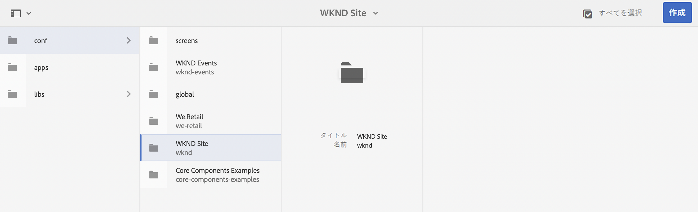
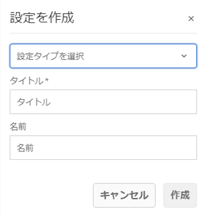
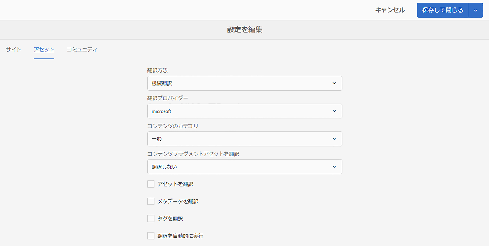
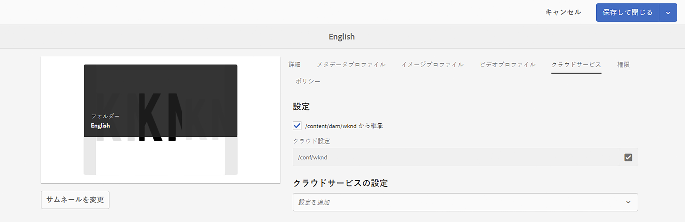

# 翻訳コネクタの設定 {#configure-connector}

AEMを翻訳サービスに接続する方法を説明します。

## これまでの説明内容 {#story-so-far}

以前のドキュメントのAEMヘッドレス翻訳ジャーニーでは、 [AEMヘッドレス翻訳の概要](learn-about.md) ヘッドレスコンテンツの整理方法とAEM翻訳ツールの仕組みを学習し、次の操作をおこなう必要があります。

* 翻訳に対するコンテンツ構造の重要性を理解します。
* AEMがヘッドレスコンテンツを保存する方法を理解します。
* AEMの翻訳ツールを理解してください。

この記事は、これらの基本事項に基づいて構築されるので、最初の設定手順を実行して翻訳サービスを設定し、後でそのサービスを使用してコンテンツを翻訳します。

## 目的 {#objective}

このドキュメントでは、選択した翻訳サービスにAEMコネクタを設定する方法を説明します。 ドキュメントを読めば、以下が可能です。

* AEMの翻訳統合フレームワークの重要なパラメーターを理解します。
* 翻訳サービスへの接続を独自に設定できるようになります。

## 翻訳統合フレームワーク {#tif}

AEM Translation Integration Framework(TIF) は、サードパーティの翻訳サービスと統合され、AEMコンテンツの翻訳を調整します。 これには 3 つの基本的な手順が必要です。

1. 翻訳サービスプロバイダーに接続します。
1. 翻訳統合フレームワーク設定を作成します。
1. 設定をコンテンツに関連付けます。

次の節では、これらの手順の詳細を説明します。

## 翻訳サービスプロバイダーへの接続 {#connect-translation-provider}

最初の手順は、使用する翻訳サービスを選択することです。 AEMでは、人間と機械翻訳サービスに対して様々な選択肢があります。 ほとんどのプロバイダーは、インストールするトランスレーターパッケージを提供しています。 詳しくは、 [その他のリソース](#additional-resources) セクションを参照してください。

>[!NOTE]
>
>通常、翻訳スペシャリストは、使用する翻訳サービスの選択を担当しますが、管理者は、必要な翻訳コネクタパッケージのインストールを担当します。

このジャーニーの目的で、AEMに標準で体験版ライセンスが付与されているMicrosoft Translator を使用します。 詳しくは、 [その他のリソース](#additional-resources) このプロバイダの詳細については、「 」を参照してください。

別のプロバイダーを選択する場合は、管理者が、翻訳サービスの指示に従って、コネクタパッケージをインストールする必要があります。

>[!NOTE]
>
>AEMで標準搭載のMicrosoft Translator を使用する場合は、追加の設定は必要なく、コネクタを追加設定せずにそのまま機能します。
>
>テスト用にMicrosoft Translator コネクタを使用する場合は、次の 2 つの節で示す手順を実行する必要はありません。 [翻訳統合設定の作成](#create-config) および [設定をコンテンツに関連付けます。](#associate) ただし、目的のコネクタを設定する必要がある場合の手順を理解できるように、目的のコネクタを読むことをお勧めします。
>
>Microsoft Translator Connector の体験版ライセンスは、実稼動用のライセンスではありません。ライセンスを取得する場合は、システム管理者が、 [その他のリソース](#additional-resources) 」の節を参照してください。

## 翻訳統合フレームワーク設定の作成 {#create-config}

目的の翻訳サービス用のコネクタパッケージをインストールしたら、そのサービス用の翻訳統合フレームワーク設定を作成する必要があります。 この設定には以下の情報が含まれます。

* 使用する翻訳サービスプロバイダー
* 人間による翻訳と機械翻訳のどちらを実行するか
* タグなど、コンテンツフラグメントに関連付けられた他のコンテンツを翻訳するかどうか

新しい翻訳設定を作成するには：

1. グローバルナビゲーションメニューで、「 」をクリックまたはタップします。 **ツール** -> **Cloud Services** -> **翻訳Cloud Services**.
1. コンテンツ構造内で設定を作成する場所に移動します。多くの場合、特定のプロジェクトに基づいているか、グローバルにすることができます。
   * 例えば、この場合、すべてのコンテンツに適用するようにグローバルに設定したり、WKND プロジェクトに対してのみ設定したりできます。

   

1. フィールドに次の情報を入力し、「 」をクリックまたはタップします **作成**.
   1. ドロップダウンで「**設定タイプ**」を選択します。選択 **翻訳の統合** を選択します。
   1. 設定の&#x200B;**タイトル**&#x200B;を入力します。この&#x200B;**タイトル**&#x200B;によって、**Cloud Services** コンソールおよびページプロパティのドロップダウンリストで設定が識別されます。
   1. オプションとして、設定を格納するリポジトリノードに使用する&#x200B;**名前**&#x200B;を入力します。

   

1. タップまたはクリック **作成** そして **設定を編集** ウィンドウが表示され、設定プロパティを設定できます。

1. コンテンツフラグメントは、アセットとしてAEMに保存されます。 をタップまたはクリックします。 **Assets** タブをクリックします。



1. 以下の情報を入力します。

   1. **翻訳方法**  — 選択 **機械翻訳** または **人間翻訳** 翻訳プロバイダーに応じて異なります。 このジャーニーの目的では、機械翻訳を想定しています。
   1. **翻訳プロバイダー**  — 翻訳サービス用にインストールしたコネクタをリストから選択します。
   1. **コンテンツカテゴリ**  — 翻訳のターゲットを絞り込むために、最も適切なカテゴリを選択します（機械翻訳の場合のみ）。
   1. **コンテンツフラグメントアセットを翻訳**  — コンテンツフラグメントに関連付けられたアセットを翻訳する場合は、これをオンにします。
   1. **アセットを翻訳**  — アセットを翻訳する場合は、これをオンにします。
   1. **メタデータを翻訳**  — アセットのメタデータを翻訳する場合は、これをオンにします。
   1. **タグを翻訳**  — アセットに関連付けられているタグを翻訳する場合にオンにします。
   1. **翻訳を自動実行**  — 翻訳を翻訳サービスに自動的に送信する場合は、このプロパティをチェックします。

1. 「**保存して閉じる**」をタップまたはクリックします。

これで、翻訳サービスへのコネクタが設定されました。

## 設定とコンテンツの関連付け {#associate}

AEMは柔軟で強力なツールで、複数のコネクタと複数の設定を介した複数の同時翻訳サービスをサポートします。 このような設定は、このジャーニーの範囲外です。 ただし、この柔軟性により、この設定をコンテンツに関連付けることで、コンテンツの翻訳に使用するコネクタと設定を指定する必要があります。

これをおこなうには、コンテンツの言語ルートに移動します。 この例では、次のようになります。

```text
/content/dam/<your-project>/en
```

1. グローバルナビゲーションに移動し、に移動します。 **ナビゲーション** -> **Assets** -> **ファイル**.
1. アセットコンソールで、設定する言語ルートを選択し、「 」をクリックまたはタップします **プロパティ**.
1. をタップまたはクリックします。 **Cloud Services** タブをクリックします。
1. の下 **Cloud Service設定** 内 **設定を追加** ドロップダウンで、コネクタを選択します。 パッケージを [前述のとおりです。](#connect-translation-provider)
1. の下 **Cloud Service設定** 内 **設定を追加** ドロップダウンで、設定を選択します。
1. 「**保存して閉じる**」をタップまたはクリックします。



## 次の手順 {#what-is-next}

ヘッドレス翻訳ジャーニーのこの部分を完了したら、次の手順を実行します。

* AEMの翻訳統合フレームワークの重要なパラメーターを理解します。
* 翻訳サービスへの接続を独自に設定できるようになります。

この知識に基づいてドキュメントを次に確認し、AEMヘッドレス翻訳ジャーニーを継続します [翻訳ルールを設定する](translation-rules.md) 翻訳するコンテンツを定義する方法を説明します。

## その他のリソース {#additional-resources}

ドキュメントを確認して、ヘッドレス翻訳ジャーニーの次の部分に進むことをお勧めします [翻訳ルールの設定](translation-rules.md) 以下に、このドキュメントで取り上げたいくつかの概念について詳しく説明する追加のオプションリソースを示しますが、ヘッドレスジャーニーを続行する必要はありません。

* [翻訳統合フレームワークの設定](/help/sites-administering/tc-tic.md)  — 選択した翻訳コネクタのリストを確認し、サードパーティの翻訳サービスと統合するための翻訳統合フレームワークの設定方法を学びます。
* [Microsoft Translator への接続](/help/sites-administering/tc-msconf.md) - AEMは、テスト用にMicrosoft翻訳の体験版アカウントを提供します。
