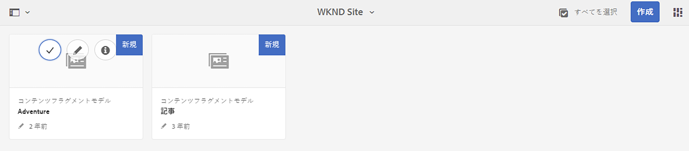
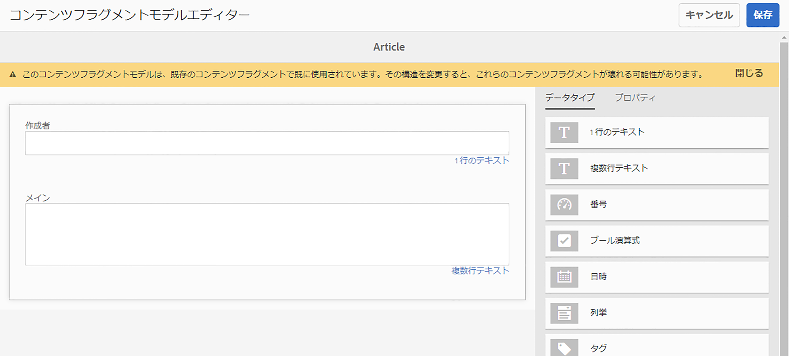
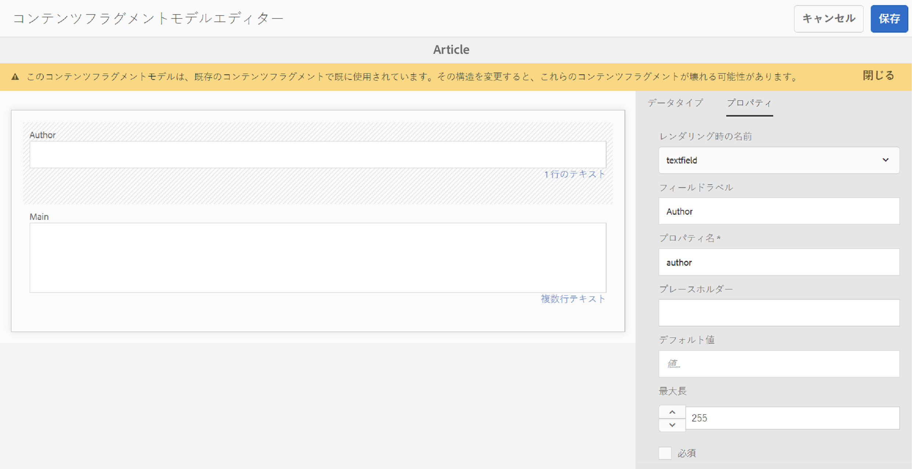

# AEMヘッドレス翻訳の概要 {#getting-started}

ヘッドレスコンテンツの整理方法とAEM翻訳ツールの仕組みについて説明します。

## これまでの説明内容 {#story-so-far}

以前のドキュメントのAEMヘッドレス翻訳ジャーニーでは、 [ヘッドレスコンテンツとAEMでの翻訳方法について説明します](learn-about.md) ヘッドレス CMS の基本理論を学び、次のようにする必要があります。

* ヘッドレスコンテンツ配信の基本概念を理解します。
* AEMがヘッドレスと翻訳をサポートする方法を理解してください。

この記事は、これらの基本事項に基づいて構築され、AEMがヘッドレスコンテンツを保存および管理する方法と、AEM翻訳ツールを使用してそのコンテンツを翻訳する方法を理解できます。

## 目的 {#objective}

このドキュメントでは、AEMでヘッドレスコンテンツの翻訳を開始する方法を説明します。 ドキュメントを読めば、以下が可能です。

* 翻訳に対するコンテンツ構造の重要性を理解します。
* AEMがヘッドレスコンテンツを保存する方法を理解します。
* AEMの翻訳ツールを理解してください。

## 要件と前提条件 {#requirements-prerequisites}

ヘッドレスAEMコンテンツの翻訳を開始する前に、いくつかの要件があります。

### 知識 {#knowledge}

* CMS でのコンテンツの翻訳を体験する
* 大規模な CMS の基本機能を使用した経験
* AEMの基本操作に関する実務知識がある
* 使用している翻訳サービスについて理解している
* 翻訳するコンテンツの基本的な理解を得る

>[!TIP]
>
>AEMのような大規模な CMS の使用に慣れていない場合は、 [基本操作](/help/sites-authoring/basic-handling.md) ドキュメントを参照してください。 基本操作に関するドキュメントはジャーニーに含まれていません。完了したら、このページに戻ってください。

### ツール {#tools}

* コンテンツの翻訳をテストするためのサンドボックスアクセス
* 目的の翻訳サービスに接続するための資格情報
* のメンバーである `project-administrators` AEMのグループ

## 構造がキー {#content-structure}

AEMコンテンツは、ヘッドレスや従来の Web ページであっても、構造によって決まります。 AEMではコンテンツ構造に関していくつかの要件が課されますが、プロジェクト計画の一環としてコンテンツ階層を慎重に検討すると、翻訳がより簡単になります。

>[!TIP]
>
>ヘッドレスプロジェクトの最初に翻訳を計画します。 プロジェクトマネージャーやコンテンツアーキテクトと早期に緊密に連携します。
>
>国際化プロジェクトマネージャーは、翻訳するコンテンツと翻訳しないコンテンツを定義し、地域またはローカルのコンテンツプロデューサーが変更できる翻訳コンテンツを定義する責任を負う個人として必要になる場合があります。

## AEMがヘッドレスコンテンツを保存する方法 {#headless-content-in-aem}

翻訳スペシャリストにとって、AEMがヘッドレスコンテンツをどのように管理するかを深く理解することは重要ではありません。 ただし、後でAEM翻訳ツールを使用する際には、基本概念と用語に精通していることが役立ちます。 最も重要なのは、効果的に翻訳するために、独自のコンテンツと、その構造を理解する必要があることです。

### コンテンツモデル {#content-models}

ヘッドレスコンテンツをチャネル、地域、言語をまたいで一貫して配信するには、コンテンツの構造が非常に高い必要があります。 AEMでは、コンテンツモデルを使用してこの構造を強化します。 コンテンツモデルは、ヘッドレスコンテンツを作成するためのテンプレートまたはパターンの一種と考えてください。 すべてのプロジェクトには独自のニーズがあるので、すべてのプロジェクトで独自のコンテンツフラグメントモデルを定義します。 AEMには、このようなモデルに対する固定された要件や構造はありません。

コンテンツアーキテクトは、プロジェクトの初期段階でこの構造を定義します。 翻訳スペシャリストは、コンテンツアーキテクトと緊密に連携して、コンテンツを理解し、整理する必要があります。

>[!NOTE]
>
>コンテンツモデルを定義するのはコンテンツアーキテクトの責任です。 翻訳スペシャリストは、次の手順で説明する構造にのみ精通している必要があります。

コンテンツモデルはコンテンツの構造を定義するので、翻訳する必要があるモデルのフィールドを把握しておく必要があります。 通常は、コンテンツアーキテクトと協力してこれを定義します。 コンテンツモデルのフィールドを参照するには、次の手順に従います。

1. に移動します。 **ツール** -> **Assets** -> **コンテンツフラグメントモデル**.
1. コンテンツフラグメントモデルは、通常、フォルダー構造に保存されます。 プロジェクトのフォルダーをタップまたはクリックします。
1. モデルが表示されます。 詳細を表示するには、モデルをタップまたはクリックします。
   
1. この **コンテンツフラグメントモデルエディター** が開きます。
   1. 左の列には、モデルのフィールドが含まれます。 この欄は私たちに興味を持たせる。
   1. 右側の列には、モデルに追加できるフィールドが含まれます。 この列は無視できます。
      
1. モデルのフィールドの 1 つをタップまたはクリックします。 AEMによってマークが付けられ、そのフィールドの詳細が右側の列に表示されます。
   

フィールドをメモします。 **プロパティ名** 翻訳が必要なすべてのフィールドに対して この情報は、後でジャーニーで必要になります。 これら **プロパティ名**&#x200B;翻訳が必要なコンテンツのフィールドをAEMに通知するには、が必要です。

>[!TIP]
>
>通常、コンテンツアーキテクトは翻訳の専門家に **プロパティ名**&#x200B;翻訳に必要なすべてのフィールドの。 これらのフィールド名は、ジャーニーの後半で使用するために必要になります。 以前の手順は、翻訳スペシャリストの理解を深めるために提供されています。

### コンテンツフラグメント {#content-fragments}

コンテンツモデルは、コンテンツ作成者が実際のヘッドレスコンテンツを作成する際に使用します。 コンテンツ作成者は、コンテンツの基にするモデルを選択し、コンテンツフラグメントを作成します。 コンテンツフラグメントはモデルのインスタンスで、ヘッドレスに配信される実際のコンテンツを表します。

コンテンツモデルがコンテンツのパターンの場合、コンテンツフラグメントは、それらのパターンに基づく実際のコンテンツになります。 コンテンツフラグメントは、翻訳が必要なコンテンツを表します。

コンテンツフラグメントは、デジタルアセット管理 (DAM) の一環としてAEMでアセットとして管理されます。 これらはすべてパスの下に配置されるので、重要です `/content/dam`.

## 推奨コンテンツ構造 {#recommended-structure}

前述のとおり、コンテンツアーキテクトと協力して、独自のプロジェクトに適したコンテンツ構造を決定します。 ただし、次に示す構造は実証済みで、シンプルで直感的で、非常に効果的です。

の下にプロジェクトのベースフォルダーを定義する `/content/dam`.

```text
/content/dam/<your-project>
```

コンテンツをオーサリングする言語は、言語ルートと呼ばれます。 この例では、パスは英語で、このパスの下に配置する必要があります。

```text
/content/dam/<your-project>/en
```

ローカライズが必要になる可能性のあるプロジェクトコンテンツは、すべて言語ルートの下に配置する必要があります。

```text
/content/dam/<your-project>/en/<your-project-content>
```

翻訳は、言語ルートの横に兄弟フォルダーとして作成し、そのフォルダー名は言語の ISO-2 言語コードを表す必要があります。 例えば、ドイツ語の場合、パスは次のようになります。

```text
/content/dam/<your-project>/de
```

>[!NOTE]
>
>コンテンツアーキテクトは、通常、これらの言語フォルダーの作成を担当します。 翻訳ジョブが作成されていない場合、AEMは後で翻訳ジョブを作成できません。

最終的な構造は次のようになります。

```text
/content
    |- dam
        |- your-project
            |- en
                |- some
                |- exciting
                |- headless
                |- content
            |- de
            |- fr
            |- it
            |- ...
        |- another-project
        |- ...
```

コンテンツの特定のパスは、後で翻訳を設定する際に必要になるので、メモしておく必要があります。

>[!NOTE]
>
>コンテンツ構造の定義はコンテンツアーキテクトがおこなうのが一般的ですが、翻訳スペシャリストと共同作業をおこなうことができます。
>
>完全性を考慮して、ここで詳しく説明します。

## AEM Translation Tools {#translation-tools}

コンテンツフラグメントの概要とコンテンツ構造の重要性を理解したので、このコンテンツの翻訳方法を見てみましょう。 AEMの翻訳ツールは非常に強力ですが、高いレベルで簡単に理解できます。

* **翻訳コネクタ**  — コネクタは、使用するAEMと翻訳サービスの間のリンクです。
* **翻訳ルール**  — ルールは、特定のパスの下で翻訳するコンテンツを定義します。
* **翻訳プロジェクト**  — 翻訳プロジェクトは、単一の翻訳作業として扱う必要のあるコンテンツを収集し、翻訳の進行状況を追跡します。コネクタと連携して、翻訳対象のコンテンツを送信し、翻訳サービスから返信します。

通常、コネクタはインスタンスに対して 1 回だけ設定し、ヘッドレスプロジェクトごとにルールを設定します。 その後、翻訳プロジェクトを使用して、コンテンツを翻訳し、その翻訳を継続的に最新の状態に保ちます。

## 次の手順 {#what-is-next}

ヘッドレス翻訳ジャーニーのこの部分を完了したら、次の手順を実行します。

* 翻訳に対するコンテンツ構造の重要性を理解します。
* AEMがヘッドレスコンテンツを保存する方法を理解します。
* AEMの翻訳ツールを理解してください。

この知識に基づいてドキュメントを次に確認し、AEMヘッドレス翻訳ジャーニーを継続します [翻訳コネクタの設定](configure-connector.md) AEMを翻訳サービスに接続する方法を説明します。|

## その他のリソース {#additional-resources}

ドキュメントを確認して、ヘッドレス翻訳ジャーニーの次の部分に進むことをお勧めします [翻訳コネクタの設定](configure-connector.md) 以下に、このドキュメントで取り上げたいくつかの概念について詳しく説明する追加のオプションリソースを示しますが、ヘッドレスジャーニーを続行する必要はありません。

* [AEM Basic Handling](/help/sites-authoring/basic-handling.md)  — コンテンツを快適に移動し、検索するなどの重要なタスクを実行できるAEM UI の基本について説明します。
* [翻訳するコンテンツの識別](/help/sites-administering/tc-rules.md)  — 翻訳ルールが、翻訳が必要なコンテンツを識別する方法を説明します。
* [翻訳統合フレームワークの設定](/help/sites-administering/tc-tic.md)  — サードパーティの翻訳サービスと統合するための翻訳統合フレームワークの設定方法を説明します。
* [翻訳プロジェクトの管理](/help/sites-administering/tc-manage.md) - AEMで機械翻訳プロジェクトと人間翻訳プロジェクトの両方を作成および管理する方法を説明します。
