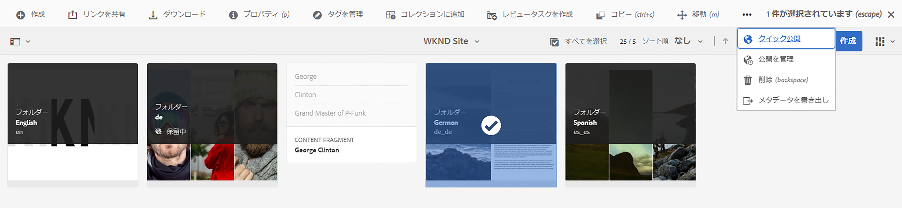
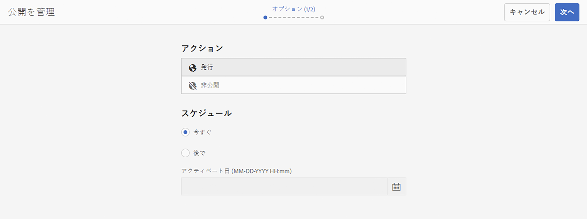
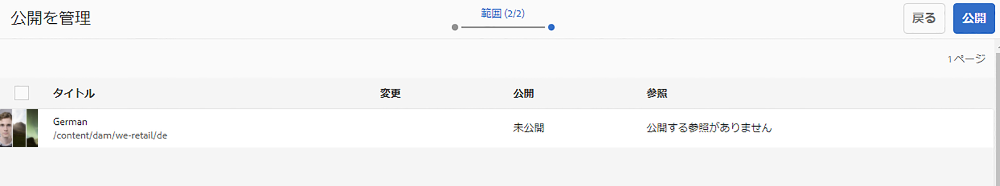
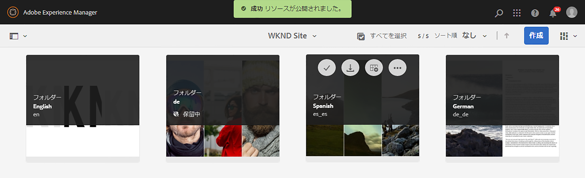
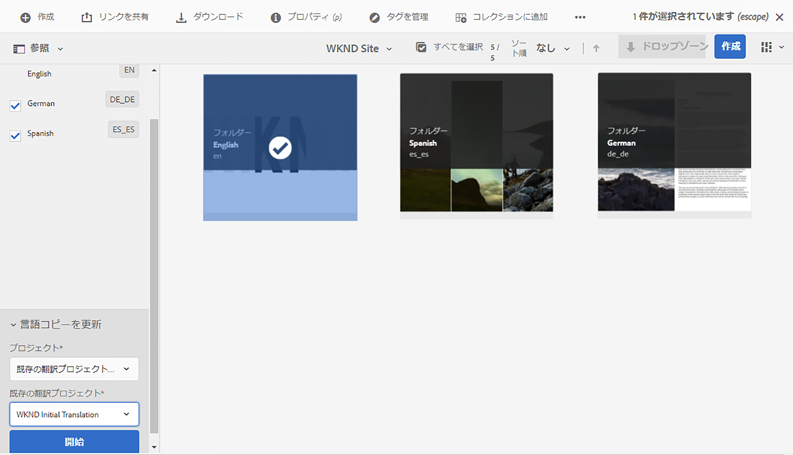
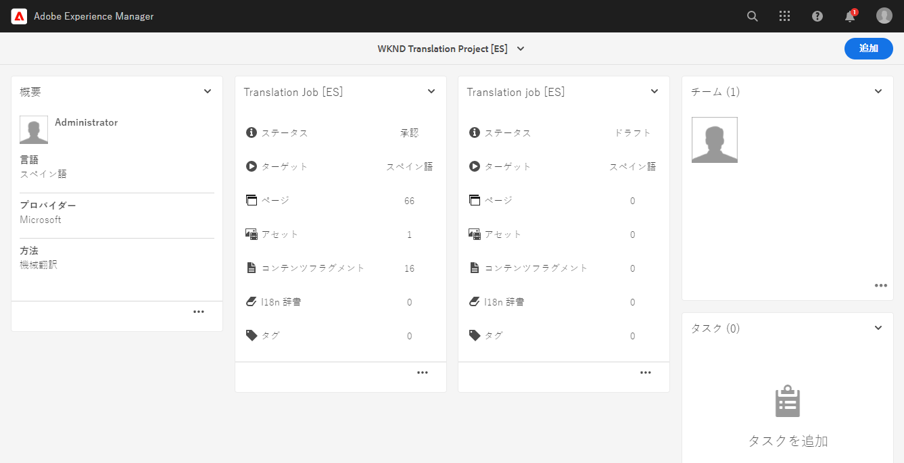
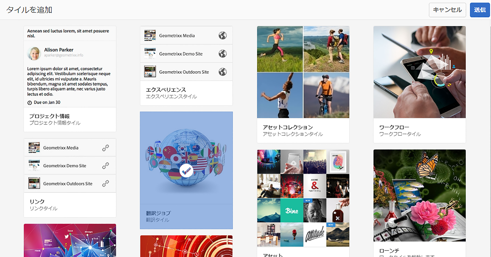
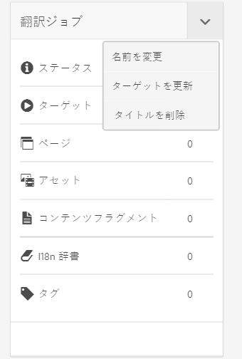
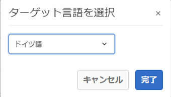

# 翻訳済みコンテンツを公開 {#publish-content}

翻訳済みコンテンツを公開し、コンテンツの更新に合わせて翻訳を更新する方法を説明します。

## これまでの説明内容 {#story-so-far}

以前のドキュメントのAEMヘッドレス翻訳ジャーニーでは、 [コンテンツを翻訳](configure-connector.md) ここでは、AEM Translation Projects を使用して、ヘッドレスコンテンツを翻訳する方法を学びました。 次の手順を実行します。

* 翻訳プロジェクトとは何かを理解します。
* 新しい翻訳プロジェクトを作成できるようにする。
* 翻訳プロジェクトを使用して、ヘッドレスコンテンツを翻訳します。

初期翻訳が完了したので、この記事では、次の手順でそのコンテンツを公開し、言語ルートの基になるコンテンツが変更されたときに翻訳を更新する方法を説明します。

## 目的 {#objective}

このドキュメントでは、AEMでヘッドレスコンテンツを公開する方法と、翻訳を最新の状態に保つための継続的なワークフローを作成する方法を説明します。 読み終えると、以下を達成できます。

* AEMのオーサーとパブリッシュのモデルを理解します。
* 翻訳済みコンテンツの公開方法を理解します。
* 翻訳されたコンテンツの継続的な更新モデルを実装できる。

## AEM Author-Publish モデル {#author-publish}

コンテンツを公開する前に、AEMのオーサーとパブリッシュのモデルを理解しておくことをお勧めします。 簡略化された用語では、AEMはシステムのユーザーを 2 つのグループに分割します。

1. コンテンツやシステムを作成、管理するユーザー
1. システムからコンテンツを使用するユーザー

したがって、AEMは物理的に 2 つのインスタンスに分けられます。

1. この **作成者** インスタンスとは、コンテンツ作成者と管理者がコンテンツの作成と管理をおこなうシステムです。
1. この **公開** インスタンスは、コンテンツを消費者に配信するシステムです。

コンテンツをオーサーインスタンスで作成したら、そのコンテンツを使用できるようにするには、パブリッシュインスタンスに転送する必要があります。 オーサーからパブリッシュに転送するプロセスが呼び出されます **公開**.

## 翻訳済みコンテンツの公開 {#publishing}

翻訳されたコンテンツの状態に満足したら、ヘッドレスサービスがそのコンテンツを使用できるように、コンテンツを公開する必要があります。 このタスクは通常、翻訳スペシャリストの責任ではありませんが、ワークフロー全体を説明するためにここに記載されています。

>[!NOTE]
>
>通常、翻訳が完了すると、翻訳のスペシャリストから、翻訳の公開準備が整ったことがコンテンツ所有者に通知されます。 コンテンツの所有者は、コンテンツを公開します。
>
>完全性を考慮して、次の手順を実行します。

翻訳を公開する最も簡単な方法は、プロジェクトのアセットフォルダーに移動することです。

```text
/content/dam/<your-project>/
```

このパスの下に各翻訳言語用のサブフォルダーがあり、公開するサブフォルダーを選択できます。

1. に移動します。 **ナビゲーション** -> **Assets** -> **ファイル** プロジェクトフォルダを開きます。
1. ここに、言語ルートフォルダーとその他すべての言語フォルダーが表示されます。 公開するローカライズされた言語を選択します。
   
1. タップまたはクリック **公開を管理**.
1. 内 **公開を管理** ウィンドウで、 **公開** 次の項目で自動的に選択されます： **アクション** そして **今すぐ** が次の中で選択されています： **スケジュール**. 「**次へ**」をタップまたはクリックします。
   
1. 次の **公開を管理** ウィンドウで、適切なパスが選択されていることを確認します。 タップまたはクリック **公開**.
   
1. AEMは、画面の上部にポップアップメッセージを表示して、公開アクションを確認します。
   

翻訳されたヘッドレスコンテンツが公開されました。 これで、ヘッドレスサービスでアクセスし、使用できるようになりました。

>[!TIP]
>
>複数の翻訳を一度に公開するために、公開時に複数の項目（複数の言語フォルダー）を選択できます。

コンテンツを公開する際には、公開時間のスケジュールなど、このジャーニーの範囲外の追加オプションがあります。 詳しくは、 [その他のリソース](#additional-resources) 」の節を参照してください。

## 翻訳済みコンテンツの更新 {#updating-translations}

翻訳が一回限りの練習になることはほとんどありません。 通常、コンテンツ作成者は、初回翻訳が完了した後も、引き続き言語ルートのコンテンツをに追加および変更します。 つまり、翻訳済みコンテンツも更新する必要があります。

特定のプロジェクト要件は、翻訳の更新頻度と、更新を実行する前に実行される決定プロセスを定義します。 翻訳の更新を決定したら、AEMでの処理は非常に簡単です。 最初の翻訳は翻訳プロジェクトに基づいていたので、更新もおこなわれます。

ただし、以前と同様、翻訳プロジェクトを自動的に作成するか、翻訳プロジェクトを手動で作成するかを選択した場合は、プロセスが若干異なります。

### 自動的に作成された翻訳プロジェクトの更新 {#updating-automatic-project}

1. に移動します。 **ナビゲーション** -> **Assets** -> **ファイル**. AEMのヘッドレスコンテンツは、コンテンツフラグメントと呼ばれるアセットとして保存されます。
1. プロジェクトの言語ルートを選択します。 この場合、 `/content/dam/wknd/en`.
1. パネルセレクターをタップまたはクリックし、 **参照** パネル。
1. タップまたはクリック **言語コピー**.
1. 次を確認します。 **言語コピー** チェックボックス。
1. 「 」セクションを展開します。 **言語コピーを更新** をクリックします。
1. 内 **プロジェクト** ドロップダウン、選択 **既存の翻訳プロジェクトに追加**.
1. 内 **既存の翻訳プロジェクト** ドロップダウンで、最初の翻訳用に作成したプロジェクトを選択します。
1. タップまたはクリック **開始**.



コンテンツが既存の翻訳プロジェクトに追加されます。 翻訳プロジェクトを表示するには：

1. に移動します。 **ナビゲーション** -> **プロジェクト**.
1. 更新したプロジェクトをタップまたはクリックします。
1. 更新した言語をタップまたはクリックします。

必要に応じて、新しいジョブカードがプロジェクトに追加されています。

<!--
You see that a new job card was added to the project. In this example, another Spanish translation was added.


-->

新しいカード（アセット数とコンテンツフラグメント数）に表示される統計が異なることに気付くかもしれません。 これは、AEMが最後の翻訳以降に変更された内容を認識し、翻訳が必要なコンテンツのみを含むからです。 これには、更新されたコンテンツの再翻訳と、新しいコンテンツの初回翻訳が含まれます。

この点から、 [元の翻訳ジョブと同じように、翻訳ジョブを開始および管理します。](translate-content.md#using-translation-project)

### 手動で作成した翻訳プロジェクトの更新 {#updating-manual-project}

翻訳を更新するには、更新されたコンテンツを翻訳する役割を持つ新しいジョブを既存のプロジェクトに追加します。

1. に移動します。 **ナビゲーション** -> **プロジェクト**.
1. 更新するプロジェクトをタップまたはクリックします。
1. をタップまたはクリックします。 **追加** ボタンをクリックします。
1. 内 **タイルを追加** ウィンドウ、タップまたはクリック **翻訳ジョブ** その後 **送信**.

   

1. 新しい翻訳ジョブのカードで、カードの上部にある山形のボタンをタップまたはクリックし、「 」を選択します。 **ターゲットを更新** ：新しいジョブのターゲット言語を定義します。

   

1. 内 **ターゲット言語を選択** ダイアログが表示されたら、ドロップダウンを使用して言語を選択し、をタップまたはクリックします。 **完了**.

   

1. 新しい翻訳ジョブのターゲット言語が設定されたら、ジョブカードの下部にある省略記号ボタンをタップまたはクリックして、ジョブの詳細を表示します。
1. 最初に作成したジョブは空です。 「 **追加** ボタンをクリックし、パスブラウザーを使用します。 [翻訳プロジェクトを最初に作成したときと同じように。](translate-content.md##manually-creating)

>[!TIP]
>
>パスブラウザーの強力なフィルターは、更新されたコンテンツのみを見つけるのに再び役立つ場合があります。
>
>パスブラウザーについて詳しくは、 [その他のリソースの節を参照してください。](#additional-resources)

この点から、 [元の翻訳ジョブと同じように、翻訳ジョブを開始および管理します。](translate-content.md#using-translation-project)

## ジャーニー? {#end-of-journey}

おめでとうございます。ヘッドレス翻訳ジャーニーを完了しました。 次の手順を実行します。

* ヘッドレスコンテンツ配信の概要を把握します。
* AEMヘッドレスの基本機能について
* AEMの翻訳機能と、ヘッドレスコンテンツとの関連について説明します。
* 独自のヘッドレスコンテンツの翻訳を開始できます。

これで、AEMで独自のヘッドレスコンテンツを翻訳する準備が整いました。 ただし、AEMは強力なツールであり、他にも多くのオプションを使用できます。 その他のリソースについては、 [「その他のリソース」セクション](#additional-resources) このジャーニーで確認した機能の詳細を確認するには、以下を参照してください。

## その他のリソース {#additional-resources}

* [翻訳プロジェクトの管理](/help/sites-administering/tc-manage.md)  — 翻訳プロジェクトの詳細と、人間による翻訳ワークフローや多言語プロジェクトなどの追加機能について説明します。
* [オーサリングの概念](/help/sites-authoring/author.md) - AEMのオーサーとパブリッシュのモデルについて詳しく説明します。 このドキュメントでは、コンテンツフラグメントではなくページのオーサリングに焦点を当てていますが、理論は依然として当てはまります。
* [ページの公開](/help/sites-authoring/publishing-pages.md)  — コンテンツを公開する際に使用できる追加機能について説明します。 このドキュメントでは、コンテンツフラグメントではなくページのオーサリングに焦点を当てていますが、理論は依然として当てはまります。
* [オーサリング環境とツール](/help/sites-authoring/author-environment-tools.md##path-selection) - AEMは、堅牢なパスブラウザーを含む、コンテンツを整理および編集するための様々なメカニズムを提供します。
