# コンテンツを翻訳 {#translate-content}

翻訳コネクタとルールを使用して、ヘッドレスコンテンツを翻訳します。

## これまでの説明内容 {#story-so-far}

以前のドキュメントのAEMヘッドレス翻訳ジャーニーでは、 [翻訳ルールを設定](translation-rules.md) 翻訳ルールを使用して翻訳コンテンツを識別する方法を学びました。 次の手順を実行します。

* 翻訳ルールの動作を理解します。
* 独自の翻訳ルールを定義できる。

コネクタと翻訳のルールが設定されたので、この記事では、ヘッドレスコンテンツを翻訳する次の手順を説明します。

## 目的 {#objective}

このドキュメントでは、AEM翻訳プロジェクトと、コネクタおよび翻訳ルールを使用してコンテンツを翻訳する方法を理解するのに役立ちます。 読み終えると、以下を達成できます。

* 翻訳プロジェクトとは何かを理解します。
* 新しい翻訳プロジェクトを作成できるようにする。
* 翻訳プロジェクトを使用して、ヘッドレスコンテンツを翻訳します。

## 翻訳プロジェクトの作成 {#creating-translation-project}

翻訳プロジェクトを使用すると、ヘッドレスAEMコンテンツの翻訳を管理できます。 翻訳プロジェクトでは、翻訳作業を一元的に把握できるように、他の言語に翻訳するコンテンツを 1 か所で収集します。

コンテンツを翻訳プロジェクトに追加すると、その翻訳ジョブが作成されます。 リソースで実行される人間による翻訳と機械翻訳のワークフローの管理に使用するコマンドとステータス情報がジョブによって提供されます。

翻訳プロジェクトは、次の 2 つの方法で作成できます。

1. コンテンツの言語ルートを選択し、コンテンツパスに基づいてAEMが翻訳プロジェクトを自動的に作成するようにします。
1. 空のプロジェクトを作成し、翻訳プロジェクトに追加するコンテンツを手動で選択します

両方の方法は、通常、翻訳を実行するペルソナによって異なる場合にのみ有効です。

* 多くの場合、翻訳プロジェクトマネージャー (TPM) は、翻訳プロジェクトに対するコンテンツを手動で選択する柔軟性が必要です。
* コンテンツ所有者も翻訳を担当する場合は、AEMが選択したコンテンツパスに基づいてプロジェクトを自動的に作成するほうが簡単です。

両方の方法については、以降の節で説明します。

### コンテンツパスに基づく翻訳プロジェクトの自動作成 {#automatically-creating}

翻訳も担当するコンテンツ所有者の場合、多くの場合、AEMで翻訳プロジェクトを自動的に作成するほうが簡単です。 コンテンツパスに基づいてAEMで翻訳プロジェクトを自動的に作成するには、次の手順を実行します。

1. に移動します。 **ナビゲーション** -> **Assets** -> **ファイル**. AEMのヘッドレスコンテンツは、コンテンツフラグメントと呼ばれるアセットとして保存されます。
1. プロジェクトの言語ルートを選択します。 この場合、 `/content/dam/wknd/en`.
1. パネルセレクターをタップまたはクリックし、 **参照** パネル。
1. タップまたはクリック **言語コピー**.
1. 次を確認します。 **言語コピー** チェックボックス。
1. 「 」セクションを展開します。 **言語コピーを更新** をクリックします。
1. 内 **プロジェクト** ドロップダウン、選択 **翻訳プロジェクトを作成**.
1. 翻訳プロジェクトに適したタイトルを指定します。
1. タップまたはクリック **開始**.

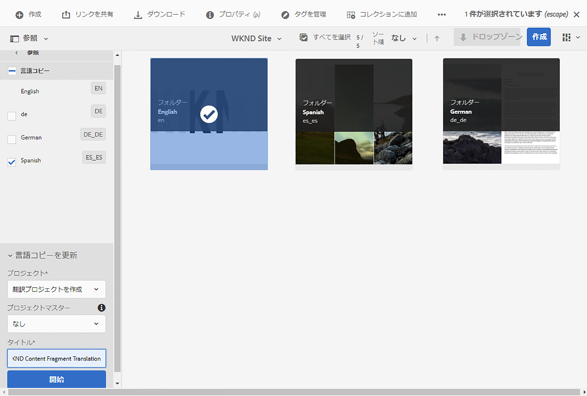

プロジェクトが作成されたことを示すメッセージが表示されます。

>[!NOTE]
>
>翻訳言語に必要な言語構造が、 [コンテンツ構造の定義。](getting-started.md#content-structure) これは、コンテンツアーキテクトと協力しておこなう必要があります。
>
>前の手順で説明したように、言語フォルダーが事前に作成されない場合は、言語コピーを作成できません。

### コンテンツを選択して手動で翻訳プロジェクトを作成する {#manually-creating}

翻訳プロジェクトマネージャーの場合、多くの場合、翻訳プロジェクトに含める特定のコンテンツを手動で選択する必要があります。 手動翻訳プロジェクトを作成するには、まず空のプロジェクトを作成してから、そのプロジェクトに追加するコンテンツを選択する必要があります。

1. に移動します。 **ナビゲーション** -> **プロジェクト**.
1. タップまたはクリック **作成** -> **フォルダー** をクリックして、プロジェクト用のフォルダーを作成します。
   * これはオプションですが、翻訳作業の整理に役立ちます。
1. 内 **フォルダーを作成** ウィンドウ、 **タイトル** フォルダーのをタップまたはクリックし、 **作成**.

   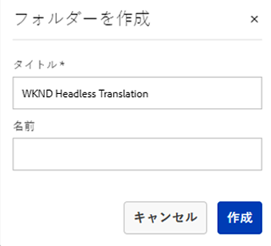

1. フォルダーをタップまたはクリックして、フォルダーを開きます。
1. 新しいプロジェクトフォルダーで、をタップまたはクリックします。 **作成** -> **プロジェクト**.
1. プロジェクトはテンプレートに基づいています。 をタップまたはクリックします。 **翻訳プロジェクト** テンプレートを選択し、タップまたはクリックします。 **次へ**.

   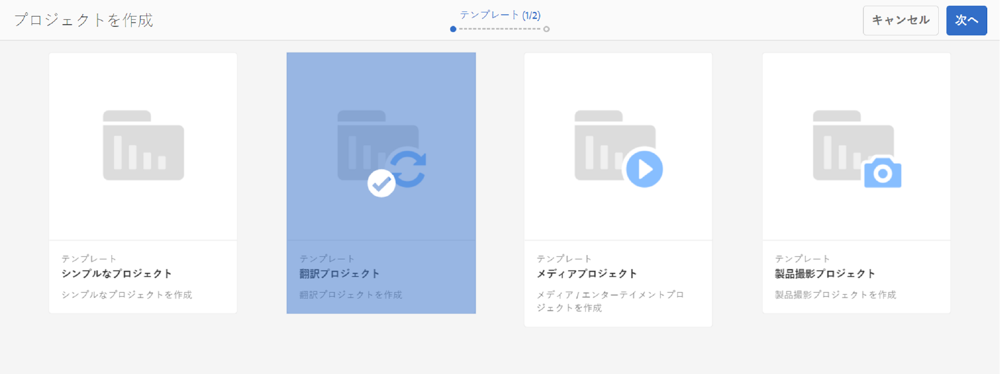

1. の **基本** 「 」タブで、新しいプロジェクトの名前を入力します。

   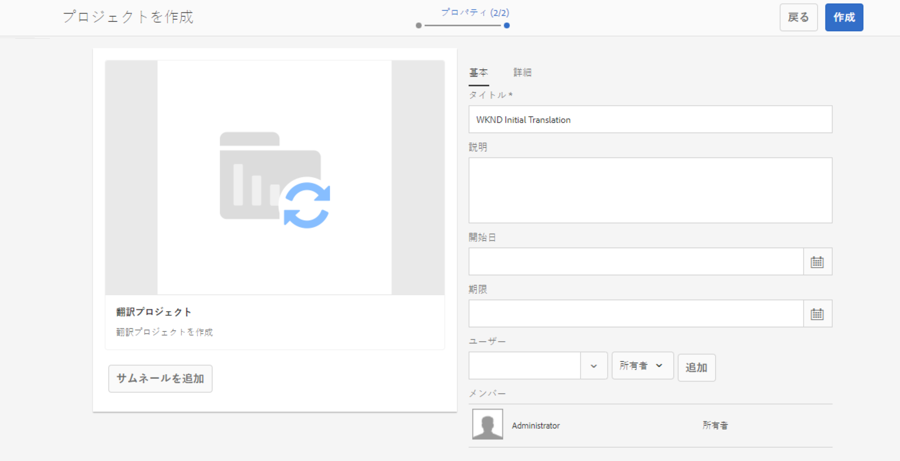

1. の **詳細** タブで、 **ターゲット言語** ドロップダウンを使用して、コンテンツの翻訳先の言語を選択します。 「**作成**」をタップまたはクリックします。

   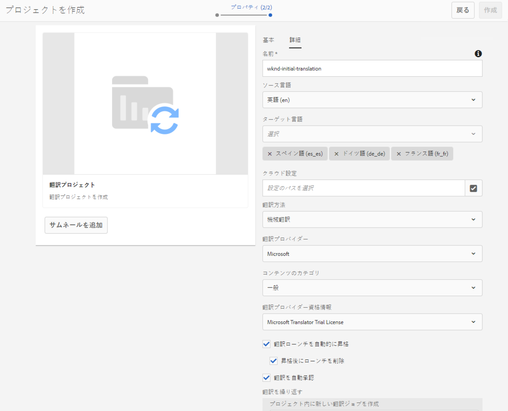

1. タップまたはクリック **開く** をクリックします。

   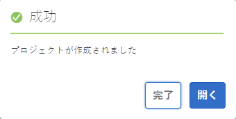

プロジェクトが作成されましたが、翻訳するコンテンツが含まれていません。 次の節では、プロジェクトの構造とコンテンツの追加方法について詳しく説明します。

## 翻訳プロジェクトの使用 {#using-translation-project}

翻訳プロジェクトは、翻訳作業に関連するすべてのコンテンツとタスクを 1 か所で収集し、翻訳を簡単かつ容易に管理できるように設計されています。

翻訳プロジェクトを表示するには：

1. に移動します。 **ナビゲーション** -> **プロジェクト**.
1. 前の節で作成したプロジェクトをタップまたはクリックします。

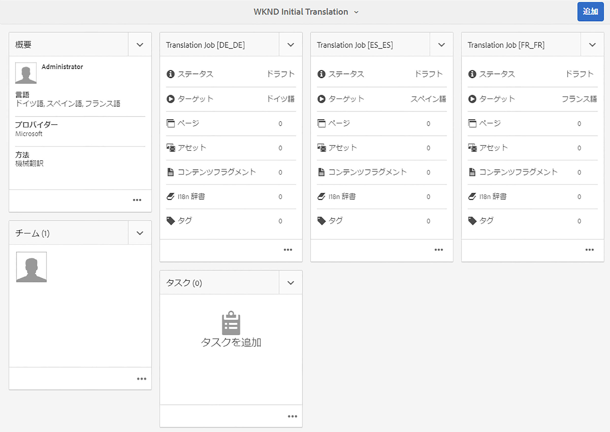

プロジェクトは複数のカードに分かれています。

* **概要**  — このカードには、所有者、言語、翻訳プロバイダーなど、プロジェクトの基本的なヘッダー情報が表示されます。
* **翻訳ジョブ**  — このカードまたは表示されるカードは、ステータス、アセット数など、実際の翻訳ジョブの概要を提供します。 一般に、ジョブ名に ISO-2 言語コードが追加された各言語につき 1 つのジョブが存在します。
* **チーム**  — このカードには、この翻訳プロジェクトで共同作業しているユーザーが表示されます。 このジャーニーでは、このトピックについては説明しません。
* **タスク**  — コンテンツの翻訳に関連する追加タスク（項目やワークフロー項目を実行するなど）。 このジャーニーでは、このトピックについては説明しません。

翻訳プロジェクトの使用方法は、作成方法によって異なります。AEMによって自動的に、または手動で。

### 自動的に作成された翻訳プロジェクトの使用 {#using-automatic-project}

翻訳プロジェクトを自動的に作成する場合、AEMは、以前に定義した翻訳ルールに基づいて、選択したパスの下のヘッドレスコンテンツを評価します。 この評価に基づいて、新しい翻訳プロジェクトへの翻訳が必要なコンテンツを抽出します。

このプロジェクトに含まれるヘッドレスコンテンツの詳細を確認するには：

1. の下部にある省略記号ボタンをタップまたはクリックします。 **翻訳ジョブ** カード。
1. この **翻訳ジョブ** ウィンドウには、ジョブ内のすべての項目が表示されます。
   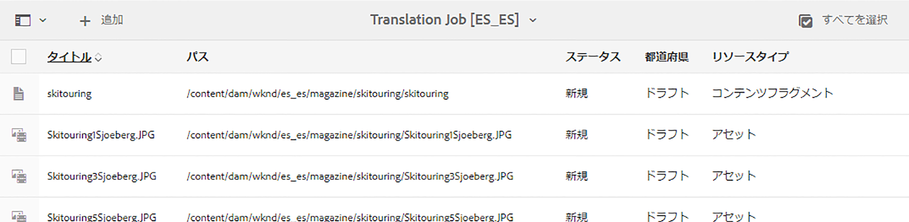
1. 行をタップまたはクリックすると、その行の詳細が表示されます。1 つの行が、翻訳する複数のコンテンツ項目を表している場合があります。
1. 行項目の選択チェックボックスをタップまたはクリックすると、その行項目をジョブから削除するオプションや、コンテンツフラグメントコンソールまたはアセットコンソールで表示するオプションなど、追加のオプションが表示されます。
   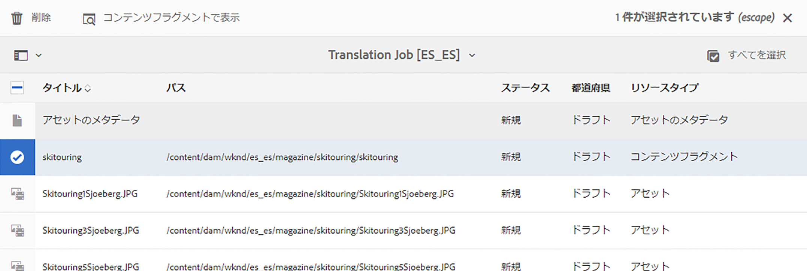

通常、翻訳ジョブのコンテンツは **ドラフト** ～が示す状態 **都道府県** 列 **翻訳ジョブ** ウィンドウ

翻訳ジョブを開始するには、翻訳プロジェクトの概要に戻り、上部にある山形のボタンをタップまたはクリックします **翻訳ジョブ** カードと選択 **開始**.

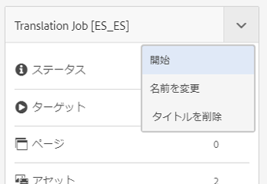

これで、AEMが翻訳設定およびコネクタと通信し、コンテンツを翻訳サービスに送信するようになります。 翻訳の進行状況を確認するには、 **翻訳ジョブ** ウィンドウと表示 **都道府県** エントリの列。

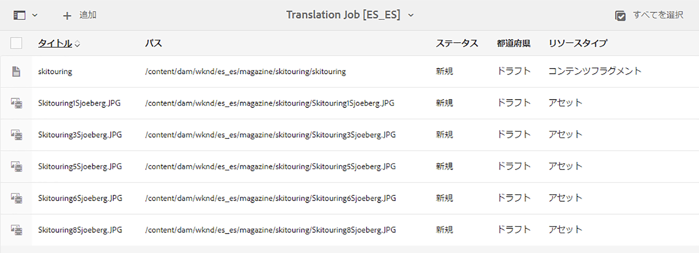

機械翻訳は、 **承認済み**. 人間による翻訳は、より多くのインタラクションを可能にしますが、このジャーニーの範囲を超えています。

### 手動で作成した翻訳プロジェクトの使用 {#using-manual-project}

翻訳プロジェクトを手動で作成する場合、AEMは必要なジョブを作成しますが、含めるコンテンツは自動的には選択しません。 これにより、翻訳プロジェクトマネージャーは、翻訳するコンテンツを柔軟に選択できます。

翻訳ジョブにコンテンツを追加するには：

1. いずれかの **翻訳ジョブ** カード。
1. ジョブにコンテンツが含まれていないことを確認します。 をタップまたはクリックします。 **追加** ボタンをウィンドウの上に置き、 **アセット/ページ** 」をクリックします。

   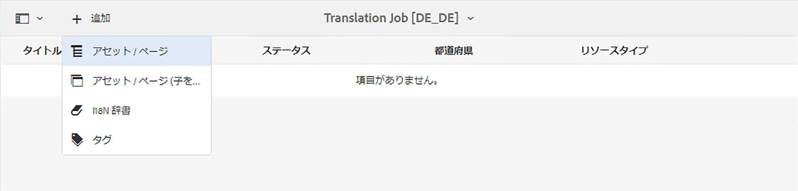

1. パスブラウザーが開き、追加するコンテンツを具体的に選択できます。 コンテンツを探し、タップまたはクリックして選択します。

   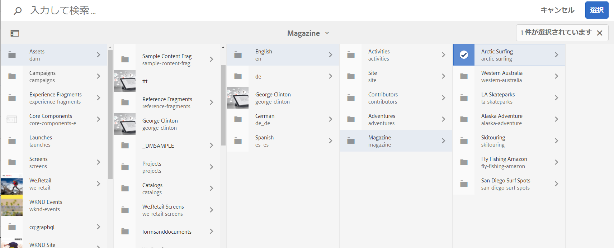

1. タップまたはクリック **選択** 選択したコンテンツをジョブに追加します。
1. 内 **翻訳** ダイアログで、次の操作を行います。 **言語コピーを作成**.

   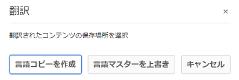

1. コンテンツがジョブに含まれます。

   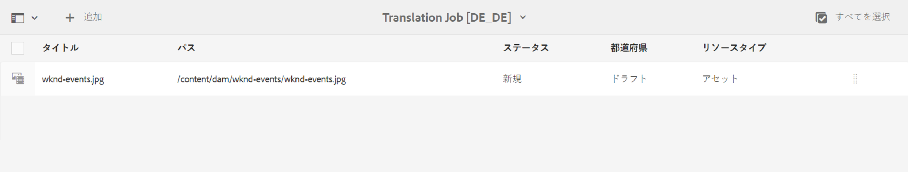

1. 行項目の選択チェックボックスをタップまたはクリックすると、その行項目をジョブから削除するオプションや、コンテンツフラグメントコンソールまたはアセットコンソールで表示するオプションなど、追加のオプションが表示されます。
   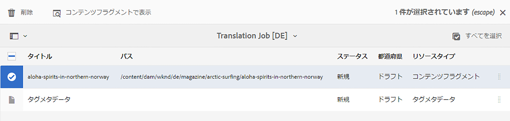

1. これらの手順を繰り返して、必要なコンテンツをすべてジョブに含めます。

>[!TIP]
>
>パスブラウザーは、コンテンツの検索、フィルタリング、ナビゲーションを可能にする強力なツールです。 をタップまたはクリックします。 **コンテンツのみ/フィルター** ボタンを使用して、サイドパネルを切り替え、次のような詳細フィルターを表示します。 **変更日** または **翻訳ステータス**.
>
>パスブラウザーについて詳しくは、 [その他のリソースの節を参照してください。](#additional-resources)

前の手順を使用して、プロジェクトのすべての言語（ジョブ）に必要なコンテンツを追加できます。 すべてのコンテンツを選択したら、翻訳を開始できます。

通常、翻訳ジョブのコンテンツは **ドラフト** ～が示す状態 **都道府県** 列 **翻訳ジョブ** ウィンドウ

翻訳ジョブを開始するには、翻訳プロジェクトの概要に戻り、上部にある山形のボタンをタップまたはクリックします **翻訳ジョブ** カードと選択 **開始**.

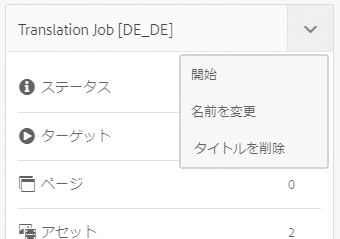

これで、AEMが翻訳設定およびコネクタと通信し、コンテンツを翻訳サービスに送信するようになります。 翻訳の進行状況を確認するには、 **翻訳ジョブ** ウィンドウと表示 **都道府県** エントリの列。

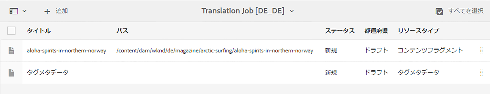

機械翻訳は、 **承認済み**. 人間による翻訳は、より多くのインタラクションを可能にしますが、このジャーニーの範囲を超えています。

## 翻訳済みコンテンツのレビュー {#reviewing}

[前に見たように、](#using-translation-project) 機械翻訳されたコンテンツは、次のステータスでAEMに戻されます： **承認済み** 機械翻訳が使用されているので、人間の介入は必要ないと仮定しています。 ただし、翻訳されたコンテンツをレビューすることはもちろん可能です。

完了した翻訳ジョブに移動し、チェックボックスをタップまたはクリックして行項目を選択します。 アイコン **コンテンツフラグメントで表示** がツールバーに表示されます。

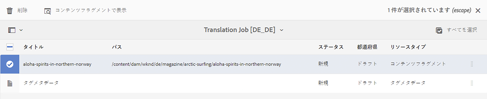

そのアイコンをタップまたはクリックすると、翻訳済みコンテンツフラグメントがエディターコンソールで開き、翻訳済みコンテンツの詳細が表示されます。

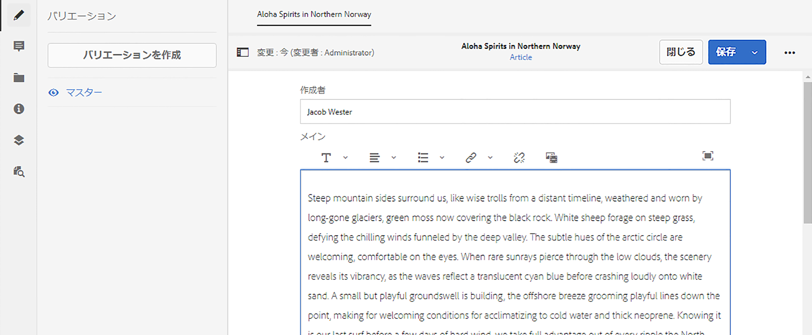

適切な権限を付与できれば、必要に応じてコンテンツフラグメントをさらに変更できますが、コンテンツフラグメントの編集は、このジャーニーの範囲外です。 詳しくは、 [その他のリソース](#additional-resources) このトピックの詳細については、このドキュメントの末尾の「 」セクションを参照してください。

プロジェクトの目的は、簡単にアクセスして明確な概要を示すために、翻訳に関連するすべてのリソースを 1 か所に収集することです。 ただし、翻訳済みアイテムの詳細を表示すると、翻訳自体が翻訳言語のアセットフォルダーに戻ります。 この例では、フォルダーは

```text
/content/dam/wknd/es
```

次の場所からこのフォルダーに移動した場合： **ナビゲーション** -> **Assets** -> **ファイル**&#x200B;翻訳されたコンテンツが表示されます。

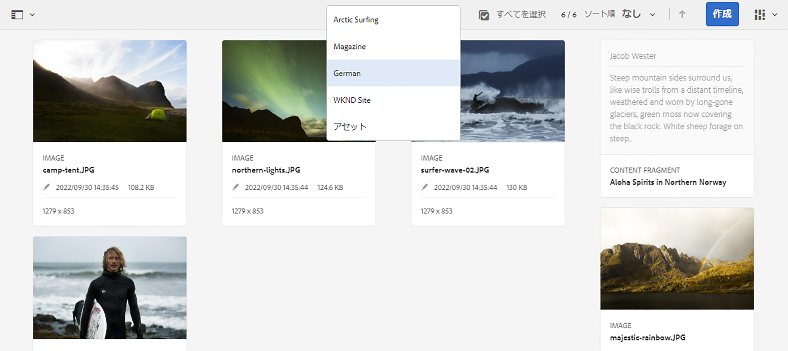

AEM翻訳フレームワークは、翻訳コネクタから翻訳を受け取り、言語ルートに基づいて、コネクタが提供する翻訳を使用して、コンテンツ構造を自動的に作成します。

このコンテンツは公開されず、ヘッドレスサービスでは使用できないことを理解することが重要です。 このオーサーとパブリッシュの構造について学び、翻訳ジャーニーの次のステップで、翻訳済みコンテンツのパブリッシュ方法を確認します。

## 人間翻訳 {#human-translation}

翻訳サービスが人間による翻訳を提供する場合は、レビュープロセスにより多くのオプションが用意されています。 例えば、翻訳が「 」ステータスでプロジェクトに再び届くとします **ドラフト** およびは、手動でレビューおよび承認または却下する必要があります。

人間による翻訳は、このローカライゼーションのジャーニーの範囲外です。 詳しくは、 [その他のリソース](#additional-resources) このトピックの詳細については、このドキュメントの末尾の「 」セクションを参照してください。 ただし、追加の承認オプション以外は、人による翻訳のワークフローは、このジャーニーで説明する機械翻訳と同じです。

## 次の手順 {#what-is-next}

ヘッドレス翻訳ジャーニーのこの部分を完了したら、次の手順を実行します。

* 翻訳プロジェクトとは何かを理解します。
* 新しい翻訳プロジェクトを作成できるようにする。
* 翻訳プロジェクトを使用して、ヘッドレスコンテンツを翻訳します。

この知識に基づいてドキュメントを次に確認し、AEMヘッドレス翻訳ジャーニーを継続します [翻訳済みコンテンツを公開](publish-content.md) ここでは、翻訳済みコンテンツを公開する方法と、言語ルートコンテンツの変更に合わせてこれらの翻訳を更新する方法について説明します。

## その他のリソース {#additional-resources}

ドキュメントを確認して、ヘッドレス翻訳ジャーニーの次の部分に進むことをお勧めします [翻訳済みコンテンツを公開する](publish-content.md) 以下に、このドキュメントで取り上げたいくつかの概念について詳しく説明する追加のオプションリソースを示しますが、ヘッドレスジャーニーを続行する必要はありません。

* [翻訳プロジェクトの管理](/help/sites-administering/tc-manage.md)  — 翻訳プロジェクトの詳細と、人間による翻訳ワークフローや多言語プロジェクトなどの追加機能について説明します。
* [オーサリング環境とツール](/help/sites-authoring/author-environment-tools.md##path-selection) - AEMは、堅牢なパスブラウザーを含む、コンテンツを整理および編集するための様々なメカニズムを提供します。
