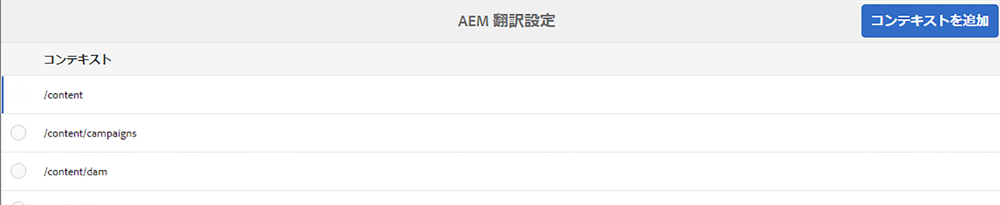
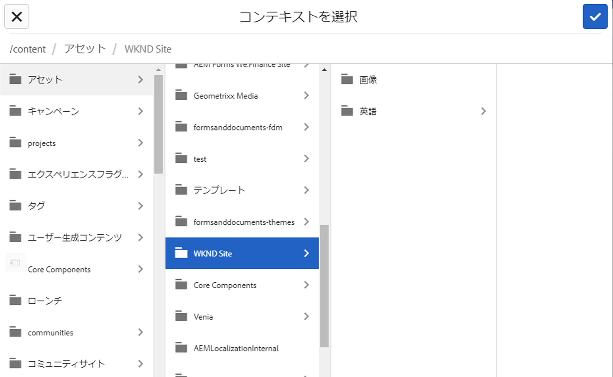
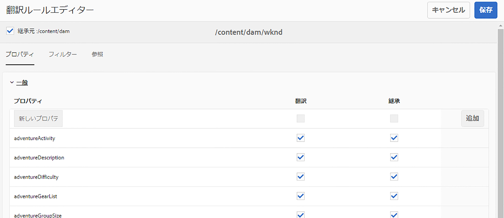
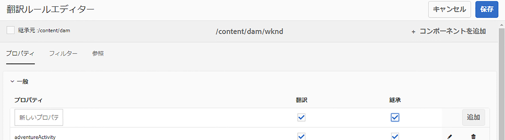

# 翻訳ルールを設定 {#configure-translation-rules}

翻訳するコンテンツを識別するための翻訳ルールを定義する方法を説明します。

## これまでの説明内容 {#story-so-far}

以前のドキュメントのAEMヘッドレス翻訳ジャーニーでは、 [翻訳コネクタの設定](configure-connector.md) 翻訳コネクタのインストールと設定の方法を学習し、次の操作を行う必要があります。

* AEMの翻訳統合フレームワークの重要なパラメーターを理解します。
* 翻訳サービスへの接続を独自に設定できるようになります。

コネクタの設定が完了したので、この記事では次に、翻訳が必要なコンテンツを特定する手順を説明します。

## 目的 {#objective}

このドキュメントでは、AEM翻訳ルールを使用して翻訳コンテンツを識別する方法を説明します。 読み終えると、以下を達成できます。

* 翻訳ルールの動作を理解します。
* 独自の翻訳ルールを定義できる。

## 翻訳ルール {#translation-rules}

ヘッドレスコンテンツを表すコンテンツフラグメントには、構造化されたフィールドで整理された多くの情報を含めることができます。 プロジェクトのニーズに応じて、コンテンツフラグメント内のすべてのフィールドを翻訳する必要がない場合があります。

翻訳ルールは、翻訳プロジェクトに含まれる、または翻訳プロジェクトから除外されるコンテンツを識別します。 コンテンツが翻訳されると、AEMはこれらのルールに基づいてコンテンツを抽出またはハーベストします。 このようにして、翻訳が必要なコンテンツのみが翻訳サービスに送信されます。

翻訳ルールには、次の情報が含まれます。

* ルールを適用するコンテンツのパス
   * ルールはコンテンツの子孫にも適用されます
* 翻訳するコンテンツを含むプロパティの名前
   * プロパティは、特定のリソースタイプに固有、またはすべてのリソースタイプに固有にすることができます

コンテンツフラグメントの構造を定義するコンテンツフラグメントモデルは、独自のプロジェクトに固有なので、AEMが翻訳するコンテンツモデルの要素を把握できるように、翻訳ルールを設定することが不可欠です。

>[!TIP]
>
>通常、コンテンツアーキテクトは翻訳の専門家に **プロパティ名**&#x200B;翻訳に必要なすべてのフィールドの。 これらの名前は、翻訳ルールを設定するために必要です。 翻訳のスペシャリストとして、 [これらを見つける **プロパティ名**&#x200B;自分で](getting-started.md#content-models) このジャーニーで前述したように。

## 翻訳ルールの作成 {#creating-rules}

複雑な翻訳要件をサポートするために、複数のルールを作成できます。 例えば、あるプロジェクトで作業している場合は、モデルのすべてのフィールドを翻訳する必要がありますが、別の説明フィールドでは翻訳が必要ですが、タイトルは未翻訳のまま残ります。

翻訳ルールは、このようなシナリオを処理するように設計されています。 ただし、この例では、単純な単一の設定に焦点を当ててルールを作成する方法を説明します。

ここに **翻訳設定** 翻訳ルールを設定するためのコンソール。 コンソールにアクセスするには：

1. に移動します。 **ツール** -> **一般**.
1. タップまたはクリック **翻訳設定**.

内 **翻訳設定** UI には、翻訳ルールで使用できるオプションが多数あります。 ここでは、基本的なヘッドレスローカリゼーション設定に必要な、最も一般的な手順を示します。

1. タップまたはクリック **コンテキストを追加**：パスを追加できます。 これは、ルールの影響を受けるコンテンツのパスです。
   
1. パスブラウザーを使用して必要なパスを選択し、 **確認** ボタンをクリックして保存します。 ヘッドレスコンテンツを保持するコンテンツフラグメントは、通常、 `/content/dam/<your-project>`.
   
1. AEMが設定を保存します。
1. 作成したコンテキストを選択し、をタップまたはクリックする必要があります **編集**. これにより、 **翻訳ルールエディター** プロパティを設定する場合。
   
1. デフォルトでは、すべての設定は親パスから継承されます ( この場合は `/content/dam`. 「 」オプションの選択を解除します。 **継承元`/content/dam`** を追加します。
1. 一度オフにすると、 **一般** 「 」セクションで、目的のコンテンツフラグメントモデルのプロパティ名を追加します [は、以前、翻訳用のフィールドとして識別されていました。](getting-started.md#content-models)
   1. プロパティ名を **新しいプロパティ** フィールドに入力します。
   1. オプション **翻訳** および **継承** が自動的にオンになります。
   1. タップまたはクリック **追加**.
   1. 翻訳する必要のあるすべてのフィールドに対して、これらの手順を繰り返します。
   1. 「**保存して閉じる**」をタップまたはクリックします。
      

これで、翻訳ルールが設定されました。

## 高度な使用方法 {#advanced-usage}

翻訳ルールの一部として設定できる追加のプロパティが多数あります。 さらに、ルールを XML として手動で指定できるので、より特異性と柔軟性を高めることができます。

このような機能は、通常、ヘッドレスコンテンツのローカライズを開始する際に必要なものではありませんが、詳しくは、 [その他のリソース](#additional-resources) セクションを参照してください。

## 次の手順 {#what-is-next}

ヘッドレス翻訳ジャーニーのこの部分を完了したら、次の手順を実行します。

* 翻訳ルールの動作を理解します。
* 独自の翻訳ルールを定義できる。

この知識に基づいてドキュメントを次に確認し、AEMヘッドレス翻訳ジャーニーを継続します [コンテンツを翻訳](translate-content.md) ここでは、コネクタとルールが連携してヘッドレスコンテンツを翻訳する方法を学びます。

## その他のリソース {#additional-resources}

ドキュメントを確認して、ヘッドレス翻訳ジャーニーの次の部分に進むことをお勧めします [コンテンツを翻訳](translate-content.md)以下に、このドキュメントで取り上げるいくつかの概念について詳しく説明する、その他のオプションのリソースを示します。ただし、ヘッドレスジャーニーを続行する必要はありません。

* [翻訳するコンテンツの識別](/help/sites-administering/tc-rules.md)  — 翻訳ルールが、翻訳が必要なコンテンツを識別する方法を説明します。
