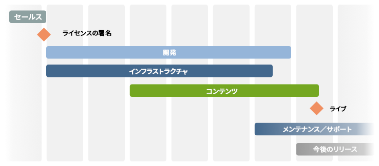
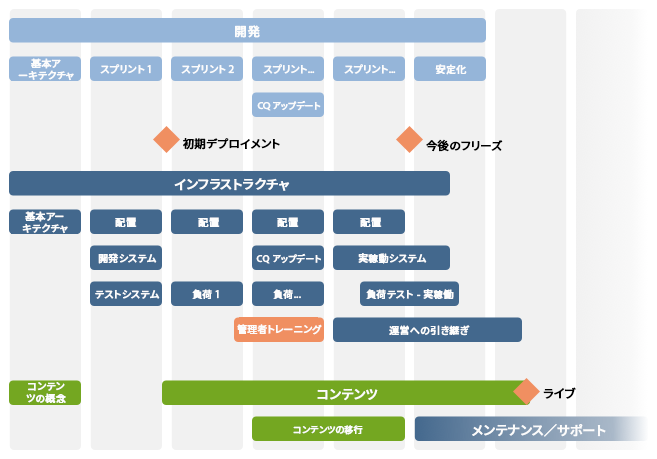

# チェックリスト - 詳細情報{#the-checklist-further-reference}

このページでは、[プロジェクトの管理 - ベストプラクティスチェックリスト](/help/managing/best-practices.md)で扱ったドキュメントの内容や原則を拡張および補足する詳細情報を提供します。

## AEM - 何を使用するか {#aem-what-will-you-be-using}

>[!CAUTION]
>
>ここに示すリストは完全ではなく、概要として示しています。

### AEM 内の機能 {#features-within-aem}

When implementing AEM (particularly for the first time) you will need to review the [capabilites and workflows of AEM](https://www.adobe.com/marketing/experience-manager.html) to be sure of which areas you want/need.

次のような使用する AEM の機能と、デザインへの影響を検討します。

* [コマース](/help/sites-administering/ecommerce.md)
* [スクリーン](https://docs.adobe.com/content/help/ja-JP/experience-manager-screens/user-guide/aem-screens-introduction.html)
* [Assets](/help/assets/assets.md)
* [タグ](/help/sites-administering/tags.md)
* [マルチサイト管理と翻訳](/help/sites-administering/msm-and-translation.md)
* [フォーム](/help/forms/home.md)
* [コミュニティ](/help/communities/deploy-communities.md)
* [Livefyre](https://answers.livefyre.com/product/livefyre-for-adobe-experience-manager-aem/livefyre-for-adobe-experience-manager/)

また、[リリースノート](/help/release-notes/release-notes.md)で AEM の様々なバージョンをチェックして、新機能が追加された時期を確認してください。

### 統合 {#integrations}

AEM は、他のアドビ製品やサードパーティのサービスと統合できます。統合により、さらなるパワーと機能を自由に利用できます。

詳しくは、[ソリューションの統合](/help/sites-administering/integration.md)を参照してください。

## 移行かアップグレードか {#migrate-or-upgrade}

主に考慮する点は、以下のいずれを実行するかです。

* 配置済みの既存のインストールをアップグレードする。
* 現在のシステムのコンテンツを新規インストールに移行する。

旧バージョンから最新バージョンに移行する場合、次の 2 つのオプションがあります。

* [パッケージマネージャー](/help/sites-administering/package-manager.md)を使用して、旧システムから新システムにすべてのコンテンツおよびアプリケーションコードをエクスポートします。
* 配置済みの旧システムを[アップグレード](/help/sites-deploying/upgrade.md)します。ほとんどの場合、このオプションが推奨されます。

## 基本ルール {#basic-ground-rules}

あらゆるプロジェクトと同様に、できるだけ早い時期に基本原則を確立することが重要です。有効なタイプには以下が含まれます。

>[!NOTE]
>
>These points are generic, the [Best Practices Checklist](/help/managing/best-practices.md) deals with specifics in relation to AEM.

* **役割**

   役割は明確に定義し、プロジェクトに関わる全員に知らせる必要があります。また、以下の役割を特に強調して知らせることをお勧めします。

   * 意思決定者
   * 連絡先

* **責務**

   * 各役割に対して、プロジェクトに関連した責務を明確に定義すると、混乱を防ぐことができます。

* **関与**

   できるだけ早く関係者を関与させることで、プロジェクトの&#x200B;*ステークホルダー*&#x200B;になるように働きかけ、成功に向けての意欲を向上させることができます。

   * お客様側では、作成者（1日1回のシステムで作業する必要がある作成者）も含まれます。
   * 独自のプロジェクトチーム内には、品質保証の担当者も含まれます。 お客様の要件をより深く理解すればするほど、テストの計画がより適切になります。

* **伝達経路**

   * これらの情報を過度に正式化すべきではありませんが、特定の定義によって、重要な人々に常に通知され、その結果最新の情報を保持する必要があります。 外部の関係者とのコミュニケーションには、特に注意が必要です。

* **プロセス**

   定義するプロセスは、個々のプロジェクトに依存します。 次の点を考慮して、これらのシンプルさを保つよう再度試みます。

   * サードパーティと対話するためのプロセス（および通信のパス）の定義例えば、設計代理店やサードパーティのソフトウェアサプライヤーなど。
   * 多くの場合、お客様は独自のプロジェクト管理およびレポート手順とツールを持ちます。

* **追跡ツール**

   バグやタスクなど、プロジェクトに関する情報を追跡できる多くのツールがあります。詳しくは、[使用する可能性があるツールの概要](#overview-of-potential-tools)を参照してください。

   * ここで注意すべき重要な点は、情報のコピーを1つだけ保持し、情報を共有することです（したがって、使用中のツールにアクセスすること）。 これにより、メンテナンスが容易になり、不一致を防ぐことができます。

* **対象範囲**

   様々なレベルでプロジェクトの対象となる内容を明確に定義します。

   * 個々のリリース（反復的なリリースプロセスが使用される場合、顧客または社内テストチームに配信されるかどうかに関係なく）。
   * AEM プロジェクト。
   * プロジェクト全体サードパーティ製ソフトウェア、テスト、組織の問題、その他多数に影響するソフトウェアを含む。
   * プロジェクトの範囲内に&#x200B;*ない*&#x200B;ものを示すことが役に立つ場合もあります。混乱や誤認を回避できますが、基本的な問題での使用に限定されます。

* **レポート**

   レポートする情報、形式、頻度およびレポート先を明確に定義します。

* **用語**

   * 使用される略語／顧客固有の用語を定義します。

* **仮定**

   * あらゆる想定事項を定義します。

この情報は、プロジェクトハンドブック内で定義できます。また、Wiki の使用も、継続的な変化に効率よく対応するために役立ちます。これらが定義される場合、主な要因は次のとおりです。

* 情報が定義され、保守される
* 関係者全員には、情報が明確に伝えられます。 標準的なプロジェクト管理方法ではありますが、役割定義が明確であるかや、伝達が良好であるかによって、プロジェクトの成否が左右されるということを繰り返し肝に銘じてください。
* バグ追跡や問題追跡など、追跡される情報は、1 つのバージョンだけを保持する。

## 主要業績評価指標とターゲット指標 {#key-performance-indicators-and-target-metrics}

組織は主要業績評価指標（KPI）を使用して、ターゲット達成の成功を評価します。これらの指標は測定可能な値です。これにより、特定の目的がいかに効果的に達成されているかを示すことができます。

以下の指標があります。

* ビジネス：

   * 主要なビジネス目標を測定します。
   * 実際のビジネスやシナリオに適した KPI を選択することが重要です。その KPI が何であるか、どのように測定するか、誰がどのように使用するかを明確に定義する必要があります。

* パフォーマンス:

   * システムのパフォーマンスの測定方法を定義します。
   * 例として、ページの読み込み時間、サーバーの応答時間、データベースのクエリパフォーマンスなどがあります。

指標の一部は、特定および定義されたターゲット指標をベースとすることができますが、すべてそうする必要はありません。

### ターゲット指標 {#target-metrics}

指標は、Web サイトの品質の量的な測定を定義するために使用されます。基本的には、パフォーマンスの達成目標の定義であり、[KPI（主要業績評価指標）](#key-performance-indicators-and-target-metrics)を定義する際に使用できます。

多数のメトリックを定義できますが、その多くは、パフォーマンスと同時性に関する目標を定義するものです。特に、量的に示すことが難しく、*感情*&#x200B;によって評価される傾向にある次のような要素について定義します。

* 「Web サイトの現在の速度が&#x200B;*遅すぎる*」 - *低速*&#x200B;になるのはいつか。

* 「同僚がログインすると、すべてが&#x200B;*停止*&#x200B;する」 - システムでサポートされる同時ユーザー数は何人か。
* 「検索時にシステムが&#x200B;*停止*&#x200B;する」 - どのような種類の検索要求がシステムに影響を及ぼすか。
* 「ファイルのダウンロードに&#x200B;*長く*&#x200B;時間がかかる」 - （標準ネットワーク条件下で）許容されるダウンロード時間はどれくらいか。

ターゲット指標は、プロジェクトの開始時に次の目的で定義されます。

* オファーするWebサイトの期待されるサイズを示す
* 達成したい最低限の品質を示す
* これらの要因が実際にどのように測定されるかを定義する
* [主要業績評価指標](#key-performance-indicators-and-target-metrics)の基礎として使用される

ターゲット指標を定義する際は、常に注意が必要です。

* 高く設定しすぎると、完全に到達不能になる可能性があります。
* 低い値に設定すると、強調表示されない場合があります。
* 繰り返し一貫して測定できるようにする
* 測定される異なる要因間のバランスを提供する
* 特定の指標はテスト環境に関連しますが、実稼働用Webサイトで測定可能で再現可能である必要がある現実的なシナリオを反映するものもあります。
* ウェブサイトに対する意義に従って指標に優先順位を付ける
* 指標を現実的に監視できるセットに限定する

これらのメトリックは、プロジェクトの開発時に必要に応じて更新したり、調整したりできます。プロジェクトが正常に実装されたら、これらのメトリックを使用してインストール環境を制御したり、継続中の操作に必要なサービスレベルの監視や維持を行ったりすることができます。

適切に使用すると、これらの指標が役立つツールを提供します。無責任に使うと、時間を無駄にする気晴らしになる。 いつものように、測定するもの、測定する方法、理由を理解する必要があります。

>[!NOTE]
>
>本節では、検討すべき基本原則及び課題について取り組む。 各インストールは異なるので、実際の測定値は異なります。

### すべての基礎となるプロジェクトデザイン {#everything-rests-on-your-project-design}

測定されるすべての指標は、ある意味で、プロジェクトのデザインの影響を受けます。 逆に、多くの問題は設計の変更によって解決するのが最善策です。

したがって、デザインを決定する&#x200B;*前に*&#x200B;ターゲットメトリックを定義する必要があります。これにより、これらの要因に基づいてデザインを最適化できます。 プロジェクトが開発されると、基本的な設計原則を変更するのは難しくなります。

Web サイトの構造を作成する際には、AEM Web サイトで推奨される構造に従います。次の問題や原則を理解していることを確認してください。

* Webサイトのコンテンツを構成する方法。
* テンプレートとコンポーネントの動作方法。
* キャッシュの仕組み。
* パーソナライズされたコンテンツの影響。
* 検索機能の動作方法。
* CSSと関連テクノロジーを使用して、コンパクトで冗長性のないHTMLコードを作成する方法。

デザインがガイドラインに従っていない場合、または意味が不明な場合は、プログラミング段階を開始するかコンテンツを入力する前に、これらの問題を明確にしてください。

### インフラストラクチャ {#infrastructure}

インフラストラクチャを定義または評価する際に、次のようなターゲット値を定義するのに役立ちます。

* 訪問者/日；平均とピーク
* ヒット/日；平均とピーク
* 利用可能になっているwebページの数
* ウェブコンテンツの量

使用時の状況、および Web サイトの戦略的意義に応じて、以下の項目がインフラストラクチャの評価や選択に役立ちます。

* サーバーの数
* AEM インスタンス（オーサーおよびパブリッシュ）の数

### パフォーマンス {#performance}

評価できるパフォーマンス要因はいくつかあります。

* 個々のページの応答時間を考慮してください。

   * オーサー環境での応答時間
   * パブリッシュ環境での応答時間

* 検索リクエストの応答時間

This section can be read in conjunction with [Performance Optimization](/help/sites-deploying/configuring-performance.md) that expands the technical details of actually measuring the performance.

#### 個々のページの応答時間 {#response-times-for-individual-pages}

Web サイトが訪問者の要求に応答するまでにどの程度の時間がかかるかは、非常に重要な問題です。

当然、応答時間は個々の要求によって異なりますが、平均的なターゲット時間の値を定義することはできます。この値が達成可能かつ維持可能な数値と証明されれば、Web サイトのパフォーマンスを監視したり、潜在的な問題の進行を示したりするために使用できます。

オーサー環境とパブリッシュ環境でのターゲットの違い

オーサー環境とパブリッシュ環境では、対象ユーザーが異なるので、目標とする応答時間が異なります。

* **オーサー環境**

   この環境は、コンテンツの入力および更新をおこなう作成者が使用する環境なので、以下のように設定することが必要です。

   * コンテンツページとそれらのページの個々の要素を更新する際に、大量のリクエストを生成する少数のユーザーに対する対応
   * コンテンツを Web サイトにできるだけ早く展開し、生産性を最大限に高める

* **パブリッシュ環境**

   この環境には、ユーザーが利用できるようにするコンテンツが含まれます。

   * 速度は重要であるが、多くの場合、オーサー環境より遅くなる
   * その他のパフォーマンス向上メカニズムが多く適用されます。

      * コンテンツがキャッシュされる
      * ロードバランシングが適用される

#### ターゲット応答時間の設定 {#setting-target-response-times}

以上に基づき、どうすれば達成可能な（平均）応答時間を決定できるでしょうか。これは多くの場合、経験の問題です。

* webサイトでの過去の経験
* AEM の使用経験
* 平均応答時間を超える複雑なページの認識（可能な場合は個別に最適化する必要があります）

ただし、（制御下にある状況では）以下のガイドラインを適用できます。

* ページの要求の70%は、100ミリ秒未満で応答する必要があります。
* ページのリクエストの25 %が100 ms ～ 300 ms未満で応答する必要がある。
* ページのリクエストの4 %が300 ms ～ 500 ms未満で応答する必要があります。
* ページのリクエストの1 %が500 ms ～ 1000 ms未満で応答する必要があります。
* ページ要求への応答時間が 1 秒を超えることはない。

以上の数値は、次の条件を前提としています。

* パブリッシュ環境で測定される（オーサー環境や CFC のオーバーヘッドではない）
* サーバー上で測定される（ネットワークオーバーヘッドを考慮しない）
* キャッシュされない（AEM 出力キャッシュや Dispatcher キャッシュがない）
* 多数の依存ファイル（HTML、JS、PDF など）を伴う複雑な要求のみ
* 他のシステム負荷なし

いくつかのメカニズムを使用して応答時間を監視できます。

* **AEM request.log を使用した応答時間の監視**

   パフォーマンス分析を開始するのに適したのは、要求ログです。 その他の情報として、この情報を使用して個々のリクエストの応答時間を確認できます。 詳しくは、「 [パフォーマンスの最適化](/help/sites-deploying/configuring-performance.md) 」を参照してください。

* **HTML コメントを使用した応答時間の監視**

   HTML コメント を使用すると、各ページのソース内に次のように応答時間の情報を含めることができます。

   `</body> </html>v <-- Page took 58 milliseconds to be rendered by the server --> Response times for search requests`

#### 検索要求 {#search-requests}

検索要求は、以下の両方の点で、Web サイトに重大な影響を与える可能性があります。

* 実際の検索の応答時間

   * 高速な検索機能が、Web サイトの品質目標です。

* 全般的なパフォーマンスへの影響

   * 検索機能は、（巨大である可能性の高い）コンテンツのセクションや、特別に抽出されたインデックスをスキャンする必要があるので、この機能が最適化されていないと、システム全体のパフォーマンスに影響する可能性があります。

検索要求のターゲット設定についても、以下に応じて経験に基づいておこないます。

* AEM の使用経験
* 検索が他の目標と比較してどの程度頻繁に使用されるかの評価
* 永続性マネージャー
* 検索インデックス
* 検索機能の複雑さ。検索用語が 1 語のみ許可される基本的な検索機能は、AND／OR／NOT を使用して複雑な検索ステートメントを作成できる高度な検索よりも速くなります。

このカスタマイズの計画および統合は、プロジェクトの最初の時点からおこなう必要があります。監視には次のメカニズムを使用することができます。

* **AEM request.log を使用した検索応答時間の監視**

   この場合も、request.log を使用することで、検索要求の応答時間を監視できます。詳しくは、[パフォーマンスの最適化](/help/sites-deploying/configuring-performance.md)を参照してください。

* **検索応答時間の測定のプログラム化メカニズム**

   検索要求に関して収集する情報、および検索要求のパフォーマンスをカスタマイズするには、プロジェクトのソースコードに情報収集を含めることをお勧めします。詳しくは、[パフォーマンスの最適化](/help/sites-deploying/configuring-performance.md)を参照してください。

### 並行性 {#concurrency}

Web サイトは、オーサー環境とパブリッシュ環境の両方で多数のユーザー／訪問者に公開されます。ユーザーの数は通常、テスト時に使用したユーザー数より多くなりますが、同時に変動があり、予測が困難です。パフォーマンスへの悪影響を意識せずに作業できる同時ユーザー／訪問者数の平均値を考慮して、Web サイトをデザインする必要があります。この場合も `request.log` を使用して、同時実行をテストできます。詳しくは、[パフォーマンスの最適化](/help/sites-deploying/configuring-performance.md)を参照してください。

同時ユーザー数のターゲットは、環境のタイプによって異なります。

* **オーサー環境**

   * 通常、同時ユーザ数は正確に見積もることができます。 全体で何名の著者がいるかは分かるでしょうが、（おそらく）すべてが同時にアクティブになるわけではありません。

* **パブリッシュ環境**

   * これは予測が難しいので、ターゲット値を選択する必要があります。 これは、現在のWebサイトの経験と、新しいWebサイトに対する現実的な期待に基づくものです。
   * 特別なイベント（例えば非常に人気のあるコンテンツを新規公開する場合）では、予測を超えたり、（イベントのチケットの発売時に報道されると）処理能力を超えたりすることもあります。

### 処理能力とボリューム {#capacity-and-volume}

関連するメトリックについて説明する前に、いくつかの用語の大まかな定義を示します。

* **ボリューム**

   * システムが処理および提供する出力の量です。

* **処理能力**

   * システムがボリュームを提供する能力です。
   * 各ステップで、容量と容量の測定方法は異なります。次の表を参照してください。 最適なパフォーマンスを得るには、各ステップで容量がボリュームと一致し、容量とボリュームがすべてのステップで共有されていることを確認します。 例えば、要求ごとにサーバーでナビゲーションを計算する代わりに、クライアントコンピューターで計算したり、キャッシュに配置したりできます。

* **処理能力とボリューム**

   | 対象／場所 | 処理能力 | ボリューム |
   |---|---|---|
   | クライアント | ユーザーのコンピューターの計算能力。 | ページレイアウトの複雑さ。 |
   | ネットワーク | ネットワーク帯域幅。 | ページのサイズ（コード、画像など）。 |
   | ディスパッチャーキャッシュ | Webサーバーのサーバーメモリ（メインメモリとハードドライブ）。 | Webサーバー（メインメモリとハードドライブ）。 キャッシュされたページの数とサイズ。 |
   | 出力キャッシュ | AEMサーバーのサーバーメモリ（メインメモリとハードドライブ）。 | 出力キャッシュ内のページの数とサイズ、ページごとの依存関係の数。 Dispatcher キャッシュを使用すると、このボリュームが少なくなります。 |
   | Web サーバー | Webサーバーの計算能力。 | リクエストの量。 キャッシュを使用すると、このボリュームが少なくなります。 |
   | テンプレート | Webサーバーの計算能力。 | テンプレートの複雑さ。 |
   | リポジトリ | リポジトリのパフォーマンス。 | リポジトリから読み込まれたページ数。 |

### その他のメトリック {#other-metrics}

以上の節では、定義される主なメトリックについて説明しました。

具体的な要件に応じて、追加の指標を個別に定義したり、上記の分類を考慮したりすると便利です。

ただし、Webサイトのあらゆる側面を測定および定義するのではなく、簡単かつ確実に機能する正確なコア指標の小さなセットを用意することをお勧めします。 その本質上、貴社のウェブサイトはユーザに届くとすぐに変化し進化する開始を持ちます。

## セキュリティ {#security}

セキュリティはきわめて重要であり、対処すべき課題として深刻性を増しています。プロジェクトの早期の段階からセキュリティについて検討し、計画する必要があります。******

[セキュリティチェックリスト](/help/sites-administering/security-checklist.md)では、デプロイ時に AEM インストールを確実に保護するための手順が詳細に説明されています。Other security aspects are covered under [Security (when developing)](/help/sites-developing/security.md) and [User Administration and Security](/help/sites-administering/security.md).

## 並列タスクと反復タスク {#parallel-and-iterative-tasks}

>[!NOTE]
>
>このセクションでは、以下の点について留意してください。
>
>* Offers an overview related to the *first* implemention of an AEM project.
>* 抽象的な概要を示すことを意図しています。具体的なフェーズ／マイルストーン／タスクについては、[プロジェクトチェックリスト](/help/managing/best-practices.md)を参照してください。
>* 時間単位は理論上のものです。

>

標準的な AEM プロジェクトを新規に実装するには、以下のようなタスクを検討する必要があります。

* セールスプロセスから引き継がれます。
* 顧客アプリケーションを実装します（**開発**）。
* 顧客サイトにインフラストラクチャ（および関連プロセス）をインストールして設定します（**インフラストラクチャ**）。
* コンテンツを作成（または移行）します（**コンテンツ**）。
* 運営に引き継ぎます（**メンテナンス／サポート**）。
* リリースをフォローアップします。

すべての面で、反復アプローチを使用することをお勧めします。

>[!NOTE]
>
>実稼動環境の実際の条件で調整、最適化およびユーザートレーニングができるように、プロジェクト開始を&#x200B;**ソフトローンチ**（不完全な可用性、複数の反復）と&#x200B;**ハードローンチ**（完全な可用性 - ライブ）に分割します。

>[!NOTE]
>
>プロジェクトのライフサイクルで実行（または評価）する必要のあるタスクの例については、[プロジェクトチェックリスト](/help/managing/best-practices.md)を参照してください。

各カテゴリについての留意事項を次に示します。

* **開発**

   * 基本アーキテクチャを最初に定義します。
   * 開発にはいくつかの繰り返し（スプリント）を使用します。

      * 最初のスプリントは最初の全開発サイクルに相当します。
      * 最初のスプリントの結果として、テスト環境への最初の開発が行われます。
      * すべてのスプリントが実行可能な結果を持ちます。
      * スプリントごとに顧客の承認（最低限の構造テストとフィードバック）が取得されます。
   * プロジェクトの進行中に利用可能な AEM バージョンが最終的に更新されるように計画します。
   * スプリント中にテストおよび最適化が行われるように計画します。
   * 安定化および最適化フェーズを計画します。
   * 今後のリリース対象として計画している項目のログを作成します。
   * パートナーの関与と引き継ぎを計画します。

* **インフラストラクチャ**

   * 基本アーキテクチャを最初に定義します。

      * パフォーマンス要件を定義します。
      * パフォーマンス目標を定義します（つまり、期待事項を明確に定義します）。
      * サイジングを含め、ハードウェアとインフラストラクチャのアーキテクチャを定義します。
      * デプロイメントを定義します。
   * 最初のスプリントと次の初期設定の準備にいくつかの繰り返しを使用します。

      * 開発環境
      * 開発プロセス
      * テスト環境
      * 開発プロセス（設定管理を含む）
   * いくつかの負荷テストを計画します。
   * スプリント中にテストおよび最適化が行われるように計画します。
   * 安定化および最適化フェーズを計画します。
   * 実稼働環境にできるだけ早期にデプロイします（運営チームにシステムのセットアップ経験を積ませます）。
   * 指定されたユーザーと定義済み役割をできるだけ早期に使用します。
   * トレーニング（管理者向けトレーニングなど）を計画します。
   * 運営への引き継ぎを計画します。

* **コンテンツ**

   * 基本アーキテクチャとは次のようなものです。
      * コンテンツ階層を稼働させます。
      * コンテンツの概念を定義するのに役立ちます。
      * MSM の使用方法とレイアウトを定義します。
      * 役割、グループ、ワークフロー、および権限を定義します。
   * オフラインページの作成が有益かどうかを検討します。
   * 初期ページおよびコンテンツの早期作成を計画します（テストおよびフィードバック用）。
   * 既存のコンテンツの移行を計画します。
   * リファクタリング後の「スプリント中移行」を計画します。
   * 「コンテンツバーンダウン」（実稼動コンテンツのサイトマップ）を計画します。

## 時間と労力の見積もり {#estimating-time-and-effort}

結果のタスクリストに応じて、（高レベルの）タスク定義に関する時間と労力の初期予測を作成できます。 これには、誰（顧客またはパートナー）が何をいつ実行するかを示す指示が含まれます。

次のリストは、標準近似と、関連する作業の相互関係を示しています。したがって、コストが発生します。

>[!CAUTION]
>
>これらの数字は初期見積もりにのみ使用できます。経験豊富な AEM 開発者は詳細な分析をおこなう必要があります。

| フェーズ | 労力 |
|---|---|
| 開発 | コンポーネントノードごとに 2 ～ 4 時間の概算見積もりを使用すると、すべての開発要件を満たします。 |
| 開発者によるテスト | 開発 15 ％ |
| フォローアップ | 開発 10 ％ |
| ドキュメント | 開発 15 ％ |
| JavaDoc 文書化 | 開発 10 ％ |
| バグ修正 | 開発 15 ％ |
| プロジェクト管理 | 進行中のプロジェクトの管理および統制にかかるプロジェクトコストの 20 ％ |

その後の詳細な計画で、使用可能なリソースや必要なリソースを、納期やコストに関連付けることができます。

## 参照アーキテクチャ {#reference-architecture}

参照アーキテクチャは、AEM アーキテクチャにテンプレートソリューションを提供するために用意されました。参照アーキテクチャは、拡張性、信頼性、セキュリティなどの、企業システムで一般的に発生する問題に対処します。

次のサイトメトリックを定義する必要があります。

| 分類 | 定義 |
|---|---|
| インターネットサイトの数 |  |
| イントラネットサイトの数 |  |
| コードベースの数（インターネットとイントラネットが異なる場合など） |  |
| 個々のページの数 |  |
| 1 日あたりのサイト訪問の数 |  |
| 1 日あたりのページビューの数 |  |
| 1 日あたりのデータ転送量（GB） |  |
| 同時ユーザーの数（閉じられたユーザーグループ） |  |
| 同時訪問者の数（公開） |  |
| 同時作成者の数 |  |
| 登録済み作成者の数 |  |
| 営業日あたりのページアクティベーションの数 |  |
| デプロイ時のページアクティベーションの数 |  |

## 使用する可能性があるツールの概要 {#overview-of-potential-tools}

次のリストは、使用可能な各種ツールを示しています。このリストはあくまでもツールの紹介で、詳細な推奨リストではありません。その他の任意のツールは使用できないということを意味するものではありません。

<table>
 <tbody>
  <tr>
   <td><strong>製品</strong></td>
   <td><strong>説明</strong></td>
  </tr>
  <tr>
   <td>AEM</td>
   <td>
AEM自体は、アプリケーションの監視、テスト、調査、デバッグを行うのに役立つ様々なメカニズムを備えています。含める：

    <ul>
     <li><a href="/help/sites-developing/developer-mode.md">開発者モード</a></li>
     <li>テスト <a href="/help/sites-developing/hobbes.md">コンソール</a></li>
     <li><a href="/help/sites-administering/operations-dashboard.md">操作ダッシュボード</a></li>
     <li><a href="/help/sites-authoring/content-insights.md">コンテンツインサイト</a></li>
     <li>コン <a href="/help/sites-authoring/author-environment-tools.md#content-tree">テンツツリー</a></li>
    </ul> </td>
  </tr>
  <tr>
   <td> </td>
   <td> </td>
  </tr>
  <tr>
   <td>Selenium</td>
   <td><a href="https://docs.seleniumhq.org/">Selenium</a> は、オープンソースのテストツールです。テストはブラウザーで直接実行され、ユーザーの作業がエミュレートされます。</td>
  </tr>
  <tr>
   <td>Microsoft Project</td>
   <td>一般的に使用されるプロジェクト管理ツール。</td>
  </tr>
  <tr>
   <td>Jira</td>
   <td><a href="https://www.atlassian.com/software/jira">Jira</a> は、ソフトウェアバグを詳細に追跡および管理するためオープンソースツールです。必要に応じて、バグの詳細情報にワークフローを組み込むこともできます。</td>
  </tr>
  <tr>
   <td>Git</td>
   <td><a href="https://git-scm.com/">Git</a> は、リビジョン管理ソフトウェアです。</td>
  </tr>
  <tr>
   <td>Eclipse</td>
   <td>
Eclipse は、様々なプロジェクトからなるオープンソース IDE です。ソフトウェアをライフサイクルに沿って構築、デプロイ、管理するために必要な広範なフレームワーク、ツールおよびランタイムで構成されるオープン開発プラットフォームを構築することに焦点を当てています。
 
See <a href="/help/sites-developing/howto-projects-eclipse.md">How to Develop AEM Projects Using Eclipse</a> for more information.
 </td>
  </tr>
  <tr>
   <td>IntelliJ</td>
   <td>
各種機能を包括的に備えたプロフェッショナル向け IDE です（そのため、ライセンス費が発生します）。 
 
See <a href="/help/sites-developing/ht-intellij.md">How to Develop AEM Projects using IntelliJ IDEA</a> for more information.
 </td>
  </tr>
  <tr>
   <td>Maven</td>
   <td><a href="https://maven.apache.org/">Maven</a> は、プロジェクトの構築プロセス（ソフトウェアおよびドキュメント）を管理するための包括的なソフトウェアプロジェクト管理ツールです。</td>
  </tr>
 </tbody>
</table>

## 参考情報 {#further-reading}

また、次の各節では、特に注目すべき内容を取り上げています。

* [概要](/help/sites-deploying/deploy.md#getting-started)
* [技術要件](/help/sites-deploying/technical-requirements.md)
* [インスタンスの監視および保守](/help/sites-deploying/monitoring-and-maintaining.md)

### ベストプラクティス {#best-practices}

アドビでは、以下のようなすべてのフェーズおよびオーディエンスに対してさらにベストプラクティスを提供しています。

* [デプロイ](/help/sites-deploying/best-practices.md)
* [オーサリング](/help/sites-authoring/best-practices.md)
* [管理](/help/sites-administering/administer-best-practices.md)
* [開発](/help/sites-developing/best-practices.md)
* [プロジェクト管理](/help/managing/best-practices.md)