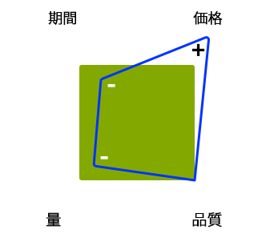

# プロジェクトの管理 - ベストプラクティスチェックリスト{#managing-projects-best-practices-checklist}

Adobe Experience Manager（AEM）実装プロジェクトの管理では、（プロジェクトの実装前および実装中の）問題点とそれに関連する必要な決断を認識するために、計画を立てて理解する必要があります。

ベストプラクティスは次のような役に立つ内容で構成されています。

* [インタラクティブなチェックリスト](/help/managing/best-practices-checklist.md)。これらのベストプラクティスの進行状況を追跡および監視できます。

   * フェーズ、マイルストーンおよびペルソナに応じて入力と成果物を定義します。
   * 進行状況とプロジェクトのヘルスを示す自動化された概要（品質、ヘルスおよび完了状況）を提供します。

* ドキュメント。直接[チェックリスト](/help/managing/best-practices-checklist.md)に基づいて、以下の詳細を説明しています。

   * [Project Heartbeat](#projectheartbeat) 分析。
   * [ロール別ステータス](#status-by-role) ：概要
   * [フェーズおよびマイルストーン](#phases-and-milestones)。
   * [主要なペルソナ](#persona)および各（関連）段階でのペルソナの関与。
   * [必要なドキュメントと提供資料の](/help/managing/best-practices-glossary.md) 用語集 。

* [詳細情報](/help/managing/best-practices-further-reference.md)。特定の分野に関する詳細を提供します。

## プロジェクトのハートビートダッシュボード {#project-heartbeat-dashboard}

「**プロジェクトのハートビート**」ワークシートでは、プロジェクトの重要な指標の概要が図解されています。

* **フェーズの品質**

   * プロジェクト全体の[必須ドキュメントと成果物](#required-documents-and-deliverables)の品質を示します。

* **フェーズのヘルス**

   * プロジェクトの全体的なステータスインジケーター。リスクの可能性のある領域を強調するのに便利です。

* **フェーズの完了状況**

   * プロジェクト中、任意の時点で、プロジェクトの各フェーズがどれだけ完了済みかを示します。

## 役割別のスタータス {#status-by-role}

「**役割別のステータス**」ワークシートには、[**ヘルス**、**品質**&#x200B;および&#x200B;**完了状況**](#projectheartbeat)&#x200B;の詳細な分類が、**[フェーズ](#phases-and-milestones)**&#x200B;および&#x200B;**[ペルソナ](#persona)**&#x200B;別に表示されます。

## フェーズおよびマイルストーン {#phases-and-milestones}

プロジェクト計画は個別の（上位レベルの）フェーズに分類されます。

フェーズごとに独自のマイルストーンが含まれます。For each [persona](#persona) (or role), the relevant milestones are listed, together with the documents that are required to produce the defined deliverables.

>[!NOTE]
>
>個々の必須ドキュメントと成果物の間には、直接の 1:1 の関係はありません。

### 準備 {#preparation}

プロジェクトの準備は、プロジェクト全体の基礎を形成します。以下の項目に関して、主要な要件、および明確な目標と期待を定義する必要があります。

* **ビジネスの論理的根拠**

   * プロジェクトを開始するための根本的理由と正当性。

* **適用範囲とスケジュール**

   * 要件と実施期間を定義するために、基本的な適用範囲と大まかなスケジュールを設定する必要があります。状況を明らかにするために役立つ場合は、適用範囲外にある事項も必要に応じて定義します。

プロジェクトの準備、計画および実行方法と、ソリューションの実装方法は、決められた予算や日程、コンテンツの量、求められる品質などの制約による影響を受けます。

すべての場合に当てはまりますが、ある要因を調整すると別の要因が影響を受けます。例えば、期間を短縮し、かつ同じ品質水準を要求すると、価格は上昇し、満足できるコンテンツの量は減少します。予算が重要な要因となることが多いので、このような関係を忘れてはなりません。

4 つの要因は次のとおりです。

#### マイルストーン {#milestones}

* **検証**

   このフェーズでは、次のようなプロジェクトの目標を検証し、確認する必要があります。

   * 何を達成または提供するか。
   * 誰が恩恵を受けるか。
   * 適用範囲はどうするか。

      * 状況を明らかにするために役立つ場合は、適用範囲外にある事項も必要に応じて定義します。
   * 成功をどう定義するか。
   * 成功をどのように測定するか。
   * ビジネス要件と技術要件。
   * 交換が必要なレガシーシステムの有無。これが該当する場合は移行が必要なデータの有無。
   * 誰が関与するか。
   * 進行状況をどのように測定するか。
   * プロジェクトの期間中に進行状況を確認する頻度。

* **予算**

   プロジェクトを開始する前に、実装にかかるコストに関して信頼性が高く現実的な見積もりをおこなう必要があります。

   * 検証マイルストーンの情報を見積もりの基礎として使用します。
   * 現実的に見積もりをおこないます。
   * クライアントが従う可能性のあるガイドライン、プロセスまたは制限を考慮し、尊重します。
   * 後の段階で予算の再検討や見直しが必要になった場合に備えて、不測の事態やレビューのプロセスを考慮します。
   * 物品の購入やリソースの使用、手数料など、コストは多くの形で発生することに留意します。

### 計画 {#planning}

プロジェクトを計画すると、準備が一本化されます。ここではまず、目標と期待を転換することにより、具体的なタスクから成り、明確なコミュニケーションを伴い、厳格なレビューによって進行状況を測定する、十分に定義されたロードマップを作成する必要があります。

#### マイルストーン {#milestones-1}

* **引き継ぎ**

   引き継ぎを明確化することで、適切なペルソナまたはグループが、プロジェクト内の自らの責任を確実に理解できるようになります。

   それには、ロードマップ、適用範囲、目標、要件および KPI を含む関連するすべての局面を十分に理解できるように、完全な詳細を提供または生成する必要があります。

* **リスク評価**

   不測の事態を避けるために、リスク評価を使用して、潜在的なリスクおよびその影響と発生確率を識別し、定量化します。

   これは、プロジェクトのライフサイクルの早期に実施し、脆弱性を確実に識別して評価する必要があります。結果に基づいて、要件がすべて実装可能かどうか、また必要に応じて、適切な措置を実施して追跡することが可能かどうかを関係者に報告できます。

* **コミュニケーション**

   どんなプロジェクトにおいても、コミュニケーションは常に成功への鍵となります。明確かつ効率的なコミュニケーションにより、全員が次のことを確実におこなえるようにする必要があります。

   * 同じ基本目標に向かう
   * 同じ情報ベースから出発する
   * 同じチャネルを使用する

* **キックオフ**

   キックオフミーティングは、プロジェクト開始の認識を高めるために使用されます。次のことをおこなう良い機会です。

   * 関心のあるすべての関係者（または少なくともグループの代表者）の招待
   * プロジェクトに関する重要な情報の提示
   * 質問への回答
   * メンバー全員の知識ベースの合致
   * 関係するすべての人から必要なコミットメントを得る

      * 最重要プレーヤー（作成者になる見込みの人を含む）をプロジェクトの開始時点から参画させると、その人たちのプロジェクトに対する取り組みが真剣なものになる可能性が高まります。

### 開発の準備 {#development-preparation}

開発計画は、強固なデザインに基づき、必要な知識を持つチームがプロジェクトを構築するための確かな鍵となります。

#### マイルストーン {#milestones-2}

* **開発チームの人員確保とトレーニング**

   プロジェクトに取り掛かる前に、開発チームに適切な人材が確保されていて、チームのメンバー全員が必要なトレーニングを受けていることを確認する必要があります。

* **コンテンツのアーキテクチャ**

   コンテンツのアーキテクチャでは、以下を含むコンテンツの将来のアーキテクチャを定義し、説明します。

   * コンテンツツリー（アセットを含む）
   * 基本構造（キャンペーンなどを含む）
   * マルチサイトおよび多言語構造（MSM、翻訳など）
   * サポートコンテンツ（タグおよびタグ付けの概念を含む）
   * キャッシュおよびコンテンツ再利用の戦略

* **システムのアーキテクチャ**

   システムのアーキテクチャでは、特に次の情報を含むシステムの概念表示を定義します。

   * 必要なすべての環境の[システムのアーキテクチャ](/help/sites-deploying/recommended-deploys.md#deployment-scenarios)
   * サブシステム
   * サードパーティのシステム
   * インターフェイス（ハードウェア、ソフトウェアおよび人間の操作）
   * Servers for each environment; see the [Technical Requirements](/help/sites-deploying/technical-requirements.md) and [Hardware Sizing Guidelines](/help/managing/hardware-sizing-guidelines.md)

   * 各環境用のプロセス（デプロイメントやメンテナンスの要件など）
   * メンテナンスアクティビティ（データストア GC、TarPM の最適化など）
   * [ディスパッチャーのキャッシング](https://helpx.adobe.com/experience-manager/dispatcher/user-guide.html)
   * [公開/作成者共有のクラスター化](/help/sites-deploying/recommended-deploys.md#deployment-scenarios)
   * クライアント側のパフォーマンス（JavaScript の圧縮、結合、CSS スプライト、HTTP リクエストの合計数など）

* **アプリケーションのアーキテクチャ**

   アプリケーションのアーキテクチャでは、提案されたアプリケーションの動作を定義し、説明します。

   以下に焦点が当てられています。

   * アプリケーション間、およびアプリケーションとユーザーとの相互動作。
   * 内部構造ではなく、アプリケーションによって消費および生成されるデータ。

   定義は以下の点をカバーする必要があります。

   * プロジェクトの基本コード構造
   * コードのアーティファクト（バンドル、パッケージなど）
   * テンプレートやコンポーネントの分類および関係
   * 必要なカスタマイズの全体的な詳細（具体的なオーバーレイが後続）
   * ソリューションに必要なワークフローのデザイン（コンテンツの作成、承認、公開、変換、読み込み、書き出し、など）
   * MSM、コマース、サードパーティ統合などの複雑なモジュールに関する特別な考慮

* **システムの統合**

   システムの統合には、以下の計画（および実装）が必要です。

   * すべてのサブシステムおよび[ソリューションの統合](/help/sites-administering/integration.md)をどのようにして 1 つのまとまったシステムとして動作させるか
   * サードパーティ製システムの統合方法サードパーティ製システムがダウンした場合のオフライン/オンライン、クライアント側/ブラウザ側/フォールバー処理など、特別な考慮事項と共に使用できます。

* **テスト概念**

   開発を始める前に、プロジェクトのすべての[テスト](/help/sites-developing/planning.md)要件の詳細かつ包括的な概念を作成する必要があります。

   これには、特に以下を含める必要があります。

   * 実施するすべてのテストの詳細
   * テストに必要なコンテンツの準備
   * 使用するテストツールの情報
   * テスト要員、特に QA チーム外のグループの概要
   * テストの自動化の詳細（Selenium や AEM 開発モードの使用など）

* **エクスペリエンスデザイン**

   エクスペリエンスデザイン（XD）には、ソリューションのユーザーエクスペリエンスのデザインが含まれます。

   Web サイトの作成者と最終ユーザーの双方に関してユーザーエクスペリエンスを分析し、開発する必要があります。

* **サポートのセットアップ**

   開発前に、デプロイ、リリース、テストおよび問題の報告に必要なすべてのサポートプロセスを設定しておく必要があります。

   [アドビのサポートポータル](https://helpx.adobe.com/jp/marketing-cloud/contact-support.html)も参照してください。

### 運用計画と運用 {#operations-planning-and-operations}

同様に、運用を適切に計画し、プロジェクトのライフサイクルの全段階に関して、必要な環境が整っていることを確認する必要があります。また、メンテナンスのための適切なプロセスも必要です。

#### マイルストーン {#milestones-3}

* **権限**

   ソリューションを使用するすべてのユーザーおよびグループに関して、役割と権利の概念を計画し、実装する必要があります。

   次に例を示します。

   * A list of roles (i.e. groups) with `read`/ `write` access definitions for each

   * Definition of the use of privileges that impact the publish environment; for example, `replicate`
   * 最小限の権限を持つユーザーに対しては、ワークフローを定義する必要があります。
   * Users in the `editor` group should not have `admin` rights nor be part of the `administrators` group

   For more information, see [User Administration and Security](/help/sites-administering/security.md).

* **監視とメンテナンス**

   監視とメンテナンスは、実稼動後のソリューションのスムーズな運用を実現するために重要な局面です。そのためには、以下を定義する必要があります。

   * 何を監視する必要があるか
   * メンテナンスタスク（定期的および特殊ケース用）

   詳しくは、[監視とメンテナンス](/help/sites-deploying/monitoring-and-maintaining.md)も参照してください。

* **移行**

   レガシーシステムに由来するコンテンツは、移行用にレビューし、検証する必要があります。

* **障害回復計画**

   障害回復計画が整っていることを確認します。緊急時には、この計画により、AEM の実稼動環境を保護できるようにする必要があります。バックアップ、復元、フェイルオーバーおよびその他の状況をカバーします。

### 開発 {#development}

開発は重要なフェーズであり、必要なのはコーディングだけではありません。

#### マイルストーン {#milestones-4}

* **開発環境**

   以下を含めて、開発環境を計画し、文書化します。

   * アーキテクチャ
   * [開発ツール](/help/sites-developing/dev-tools.md)

      * 典型的な環境の構成内容は次のとおりです。

         * 問題追跡システム（Jira など）
         * IDE（Eclipse など）
         * ビルド管理ツール（Maven など）
         * 継続的統合のためのツール例えばジェンキンス
         * バージョン管理のためのツール（GIT や SVN など）
         * ビルドアーティファクトのリポジトリマネージャー（Archiva や Nexus など）
   * サードパーティソフトウェアの統合と依存関係
   * [ソリューションの統合と依存関係](/help/sites-administering/integration.md)
   * デプロイメントのサイクル

* **テストシステム**

   以下を含めて、テスト環境を計画し、文書化します。

   * アーキテクチャ
   * ナイトリービルドを含む開発ビルドへの依存性
   * サードパーティソフトウェアの統合と依存関係のテストの可能性または制限
   * テストツール
   * 自動テスト戦略

* **実稼動システム**

   以下を含めて、実稼動環境を計画し、文書化します。

   * アーキテクチャ
   * デプロイメントのサイクル
   * サードパーティソフトウェアの統合と依存関係
   * セキュリティのセットアップ
   * Baseline performance verified by running the [Tough Day tests](/help/sites-developing/tough-day.md) on the production setup
   * パフォーマンステストの要件（[品質保証のベストプラクティス](/help/sites-deploying/configuring-performance.md#best-practices-for-quality-assurance)を参照）

* **統合**

   以下を含めて、システムおよび[ソリューションの統合](/help/sites-administering/integration.md)のすべての局面を計画、文書化およびテストします。

   * 自動テスト戦略
   * [アプリケーションを開発からテスト、さらに実稼動へ移行](/help/managing/enterprise-devops.md#code-movement)するプロセスの自動化
   * [コンテンツを実稼動からテストおよび開発へ移行](/help/managing/enterprise-devops.md#content-movement)するプロセスの自動化

* **移行**

   以下を含めて、コンテンツ移行のすべての局面を計画、文書化およびテストします。

   * コンテンツのアーキテクチャ
   * 移行戦略

* **コミュニケーション**

   チームの全メンバーおよびプロジェクトのペルソナに必要な最新情報を伝達します。

* **ドキュメント**

   以下を含めて、ソリューションを完全に文書化します。

   * 運用マニュアル
   * アップグレードに影響する可能性のあるカスタマイズ
   * リリースノート

### パフォーマンスおよびテスト {#performance-and-testing}

新しいアプリケーションが使用可能になったら、機能と[パフォーマンス](/help/sites-deploying/configuring-performance.md)の両面で厳格なテストをおこなう必要があります。

>[!NOTE]
>
>テストチームは中立を保ち、テスト結果を提供する必要があります。
>
>結果に伴う影響を評価し、適切な対応を決定するのは、プロジェクトマネージャの責任です。

#### マイルストーン {#milestones-5}

* **エンドユーザー受け入れテスト**

   [ユーザー受け入れテスト](/help/sites-developing/acceptance-signoff.md)（UAT）は、以下のことを確実にする上で重要です。

   * ソリューションがユーザーや顧客の要件を満たしていること
   * 顧客やユーザーがソリューション（機能、デザインおよびパフォーマンス）を受け入れること

   顧客への引き渡し用の形式化されたチェックリストが必要です。自動化され、スナップショットに対して夜間に実行されるのが理想的です。その結果をプロジェクトマネージャーおよび開発チームに送信する必要があります。

* **パフォーマンステストと負荷テスト**

   パフォーマンステストと負荷テストは、平均負荷とピーク負荷でソリューションが必要なパフォーマンスレベルを満たしていることを確認するために使用されます。

   パフォーマンステストについて詳しくは、以下を参照してください。

   * [パフォーマンステスト](/help/sites-deploying/configuring-performance.md)
   * [テストを計画して実行する方法](/help/sites-developing/planning.md)

   * [基本的なパフォーマンスのガイドライン](/help/sites-deploying/configuring-performance.md#basic-performance-guidelines)
   >[!NOTE]
   >
   >このプロセスは、通常の AEM 使用時も引き続き実行する必要がありますが、この初期段階では最も重要です。

### ロールアウト {#rollout}

スムーズに運用を開始するためには、新しいアプリケーションのロールアウトを慎重に計画する必要があります。これには、全体的なセキュリティの確認、見込みユーザー全員のトレーニング、すべての問題が対応済みであることを確認するためのドライランの複数回に渡る実行が含まれます。

#### マイルストーン {#milestones-6}

* **準備**

   準備と計画は、スムーズなロールアウトの実現に役立ちます。

* **トレーニング**

   関与する全スタッフがトレーニングを受けていることを確認します。

   コースカタログで [Adobe Experience Manager](https://training.adobe.com/training/courses.html#solution=adobeExperienceManager) を参照してください。

* **管理者のトレーニング**

   ソリューション管理者に関して、以下のことを確認します。

   * トレーニングを受けていること
   * 適切なトレーニング資料を受け取っていること
   * 適切なドキュメントを受け取っていること

* **ユーザーのトレーニング**

   作成者に関して、以下のことを確認します。

   * トレーニングを受けていること
   * 適切なトレーニング資料を受け取っていること
   * 適切なドキュメント（ユーザーガイドなど）を受け取っていること

* **侵入テスト**

   侵入テストでは、コンピューターシステムへの攻撃をシミュレートして、潜在的なセキュリティの弱点を特定します。

* **侵入／セキュリティテスト**

   ソリューションのセキュリティを確実にするために、特定の侵入テストを、多岐に渡るセキュリティテストとともに実行します。

   詳しくは、[セキュリティチェックリスト](/help/sites-administering/security-checklist.md)を参照してください。

### 運用開始 {#go-live}

運用開始は可能な限りスムーズにする必要があります。ここでも、クリーンな実行のために、最終手順を計画する必要があります。

#### マイルストーン {#milestones-7}

* **準備**

   準備と計画は、スムーズな運用開始の実現に役立ちます。

* **セキュリティ**

   内部、外部両方のユーザーとユーザーのコンテンツに対して、ソリューションのセキュリティを確認します。

* **フォールバック**

   運用開始前に、フォールバックに必要なシステム、手順およびメカニズムがすべて揃っていることを確認します。

* **サポート**

   サポートサービスが整っていて、準備ができていることを確認します。

* **トランジション**

   実稼動環境およびユーザーへの切り替えを計画し、実行します。

* **ロールアウト**

   スモークテストを準備して実行します。

## ペルソナ {#persona}

チェックリストはペルソナによってデザインされます。この役割は、プロジェクトのライフサイクルに重要な関わりを持っています。

また、特定のタスクに関与している[その他のペルソナ](#other-persona)も存在します。

### プロジェクトスポンサー {#project-sponsor}

プロジェクトスポンサーは、

* プロジェクトにビジネス事例を提供または提示します。
* 以下を含むプロジェクトの適用範囲を形成し、定義する上での鍵となります。

   * 成功の定義と成功のための条件
   * 主要な KPI

* クライアントのロードマップに基づいて主要なマイルストーンを提供します。

### プロジェクトマネージャー {#project-manager}

プロジェクトマネージャーの役割：

* プロジェクトスポンサーによって提供された要件（適用範囲、KPI、成功の条件および定義）に基づいて、プロジェクトを全体的に遂行します。
* 予算を定義し、その予算に基づいてプロジェクトを準備します。
* プロジェクトに関与する全ペルソナのコミュニケーションの要です。

### アーキテクト {#architect}

ソリューションアーキテクトの役割：

* ソリューションおよびシステムの高レベルのデザインを担当します。
* AEM の実装戦略の定義に助力します。例えば、クラスターインストールとコールドスタンバイのどちらを実装するか、どんな場合にコンテンツ配信ネットワーク（CDN）が必要かなどです。
* クライアントの要件に基づいて、AEM ソリューションアーキテクチャも定義します。これには、ユーザーの役割（および関連する権利）の概念、テンプレートとコンポーネントの関係、どんな場合にマルチサイト管理を使用するかなどが含まれます。

### ビジネスアナリスト {#business-analyst}

ビジネスアナリストの役割：

* 全体的な要件を収集して分析し、次のような仕様に転換する作業を主に担当します。

   * プロジェクトマネージャーが開発を計画する際に利用する仕様
   * 開発チームがデザインおよび開発の際に基準とする仕様

* クライアントと密接に協力して要件を分析し、以下に照らして要件を一致させます。

   * 成功の定義
   * 成功のための条件
   * KPI（ビジネスベースとパフォーマンスベース）

### 開発リーダー {#development-lead}

開発リーダーの役割：

* プロジェクトを技術的に遂行します。
* クライアントの要件に準拠する開発方法を選択します。
* 次のようにして開発戦略を作成します。

   * ビジネスおよびパフォーマンスの KPI に沿っていることを確認
   * 成功の条件および定義を考慮

* アーキテクトと密接に協力し（特に AEM の開発戦略を作成する際）、テンプレートとコンポーネントの関係、サードパーティアプリケーションの統合戦略、特殊な機能などを定義します。

### 品質リーダー {#quality-lead}

品質リーダーの役割：

* 成果物の品質に関する責任を負い、成功のための条件やクライアントが定義している KPI が満たされていることを確認します。
* 品質の指標を定義し、全関係者と協調し、テスト計画を作成して確実に実行します。
* レポートを作成してプロジェクトの関係者に配信します。

### システムエンジニア {#system-engineer}

システムエンジニアの役割：

* プロジェクトのインフラストラクチャを監督します。
* 次の作業を担当します。

   * 内部の開発環境とテスト環境のセットアップ
   * セットアップしたシステムとクライアントのシステムとのマッチング

* 推奨されるハードウェアを提案し、様々な実装を監視し、運用開始前後の運用サポートを提供します。

### セキュリティリーダー {#security-lead}

セキュリティリーダーの役割：

* ソリューションの全体的なセキュリティ概念に関する責任を負い、セキュリティ概念がクライアントの要件やポリシーに沿っていることを確認します。
* セキュリティ概念、セキュリティ操作を提供し、ゾーンやファイアウォールといったハードウェアベースのセキュリティ概念を推奨します。

### その他のペルソナ {#other-persona}

* 関係者

   * プロジェクトの成功に利害関係を持つ人物（多くの場合はビジネス関係者）。多くの場合、予算に貢献します。

* 法律担当者

   * 契約交渉時には、法的助言が必要です。

* トレーナー

   * プロジェクトの規模と性質によっては、専門的なトレーナーを活用して、関連グループのトレーニングセッションを開発し、提示できます。

* テクニカルライター

   * プロジェクトの規模と性質によっては、専門的なテクニカルライターを活用して、特定のグループ向けのガイドラインやマニュアルを作成できます。例えば、システム管理者向けのメンテナンスマニュアルや、作成者向けのユーザーガイドなどです。

* システム管理者

   * システムの継続運用に関する責任を負います。

* 作成者とエンドユーザー

   * システムを使用して Web サイトのコンテンツを作成し、メンテナンスする人物です。

## 必須ドキュメントと成果物 {#required-documents-and-deliverables}

The checklists cover the **Required Documents** and **Deliverables** for each milestone.

* この 2 つの間には、1:1 の関係はありません。例えば、複数の必須ドキュメントのグループが 1 つの成果物になる場合もあります。
* 同じマイルストーンの間に、あるペルソナからの成果物が、別のペルソナの必須ドキュメントになる場合もあります。

### 必須ドキュメント {#required-documents}

**必須ドキュメント**&#x200B;は、適切なペルソナが自身の成果物を生成する際に必要になります。

For each **Required Document** the persona should indicate:

* **Y/N**：必須ドキュメントを受け取ったかどうか。
* **1-3**：受け取ったドキュメントの品質表示。

### 成果物 {#deliverables}

マイルストーンごとに、適切なペルソナが特定のドキュメントを提供します。そのため、各自が特定のマイルストーンに対する自身の責任を認識しています。

For each **Deliverable** the persona must indicate:

* **Y/N**：成果物が完成したかどうか。

Deliverables are often used as **Required Documents** for either the current or a later milestone.

## 関連するベストプラクティス {#related-best-practices}

デプロイ、管理、開発またはオーサリングのベストプラクティスについては、以下を参照してください。

* AEM プロジェクトの管理に関連するその他のベストプラクティスおよびガイドライン:
   * [ハードウェアのサイジングのガイドライン](/help/managing/hardware-sizing-guidelines.md)
   * [Enterprise DevOps](/help/managing/enterprise-devops.md)
   * [SEO と URL 管理のベストプラクティス](/help/managing/seo-and-url-management.md)
   * [AEM と Web アクセシビリティのガイドライン](/help/managing/web-accessibility.md)
   * [全般的なデータ保護規制](/help/managing/data-protection-and-privacy.md)*ベスト・プラクティスの [導入と保守](/help/sites-deploying/best-practices.md)
* [管理のベストプラクティス](/help/sites-administering/administer-best-practices.md)
* [開発のベストプラクティス](/help/sites-developing/best-practices.md)
* [オーサリングのベストプラクティス](/help/sites-authoring/best-practices.md)

## ドキュメントの重要個所 {#key-documentation-areas}

* AEM ドキュメントAEM ドキュメントの以下の節も、特に興味深い内容になっています（ただし、このリストがすべてではありません）。

   * [セキュリティ](/help/sites-developing/security.md)
   * [推奨されるデプロイメント](/help/sites-deploying/recommended-deploys.md)
   * [Enterprise DevOps](/help/managing/enterprise-devops.md)
   * [ハードウェアのサイジング](/help/managing/hardware-sizing-guidelines.md)
   * AEM の概念：

      * [開発 - 基本](/help/sites-developing/the-basics.md)
      * [MSM の概念](/help/sites-administering/msm.md)
      * [HTML テンプレート言語（HTL）](https://docs.adobe.com/content/help/ja-JP/experience-manager-htl/using/overview.html)

* 関連ドキュメント

   * Adobe Experience Cloud - [Adobe Experience Cloud の計画](https://helpx.adobe.com/marketing-cloud/how-to/planning.html)

