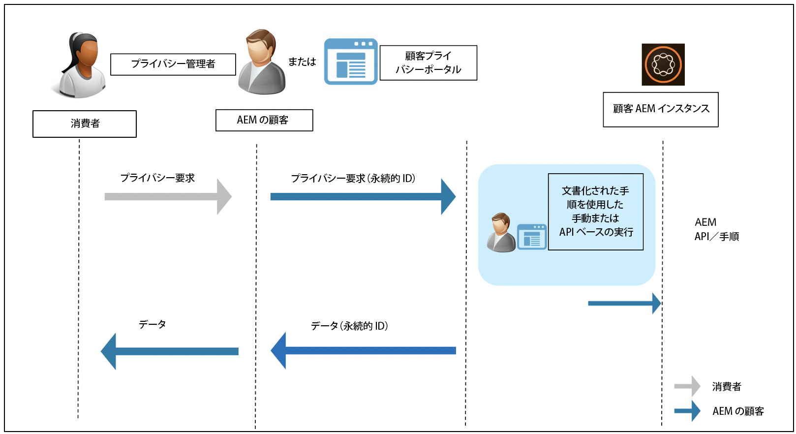

# Adobe Experience Manager保護対応およびデータプライバシー規制 {#aem-readiness-for-data-protection-and-data-privacy-regulations}

>[!WARNING]
>
>このドキュメントの内容は法律上の助言とはならず、法律上の助言の代わりとしての意味も持たない。
>
>データ保護およびデータのプライバシーに関する規制に関するアドバイスについては、会社の法務部にお問い合わせください。

>[!NOTE]
>
>プライバシーに関する問題に対するAdobeの対応、およびAdobeのお客様にとっての意味について詳しくは、 [Adobeのプライバシーセンター](https://www.adobe.com/privacy.html)を参照してください。

Adobeは、お客様のプライバシー管理者またはAEM管理者がデータ保護とデータプライバシーの要請を処理し、お客様がこれらの規制に準拠できるように、ドキュメントと手順を（APIを使用して）提供しています。 ドキュメントに記載された手順により、顧客は手動で、または、可能な場合は外部のポータルやサービスからAPIに呼び出すことで、規制要求を実行できます。

>[!CAUTION]
>
>詳細はAdobe Experience Managerに限定。
>
>別のAdobeのオンデマンドサービスのデータは、関連するプライバシー要求と共に、そのサービスでの処置が必要になります。
>
>詳しくは、 [Adobeのプライバシーセンターを参照してください](https://www.adobe.com/privacy.html)。

## 概要 {#introduction}

Adobe Experience Managerの例と、それに対して実行されるアプリケーションは、弊社のお客様が所有し、運用しています。

その結果、GDPR、CCPAなどのデータ保護に関する規制は、お客様の責任が大きく左右されます。

簡単に説明すると、データのプライバシーと保護に関する規則には、次の役割を果たす新しい規則が含まれます。

* CCPA(Business Entities)および/またはGDPR(Data Controller)

* サービスプロバイダー(CCPA)および/またはGDPR(Data Processor)

この規則の主な規定は次の通りである。

1. 個人データの定義が拡張され、一意のIDがすべて含まれるようになりました。を直接または間接的に識別可能なデータとして扱う場合と同様です。

2. 同意要件を強化しました。

3. 削除権限（データ消去）に対する焦点を高めました。

4. データ販売のオプトアウトを参照してください。

Adobe Experience Managerの場合：

* インスタンスと、それらに対して実行されるアプリケーションは、顧客が所有し、操作します。

   * つまり、ビジネス・エンティティやサービスプロバイダー、データ・コントローラ、データ・プロセッサなど、規制上の役割をお客様が管理するということです。

   * 下の図に示すように、Adobe Experience Platform Privacy ServiceはAEMのワークフローに含まれません。

* AEMには、お客様のプライバシー管理者およびAEM管理者がプライバシー規制の要請を実行するためのドキュメントと手順が含まれます。手動で、またはAPI経由で（使用可能な場合）。

* 新しいサービスまたはUIが追加されていません。

   * 代わりに、プライバシー規制の要求を処理するお客様のUI/ポータルでの使用に関する手順とAPIについて説明しています。

* AEMには、プライバシー要求のワークフローをサポートする追加設定なしのツールは含まれません。

   * Adobeは、お客様のプライバシー管理者またはAEM管理者に関するドキュメントと手順を提供し、プライバシー規制に関する要求を手動で実行できるようにします。

Adobeは、Adobe Experience Managerのアクセス、削除、およびオプトアウトに関するプライバシー要求を処理する手順を提供しています。 場合によっては、自動化を支援するために、お客様が開発したポータルまたはスクリプトから呼び出すことのできるAPIがあります。

次の図に、プライバシーリクエストワークフローの例を示します(Adobe Experience Manager6.5を使用した図を参照)。

## Adobe Experience Managerと規制への対応 {#aem-and-regulatory-readiness}

AEMの製品領域に関する規制に関するドキュメントについては、以下の節を参照してください。

## AEM の基盤 {#aem-foundation}

AEM Foundationのデータ保護およびプライバシー要求の [処理を参照してください](/help/sites-administering/handling-gdpr-requests-for-aem-platform.md)。

## 集計した使用状況の統計の収集を AEM でオプトインする方法 {#aem-opting-into-aggregate-usage-statistics-collection}

[集計した使用状況の統計の収集](/help/sites-deploying/opt-in-aggregated-usage-statistics.md)を参照してください。

## AEM Sites {#aem-sites}

「 [AEM Sites- Data Protection and Privacy Readiness」を参照してください。](/help/sites-administering/gdpr-compliance-sites.md)

## AEM Commerce {#aem-commerce}

「 [AEM Commerce - Data Protection and Privacy Readiness](/help/sites-administering/gdpr-compliance-commerce.md)」を参照してください。

## AEM Mobile {#aem-mobile}

「 [AEM Mobile- Data Protection and Privacy Readiness](/help/mobile/aem-mobile-gdpr-compliance.md)」を参照してください。

## Adobe Target および Adobe Analytics との AEM 統合 {#aem-integration-with-adobe-target-adobe-analytics}

これらのAdobe Experience Manager統合は、データ保護とプライバシー（GDPRやCCPAなど）に対応したサービスを提供します。 統合に関連して、Adobe TargetやAdobe Analyticsからの個人データはAEMに格納されない。
詳しくは、次のセクションを参照してください。

* [Adobe Target — プライバシーの概要](https://docs.adobe.com/content/help/en/target/using/implement-target/before-implement/privacy/privacy.html)

* [Adobe Analyticsデータのプライバシーワークフロー](https://docs.adobe.com/content/help/en/analytics/admin/data-governance/an-gdpr-workflow.html)

## AEM Communities {#aem-communities}

AEM Communities は[デフォルトの API](/help/communities/user-ugc-management-service.md) を通じて、データのポータビリティ権、アクセス権および削除権をデータ主体に提供します。これらの API を使用すれば、ユーザー生成コンテンツの一括削除や一括書き出し、および許可可能 ID で識別されたユーザーアカウントの無効化が可能となります。ただし、CRXDE Lite でユーザーノードを削除してユーザーアカウントを永続的に削除することもできるので、システムからの容易なオプトアウト、という要求に応えることができます。

さらに AEM Communities では、一括モデレーションコンソールを通じて「プライバシーバイデザイン」が実現されます。このコンソールでは、権限を持つメンバーがユーザーの貢献や詳細を検索および削除できます。メンバー管理コンソールを使用すれば、制限を設けてある貢献者の参加を禁止することさえできます。このコンソールではさらに、データ主体が自身の作成した貢献を削除することもできます。

## AEM Forms {#aem-forms}

AEM Forms に含まれるコンポーネントやワークフローは、ビジネスプロセスの調整やデジタルトランザクションの実行のためにデータをキャプチャ、処理および格納します。コンポーネントごとに異なるデータストアが使用されますが、コンポーネントをカスタムデータストアと統合することも可能です。次のドキュメントでは、コンポーネントのデータ保護とプライバシー（GDPRやCCPAなど）ワークフローをサポートするために、ユーザーデータにアクセスして処理する手順とガイドラインを説明しています。

* [フォームポータル](/help/forms/using/forms-portal-handling-user-data.md)
* [Correspondence Management](/help/forms/using/correspondence-management-handling-user-data.md)
* [Adobe Sign との統合](/help/forms/using/integration-adobe-sign-handling-user-data.md)
* [OSGi でのフォームに特化したワークフロー](/help/forms/using/forms-workflow-osgi-handling-user-data.md)
* [Forms JEE のワークフロー](/help/forms/using/forms-workflow-jee-handling-user-data.md)（AEM Forms JEE のみ）
* [Document Security](/help/forms/using/document-security-handling-user-data.md)（AEM Forms JEE のみ）
* [ユーザー管理](/help/forms/using/user-management-handling-user-data.md)（AEM Forms JEE のみ）
