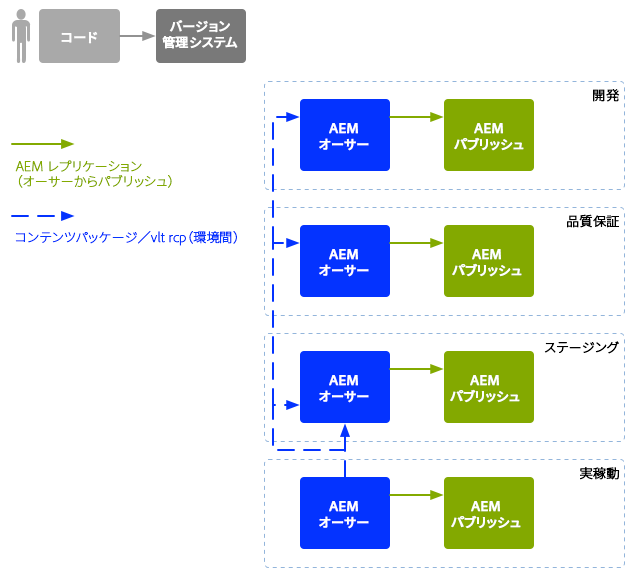

# Enterprise DevOps{#enterprise-devops}

DevOps では、以下の目的に必要なプロセス、メソッドおよびコミュニケーションを扱います。

* 様々な環境にわたるソフトウェアのデプロイメントを容易にする。
* 開発、テスト、デプロイメントチーム間のコラボレーションを簡素化する。

DevOps は、次のような問題を回避することを目的としています。

* 手動によるエラー。
* 要素の抜け（ファイルや設定の詳細など）。
* 不一致（開発者のローカル環境とその他の環境など）。

## 環境 {#environments}

Adobe Experience Manager(AEM) デプロイメントは通常、複数の環境で構成され、様々なレベルで様々な目的で使用されます。

* [開発](#development)
* [品質保証](#quality-assurance)
* [ステージング](#staging)
* [実稼動](#production-author-and-publish)

>[!NOTE]
>
>実稼動環境には、オーサー環境とパブリッシュ環境が少なくとも 1 つずつ必要です。
>
>その他すべての環境もオーサー環境とパブリッシュ環境で構成することをお勧めします。そうすると、実稼動環境を反映して早期のテストが可能になります。

### 開発 {#development}

開発者は、必要な機能をすべて備えた、提案されたプロジェクト（web サイト、モバイルアプリケーション、DAM 実装など）の開発とカスタマイズを担当します。開発者は、次の作業を行います。

* テンプレート、コンポーネント、ワークフロー、アプリケーションなど、必要な要素の開発とカスタマイズ
* デザインの実現
* 必要な機能を実装するために必要なサービスおよびスクリプトの開発

の設定 [開発](/help/sites-developing/best-practices.md) 環境は、次の要素で構成されますが、様々な要因に依存します。

* 統合コードベースを提供する、バージョン管理を備えた統合開発システム。 これは、各開発者が使用する個々の開発環境からコードを結合および統合するために使用されます。
* 各開発者の個人環境。通常はローカルマシン上に存在します。適切な間隔で、コードがバージョン管理システムと同期されます。

システムの規模によっては、開発環境にオーサーインスタンスとパブリッシュインスタンスの両方を含めることができます。

### 品質保証 {#quality-assurance}

品質保証チームは、この環境を使用して、新しいシステムのデザインと機能を包括的に[テスト](/help/sites-developing/test-plan.md)できます。適切なコンテンツを含むオーサー環境とパブリッシュ環境の両方を持ち、完全なテストスイートを実施するために必要なすべてのサービスを提供する必要があります。

### ステージング {#staging}

ステージング環境は、実稼動環境（設定、コード、コンテンツ）のミラーである必要があります。

* 実際のデプロイメントの実装に使用するスクリプトをテストするために使用します。
* また、実稼動環境にデプロイする前の最終テスト（デザイン、機能、インターフェイス）にも使用できます。
* ステージング環境を実稼動環境と同一にすることが不可能な場合もありますが、パフォーマンスと負荷のテストができるように、できる限り近い環境にする必要があります。

### 実稼動 - オーサーとパブリッシュ {#production-author-and-publish}

実稼動環境は、実装を実際に[オーサリングおよび公開](/help/sites-authoring/author.md#concept-of-authoring-and-publishing)するために必要な環境で構成されます。

実稼動環境は、少なくとも 1 つのオーサーインスタンスと 1 つのパブリッシュインスタンスで構成されます。

* コンテンツの入力用の[オーサー](#author)インスタンス。
* 訪問者やユーザーがコンテンツを使用できるようにするための[パブリッシュ](#publish)インスタンス。

プロジェクトの規模に応じて、多くの場合、複数のオーサーインスタンス、複数のパブリッシュインスタンス、またはその両方で構成されます。 下位レベルでは、リポジトリーが複数のインスタンスにクラスター化される場合もあります。

#### 作成者 {#author}

オーサーインスタンスは、通常、内部ファイアウォールの内側に配置されます。 この環境では、自分や同僚が次のようなオーサリングタスクを実行します。

* システム全体の管理
* コンテンツの入力
* コンテンツのレイアウトとデザインの設定
* パブリッシュ環境に対するコンテンツのアクティベート

アクティベートされたコンテンツはパッケージ化され、オーサー環境のレプリケーションキューに配置されます。次に、レプリケーションプロセスは、そのコンテンツをパブリッシュ環境に転送します。

パブリッシュ環境で生成されたデータをオーサー環境にリバースレプリケートするには、オーサー環境のレプリケーションリスナーがパブリッシュ環境をポーリングし、パブリッシュ環境のリバースレプリケーションアウトボックスからそのようなコンテンツを取得します。

#### パブリッシュ {#publish}

パブリッシュ環境は、非武装地帯 (DMZ) にあります。 これは、訪問者がコンテンツ（Web サイト経由、モバイルアプリケーションの形式など）にアクセスし、公開またはイントラネット内で、コンテンツとやり取りする環境です。 パブリッシュ環境では、次の処理が行われます。

* オーサー環境からレプリケートされたコンテンツを保持します
* そのコンテンツを訪問者が利用できるようにします
* コメントやその他のフォーム送信など、訪問者によって生成されたユーザーデータを保存します。
* オーサー環境にリバースレプリケーションできるように、そのようなユーザーデータをアウトボックスに追加するよう設定できます

パブリッシュ環境は、コンテンツをリアルタイムで動的に生成し、個々のユーザーに対してコンテンツをパーソナライズできます。

## コードの移動 {#code-movement}

常に下から上にコードを反映：

* コードはまずローカルで、その後統合開発環境で開発される
* 続いて、QA 環境で十分なテストを実施する
* その後、ステージング環境でさらにテストする
* その後初めてコードは実稼動環境にデプロイされる

コード（カスタマイズされた Web アプリケーション機能やデザインテンプレートなど）は、様々なコンテンツリポジトリ間でパッケージを書き出したり読み込んだりすることで転送されます。 場合によっては、このレプリケーションを自動プロセスとして設定できます。

AEM Projects の多くの場合、トリガーコードのデプロイメントは次のようになります。

* 自動：開発環境および QA 環境への転送の場合。
* 手動：ステージング環境および実稼動環境へのデプロイメントは、より制御された方法で行われるので、多くの場合は手動ですが、必要に応じて自動化も可能です。

## コンテンツの移動 {#content-movement}

実稼動用に作成されているコンテンツは、実稼動オーサーインスタンスで&#x200B;**常に**&#x200B;オーサリングする必要があります。

コンテンツは、下位環境から上位環境へ移動するコードに従うことはできません。ローカルマシン以下の環境で作成者にコンテンツを作成させ、それを実稼動環境へ移動するのは適切な方法ではなく、エラーや不整合の原因となる可能性が高いからです。

実稼動コンテンツを実稼動環境からステージング環境へ移動して、ステージング環境で効率的かつ正確なテスト環境が提供されることを確認する必要があります。

>[!NOTE]
>
>これは、ステージングコンテンツを実稼動環境と継続的に同期する必要があるわけではありません。定期的な更新で十分ですが、特に新しいコードの反復をテストする前に必要です。 QA および開発環境のコンテンツは、それほど頻繁に更新する必要はありません。実稼動コンテンツを適切に表現する必要があります。

コンテンツの転送は可能です。

* 異なる環境間 - パッケージを書き出したり読み込んだりします。
* 異なるインスタンス間 — 直接レプリケーション ([AEMレプリケーション](/help/sites-deploying/replication.md))、コンテンツ（HTTP または HTTPS 接続を使用）に関連付けます。

