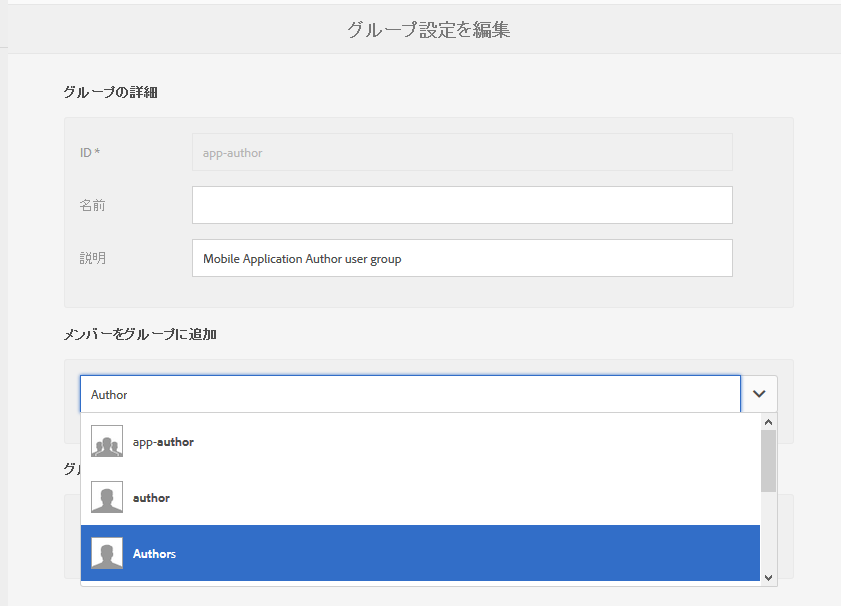
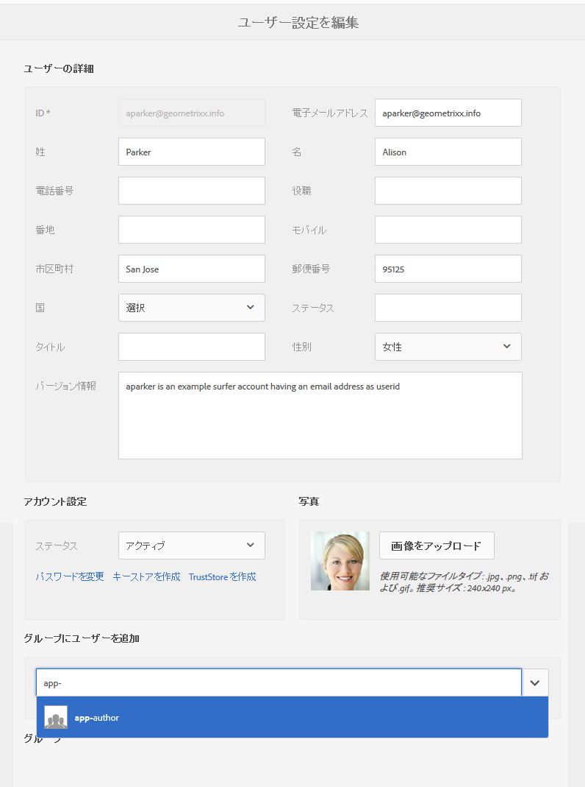
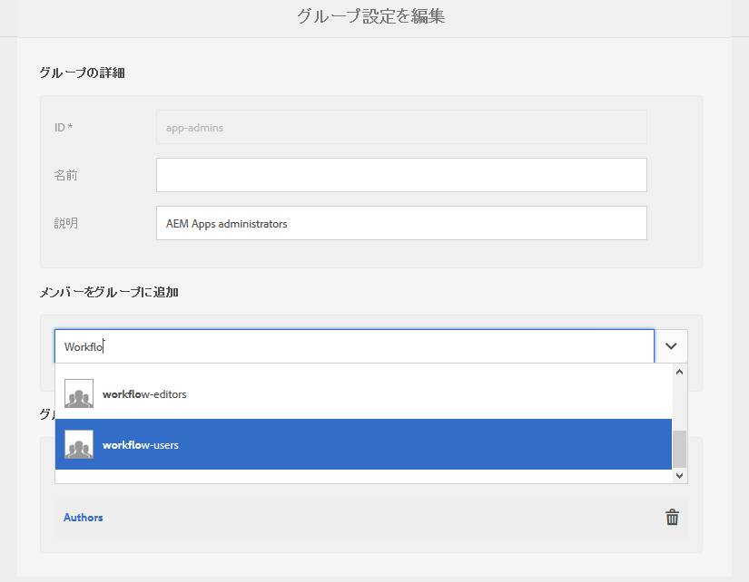

# ユーザーとユーザーグループの設定 {#configure-your-users-and-user-groups}

>[!NOTE]
>
>アドビは、シングルページアプリケーションフレームワークをベースにしたクライアント側のレンダリング（React など）を必要とするプロジェクトには SPA エディターを使用することをお勧めします。[詳細情報](/help/sites-developing/spa-overview.md)を参照してください。

この章では、ユーザーの役割と、モバイルアプリのオーサリングと管理をサポートするようにユーザーとグループを設定する方法について説明します。

## AEM Mobile アプリケーションユーザーとグループ管理 {#aem-mobile-application-users-and-group-administration}

### AEM Mobile アプリケーションコンテンツ作成者（app-author グループ） {#aem-mobile-application-content-authors-app-author-group}

app-authors グループのメンバーが、ページ、テキスト、画像、ビデオなど AEM Mobile アプリケーションコンテンツのオーサリングを担当します。

#### グループの設定 - app-authors {#group-configuration-app-authors}

1. 「app-authors」という新しいユーザーグループを作成します。

   ユーザーAdmin Consoleに移動します。 [http://localhost:4502/libs/granite/security/content/groupadmin.html](http://localhost:4502/libs/granite/security/content/groupadmin.html)

   ユーザーグループコンソールから + ボタンを選択して、グループを作成します。

   このグループの ID を「app-authors」に設定して、AEM 内でのモバイルアプリケーションの作成に固有の作成者ユーザーグループタイプであることを示します。

1. グループにメンバー「作成者」を追加します。

   

1. app-authors ユーザーグループを作成したので、[ユーザー管理コンソール](http://localhost:4502/libs/granite/security/content/useradmin.md)を使用して、この新しいグループに個別のチームメンバーを追加できます。

   

1. 以下を AEM のコンテンツ作成者グループに追加できます。

   以下に対して（読み取り）

   * /app
   * /etc/clientlibs
   * /etc/designs
   * /etc/cloudservices/dps2015

### AEM Mobile アプリケーション管理者グループ（app-admins グループ） {#aem-mobile-application-administrators-group-app-admins-group}

app-admins グループのメンバーは、app-authors に含まれているのと同じ権限でアプリケーションコンテンツを作成できます **および** また、次のことも担当します。

* アプリケーション ContentSync OTA 更新のステージング、公開および消去

>[!NOTE]
>
>権限によって、AEM アプリコマンドセンターでの一部のユーザーアクションを使用できるかどうかが決定されます。
>
>app-admins には表示されるいくつかのオプションが、app-authors には表示されません。

### グループの設定 - app-admins {#group-configuration-app-admins}

1. add-admins という新しいグループを作成します。
1. 新しい app-admins グループに次のグループを追加します。

   * content-authors
   * ワークフローユーザー

   

   >[!NOTE]
   >
   >workflow-users は、PhoneGap Build サービスを使用するリモートビルドに必要です。

1. [権限コンソール](http://localhost:4502/useradmin)に移動して、次のようにクラウドサービスを管理するための権限を追加します。

   * /etc/cloudservices/mobileservices に対して（読み取り、変更、作成、削除、複製）

1. 同じ権限コンソールで、アプリケーションコンテンツ更新をステージング、公開、消去するための権限を次のように追加します。

   * /etc/packages/mobileapp に対して（読み取り、変更、作成、削除、複製）
   * /var/contentsync に対して（読み取り）

   >[!NOTE]
   >
   >オーサーインスタンスからパブリッシュインスタンスにアプリケーションの更新を公開するには、パッケージの複製を使用します。

   >[!CAUTION]
   >
   >/var/contentsync へのアクセスは、初期設定では拒否されています。
   >
   >読み取り権限を省略すると、空の更新パッケージが作成され、複製されます。

1. 必要に応じてこのグループにメンバーを追加します。
1. コンテンツを書き出すか、アップロードするには、権限を次のように設定します。

   * 書き出しテンプレートにアクセスするには、 /etc/contentsync で（読み取り）を実行します。
   * 読み取り時のパストラバーサル用に/var に対して（読み取り）
   * /var/contentsync の（読み取り、書き込み、変更、削除）。ContentSync でキャッシュされた書き出しコンテンツの書き込み、読み取り、クリーンアップを行います。

### その他のリソース {#additional-resources}

AEM Mobile On-demand Services アプリ作成のその他の 2 つの役割および責任について詳しくは、以下のリソースを参照してください。

* [AEM Mobile On-demand Services の AEM コンテンツの開発](/help/mobile/aem-mobile-on-demand.md)
* [AEM Mobile On-demand Services アプリの AEM コンテンツのオーサリング](/help/mobile/mobile-apps-ondemand.md)
