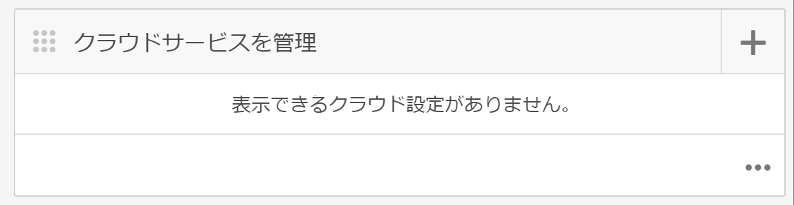
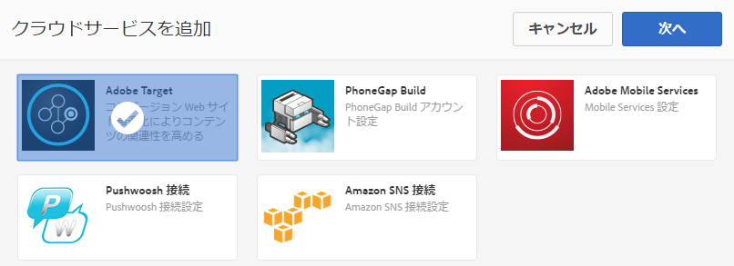
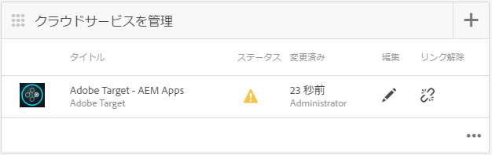
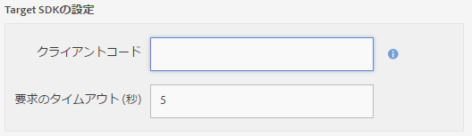
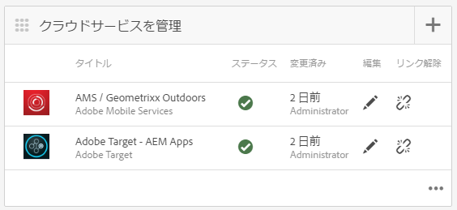

# Adobe Target クラウドサービスの設定 {#configuring-adobe-target-cloud-service}

>[!NOTE]
>
>単一ページアプリケーションフレームワークを基にしたクライアント側レンダリング（React など）が必要なプロジェクトでは、SPA エディターを使用することをお勧めします。[詳細情報](/help/sites-developing/spa-overview.md)を参照してください。

>[!NOTE]
>
>This document is part of the [Getting Started with AEM Mobile](/help/mobile/getting-started-aem-mobile.md) Guide, a recommended starting point for AEM Mobile reference.

コンテンツ作成者がモバイルアプリ用のターゲットコンテンツの生成を開始するには、次の手順を実行する必要があります。ユーザーとグループに適した権限のセットを取得し、クラウドサービスを作成し、アクティビティのアプリケーションを設定し、最後にコンテンツを生成します。

The assumption going forward is that the [AEM Mobile Hybrid Reference Application](https://github.com/Adobe-Marketing-Cloud-Apps/aem-mobile-hybrid-reference) has been successfully deployed and accessible via the AEM Mobile Dashboard.

## 権限 {#permissions}

Users that need access to the personalization console need to be part of the `target-activity-authors` group. ユーザーおよびグループのセットアップの一環として、target-activity-authors グループを apps-admins グループに追加することをお勧めします。target-activity-authorsグループを追加すると、ユーザーはパーソナライゼーションナビゲーションメニューエントリを表示できます。

パーソナライゼーション管理コンソールへのアクセス権を付与するユーザーまたはグループを target-activity-authors グループに追加し忘れると、パーソナライゼーションコンソールがユーザーに表示されません。

## クラウドサービス {#cloud-services}

モバイルアプリケーションでターゲットコンテンツを機能させるには、次の2つのサービスを設定する必要があります。Adobe targetサービスとAdobe Mobile Servicesサービス。 Adobe targetサービスは、クライアントの要求を処理し、パーソナライズされたコンテンツを返すためのエンジンを提供します。 Adobe Mobile Servicesサービスは、AMS Cordovaプラグインで使用されるADBMobileConfig.jsonファイルを介して、アドビのサービスとモバイルアプリケーションとの接続を提供します。 AEM mobileダッシュボードから、2つのサービスを追加することで、アプリを設定できます。

## Adobe Target クラウドサービス {#adobe-target-cloud-service}

AEM Mobile ダッシュボードで、「クラウドサービスを管理」を探し、+ ボタンをクリックします。

クラウドサービスを追加ウィザードで、「Adobe Target」クラウドサービスカードを選択し、「次へ」をクリックします。

「設定を選択」ドロップダウンでは、新しい設定を作成することも、既存の設定を選択することもできます。新しい設定を作成するには、ドロップダウンから[設定の作成]を選択します。 Target設定のタイトルを入力します。 Targetアカウントに関連付けられているクライアントコード、電子メール、パスワードを入力します。 これらのフィールドの値が不明な場合は、Adobe targetサポートにお問い合わせください。 「検証」ボタンをクリックして、資格情報を検証します。検証が完了したら、「送信」ボタンをクリックして、クラウドサービスを作成します。

作成されたクラウドサービスは、ウィザードによって自動的にモバイルアプリケーションと関連付けられます。cq:cloudserviceconfigsプロパティの値は、appsグループノードのjcr:contentノードに設定されます。 ハイブリッドアプリのサンプルでは、/etc/cloudservices/testandtarget/adobe-target—aem-apps/frameworkに配置された自動生成フレームワークノードを指す値を使用して、/content/mobileapps/hybrid-reference-app/jcr:contentに設定されます。 フレームワークノードには、デフォルトで設定される 2 つのプロパティ（gender および age）があります。フレームワークは AEM のプレビューのみで使用され、デバイスには影響しません。

ウィザードを完了すると、クラウドサービスを管理タイルに Target クラウドサービスが表示されますが、Adobe Mobile Services アカウントがないという警告が示されています。

## Adobe Mobile Services {#adobe-mobile-service}

Adobe Mobile Services（AMS）アカウントもアプリケーションにリンクする必要があります。AMS サービスは、Target クライアントコード情報を格納する必須の ADBMobileConfig.json ファイルを提供します。AMSアカウントとの関連付けを作成する前に、AMSアカウントに対する権限を持つユーザーがAMSアカウントを変更する必要があります。

### クライアントコード {#client-code}

To login to the AMS services visit [https://mobilemarketing.adobe.com](https://mobilemarketing.adobe.com/), select the mobile application and click the settings. 「SDK targetオプション」フィールドを探し、フィールドにクライアントコードを配置して、「保存」をクリックします。

クライアントコードをモバイルアプリケーションと関連付けると、Adobe Mobile ダッシュボードで AMS クラウドサービスを設定する際に、サービスの設定が ADBMobileConfig.json ファイルから提供されます。

### Adobe Mobile Services クラウドサービス {#adobe-mobile-service-could-service}

AMS を設定したら、次は Adobe Mobile ダッシュボードでモバイルアプリケーションを関連付けます。AEM Mobile ダッシュボードで、「クラウドサービスを管理」を探し、+ ボタンをクリックします。

「Adobe Mobile Services」カードを選択し、「次へ」をクリックします。

「作成または選択」ウィザードステップで、「Mobile Service」ドロップダウンを選択し、「設定を作成」項目を選択します。タイトル、会社名、ユーザー名、パスワードを入力し、適切なデータセンターを選択します。 これらの値が不明な場合は、Adobe Mobile Service管理者に問い合わせて取得してください。 すべてのフィールドに入力したら、「検証」ボタンをクリックします。 検証プロセスはAMSに進み、アカウントの資格情報を検証し、検証に成功すると、関連するモバイルアプリケーションのリストが入力され、ドロップダウンから関連するモバイルアプリケーションを選択します。 「送信」ボタンをクリックして、ウィザードを完了します。 設定データと、アプリケーションに関連付けられた解析を取得するには、このプロセスに少し時間がかかる場合があります。 プロセスが完了したら、モーダルから「完了」ボタンをクリックして、Adobe Mobile Dashboardに戻ります。

Mobile ダッシュボードに戻ると、クラウドサービスを管理タイルに AMS クラウドサービスが表示されます。また、[指標の分析]タイルにはライフサイクルレポートが表示されます。

## Target のコンテンツ同期ハンドラー {#target-content-sync-handlers}

ユーザーのデバイスにコンテンツを配信するには、AEM コンテンツ作成者が作成したオファーをレンダリングすることにより、コンテンツを生成します。ターゲットオファーのレンダリングを処理するために、オファーを処理する新しいコンテンツ同期ハンドラーが用意されています。 Using the Hybrid Reference Application as our sample, the en (english) content package contains the ContentSyncConfig with a [mobileappoffers](https://github.com/Adobe-Marketing-Cloud-Apps/aem-mobile-hybrid-reference/blob/master/aem-package/content-author/src/main/content/jcr_root/content/mobileapps/hybrid-reference-app/en/_jcr_content/pge-app/app-config-dev/targetOffers/.content.xml) handler. オファーをデバイスにレンダリングするには、次の手順が非常に重要です。mobileappofersハンドラーには、アプリケーションに使用するパーソナライゼーションアクティビティへのパスを識別するpathプロパティがあります。

For example if there is an activity that is located at */content/campaigns/hybridref* copy this path and paste it as the value to the *path* property of the mobileappoffers handler.

Hybrid Reference App の場合、2 つの mobileappoffers ハンドラーがあり、1 つは開発用、もう 1 つは実稼動用です。

mobileappoffers ハンドラーの path プロパティでアクティビティのパスを設定したら、ハンドラーを保存します。ハンドラーは、モバイルデバイス用のオファーのレンダリングを開始する準備が整いました。

### レンダリングモード {#render-mode}

パブリッシュセットアップと開発セットアップでは、mobileappoffers ハンドラーの設定が異なります。For publish setups there is a property called *renderMode* with a value of *publish* set on the cq:ContentSyncConfig node. mobileappofersハンドラーはrenderModeを参照し、publishに設定した場合は、作成されるmbox IDを変更します。 デフォルトでは、AEMによって作成されるmboxには —author値がmbox IDに付加されます。 これは、アクティビティが公開されていないこと、およびオファーの解決に未公開のキャンペーンを使用する必要があることを示します。

Adobe Mobile ダッシュボードでコンテンツがステージングされると、ステージングされたコンテンツは、実稼動の準備ができたコンテンツとみなされ、開発用でないコンテンツ同期設定を使用してレンダリングされます。この方法でレンダリングすると、—authorがすべてのmbox IDから削除され、Targetサーバーで公開済みのアクティビティが使用可能になることが期待されます。 ステージングされたコンテンツをテストする前に、アクティビティが公開されていることを確認します。

## コンテンツの作成 {#creating-content}

クラウドサービスが作成され、mobileappoffers ハンドラーが設定されたので、コンテンツ作成者はターゲットエクスペリエンスの生成を開始できます。
