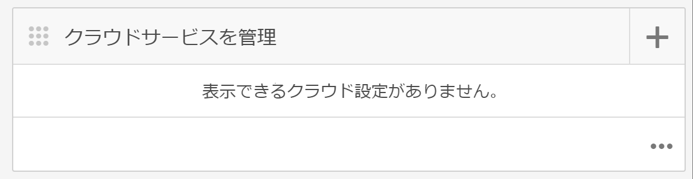
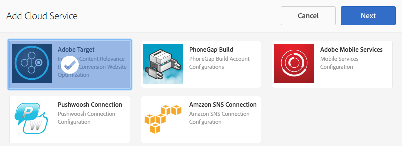
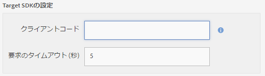
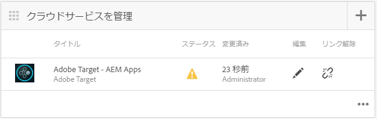
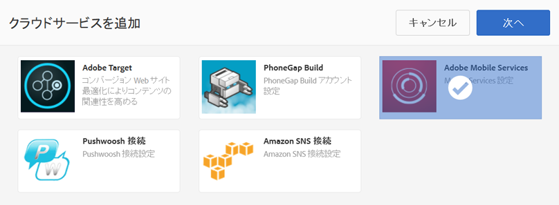

# Adobe Target Cloud Service の設定 {#configuring-adobe-target-cloud-service}

{{ue-over-mobile}}

>[!NOTE]
>
>このドキュメントは、[Adobe Experience Manager（AEM）モバイル入門ガイド &#x200B;](/help/mobile/getting-started-aem-mobile.md) ガイドの一部です。このガイドは、AEM Mobile リファレンスの出発点として推奨されます。

コンテンツオーサーがモバイルアプリのターゲットコンテンツを生成するには、いくつかのステップを実施する必要があります。ユーザーとグループに対する適切な権限セット、クラウドサービスの作成、アクティビティ用のアプリケーションの設定、コンテンツの生成です。

今後の前提は、[AEM Mobile ハイブリッド参照アプリケーション &#x200B;](https://github.com/Adobe-Marketing-Cloud-Apps/aem-mobile-hybrid-reference)が正常にデプロイされ、AEM Mobile ダッシュボードを介してアクセスできるようになったことです。

## 権限 {#permissions}

パーソナライゼーションコンソールにアクセスする必要があるユーザーは、`target-activity-authors` グループに属している必要があります。 ユーザーおよびグループ設定の一部として、target-activity-groupをapps-admins グループに追加することをお勧めします。 target-activity-authors グループを追加すると、Personalization ナビゲーションメニューエントリを表示できるようになります。

personalization Admin Consoleにアクセスするユーザーまたはグループをtarget-activity-authors グループに追加し忘れると、ユーザーはpersonalization consoleを表示できなくなります。

## クラウドサービス {#cloud-services}

モバイルアプリケーションでターゲットコンテンツを機能させるには、Adobe Target サービスとAdobe Mobile Services サービスの2つのサービスを設定する必要があります。 Adobe Target サービスは、クライアントリクエストを処理し、パーソナライズされたコンテンツを返すためのエンジンを提供します。 Adobe Mobile Services サービスは、AMS Cordova プラグインによって使用されるADBMobileConfig.json ファイルを介して、Adobe サービスとモバイルアプリケーション間の接続を提供します。 AEM Mobile ダッシュボードから、2つのサービスを追加してアプリケーションを設定できます。

## Adobe Target Cloud Service {#adobe-target-cloud-service}

AEM Mobile ダッシュボードから、「クラウドサービスを管理」を探し、「+」ボタンをクリックします。

Cloud Serviceを追加ウィザードで、「Adobe Target」クラウドサービスカードを選択し、「次へ」をクリックします。

「設定を選択」ドロップダウンから、設定を作成するか、既存の設定から選択できます。 設定を作成するには、ドロップダウンから「設定を作成」を選択します。 Target設定のタイトルを入力します。 Target アカウントに関連付けられているクライアントコード、電子メール、パスワードを入力します。 これらのフィールドの値がわからない場合は、Adobe Target サポートにお問い合わせください。 「検証」ボタンをクリックして、資格情報を検証します。 確認が完了したら、「送信」ボタンをクリックしてクラウドサービスを作成します。

作成されたクラウドサービスは、ウィザードを介してモバイルアプリケーションに自動的に関連付けられます。 cq:cloudserviceconfigs プロパティ値は、apps グループノードのjcr:content ノードで設定されます。 ハイブリッドアプリサンプルの場合、自動生成されるフレームワークノードを指す値が/etc/cloudservices/testandtarget/adobe-target—aem-apps/frameworkである/content/mobileapps/hybrid-reference-app/jcr:contentに設定されます。 フレームワークノードには、デフォルトで性別と年齢の2つのプロパティが設定されています。 このフレームワークはAEMのプレビューでのみ使用され、デバイスには影響しません。

ウィザードが終了すると、Cloud Serviceの管理タイルにTarget クラウドサービスが含まれますが、Adobe Mobile Service アカウントが見つからない場合の警告が表示されます。

## Adobe Mobile Service {#adobe-mobile-service}

Adobe Mobile Services （AMS）アカウントをアプリケーションにリンクする必要もあります。AMS サービスは、Target クライアントコード情報を含む必要なADBMobileConfig.json ファイルを提供します。 AMS アカウントとの関連付けを作成する前に、AMS アカウントは、AMSに対する権限を持つユーザーによって変更される必要があります。

### クライアントコード {#client-code}

AMS サービスにログインするには、[https://mobilemarketing.adobe.com](https://mobilemarketing.adobe.com/)にアクセスし、モバイルアプリケーションを選択して、設定をクリックします。 「SDK Target オプション」フィールドを探し、クライアントコードをフィールドに配置して「保存」をクリックします。

クライアントコードがモバイルアプリケーションに関連付けられたため、AMS クラウドサービスがAdobe モバイルダッシュボードを介して設定されると、サービス設定の設定がADBMobileConfig.json ファイルを介して配信されます。

### Adobe Mobile Serviceは {#adobe-mobile-service-could-service}

AMSが設定されたので、次はAdobe Mobile Dashboardでモバイルアプリケーションを関連付けます。 AEM Mobile ダッシュボードから、「クラウドサービスを管理」を探し、「+」ボタンをクリックします。

Adobe Mobile Services カードを選択し、「次へ」をクリックします。

作成または選択ウィザードの手順で、「モバイルサービス」ドロップダウンを選択し、「設定を作成」エントリを選択します。 タイトル、会社、ユーザー名、パスワードを入力し、適切なデータセンターを選択します。 これらの値がわからない場合は、Adobe Mobile Service管理者に問い合わせて値を取得してください。 すべてのフィールドに入力したら、**確認**&#x200B;をクリックします。 検証プロセスはAMSに送信され、アカウントの資格情報を検証し、検証が成功すると、関連するモバイルアプリケーションをドロップダウンから選択する場所にモバイルアプリケーションのリストが入力されます。 「送信」ボタンをクリックして、ウィザードを完了します。 設定データおよびアプリケーションに関連する分析を取得するには、少し時間がかかる場合があります。 プロセスが完了したら、モーダルから「**完了**」をクリックして、Adobe Mobile Dashboardに戻ります。

モバイルダッシュボードに戻ると、クラウドサービスの管理タイルにAMS クラウドサービスが含まれています。 また、「指標を分析」タイルにはライフサイクルレポートが入力されます。

## Target コンテンツ同期ハンドラー {#target-content-sync-handlers}

ユーザーのデバイスにコンテンツを配信するには、AEM コンテンツ作成者が作成したオファーをレンダリングしてコンテンツを生成します。 ターゲットオファーのレンダリングを処理するために、オファーを処理する新しいコンテンツ同期ハンドラーがあります。 ハイブリッド参照アプリケーションをサンプルとして使用すると、en （英語）コンテンツパッケージには、[mobileappoffers](https://github.com/Adobe-Marketing-Cloud-Apps/aem-mobile-hybrid-reference/blob/master/aem-package/content-author/src/main/content/jcr_root/content/mobileapps/hybrid-reference-app/en/_jcr_content/pge-app/app-config-dev/targetOffers/.content.xml) ハンドラーを持つContentSyncConfigが含まれます。 次のステップは、オファーをデバイスにレンダリングする際に重要です。 mobileappoffers ハンドラーには、アプリケーションに使用されるパーソナライゼーションアクティビティへのパスを識別するパスプロパティがあります。

例えば、*/content/campaigns/hybridref*&#x200B;にアクティビティがある場合、このパスをコピーし、値としてmobileappoffers ハンドラーの&#x200B;*path* プロパティに貼り付けます。

ハイブリッドリファレンスアプリケーションの場合、開発用と実稼動用に2つのmobileappoffers ハンドラーがあります。

アクティビティのパスをmobileappoffers ハンドラーのpath プロパティで設定したら、ハンドラーを保存します。 ハンドラーは、モバイルデバイスのオファーのレンダリングを開始する準備ができました。

### レンダーモード {#render-mode}

mobileappoffers ハンドラーは、公開設定と開発設定で異なる設定をします。 パブリッシュ設定の場合、*renderMode*&#x200B;というプロパティがあり、値は&#x200B;*publish*&#x200B;で、cq:ContentSyncConfig ノードに設定されています。 mobileappoffers ハンドラーはrenderModeを参照し、パブリッシュに設定されている場合は、作成されるmbox IDを編集します。 デフォルトでは、AEMで作成されたmboxには、mbox idに – author値が追加されます。 これは、アクティビティが公開されていないことを識別し、オファーの解決に非公開キャンペーンを使用する必要があります。

コンテンツがAdobe Mobile Dashboardを介してステージングされる場合、ステージングされたコンテンツは実稼動対応コンテンツと見なされ、非開発コンテンツ同期設定を介してレンダリングされます。 この方法でレンダリングすると、—authorがすべてのmbox IDから削除され、公開されたアクティビティがTarget サーバーで利用できるようになることを期待します。 ステージング済みコンテンツをテストする前に、アクティビティが公開されていることを確認します。

## コンテンツの作成 {#creating-content}

クラウドサービスが作成され、mobileappoffers ハンドラーが設定されたので、コンテンツオーサーはターゲットを絞ったエクスペリエンスの生成を開始できるようになりました。
