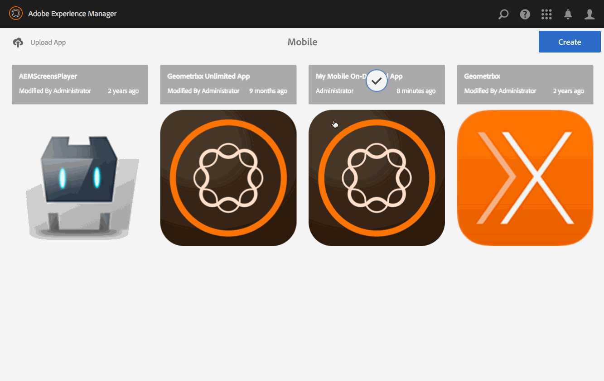

# プリフライトによるプレビュー {#previewing-with-preflight}

このページでは、プリフライトアプリを使用したプレビューについて説明します。

{{ue-over-mobile}}

次のアクションは、アプリケーション全体で実行されます。

Mobile On-Demand プリフライトアプリを使用すると、アクセス権を持つすべてのプロジェクトを表示できます。 プロジェクトを選択したら、ブラウジングページや記事を含むアプリのコンテンツをプレビューして、アプリがさまざまなデバイスでどのように表示され、パフォーマンスを確認できます。

>[!NOTE]
>
>プリフライトアプリは、本質的にはPhoneGap Enterprise ビューアに似ています。

## プリフライトによるプレビュー {#previewing-with-preflight-1}

1. モバイル版から、カタログからMobile On-Demand アプリを選択します。
1. 省略記号（。..）をクリックします **記事の管理** （またはバナー/コレクション）タイルから。
1. アクションバーから「**プリフライト**」を選択します。
1. ダイアログから「**プリフライトをアクティブ化**」をクリックします。
1. これで、アプリのプレビューの準備がモバイルオンデマンドのプリフライトアプリで整いました。

>[!NOTE]
>
>AEM Preflight アプリは、コンテンツのプレビューとページの参照に使用されます。 プリフライトアプリについて詳しくは、[こちら](https://helpx.adobe.com/digital-publishing-solution/help/aem-mobile-end-of-life-faq.html)をクリックしてください。
>

### 一歩先を行く {#getting-ahead}

コンテンツのオーサリングについて詳しくは、次のリソースを参照して、AEM Mobile アプリケーションでコンテンツを作成および管理してください。

* [AEM Mobile アプリケーションのダッシュボード](/help/mobile/mobile-apps-ondemand-application-dashboard.md)
* [コンテンツ管理](/help/mobile/mobile-apps-ondemand-manage-content-ondemand.md)

## その他のリソース {#additional-resources}

AEM Mobile On-demand Services アプリの作成に関するその他の2つの役割と責任について詳しくは、次のリソースを参照してください。

* [AEM Mobile On-demand Services向けAEM コンテンツの開発](/help/mobile/aem-mobile-on-demand.md)
* [AEM Mobile On-demand Services アプリ用AEM コンテンツのオーサリング](/help/mobile/mobile-apps-ondemand.md)
