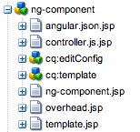

# モバイルアプリのページテンプレート {#page-templates-for-mobile-apps}

{{ue-over-mobile}}

## モバイルアプリのページテンプレート {#page-templates-for-mobile-apps-1}

アプリ用に作成するページコンポーネントは、/libs/mobileapps/components/angular/ng-page コンポーネント（[&#x200B; ローカルサーバー上のCRXDE Liteで開く](http://localhost:4502/crx/de/index.jsp#/libs/mobileapps/components/angular/ng-page)）に基づいています。 このコンポーネントには、コンポーネントが継承またはオーバーライドする次のJSP スクリプトが含まれています。

* ng-page.jsp
* head.jsp
* body.jsp
* angular-app-module.js.jsp
* angular-route-fragment.js.jsp
* angular-app-controllers.js.jsp
* controller.js.jsp
* template.jsp
* angular-module-list.js.jsp
* header.jsp
* footer.jsp
* js_clientlibs.jsp
* css_clientlibs.jsp

### ng-page.jsp {#ng-page-jsp}

`applicationName` プロパティを使用してアプリケーションの名前を決定し、pageContextを介して公開します。

head.jspとbody.jspが含まれます。

### head.jsp {#head-jsp}

アプリページの`<head>`要素を書き出します。

アプリのビューポートメタプロパティを上書きする場合は、上書きするファイルです。

ベストプラクティスに従って、アプリにはクライアントライブラリのcss部分がヘッドに含まれ、JSはクロージング &lt; `body>`要素に含まれます。

### body.jsp {#body-jsp}

Angular ページの本文は、wcmModeが検出されたか（WCMMode.DISABLED!=）に応じて異なってレンダリングされ、ページがオーサリング用に開かれているか、公開済みページとして開かれているかを判断します。

**作成者モード**

オーサーモードでは、各ページは個別にレンダリングされます。 Angularでは、ページ間のルーティングは処理されず、ページのコンポーネントを含む部分的なテンプレートを読み込むために使用されるng ビューも使用されません。 代わりに、ページテンプレート（template.jsp）のコンテンツは、`cq:include` タグを介してサーバーサイドに含まれます。

この方法を使用すると、オーサー機能（段落システム、Sidekick、デザインモードでのコンポーネントの追加や編集など）を変更することなく機能させることができます。 アプリなどのクライアントサイドのレンダリングに依存するページは、AEM オーサーモードでは適切に機能しません。

template.jsp インクルードは、`ng-controller` ディレクティブを含む`div`要素でラップされます。 この構造により、DOM コンテンツとコントローラとのリンクが可能になる。 したがって、クライアント側で自分自身をレンダリングするページは失敗しますが、そのようなことが起こる個々のコンポーネントは正常に動作します（以下のコンポーネントの節を参照）。

```xml
<div ng-controller="<c:out value="${controllerNameStripped}"/>">
      <cq:include script="template.jsp"/>
</div>
```

**公開モード**

公開モード（アプリがコンテンツ同期を使用して書き出された場合など）では、すべてのページが単一ページアプリ（SPA）になります。 （SPAについて学ぶには、Angular チュートリアル、特に[https://docs.angularjs.org/tutorial/step_07](https://docs.angularjs.org/tutorial/step_07)を使用してください）。

SPAには1つのHTML ページ（`<html>`要素を含むページ）しかありません。 このページは「レイアウトテンプレート」と呼ばれます。 Angularの用語では、「アプリケーションのすべてのビューに共通のテンプレート」です。 このページを「トップレベルのアプリページ」と見なします。 慣例として、トップレベルのアプリページは、ルートに最も近い（リダイレクトではない）アプリケーションの`cq:Page` ノードです。

アプリの実際のURIは公開モードでは変更されないため、このページからの外部アセットへの参照では相対パスを使用する必要があります。 したがって、書き出す画像をレンダリングする際に、このトップレベルページを考慮した特別な画像コンポーネントが提供されます。

SPAとして、このレイアウトテンプレートページは単にng-view ディレクティブを持つdiv要素を生成します。

```xml
 <div ng-view ng-class="transition"></div>
```

Angular route サービスは、この要素を使用して、現在のページ（template.jspに含まれる）のオーサリング可能なコンテンツを含む、アプリ内のすべてのページのコンテンツを表示します。

body.jsp ファイルには、空のheader.jspとfooter.jspが含まれています。 すべてのページに静的コンテンツを提供する場合は、アプリでこれらのスクリプトを上書きできます。

最後に、サーバーで生成される2つの特殊なJS ファイルを含むjavascript clientlibが&lt;body>要素の下部に含まれます（*&lt;page name>*.angular-app-module.jsと&#x200B;*&lt;page name>*.angular-app-controllers.js）。

### angular-app-module.js.jsp {#angular-app-module-js-jsp}

このスクリプトは、アプリケーションのAngular モジュールを定義します。 このスクリプトの出力は、テンプレートのコンポーネントの残りの部分がng-page.jspの`html`要素を介して生成するマークアップにリンクされています。この要素には、次の属性が含まれます。

```xml
ng-app="<c:out value='${applicationName}'/>"
```

この属性は、このDOM エレメントの内容が次のモジュールにリンクされていることをAngularに示します。 このモジュールは、ビュー（AEMではcq:Page リソースになります）を対応するコントローラにリンクします。

このモジュールは、`wcmMode`変数をスコープに公開し、Content Sync更新ペイロードを取得するURIを設定する`AppController`という名前のトップレベルコントローラーも定義します。

最後に、このモジュールは、それぞれの子孫ページ（それ自体を含む）を反復処理し、各ページのルートフラグメントの内容を（angular-route-fragment.js セレクターと拡張機能を介して）レンダリングします。これには、Angularの\$routeProviderの設定エントリとして含まれます。 つまり、\$routeProviderは、特定のパスが要求されたときにレンダリングするコンテンツをアプリに指示します。

### angular-route-fragment.js.jsp {#angular-route-fragment-js-jsp}

このスクリプトは、次の形式を取る必要があるJavaScript フラグメントを生成します。

```
.when('/<path>', {
    templateUrl: '<path to template>',
    controller: '<controller name>'
})
```

このコードは、&#39;/&lt;path>&#39;が`templateUrl`のリソースによって処理され、`controller`によってワイヤー接続されることを$routeProvider （angular-app-module.js.jspで定義）に示します（次に説明します）。

必要に応じて、このスクリプトを上書きして、変数を含むより複雑なパスを処理できます。 この例は、AEMと共にインストールされる/apps/geometrixx-outdoors-app/components/angular/ng-template-page/angular-route-fragment.js.jsp スクリプトで確認できます。

```xml
// note the :id suffix on the path
.when('<c:out value="${resource.path}"/>/:id', {
    templateUrl: '<c:out value="${relativeResourcePath}"/>.template.html',
    controller: '<c:out value="${controllerNameStripped}"/>'
})
```

### angular-app-controllers.js.jsp {#angular-app-controllers-js-jsp}

Angularでは、コントローラは\$スコープ内の変数をワイヤー接続し、それらをビューに公開します。 angular-app-controllers.js.jsp スクリプトは、angular-app-module.js.jspで示すパターンに従います。このパターンでは、それぞれの子孫ページ（それ自体を含む）を反復処理し、各ページで定義されるコントローラーフラグメントを（controller.js.jspを介して）出力します。 定義するモジュールは`cqAppControllers`と呼ばれ、ページコントローラーを使用できるように、トップレベルのアプリモジュールの依存関係としてリストする必要があります。

### controller.js.jsp {#controller-js-jsp}

controller.js.jsp スクリプトは、各ページのコントローラーフラグメントを生成します。 このコントローラーフラグメントは次の形式を取ります。

```
.controller('<c:out value="${controllerNameStripped}"/>', ['$scope', '$http',
    function($scope, $http) {
        var data = $http.get('<c:out value="${relativeResourcePath}"/>.angular.json' + cacheKiller);

        // component fragments which consume the contents of `data` go here
    }
])
```

`data`変数には、Angular `$http.get` メソッドから返されたpromiseが割り当てられます。 このページに含まれる各コンポーネントは、必要に応じて、（angular.json.jsp スクリプトを介して）一部の.json コンテンツを使用できるようにし、解決時にこのリクエストの内容に基づいて処理を行うことができます。 ファイルシステムにアクセスするだけなので、モバイルデバイスでのリクエストは非常に高速です。

この方法でコンポーネントをコントローラーの一部にするには、/libs/mobileapps/components/angular/ng-component コンポーネントを拡張し、`frameworkType: angular` プロパティを含める必要があります。

### template.jsp {#template-jsp}

body.jsp セクションで最初に導入されたtemplate.jspには、ページのparsysが単純に含まれています。 公開モードでは、このコンテンツは直接参照され（&lt;page-path>.template.html）、\$routeProviderで設定されたtemplateUrlを介してSPAに読み込まれます。

このスクリプトのparsysは、任意のタイプのコンポーネントを受け入れるように設定できます。 ただし、（SPAではなく）従来のweb サイト用に構築されたコンポーネントを扱う場合は、注意が必要です。 例えば、基盤画像コンポーネントは、アプリ内のアセットを参照するように設計されていないため、トップレベルのアプリページでのみ正しく機能します。

### angular-module-list.js.jsp {#angular-module-list-js-jsp}

このスクリプトは、トップレベルのAngular アプリモジュールのAngular依存関係を単に出力します。 これはangular-app-module.js.jspで参照されています。

### header.jsp {#header-jsp}

アプリの上部に静的コンテンツを配置するスクリプト。 このコンテンツは最上位ページに含まれており、ビューの範囲外にあります。

### footer.jsp {#footer-jsp}

アプリの下部に静的コンテンツを配置するスクリプト。 このコンテンツは最上位ページに含まれており、ビューの範囲外にあります。

### js_clientlibs.jsp {#js-clientlibs-jsp}

JavaScript クライアントライブラリを含めるには、このスクリプトを上書きします。

### css_clientlibs.jsp {#css-clientlibs-jsp}

CSS クライアントライブラリを含めるには、このスクリプトを上書きします。

## アプリコンポーネント {#app-components}

アプリコンポーネントは、AEM インスタンス（パブリッシュまたはオーサー）で動作するだけでなく、アプリケーションコンテンツがContent Syncを介してファイルシステムに書き出される場合にも動作する必要があります。 したがって、コンポーネントには次の特性が含まれている必要があります。

* PhoneGap アプリケーション内のすべてのアセット、テンプレート、およびスクリプトは、比較的参照する必要があります。
* AEM インスタンスがオーサーモードまたはパブリッシュモードで動作している場合は、リンクの処理が異なります。

### 相対Assets {#relative-assets}

PhoneGap アプリケーション内の任意のアセットのURIは、プラットフォームごとに異なるだけでなく、アプリの各インストールで一意です。 例えば、iOS Simulatorで実行中のアプリの次のURIに注意してください。

`file:///Users/userId/Library/Application%20Support/iPhone%20Simulator/7.0.3/Applications/24BA22ED-7D06-4330-B7EB-F6FC73251CA3/Library/files/www/content/phonegap/geometrixx/apps/ng-geometrixx-outdoors/en/home.html`

パスに「24BA22ED-7D06-4330-B7EB-F6FC73251CA3」というGUIDをメモします。

PhoneGap デベロッパーとして、関係するコンテンツはwww ディレクトリの下にあります。 アプリアセットにアクセスするには、相対パスを使用します。

この問題を複合するために、PhoneGap アプリケーションではシングルページアプリ（SPA）パターンを使用して、ベース URI （ハッシュを除く）が変更されないようにします。 したがって、**を参照するすべてのアセット、テンプレート、またはスクリプトは、トップレベルのページに関連している必要があります。** 最上位ページでは、`*<name>*.angular-app-module.js`および`*<name>*.angular-app-controllers.js`によってAngular ルーティングとコントローラが初期化されます。 このページは、*sling:redirectを*拡張しないリポジトリのルートに最も近いページである必要があります。

相対パスを扱うために、いくつかのヘルパーメソッドを使用できます。

* FrameworkContentExporterUtils.getTopLevelAppResource
* FrameworkContentExporterUtils.getRelativePathToRootLevel
* FrameworkContentExporterUtils.getPathToAsset

使用例を確認するには、/libs/mobileapps/components/angularにあるmobileapps ソースを開きます。

### リンク {#links}

すべてのWCM モードをサポートするには、リンクで`ng-click="go('/path')"`関数を使用する必要があります。 この関数は、リンクアクションを正しく決定するためにスコープ変数の値に依存します。

```xml
<c:choose><c:when test="${wcmMode}">
    <%-- WCMMode is enabled - page is being rendered in AEM --%>
    $scope.wcmMode = true;
</c:when><c:otherwise>
    <%-- WCMMode is disabled --%>
    $scope.wcmMode = false;
</c:otherwise></c:choose>
```

`$scope.wcmMode == true`の場合、URLのパスやページ部分が変更されるように、通常の方法で各ナビゲーションイベントを処理します。

または、`$scope.wcmMode == false`の場合、各ナビゲーションイベントによってURLのハッシュ部分が変更され、Angular ngRoute モジュールによって内部で解決されます。

### コンポーネントスクリプトの詳細 {#component-script-details}



#### ng-component.jsp {#ng-component-jsp}

このスクリプトは、編集モードが検出されたときに、コンポーネントの内容または適切なプレースホルダーを表示します。

#### template.jsp {#template-jsp-1}

template.jsp スクリプトは、コンポーネントのマークアップをレンダリングします。 問題のコンポーネントがAEMから抽出されたJSON データ（「ng-text」: /libs/mobileapps/components/angular/ng-text/template.jspなど）によって駆動される場合、このスクリプトは、ページのコントローラースコープによって公開されたデータでマークアップを接続する責任があります。

ただし、パフォーマンス要件により、クライアント側のテンプレート（データバインディングとも呼ばれます）を実行しないことが指示されることがあります。 この場合、コンポーネントのマークアップをサーバーサイドにレンダリングするだけで、ページテンプレートコンテンツに含まれます。

#### overhead.jsp {#overhead-jsp}

JSON データによって駆動されるコンポーネント（「ng-text」: /libs/mobileapps/components/angular/ng-textなど）では、overhead.jspを使用してtemplate.jspからすべてのJava コードを削除できます。 その後、template.jspから参照され、リクエストで公開されるすべての変数を使用できます。 この戦略は、プレゼンテーションからロジックを分離することを奨励し、新しいコンポーネントが既存のコンポーネントから派生する場合にコピーおよびペーストする必要があるコードの量を制限します。

#### controller.js.jsp {#controller-js-jsp-1}

AEM ページテンプレートで説明されているように、各コンポーネントはJavaScript フラグメントを出力して、`data` プロミスによって公開されたJSON コンテンツを使用できます。 Angularの規則に従って、コントローラはスコープへの変数の割り当てにのみ使用してください。

#### angular.json.jsp {#angular-json-jsp}

このスクリプトは、ng-pageを拡張するページごとに書き出されるページ全体の&#39;&lt;page-name>.angular.json&#39; ファイルにフラグメントとして含まれます。 このファイルでは、コンポーネント開発者は、コンポーネントに必要なJSON構造を公開できます。 「ng-text」の例では、この構造は単にコンポーネントのテキストコンテンツと、コンポーネントにリッチテキストが含まれているかどうかを示すフラグを含みます。

Geometrixx outdoors アプリの製品コンポーネントは、より複雑な例です（/apps/geometrixx-outdoors-app/components/angular/ng-product）。

```xml
{
    "content-par/ng-product": {
        "items": [{
            "name": "Cajamara",
            "description": "Bike",
            "summaryHTML": "",
            "price": "$610.00",
            "SKU": "eqsmcj",
            "numberOfLikes": "0",
            "numberOfComments": "0"
        }]
    },
    "content-par/ng-product/ng-image": {
        "items": [{
            "hasContent": true,
            "imgSrc": "home/products/eq/eqsm/eqsmcj/jcr_content/content-par/ng-product/ng-image.img.jpg/1377771306985.jpg",
            "description": "",
            "alt": "Cajamara",
            "title": "Cajamara",
            "hasLink": false,
            "linkPath": "",
            "attributes": [{
                "attributeName": "class",
                "attributeValue": "cq-dd-image"
            }]
        }]
    }
}
```

## CLI Assets ダウンロードの内容 {#contents-of-the-cli-assets-download}

Apps コンソールからCLI アセットをダウンロードして特定のプラットフォーム用に最適化し、PhoneGap コマンドライン統合（CLI） APIを使用してアプリを構築します。 ローカルファイルシステムに保存するZIP ファイルの内容には、次の構造があります。

```xml
.cordova/
  |- hooks/
     |- after_prepare/
     |- before_platform_add/
     |- Other Hooks
plugins/
www/
  |- config.xml
  |- index.html
  |- res/
  |- etc/
  |- apps/
  |- content/
  |- package.json
  |- package-update.json
```

### .cordova {#cordova}

これは、現在のOS設定によっては表示されない隠しディレクトリです。 含まれているアプリフックを変更する予定がある場合は、このディレクトリが表示されるようにOSを設定する必要があります。

#### .cordova/hooks/ {#cordova-hooks}

このディレクトリには、[CLI フック &#x200B;](https://cordova.apache.org/docs/en/10.x/guide/appdev/hooks/)が含まれています。 hook ディレクトリのフォルダーには、ビルド中に正確なポイントで実行されるnode.js スクリプトが含まれています。

#### .cordova/hooks/after-platform_add/ {#cordova-hooks-after-platform-add}

after-platform_add ディレクトリには、`copy_AMS_Conifg.js` ファイルが含まれています。 このスクリプトは、Adobe Mobile Services Analyticsのコレクションをサポートするように設定ファイルをコピーします。

#### .cordova/hooks/after-prepare/ {#cordova-hooks-after-prepare}

after-prepare ディレクトリには、`copy_resource_files.js` ファイルが含まれています。 このスクリプトは、いくつかのアイコンをコピーし、画面の画像をプラットフォーム固有の場所にスプラッシュします。

#### .cordova/hooks/before_platform_add/ {#cordova-hooks-before-platform-add}

before_platform_add ディレクトリには、`install_plugins.js` ファイルが含まれています。 このスクリプトは、Cordova プラグイン識別子のリストを繰り返し実行し、検出したプラグイン識別子がまだ使用できないものをインストールします。

この方法では、Maven `content-package:install` コマンドが実行されるたびに、プラグインをAEMにバンドルしてインストールする必要はありません。 ファイルをSCM システムにチェックインする別の方法として、繰り返し作業を行う必要があります。

#### .cordova/hooks/Other Hook {#cordova-hooks-other-hooks}

必要に応じて他のフックを含めます。 次のフックを使用できます（Phonegap サンプル hello world アプリから提供されています）。

* after_build
* before_build
* after_compile
* before_compile
* after_docs
* before_docs
* after_emulate
* before_emulate
* after_platform_add
* before_platform_add
* after_platform_ls
* before_platform_ls
* after_platform_rm
* before_platform_rm
* after_plugin_add
* before_plugin_add
* after_plugin_ls
* before_plugin_ls
* after_plugin_rm
* before_plugin_rm
* after_prepare
* before_prepare
* after_run
* before_run

#### platforms/ {#platforms}

このディレクトリは、プロジェクトで`phonegap run <platform>` コマンドを実行するまで空です。 現在、`<platform>`は`ios`または`android`のいずれかです。

特定のプラットフォーム用にアプリを構築すると、対応するディレクトリが作成され、プラットフォーム固有のアプリコードが含まれます。

#### plugins/ {#plugins}

プラグインディレクトリには、`phonegap run <platform>` コマンドを実行した後、`.cordova/hooks/before_platform_add/install_plugins.js` ファイルにリストされている各プラグインが入力されます。 ディレクトリは最初は空です。

#### www/ {#www}

www ディレクトリには、アプリの外観と動作を実装するすべてのweb コンテンツ（HTML、JS、CSS ファイル）が含まれます。 後述の例外を除き、このコンテンツはAEMから送信され、Content Syncを介して静的フォームに書き出されます。

#### www/config.xml {#www-config-xml}

PhoneGap ドキュメント （`https://docs.phonegap.com`）では、このファイルを「グローバル設定ファイル」と呼んでいます。 config.xmlには、アプリの名前、アプリの「環境設定」（例えば、iOSのweb ビューでオーバースクロールが許可されているかどうかなど）、PhoneGap ビルドで使用される&#x200B;*のみ*&#x200B;のプラグイン依存関係など、多くのアプリプロパティが含まれています。

config.xml ファイルは、AEMの静的ファイルであり、Content Syncを介してそのまま書き出されます。

#### www/index.html {#www-index-html}

index.html ファイルは、アプリの開始ページにリダイレクトされます。

config.xml ファイルには、`content`要素が含まれています。

`<content src="content/phonegap/geometrixx/apps/ng-geometrixx-outdoors/en.html" />`

PhoneGap ドキュメント （`https://docs.phonegap.com`）では、この要素は「オプションの&lt;content>要素は、トップレベルのweb アセットディレクトリ内のアプリの開始ページを定義します。 デフォルト値はindex.htmlで、通常はプロジェクトの最上位のwww ディレクトリに表示されます。」

index.html ファイルが存在しない場合、PhoneGap ビルドは失敗します。 したがって、このファイルが含まれています。

#### www/res {#www-res}

res ディレクトリには、スプラッシュ画面の画像とアイコンが含まれています。 `copy_resource_files.js` スクリプトは、`after_prepare`のビルド フェーズ中に、ファイルをプラットフォーム固有の場所にコピーします。

#### www/etc {#www-etc}

AEMでは、/etc ノードに静的なclientlib コンテンツが含まれています。 etc ディレクトリには、Topcoat、AngularJSおよびGeometrixx ng-clientlibsall ライブラリが含まれます。

#### ww/apps {#www-apps}

apps ディレクトリには、スプラッシュページに関連するコードが含まれています。 AEM アプリのスプラッシュページのユニークな特徴は、ユーザーの操作なしでアプリを初期化することです。 したがって、アプリのclientlib コンテンツ（CSSとJSの両方）は、パフォーマンスを最大化するために最小限に抑えられています。

#### www/content {#www-content}

コンテンツディレクトリには、アプリのweb コンテンツの残りの部分が含まれます。 コンテンツには、次のファイルを含めることができますが、これらに限定されません。

* AEMで直接作成されるHTMLのページコンテンツ
* AEM コンポーネントに関連付けられた画像アセット
* サーバーサイドスクリプトによって生成されるJavaScript コンテンツ
* ページまたはコンポーネントコンテンツを記述するJSON ファイル

#### www/package.json {#www-package-json}

package.json ファイルは、**full** コンテンツ同期のダウンロードに含まれるファイルをリストするマニフェストファイルです。 このファイルには、コンテンツ同期ペイロードが生成されたタイムスタンプも含まれています（`lastModified`）。 このプロパティは、AEMからアプリの部分的な更新をリクエストする場合に使用されます。

#### www/package-update.json {#www-package-update-json}

このペイロードがアプリ全体のダウンロードである場合、このマニフェストにはファイルの正確なリストが`package.json`として含まれます。

ただし、このペイロードが部分的な更新である場合、`package-update.json`には、この特定のペイロードに含まれるファイルのみが含まれます。
