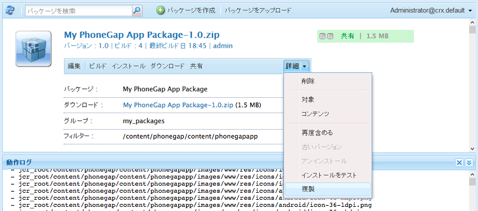
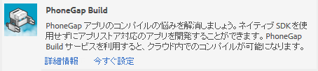

# モバイルアプリケーションのビルド{#building-mobile-applications}

>[!NOTE]
>
>単一ページアプリケーションフレームワークを基にしたクライアント側レンダリング（React など）が必要なプロジェクトでは、SPA エディターを使用することをお勧めします。[詳細情報](/help/sites-developing/spa-overview.md)

アプリケーションをビルドし、デバイスやシミュレーターにインストールして、テストを実行したり、App Store に公開したりできます。PhoneGap コマンドラインインターフェイスを使用してアプリケーションをローカルでビルドすることも、PhoneGap Build を使用してクラウドでビルドすることもできます。

GitHub から入手できるコードを使用してモバイルアプリケーションをビルドする方法についてステップバイステップで完全に解説した記事を[こちら](https://helpx.adobe.com/experience-manager/using/aem62_mobile.html)から参照できます。

## パブリッシュインスタンスへのアプリケーションの移動 {#moving-the-application-to-the-publish-instance}

パブリッシュインスタンスにアプリケーションファイルを移動すると、モバイルアプリケーションのインストール済みインスタンスにコンテンツ更新を提供したり、公開済みコンテンツを使用してアプリケーションをビルドしたりできます。アプリケーションは、リポジトリの 2 つのノードブランチで構成されています。

* `/content/phonegap/apps/<application name>`:作成者が作成し、アクティブ化するWebページです。
* `/content/phonegap/content/<application name>`:アプリケーション設定ファイルとコンテンツ同期の設定

>[!NOTE]
>
>パブリッシュインスタンスにアプリケーションファイルを移動しない場合、コンテンツ作成者はコンテンツ同期キャッシュを更新できません。

You only need to move the files in the `/content/phonegap/content/<application name>` branch to the publish instance. The files in the `/content/phonegap/apps/<application name>` branch are moved when the author activates the pages.

AEM には、コンテンツを一括してパブリッシュインスタンスに移動する方法が 2 つ用意されています。

* レプリケーションコンソールで[「ツリーをアクティベート」コマンドを使用](/help/sites-authoring/publishing-pages.md)します。
* コンテンツが含まれている[パッケージを作成し](/help/sites-administering/package-manager.md)、パッケージをレプリケートします。

例えば、phonegapapp という名前のモバイルアプリケーションを作成するとします。ノード /content/phonegap/content/phonegapapp をパブリッシュインスタンスに移動する必要があります。

**ヒント：**&#x200B;パッケージをオーサーインスタンスからパブリッシュインスタンスに移動するには、パッケージに対して「レプリケーション」コマンドを使用します。



## PhoneGap コマンドラインインターフェイスを使用したビルド {#building-using-the-phonegap-command-line-interface}

PhoneGap コマンドラインインターフェイス（CLI）を使用して、コンピューター上で PhoneGap アプリケーションをコンパイルします。AEM コンテンツをアプリケーションに含めるには、モバイルアプリケーションのコンテンツ、コンテンツ同期設定およびその他の必要なアセットを含む ZIP ファイルを作成します。ZIP ファイルをダウンロードしてビルドに含めます。

### ビルド環境の準備 {#preparing-your-build-environment}

PhoneGap CLI を使用してビルドするには、Node.js および PhoneGap クライアントユーティリティをインストールする必要があります。次の手順を実行するには、インターネット接続が必要です。

1. [Node.jsをダウンロードしてインストールします](https://nodejs.org/)。
1. ターミナルまたはコマンドプロンプトを開き、次のノードコマンドを入力して PhoneGap ユーティリティをインストールします。

   ```shell
   npm install -g phonegap
   ```

   Unix または Linux システムでは、コマンドの前に `sudo` というプレフィックスを付けることが必要になる場合があります。

   一連の HTTP GET コマンドの結果がターミナルに表示されます。インストールが正常に完了すると、次の例のように、ライブラリのインストール先がターミナルに表示されます。

   ```xml
   /usr/local/bin/phonegap -> /usr/local/lib/node_modules/phonegap/bin/phonegap.js
   phonegap@3.3.0-0.19.6 /usr/local/lib/node_modules/phonegap
   ├── pluralize@0.0.4
   ├── colors@0.6.0-1
   ├── semver@1.1.0
   ├── qrcode-terminal@0.9.4
   ├── shelljs@0.1.4
   ├── optimist@0.6.0 (...)
   ├── prompt@0.2.11 (...)
   ├── phonegap-build@0.8.4 (...)
   ├── connect-phonegap@0.8.1 (...)
   └── cordova@3.3.0-0.1.1 (...)
   ```

1. （オプション）ターゲットにするモバイルプラットフォーム用の SDK を入手してください。

   * iOS プラットフォーム向けのアプリをビルドするには、最新バージョンの [Xcode](https://developer.apple.com/xcode/) をインストールします。
   * Android アプリをビルドするには、[Android SDK](https://developer.android.com/) をインストールします。

### コンテンツ ZIP ファイルのダウンロード {#downloading-the-content-zip-file}

モバイルアプリケーションのコンテンツをファイルシステムに移動します。

1. モバイルアプリケーションページで、アプリケーションを選択します。
1. （オプション）完全インストール向けのアプリケーションをビルドするには、ツールバーで「キャッシュをクリア」アイコンをクリックまたはタップします。

   

   >[!NOTE]
   >
   >キャッシュには、インストール済みアプリケーションのコンテンツ更新が保持されています。キャッシュを消去すると、キャッシュされたすべての更新が無効になります。

1. ツールバーで、「CLI アセットをダウンロード」アイコンをクリックまたはタップします。

   

1. ZIP ファイルを保存した後、成功ダイアログで「閉じる」をクリックします。
1. ZIP ファイルのコンテンツを抽出します。

### PhoneGap CLI を使用したビルド {#using-the-phonegap-cli-to-build}

PhoneGap CLI を使用して、アプリケーションをコンパイルしてインストールします。For information about how to use the PhoneGap CLI, see the PhoneGap [Command-line Interface](https://docs.phonegap.com/en/3.0.0/guide_cli_index.md.html) documentation.

1. ターミナルまたはコマンドプロンプトを開き、ダウンロードしたアプリ ZIP ファイルに現在のディレクトリを変更します。例えば、次のようにディレクトリをng-app-cli.1392137825303.zipファイルに変更します。

   ```shell
   cd ~/Downloads/ng-app-cli.1392137825303
   ```

1. ターゲットにするプラットフォーム用の phonegap コマンドを入力します。例えば、次のコマンドは Android 向けのアプリをビルドします。

   ```shell
   phonegap build android
   ```

## PhoneGap Build を使用したビルド {#building-using-phonegap-build}

PhoneGap クラウドサービスを使用して、アプリをビルドします。この手順を実行するには、まず PhoneGap Build 設定を作成する必要があります。

### PhoneGap Build への接続 {#connecting-to-phonegap-build}

AEM 内から PhoneGap Build サービスを使用できるように、PhoneGap Build 設定を作成します。モバイルアプリケーションをビルドするときに使用する PhoneGap Build アカウントのユーザー名とパスワードを指定します。

1. ツールページを開きます([http://localhost:4502/tools.html](http://localhost:4502/tools.html)).
1. 「CQ の操作」領域で、「クラウドサービス」をクリックします。
1. PhoneGap Build の「今すぐ設定」リンクをクリックします。

   

1. 設定を作成ダイアログで、Title プロパティの値を入力します。デフォルトでは、Name プロパティの値はタイトルから導出されますが、自分で名前を入力することもできます。「作成」をクリックします。
1. PhoneGap Build 設定ダイアログで、PhoneGap Build のユーザー名とパスワードを入力し、「OK」をクリックします。

### PhoneGap Build の使用 {#using-phonegap-build}

PhoneGap Build にアプリケーションリソースを送信して、さまざまなモバイルプラットフォーム向けにコンパイルします。

1. モバイルアプリケーションページで、モバイルアプリケーションを開きます（[http://localhost:4502/mobile.html/content/phonegap](http://localhost:4502/mobile.html/content/phonegap)）。
1. （オプション）完全インストール用のアプリケーションをビルドするには、アプリケーションを選択し、「キャッシュをクリア」アイコンをクリックします。

   

   >[!NOTE]
   >
   >キャッシュには、インストール済みアプリケーションのコンテンツ更新が保持されています。キャッシュを消去すると、キャッシュされたすべての更新が無効になります。

1. スプラッシュページを選択し、「リモートビルド」アイコンをクリックします。

   

   **注意：**&#x200B;ベータバージョンの AEM Beta は、ビルドが正常に完了したときにインボックス通知を作成しません。

1. In the Success dialog box, click PhoneGap Build to open the Adobe PhoneGap Build page at [https://build.phonegap.com/apps](https://build.phonegap.com/apps). アプリが表示されるまで待機している場合には、[PhoneGap Build ステータス](https://status.build.phonegap.com/)ページを確認できます。

   For information about installing the build, see the [PhoneGap Build Documentation](https://docs.build.phonegap.com/en_US/3.1.0/#googtrans%28en%29).

   >[!NOTE]
   >
   >無料 PhoneGap Build アカウントでは、1 つのプライベートアプリケーションが許可されています。それ以上プライベートアプリケーションをビルドしようとすると、PhoneGap Build は失敗します。

### 次の手順 {#the-next-steps}

ビルドをおこなったら、次に[アプリの構造](/help/mobile/phonegap-structure-an-app.md)について学習します。
