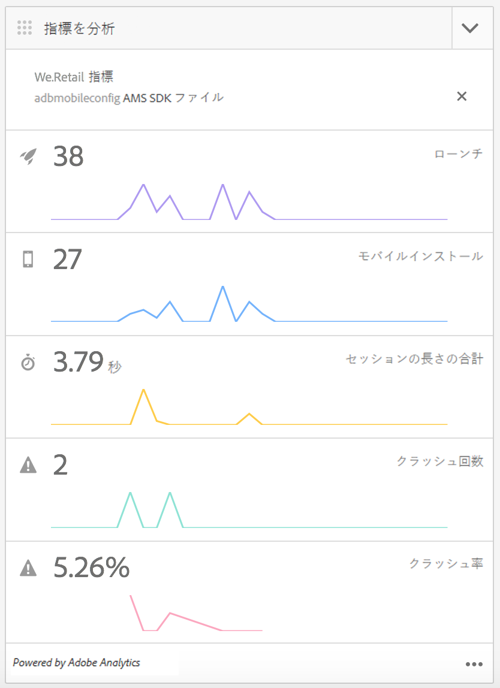
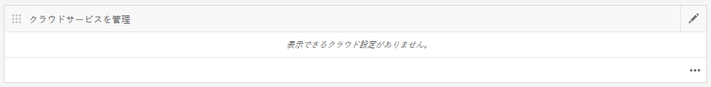
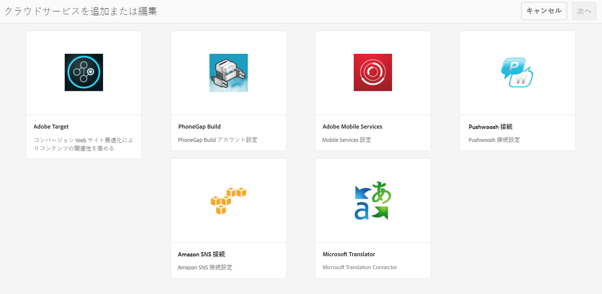
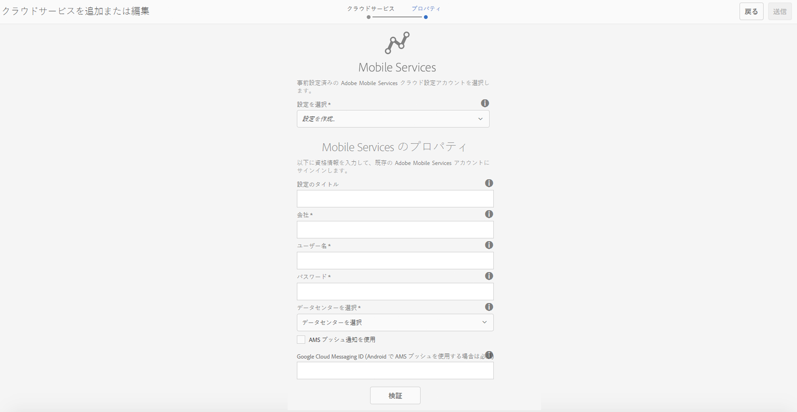
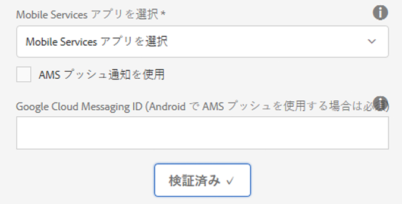
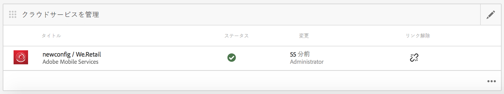
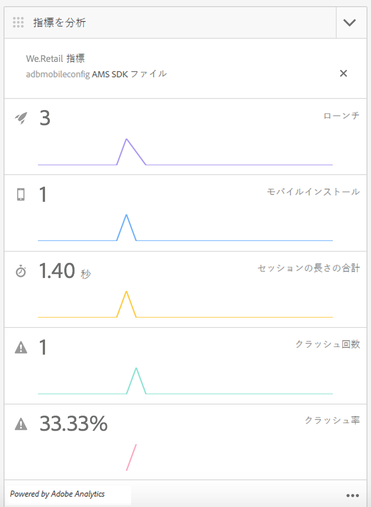

# Adobe Mobile Services クラウドサービスの設定 {#configure-your-adobe-mobile-services-cloud-service}

>[!NOTE]
>
>単一ページアプリケーションフレームワークを基にしたクライアント側レンダリング（React など）が必要なプロジェクトでは、SPA エディターを使用することをお勧めします。[詳細情報](/help/sites-developing/spa-overview.md)を参照してください。

The **Mobile Metrics Tile** on the command center provides real-time analytics for your mobile application.

[Adobe Mobile Analytics](https://www.adobe.com/ca/solutions/digital-analytics/mobile-web-apps-analytics.html) SDK は、PhoneGap プラグインを通じて使用できます。指標は収集され、デバイスに接続されるまでデバイス上にキャッシュされます。接続されると、データはAdobeのMobile Services Cloudにプッシュされ、レポートと分析が行われます。

Adobe Mobile Analytics SDK は、次の機能を提供します。

1. **モバイルチャネルに関するデータ収集** - すべての主要オペレーティングシステム上のモバイル Web サイトおよびアプリに関して総合的なデータを収集します。
1. **モバイルエンゲージメントの分析** — ユーザーがモバイルアプリ、Webサイトまたはビデオ内で行うエンゲージメントを把握できます。例えば、チャネルを起動する頻度や、消費者がアプリから購入するかどうかなどを把握できます。
1. **モバイルアプリのダッシュボードとレポート** — アプリのライフサイクル指標やアプリストア指標を含む使用状況レポートを取得します。ユーザー、起動回数、セッションの平均長さ、リテンション期間、クラッシュの傾向を確認できます。
1. **モバイルキャンペーン分析** - SMS、モバイル検索広告、モバイルディスプレイ広告、QRコードなど、モバイル固有のキャンペーンの効果を定量化します。
1. **位置情報分析** — アプリのユーザーが起動し、GPSの位置や目標地点でモバイルエクスペリエンスを操作する場所を見つけます。
1. **パス分析** — ユーザーがアプリ内をどのように移動して、ユーザーを惹きつける画面やUI要素を特定し、ユーザーをドロップオフさせる原因を確認します。

>[!CAUTION]
>
>**指標を分析**&#x200B;タイルは、クラウドサービスを設定している場合にのみダッシュボードに表示されます。

AEM コマンドセンター指標タイル

## クラウドサービスの設定 {#configuring-the-cloud-service}

Adobe Mobile Services 分析を利用するには、Adobe Analytics アカウント情報を使用して AEM Mobile Analytics クラウドサービスを設定する必要があります。

1. Click on the top right hand side icon to add or edit the Cloud Services from the **Manage Cloud Services** tile from the app dashboard.

   

1. The **Add or Edit Cloud Services** screen displays. Select **Adobe Mobile Services** and click **Next**.

   

1. Choose an existing configuration from the **Mobile Services** or choose **Create Configuration** to create a new one.

   新しい設定で、「**Mobile Services のプロパティ**」を入力し、「**検証**」をクリックします。

   

   If the credentials are verified, the **Verify** button changes to **Verified**. 「**Mobile Services アプリを選択**」から Mobile Services アプリを選択できます。

   Click **Submit** for setting up your configuration.

   

1. クラウド設定をおこなったら、ダッシュボードで設定を表示できます。

   

   >[!NOTE]
   >
   >クラウド設定をおこなったら、アプリダッシュボードの&#x200B;**指標を分析**&#x200B;タイルを表示できます。

   

