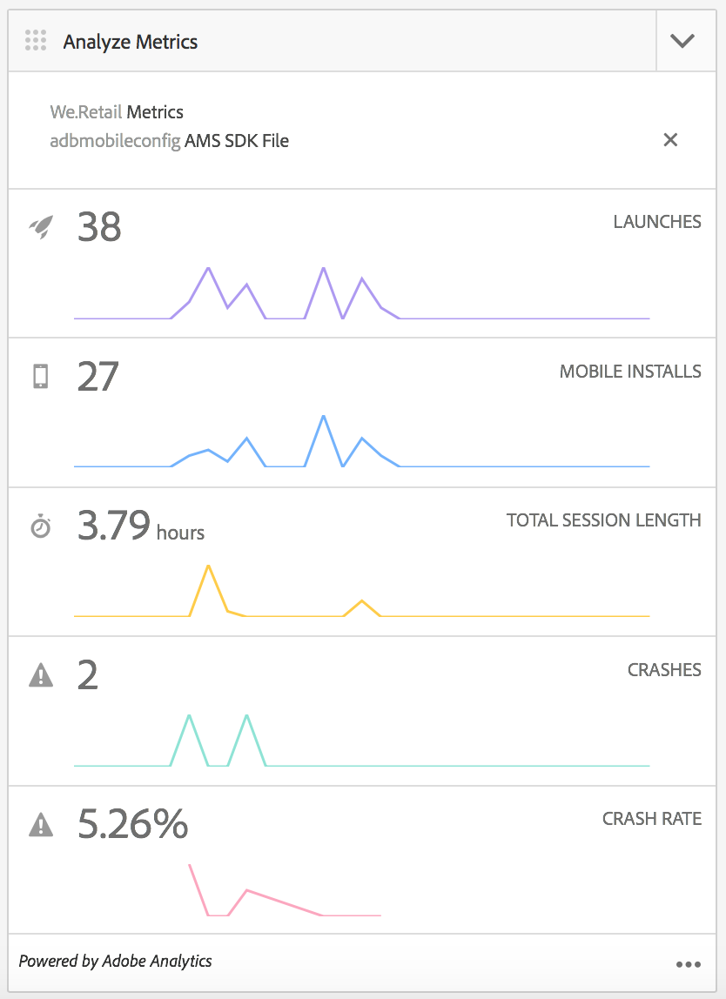
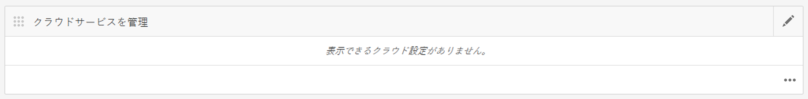
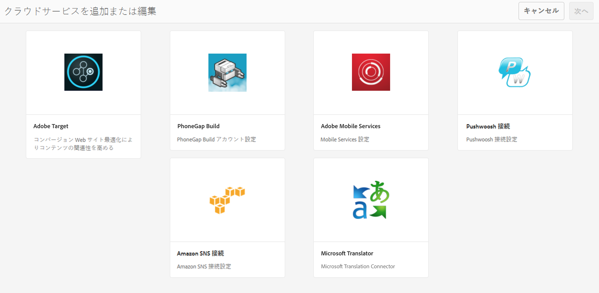
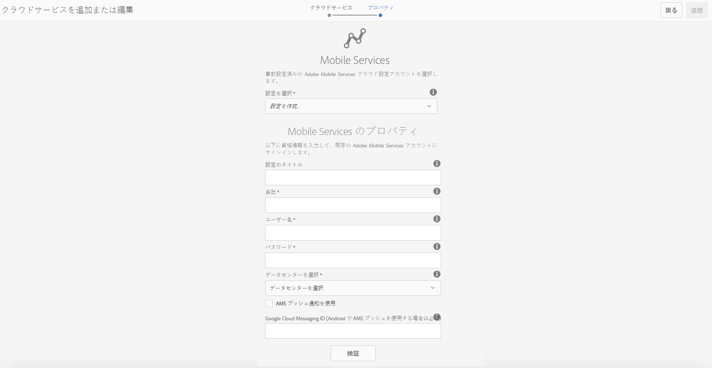
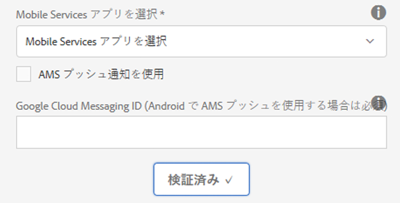
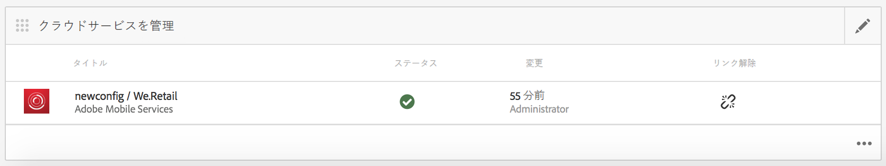
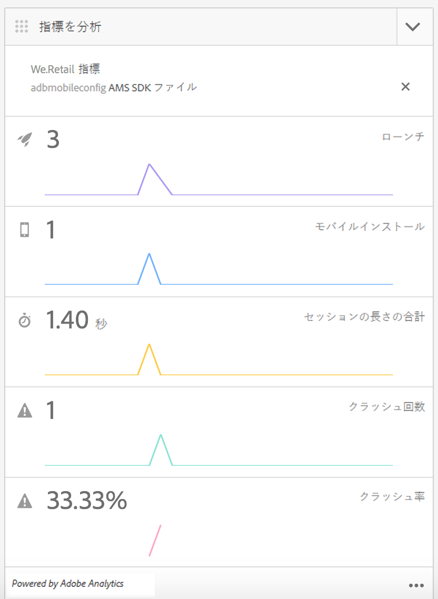

# Adobe Mobile Services Cloud Service の設定 {#configure-your-adobe-mobile-services-cloud-service}

{{ue-over-mobile}}

コマンドセンターの&#x200B;**モバイル指標タイル**&#x200B;は、モバイルアプリケーションのリアルタイム分析を提供します。

[Adobe Mobile Analytics](https://www.adobe.com/ca/solutions/digital-analytics/mobile-web-apps-analytics.html) SDKは、PhoneGap プラグインを通じて利用できます。 指標は、デバイスが接続されるまでデバイス上で収集およびキャッシュされ、その時点でデータはレポートと分析のためにAdobe Mobile Services Cloudにプッシュされます。

Adobe Mobile Analytics SDKには、次の機能があります。

1. **モバイルチャネル向けデータ収集** – 主要なオペレーティングシステムで、モバイルサイトとアプリに関する包括的なデータを収集します。
1. **モバイルエンゲージメント分析** – 消費者がチャネルを立ち上げる頻度、チャネルから購入する頻度など、モバイルアプリ、web サイト、またはビデオ内のユーザーエンゲージメントを把握します。
1. **モバイルアプリのダッシュボードとレポート** - アプリとアプリストアの指標に関するライフサイクル指標を含む使用状況レポートを取得します。ユーザー、ローンチ、平均セッション長、保持期間、クラッシュの傾向を参照してください。
1. **モバイルキャンペーン分析** - SMS、モバイル検索広告、モバイルディスプレイ広告、QR コードなどのモバイル固有キャンペーンの効果を定量化します。
1. **位置情報の分析** - アプリのユーザーが起動する場所や、モバイル エクスペリエンスを操作する場所をGPSの場所または興味のある場所で検索します。
1. **パス分析** - ユーザーがアプリ内をどのように移動して、ユーザーを惹きつける画面とUI要素、およびユーザーが離脱する原因を判断するかを確認します。

>[!CAUTION]
>
>**Analyze Metrics** タイルは、クラウドサービスを設定している場合にのみ、ダッシュボードに表示されます。

AEM Command Center Metrics Tile

## Cloud Serviceの設定 {#configuring-the-cloud-service}

Adobe Mobile Services Analyticsを利用するには、Adobe Analytics アカウント情報を使用してAEM Mobile Analytics Cloud サービスを設定する必要があります。

1. 右上のアイコンをクリックして、アプリダッシュボードの「**クラウドサービスの管理**」タイルからクラウドサービスを追加または編集します。

   

1. **クラウドサービスの追加または編集**&#x200B;画面が表示されます。 **Adobe Mobile Services**&#x200B;を選択し、**次へ**&#x200B;をクリックします。

   

1. **Mobile Services**&#x200B;から既存の設定を選択するか、**設定の作成**&#x200B;を選択して設定を作成します。

   新しい設定を行うには、**Mobile Services Properties**&#x200B;を入力し、**確認をクリックします。**

   

   資格情報が確認されると、**Verify** ボタンが&#x200B;**Verified**&#x200B;に変わります。 **モバイルアプリサービスを選択**&#x200B;からモバイルサービスアプリを選択できます。

   設定を設定するには、**送信**&#x200B;をクリックします。

   

1. クラウド設定を設定したら、ダッシュボードで同じことを表示できます。

   

   >[!NOTE]
   >
   >クラウド設定を設定したら、アプリダッシュボードで&#x200B;**指標の分析** タイルを表示できます。

   
