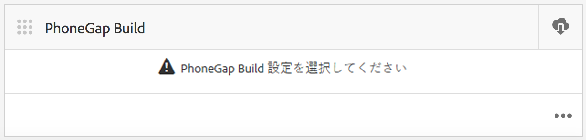
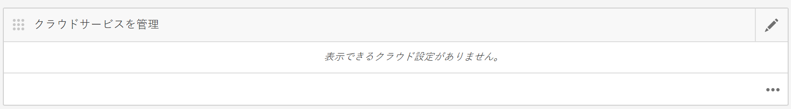
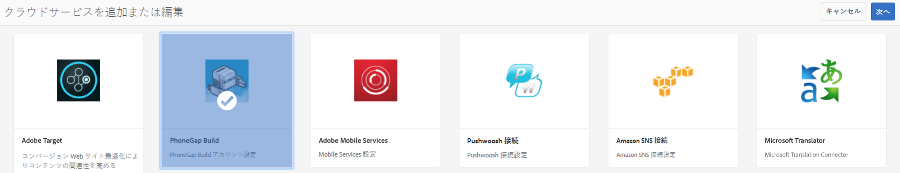
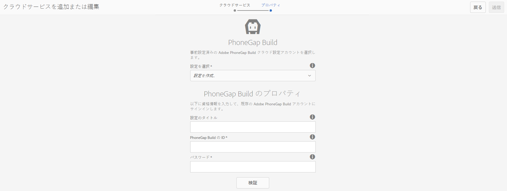
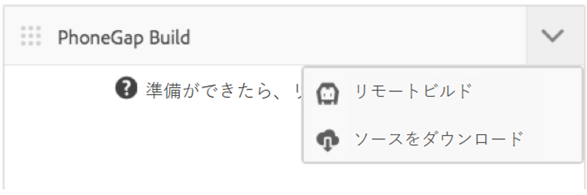

# Adobe PhoneGap Build クラウドサービスの設定 {#configure-your-adobe-phonegap-build-cloud-service}

>[!NOTE]
>
>単一ページアプリケーションフレームワークを基にしたクライアント側レンダリング（React など）が必要なプロジェクトでは、SPA エディターを使用することをお勧めします。[詳細情報](/help/sites-developing/spa-overview.md)を参照してください。

The **PhoneGap Build Tile** on the application dashboard provides the ability to build and distribute your PhoneGap mobile application through the Adobe PhoneGap Build Service.

All supported platforms defined within the **Manage App** tile will be built with PhoneGap Build when pushing a remote build with the **PhoneGap Build** Tile.

リモートビルドを [https://build.phonegap.com](https://build.phonegap.com) にプッシュしたり、ソースをダウンロードして [PhoneGap CLI](https://docs.phonegap.com/references/phonegap-cli/) でローカルにビルドしたりできます。



## クラウドサービスの設定 {#configuring-the-cloud-service}

PhoneGap Build を利用するには、PhoneGap Build アカウント情報を使用して AEM PhoneGap Build クラウドサービスを設定する必要があります。

If you don&#39;t currently have an account, navigate to [https://build.phonegap.com](https://build.phonegap.com) and sign up! Adobe Creative Cloudのメンバーシップに登録している場合は、最大25個の非公開アプリ（オープンソース以外のアプリ）がサポートされる場合があります。

Once you have verified your PhoneGap Build account is active, navigate to your AEM Cloud Management Console, specifically the [PhoneGap Build Cloud Service](http://localhost:4502/etc/cloudservices/phonegap-build.html) (http://localhost:4502/etc/cloudservices/phonegap-build.html).

Use the **Manage Cloud Services** tile to configure a new cloud service configuration.

### クラウドサービスを管理タイルの使用 {#using-manage-cloud-services-tile}

**PhoneGap Build** タイルを使用してアプリをビルドする前に、AEM Mobile ダッシュボードの&#x200B;**クラウドサービスを管理**&#x200B;タイルを使用して、クラウドサービスを設定する必要があります。

アプリのクラウドサービスを設定するには、以下の手順に従います。

1. **クラウドサービスを管理**&#x200B;タイルの右上隅をクリックします。

   

1. **クラウドサービスを追加または編集**&#x200B;画面で「**PhoneGap Build**」オプションを選択します。

   「**次へ**」をクリックします。

   

1. 資格情報を入力して、新しいクラウド設定を作成します。

   確認が終わったら、「**送信**」をクリックします。この設定したクラウド設定が、**クラウドサービスを管理**&#x200B;タイルに表示されます。

   

### PhoneGap Build でのアプリケーションのビルド {#building-your-application-with-phonegap-build}

クラウドサービスを設定したら、**PhoneGap Build** タイルを使用してアプリケーションをビルドできます。右上隅をクリックして、「**リモートビルド**」または「**ソースをダウンロード**」オプションを選択します。



Adobe PhoneGap Build を使用してリモートビルドを呼び出す場合は、「**リモートビルド**」をクリックします。

>[!NOTE]
>
>何らかの理由でビルドが失敗した場合は（下の赤い iOS アイコンはプラットフォームの障害を示しています）、アイコンにマウスポインターを合わせると、エラーメッセージが表示されます。または、タイルの下部にある 3 つのドット「...」（省略記号）をクリックして、https://build.phonegap.com に直接移動し（認証が必要です）、ビルドを直接監視および管理できます。

### PhoneGap CLI によるアプリケーションのビルド {#building-your-application-with-phonegap-cli}

PhoneGap には、アプリケーションをローカルでビルドするためのコマンドラインインターフェイスが用意されています。

PhoneGap コマンドラインインターフェイス（CLI）を使用して、コンピューター上で PhoneGap アプリケーションをコンパイルします。AEM コンテンツをアプリケーションに含めるには、モバイルアプリケーションのコンテンツ、コンテンツ同期設定およびその他の必要なアセットを含む ZIP ファイルを作成します。ZIP ファイルをダウンロードしてビルドに含めます。

PhoneGap のコマンドラインインターフェイスを利用するには、ローカル環境に以下のものを設定する必要があります。

1. プラットフォーム SDK（iOS、Android、WindowsPhone、...）および
1. PhoneGap CLI

詳しくは、[こちら](https://docs.phonegap.com/references/phonegap-cli/)をお読みください。

前提条件となる上記のものをインストールしたら、簡単なアプリを作成し、シミュレーターまたはできればデバイス上で実行して簡単なテストを実施し、ターミナルから次を試します。

```xml
phonegap create myApp
cd myApp
phonegap run ios (or android, ...)
```

>[!NOTE]
>
>接続しているデバイス上で実行しない場合は、この行の末尾に --emulate を追加してください。

Once you have verified that the above works, use the **PhoneGap Build** Tile to **Download Source**. ファイルを保存して、ローカルシステム上に解凍します。この作業が完了したら、以下をおこないます。

* 保存したファイル（フォルダー）に移動します。
* 「phonegap run ios」（または android など）を実行します。

### その他のリソース {#additional-resources}

作成者および開発者の役割と責任について詳しくは、以下のリソースを参照してください。

* [AEM と Adobe PhoneGap Enterprise での開発](/help/mobile/developing-in-phonegap.md)
* [AEM での Adobe PhoneGap Enterprise 向けオーサリング](/help/mobile/phonegap.md)
