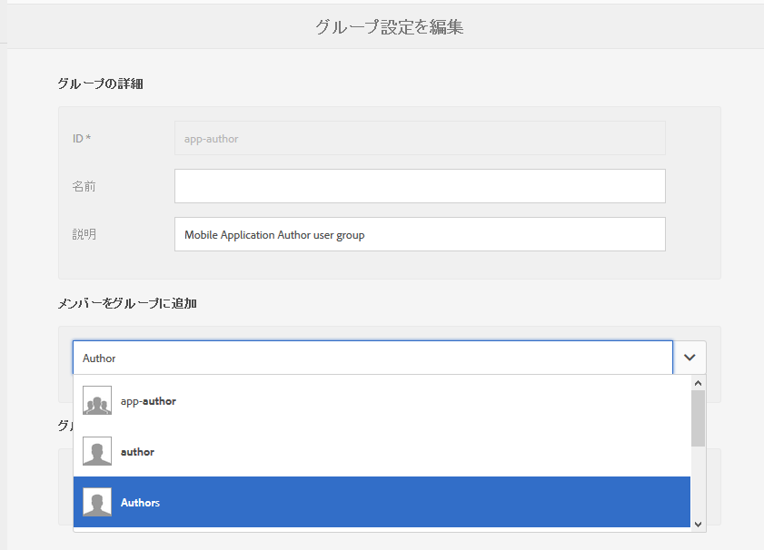
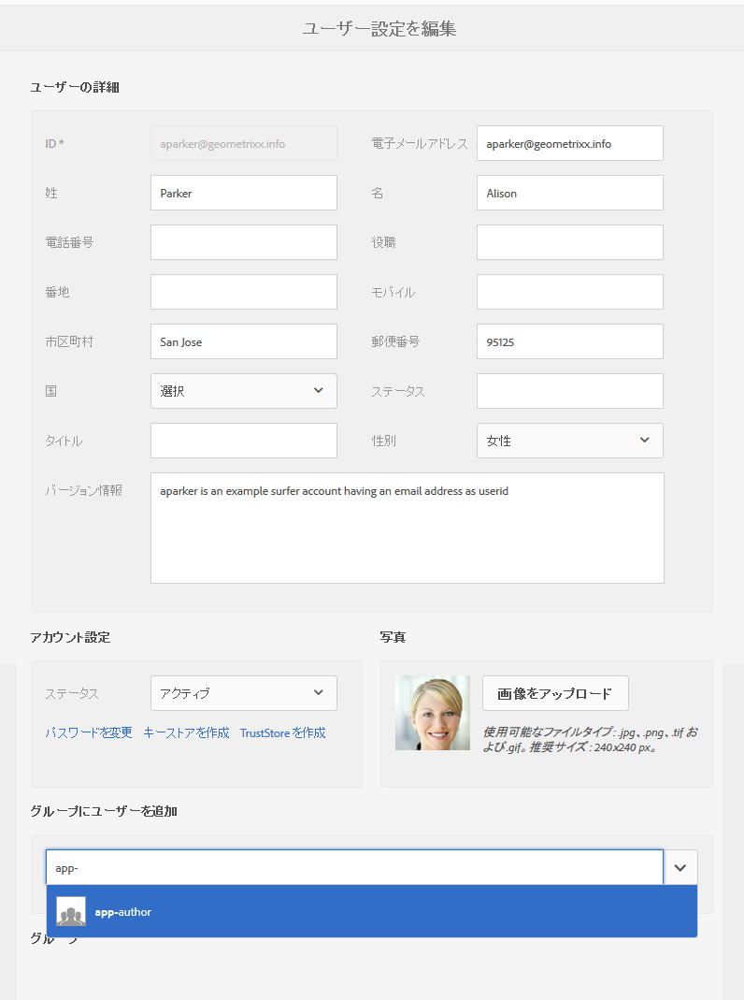
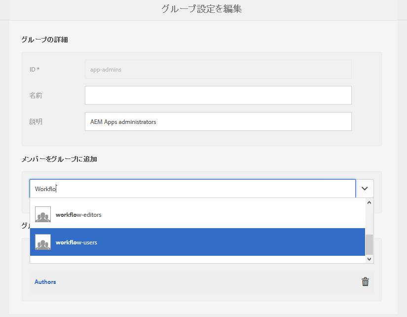
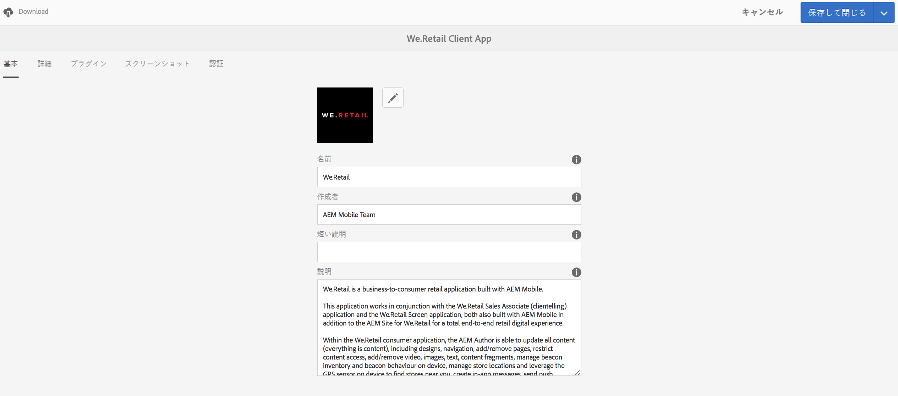

# ユーザーとユーザーグループの設定 {#configure-your-users-and-user-groups}

>[!NOTE]
>
>単一ページアプリケーションフレームワークを基にしたクライアント側レンダリング（React など）が必要なプロジェクトでは、SPA エディターを使用することをお勧めします。[詳細情報](/help/sites-developing/spa-overview.md)

この章では、ユーザーの役割について説明し、さらにモバイルアプリのオーサリングと管理をサポートするようにユーザーとグループを設定する方法について説明します。

## AEM Mobile アプリケーションユーザーとグループ管理 {#aem-mobile-application-users-and-group-administration}

AEM Appsの権限モデルを整理し管理するために、次の2つのグループを使用できます。

* app-admins for App Admins
* アプリ作成者向けアプリ作成者

### AEM Mobile Application Content Authors (app-author group) {#aem-mobile-application-content-authors-app-author-group}

app-authors グループのメンバーが、ページ、テキスト、画像、ビデオなど AEM Mobile アプリケーションコンテンツのオーサリングを担当します。

#### グループの設定 - app-authors {#group-configuration-app-authors}

1. 「app-authors」という新しいユーザーグループを作成します。

   Navigate to the User Admin Console: [http://localhost:4502/libs/granite/security/content/groupadmin.html](http://localhost:4502/libs/granite/security/content/groupadmin.html)

   ユーザーグループコンソールから + ボタンを選択して、グループを作成します。

   このグループの ID を「app-authors」に設定して、AEM 内でのモバイルアプリケーションの作成に固有の作成者ユーザーグループタイプであることを示します。

1. グループにメンバー「作成者」を追加します。

   

   「app-authors」を「作成者」グループに追加します。

1. app-authors ユーザーグループを作成したので、[ユーザー管理コンソール](http://localhost:4502/libs/granite/security/content/useradmin.md)を使用して、この新しいグループに個別のチームメンバーを追加できます。

   

   ユーザーグループを編集します。

1. [権限コンソール](http://localhost:4502/useradmin)に移動して、次のようにクラウドサービスを管理するための権限を追加します。

   * /etc/cloudservices に対して（読み取り）
   >[!NOTE]
   >
   >アプリ作成者は、AEM のデフォルトの content-authors（作成者）グループを拡張したものなので、/content/phonegap にコンテンツを作成する権限を継承しています。

### AEM Mobile Application Administrators Group (app-admins group) {#aem-mobile-application-administrators-group-app-admins-group}

Members of the app-admins group can author application content with the same permissions included with app-authors **AND** in addition are also responsible for:

* AEM での PhoneGap Build および Adobe Mobile Services クラウドサービスの設定
* アプリケーションコンテンツ同期 OTA 更新のステージング、公開および消去

>[!NOTE]
>
>権限によって、AEM アプリコマンドセンターでの一部のユーザーアクションを使用できるかどうかが決定されます。
>
>app-admins には表示されるいくつかのオプションが、app-authors には表示されません。

#### グループの設定 - app-admins {#group-configuration-app-admins}

1. add-admins という新しいグループを作成します。
1. 新しい app-admins グループに次のグループを追加します。

   * content-authors
   * workflow-users

   

1. [権限コンソール](http://localhost:4502/useradmin)に移動して、次のようにクラウドサービスを管理するための権限を追加します。

   * /etc/cloudservices/mobileservices に対して（読み取り、変更、作成、削除、複製）
   * /etc/cloudservices/phonegap-build に対して（読み取り、変更、作成、削除、複製）

1. 同じ権限コンソールで、アプリコンテンツ更新をステージング、公開および消去するための権限を次のように追加します。

   * /etc/packages/mobileapp に対して（読み取り、変更、作成、削除、複製）
   * /var/contentsync に対して（読み取り）

   >[!NOTE]
   >
   >オーサーインスタンスからパブリッシュインスタンスにアプリケーションの更新を公開するには、パッケージの複製を使用します。

   >[!CAUTION]
   >
   >/var/contentsync へのアクセスは、初期設定では拒否されています。
   >
   >読み取り権限を省略すると、空の更新パッケージが作成され、複製されます。

1. 必要に応じてこのグループにメンバーを追加します。

## ダッシュボードタイルの権限 {#dashboard-tile-permissions}

ダッシュボードタイルには、ユーザーの持つ権限に基づいて、異なるアクションが表示されることがあります。各タイルで使用できるアクションを次に示します。

ユーザーの権限に加え、現在のアプリケーションの設定方法に基づいて、アクションを表示または非表示にすることもできます。例えば、PhoneGapクラウド設定がアプリに割り当てられていない場合、「リモートビルド」アクションが公開されるポイントはありません。 These will be listed below under &#39;**Configuration Condition**&#39; sections.

### アプリを管理タイル {#manage-app-tile}

現在、このタイルには、権限を必要とするアクションはありませんが、アプリケーションの詳細ページには以下のアクションが表示されます。

* 編集&#x200B;**：app-author および app-admin 向け（UI トリガー - jcr:write - /content/phonegap/{suffix} に対して）
* *app-authorとapp-adminのダウンロード* （UIトリガー — /content/phonegap/{suffix}）

以下の図は、アプリのダウンロードおよび編集オプションを示しています。

