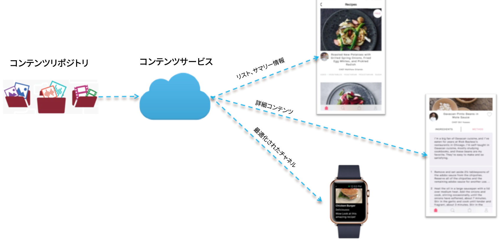
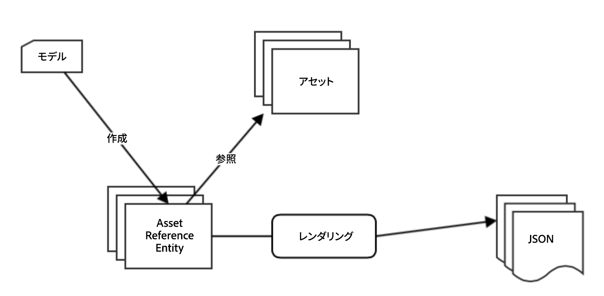
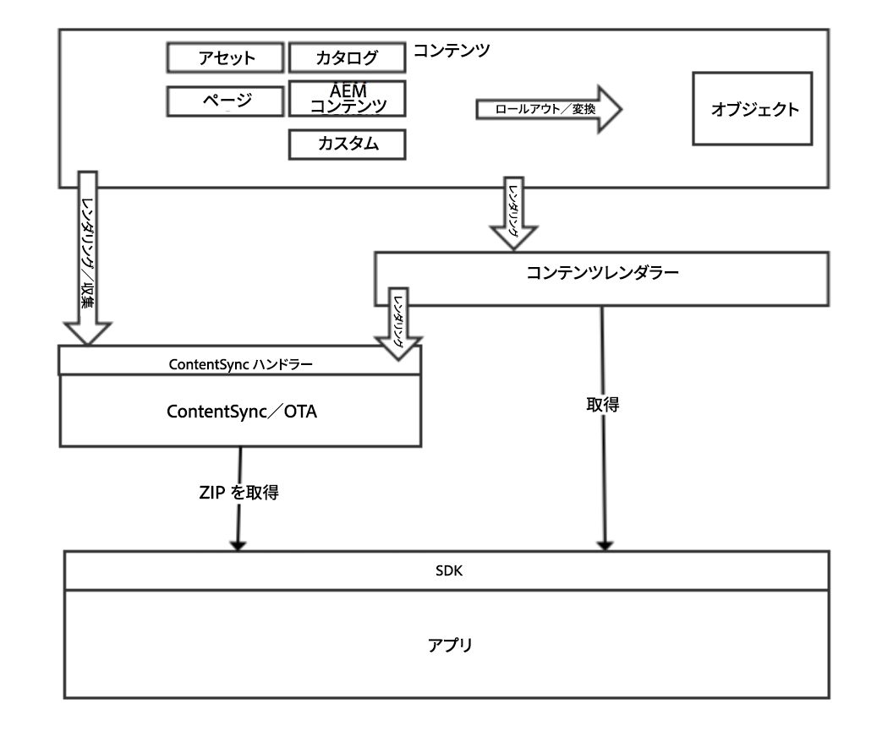

# コンテンツ配信{#content-delivery}

>[!NOTE]
>
>単一ページアプリケーションフレームワークを基にしたクライアント側レンダリング（React など）が必要なプロジェクトでは、SPA エディターを使用することをお勧めします。[詳細情報](/help/sites-developing/spa-overview.md)

モバイルアプリは、目的とするアプリエクスペリエンスを配信するために、AEM 内のあらゆるコンテンツを必要に応じて利用できなければなりません。

これには例えば、アセット、サイトコンテンツ、CaaS コンテンツ、無線（OTA）コンテンツ、独自の構造を持つカスタムコンテンツなどが含まれます。

>[!NOTE]
>
>**空中コンテンツ** (Over-the-Air Content)は、ContentSyncハンドラーを使用して上記のいずれかからも作成できます。 無線コンテンツを使用すると、パッケージと配信を Zip して一括で処理したり、アップデートやパッケージを保守したりできます。

コンテンツサービスは、主に 3 種類の要素を配信します。

1. **Assets**
1. **パッケージド HTML コンテンツ（HTML／CSS／JS）**
1. **チャネル独立コンテンツ**

## Assets {#assets}

アセットコレクションは、他のコレクションの参照を含む AEM 構成要素です。

アセットコレクションは、コンテンツサービスを介して公開できます。要求でアセットコレクションを呼び出すと、アセットのリストであるオブジェクト（URLを含む）が返されます。 アセットは URL を介してアクセスされ、その URL はオブジェクトの形で提供されます。次に例を示します。

* ページエンティティは、画像参照を含む JSON（ページオブジェクト）を返します。画像参照は、画像のアセットバイナリの取得に使用されるURLです。
* フォルダー内のアセットのリストをリクエストすると、JSON と、そのフォルダー内のすべてのエンティティに関する詳細が返されます。そのリストは対象です。 この JSON は、そのフォルダー内の各アセットのアセットバイナリを取得するために使用する URL 参照を含みます。

### アセットの最適化 {#asset-optimization}

コンテンツサービスは、デバイス用に最適化されたアセットを返します。これは、コンテンツサービスの重要な機能です。これにより、ローカルデバイスのストレージニーズが減少し、アプリのパフォーマンスが向上します。

アセットの最適化は、API リクエストで提供される情報に基づく、サーバー側の機能です。可能な限り、アセットレンディションをキャッシュする必要があり、同様の要求を行ってもアセットレンディションの再生成は必要ありません。

### アセットのワークフロー {#assets-workflow}

次に、アセットのワークフローを示します。

1. 既製の AEM で使用可能なアセット参照
1. モデルを選択してアセット参照エンティティを作成
1. エンティティを編集

   1. アセットまたはアセットコレクションを選択
   1. JSON レンダリングをカスタマイズ

The following diagram shows the **Assets Reference Workflow**:

### アセットの管理 {#managing-assets}

コンテンツサービスは、他の AEM コンテンツを介して参照できない、AEM の管理対象アセットへのアクセスを提供します。

#### 既存の管理対象アセット {#existing-managed-assets}

既存の AEM Sites および Assets ユーザーは、AEM Assets を使用して、すべてのチャネルのすべてのデジタル要素を管理しています。ネイティブのモバイルアプリを開発中で、AEM Assetsが管理する複数のアセットを使用する必要があります。 例えば、ロゴ、背景画像、ボタンアイコンなど。

現在、これらのアセットは、アセットリポジトリ全体にわたって保存されています。アプリが参照する必要のあるファイルは次の場所にあります。

* /content/dam/geometrixx-outdoors/brand/logo_light.png
* /content/dam/geometrixx-outdoors/brand/logo_dark.png
* /content/dam/geometrixx-outdoors/styles/backgrounds/grey_blue.jpg
* /content/dam/geometrixx-outdoors/brand/icons/app/cart.png
* /content/dam/geometrixx-outdoors/brand/icons/app/home.png

#### CS アセットエンティティへのアクセス {#accessing-cs-asset-entities}

ここでは、ページは既に使用可能になっているものとします。API を利用してページを使用可能にする手順については触れません（この手順については、AEM UI に関する説明で触れます）。アセットエンティティが作成され、「appImages」スペースに追加されました。 組織のために、スペースの下に追加のフォルダーが作成されました。 アセットエンティティはAEM JCRに次のように保存されます。

* /content/entities/appImages/logos/logo_light
* /content/entities/appImages/logos/logo_dark
* /content/entities/appImages/bkgnd/grey_blue
* /content/entities/appImages/icons/cart
* /content/entities/appImages/icons/home

#### 使用可能なアセットエンティティのリストの取得 {#getting-a-list-of-available-asset-entities}

アプリ開発者は、アセットエンティティを取得することで、使用可能なアセットのリストを取得できます。Content Servicesスペースエンドポイントは、WebサービスAPI SDKを介してこの情報を提供できます。

結果として取得できるリストは、「icons」フォルダー内のアセットのリストを提供する JSON 形式のオブジェクトです。

#### 画像の取得 {#getting-an-image}

JSON は、コンテンツサービスによって生成される各画像に URL を提供します。

「cart」画像のバイナリを取得するために、クライアントライブラリは再度使用されます。

## パッケージド HTML コンテンツ {#packaged-html-content}

コンテンツのレイアウトを維持するには、HTML コンテンツが必要です。これは、Cordova WebビューなどのWebコンテナーを使用してコンテンツを表示するネイティブアプリケーションで役立ちます。

AEM コンテンツサービスは、API を介してモバイルアプリに HTML コンテンツを提供できます。AEMコンテンツをHTMLとして公開したいと思うお客様は、AEMコンテンツソースを指すHTMLページエンティティを作成します。

次のオプションを検討します。

* **Zipファイル：** デバイス上に適切に表示するために、ページのすべての参照資料（css、JavaScript、アセットなど）が  — は、応答と共に単一の圧縮ファイルに含まれます。 HTMLページ内の参照は、これらのファイルへの相対パスを使用するように調整されます。
* **ストリーミング：** 必要なファイルのマニフェストをAEMから取得します。 次に、これ以降のリクエストでは、このマニフェストを使用してすべてのファイル（HTML、CSS、JS など）をリクエストします。

## チャネル独立コンテンツ {#channel-independent-content}

チャネルに依存しないコンテンツは、レイアウトやコンポーネント、その他のチャネル固有の情報を気にすることなく、ページなどのAEMコンテンツ構成を公開する手段です。

これらのコンテンツエンティティは、コンテンツモデルを使用して AEM 構成要素を JSON 形式に変換することで生成されます。結果のJSONデータには、コンテンツのデータに関する情報(AEMリポジトリとの分離)が含まれます。 これには、メタデータの返信、アセットへのAEM参照リンク、およびエンティティ階層を含むコンテンツ構造間の関係が含まれます。

### チャネル独立コンテンツの管理 {#managing-channel-independent-content}

コンテンツは、様々な方法でアプリにアクセスできます。

1. AEM 無線を介してコンテンツの ZIP を取得します。

   * コンテンツ同期ハンドラーは、zipパッケージを直接更新するか、既存のコンテンツレンダラーを呼び出して更新できます

      * プラットフォームハンドラー
      * AEMM ハンドラー
      * カスタムハンドラ

1. コンテンツレンダラーを介してコンテンツを直接取得します。

   * 既製のデフォルト Sling レンダラー
   * AEM Mobile／コンテンツサービスのコンテンツレンダラー
   * カスタムレンダリング

