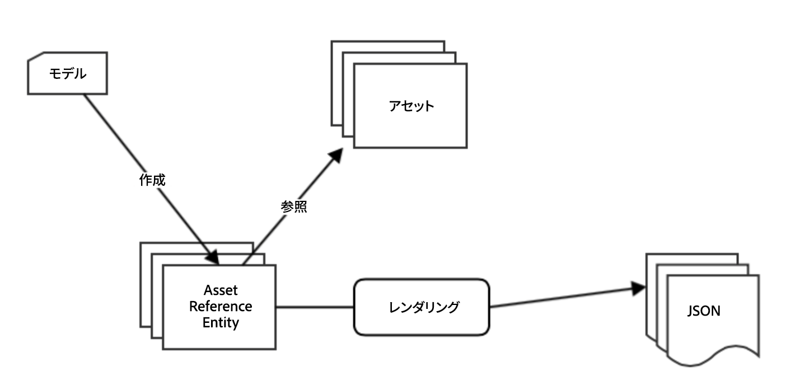
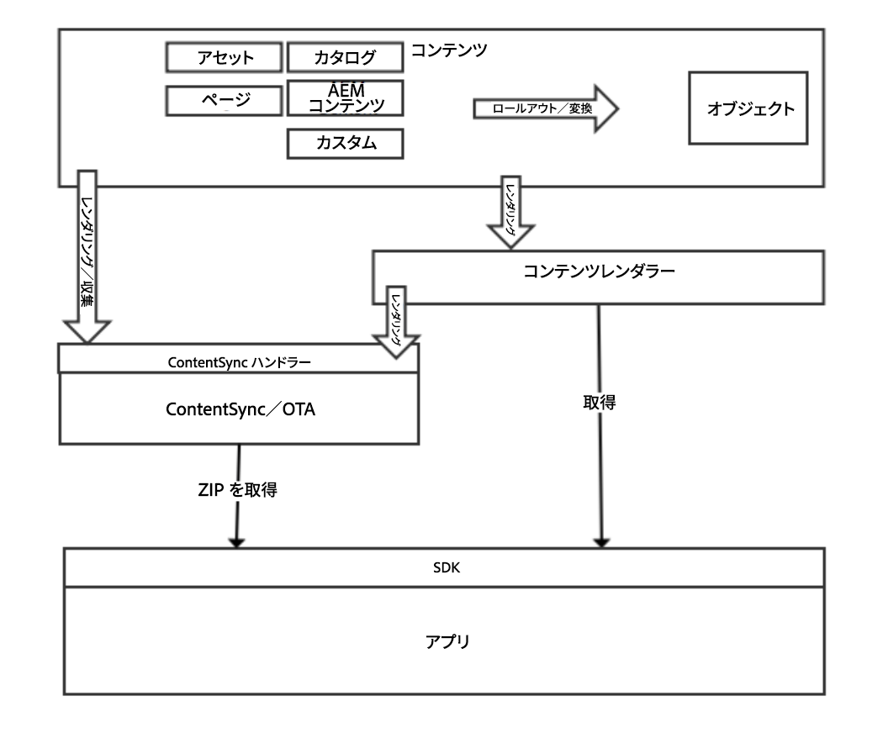

# コンテンツ配信{#content-delivery}

{{ue-over-mobile}}

モバイルアプリでは、必要に応じてAEMのあらゆるコンテンツを使用して、ターゲットを絞ったアプリ体験を提供できます。

これには、アセット、サイトコンテンツ、CaaS コンテンツ（over-the-air）コンテンツ、独自の構造を持つカスタムコンテンツなどを使用することが含まれます。

>[!NOTE]
>
>**無線コンテンツ**&#x200B;は、ContentSync ハンドラーを介して上記のいずれかから取得できます。 このパッケージを使用すると、zip形式でパッケージと配信をバッチ化し、更新やパッケージを維持できます。

コンテンツサービスが提供するコンテンツには、主に3つの種類があります。

1. **Assets**
1. **パッケージ化されたHTML コンテンツ（HTML/CSS/JS）**
1. **チャネルに依存しないコンテンツ**

## Assets {#assets}

アセットコレクションは、他のコレクションへの参照を含むAEM構成です。

アセットコレクションは、コンテンツサービスを通じて公開できます。 リクエストでアセットコレクションを呼び出すと、アセットのリスト（URLを含む）であるオブジェクトが返されます。 AssetsにはURL経由でアクセスできます。 URLはオブジェクトで指定されます。 例：

* ページエンティティは、画像参照を含むJSON （ページオブジェクト）を返します。 画像参照は、画像のアセットバイナリを取得するために使用されるURLです。
* フォルダー内のアセットのリストをリクエストすると、そのフォルダー内のすべてのエンティティに関する詳細を含むJSONが返されます。 そのリストはオブジェクトです。 JSONには、そのフォルダー内の各アセットのアセットバイナリを取得するために使用されるURL参照があります。

### Asset Optimization {#asset-optimization}

コンテンツサービスの重要な価値は、デバイスに最適化されたアセットを返すことができることです。 これにより、ローカルデバイスのストレージの必要性を減らし、アプリのパフォーマンスを向上させることができます。

アセット最適化は、API リクエストで提供される情報に基づくサーバーサイド関数です。 可能な限り、アセットのレンディションをキャッシュして、同様のリクエストがアセットのレンディションの再生成を必要としないようにします。

### Assets Workflow {#assets-workflow}

アセットのワークフローは次のとおりです。

1. AEMでは、アセット参照をすぐに使用できます
1. モデルにアセット参照エンティティを作成
1. エンティティを編集

   1. アセットまたはアセットコレクションの選択
   1. JSON レンダリングのカスタマイズ

次の図は、**Assets参照ワークフロー**&#x200B;を示しています。

### アセットの管理 {#managing-assets}

コンテンツサービスは、AEMが管理するアセットへのアクセスを提供します。これらのアセットは、他のAEM コンテンツから参照することはできません。

#### 既存のManaged Assets {#existing-managed-assets}

AEM SitesとAssetsを利用している企業は、AEM Assetsを使用して、あらゆるチャネルのデジタルコンテンツを管理しています。 ネイティブモバイルアプリを開発しており、AEM Assetsで管理されるいくつかのアセットを使用する必要があります。 例えば、ロゴ、背景画像、ボタンアイコンなどです。

現在はAssetsリポジトリ内に分散しています。 アプリが参照する必要があるファイルは次のとおりです。

* /content/dam/geometrixx-outdoors/brand/logo_light.png
* /content/dam/geometrixx-outdoors/brand/logo_dark.png
* /content/dam/geometrixx-outdoors/styles/backgrounds/grey_blue.jpg
* /content/dam/geometrixx-outdoors/brand/icons/app/cart.png
* /content/dam/geometrixx-outdoors/brand/icons/app/home.png

#### CS アセットエンティティへのアクセス {#accessing-cs-asset-entities}

ページがAPIを通じて利用できるようにする方法の手順は別枠で説明します（AEM UIの説明で説明されています）。これで完了したと仮定します。 アセットエンティティが作成され、「appImages」スペースに追加されました。 追加のフォルダーは、組織目的でスペースの下に作成されました。 そのため、アセットエンティティは次のようにAEM JCRに保存されます。

* /content/entities/appImages/logos/logo_light
* /content/entities/appImages/logos/logo_dark
* /content/entities/appImages/bkgnd/gray_blue
* /content/entities/appImages/icons/cart
* /content/entities/appImages/icons/home

#### 使用可能なアセットエンティティのリストの取得 {#getting-a-list-of-available-asset-entities}

アプリ開発者は、アセットエンティティを取得することで、使用可能なアセットのリストを取得できます。 Content Services スペースエンドポイントは、web サービス API SDKを通じてその情報を提供できます。

結果は、「icons」フォルダー内のアセットのリストを提供するJSON形式のオブジェクトになります。

#### 画像の取得 {#getting-an-image}

JSONは、コンテンツサービスによって生成された各画像のURLを画像に提供します。

「買い物かご」画像のバイナリを取得するには、クライアントライブラリをもう一度使用します。

## パッケージ化されたHTML コンテンツ {#packaged-html-content}

HTML コンテンツは、コンテンツのレイアウトを維持する必要があるお客様に必要です。 これは、コンテンツを表示するためにWeb コンテナ（Cordova Web ビューなど）を使用しているネイティブアプリケーションで便利です。

AEM Content Servicesは、APIを介してモバイルアプリにHTML コンテンツを提供します。 AEM コンテンツをHTMLとして公開したいお客様は、AEM コンテンツソースを指すHTML ページエンティティを作成できます。

次のオプションが考慮されます。

* **Zip ファイル：** デバイス上で適切に表示する可能性を最大限に高めるために、ページの参照先のマテリアル css、JavaScript、assetsなどが、レスポンスを含む1つの圧縮ファイルに含まれます。 HTML ページの参照は、これらのファイルへの相対パスを使用するように調整できます。
* **ストリーミング：** AEMから必要なファイルのマニフェストを取得しています。 その後、そのマニフェストを使用して、後続のリクエストですべてのファイル（HTML、CSS、JSなど）をリクエストします。

## チャネルに依存しないコンテンツ {#channel-independent-content}

チャネルに依存しないコンテンツとは、レイアウトやコンポーネントなどのチャネル固有の情報を心配することなく、ページなどのAEM コンテンツ構造を公開する方法です。

これらのコンテンツエンティティは、コンテンツモデルを使用して生成され、AEM構造をJSON フォーマットに変換します。 結果のJSON データには、AEM リポジトリから切り離されたコンテンツのデータに関する情報が含まれます。 これには、アセットへのメタデータおよびAEM参照リンクの返し、およびエンティティ階層を含むコンテンツ構造間の関係が含まれます。

### チャネルに依存しないコンテンツの管理 {#managing-channel-independent-content}

コンテンツは、いくつかの方法でアプリにアクセスできます。

1. AEM Over-the-Airを介してコンテンツ ZIPSを入手する

   * コンテンツ同期ハンドラーは、zip パッケージを直接更新するか、既存のコンテンツレンダラーを呼び出すことができます

      * プラットフォームハンドラー
      * AEM ハンドラー
      * カスタムハンドラー

1. コンテンツレンダラーを利用して、コンテンツを直接取得できます

   * デフォルトのSling レンダラー
   * AEM Mobile/Content Services Content Renderers
   * カスタムレンダリング
