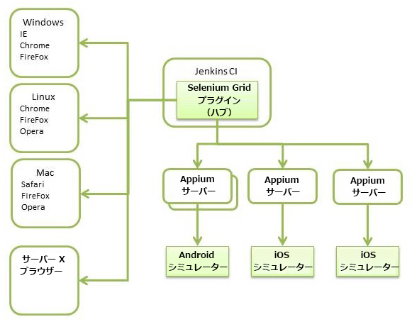

# モバイルアプリのテスト{#testing-mobile-apps}

>[!NOTE]
>
>単一ページアプリケーションフレームワークを基にしたクライアント側レンダリング（React など）が必要なプロジェクトでは、SPA エディターを使用することをお勧めします。[詳細情報](/help/sites-developing/spa-overview.md)

市場には幅広いデバイスが投入され、リリースされ続けていることから、アプリのテストが非常に重要になっています。機能やユーザビリティがアプリストアで低評価を受ける可能性がありますが、欠陥が 1 つでもあればアプリのアンインストールという結果になり得ます。テストの計画と品質保証には細心の注意を払う必要があります。次のリンクでは、自分の環境の確認や、テストケース、テストのタイプ、仮定、お客様の関与などの定義といった、全般的に対処が必要な多くのトピックを取り上げています。また、テスト作業に役立つツールについても説明しています。Internal tools, like [Hobbes](/help/sites-developing/hobbes.md), can help with web-based UI testing. [厳しい日は](/help/sites-developing/tough-day.md) 、シミュレーションされた負荷でインスタンスに応力を与える可能性があります。 テスト環境に Selenium などのサードパーティツールが既に搭載されている場合には、それを使用することもできます。

モバイルアプリを開発する際には、デバイスに固有の多くの問題が新たに発生し、従来のテストの問題に加えてこれらにも対処する必要があります。

* 機能 — すべての要件がアプリで満たされているか。
* 使い勝手 — アプリは、お客様が使いやすく、理解しやすいものですか。
* パフォーマンス — 使用のスパイク中に何が起きるか。 スワイプやカルーセルなどのアプリ要素は動作が軽快ですか。エクスペリエンスを損なうようなものになっていませんか。
* 失敗または割り込み — アプリの実行中に着信または通知が発生した場合はどうなりますか？ ネットワークの停止や電源オフがあるとどうなりますか。
* インストールとアップデート — インストールの操作方法 更新は、どのようにプッシュアウトされますか。
* 技術 — アプリがデバイスから消費する電力が多すぎるか。
* ローカライゼーション — アプリ内のすべての領域が翻訳されていますか。
* 認定 — アプリは認定されていますか。 データのプライバシー関連のすべての法的要件に準拠するという点について、アプリはお客様の信頼を得ていますか。

自動テストおよび手動テストを実行するときは、以上の質問に回答するようにしてください。

## 自動テスト {#automated-testing}

ある程度までは、多様な画面サイズ、メモリ制約、入力方法およびオペレーティングシステムに自動テストの実行で対応できる必要があります。自動テストは、テストケースの多くに対応しているだけでなく、新しい機能やデバイスを導入する際の回帰テストを迅速化できます。自動化ツールで作業の繰り返し回数が減ったり、限定的なものになったりすることが理想です。テスト作業をすべてのプラットフォームに適用できるように、ツールまたはフレームワークを使用してください。次の図は、Web ベース UI とモバイルアプリの両方のテストに使用できるテスト環境の構造を簡素化したものです。図の左側には、一連の Selenium ノードがブラウザーとともに示されています。SeleniumGrid は、一般的な Web ベースの UI テストをこれらのノードのいずれかにファームアウトできます。Selenium Hub は、クロスプラットフォームアプリテスト用に Appium に接続することもできます。図に示されているのはシミュレーターのみですが、adb（Android の場合）および Xcode ユーティリティ（iOS デバイスの場合）を組み込むこともできます。ここに挙げたツールの詳細を個別に確認するには、後述のリンクを使用してください。

## 手動テスト {#manual-testing}

自動テストに加え、アプリに対して手動テストサイクルも実行する必要があります。実際のデバイスでアプリを実行するお客様をスクリプトで再現することはできません。この場合も多くの選択肢があります。HockeyApp などのプラットフォームを使用して、フィードバックにアクセスできるユーザーを定義し、フィードバックを収集することができます。あるいは、UTest、ElusiveStars、Testin などのサービスにプロセス全体をアウトソーシングすることもできます。社内にテスト実施者グループが存在するものの、デバイスのバリエーションが不足している場合には、クラウドサービスを利用し、用意されているデバイスプールに対して手動テストを実行できます。これを実現しているサービスの 1 つが SauceLabs です。また、受け入れテストまたはデモ実施の 1 つのレベルとして、PhoneGap Enterprise に対してリモートでアプリをビルドし、ローカルデバイスにインストールすることもできます。See the [PhoneGap](https://phonegap.com/) website for their latest features and documentation. どのアプローチを採用する場合でも、手動テストには次のことが必要です。

* テスト実施者数が多いこと。
* 大規模なデバイスプールに対してテストを実施すること（実際のデバイスが理想ですが、実際のデバイスが使用できない場合にはシミュレーター／エミュレーターでもかまいません）。
* 次のような有益なフィードバックが得られること。

   * クラッシュレポート、
   * analytics/tracking、
   * 利便性、
   * 注目領域
   * パフォーマンス、
   * データ／電力消費など

## ツール {#tools}

モバイルアプリのテストには、さまざまなツールを使用できます。使用するツールを選択する場合は、機能、価格、サポート、対象範囲など個別の状況に応じて決定します。ここでは、使用可能なツールおよびサービスのいくつかをごく簡単に説明します。

**Selenium**

* テストスクリプトで WebDriver をフィードし、さまざまなブラウザーを制御するための API が含まれるフレームワーク。
* Appium とともに使用して、実際のデバイスでテストを実行できます。
* SeleniumGrid では、ノード全体をテスト対象にして並列テストを実行できます。
* Selenium IDE により、テストケース作成の負担が軽減されます。

For more information see [https://www.seleniumhq.org/](https://www.seleniumhq.org/).

**Testdroid**

* 継続的インテグレーションフックおよび実際のデバイスでのテストを実現する、クラウドベースのテストサービスです。
* デバイスの互換性のチェック、ログの分析、ビューの走査、スクリーンショットの取得およびパフォーマンスの監視を行うアプリクローラーを備えています。

For more information see [https://testdroid.com/](https://testdroid.com/).

**Appium**

* Appium は、モバイルテストを自動化するために広く使用されているクロスプラットフォームフレームワークです。
* また、テストケースのコーディングに役立つインスペクタが記録機能に含まれています。

For more information see [https://appium.io/](https://appium.io/).

**SauceLabs**

* SauceLabs は、クラウドベースのテストを提供し、継続的インテグレーションと統合されています。
* テストはクラウド環境で自動的に実行されます。また、特定のデバイスまたはプラットフォームを起動して手動テストを実行し、問題のデバッグに役立てることもできます。

For more information see [https://saucelabs.com/](https://saucelabs.com/).

**AppTestNow**

* モバイルアプリをテストするアウトソーシングサービス。
* 大規模なデバイスプールを備え、パフォーマンス、品質、機能性、認定、ローカリゼーション、データ消費量などさまざまなタイプのテストを提供します。

For more information see [https://www.apptestnow.com](https://www.apptestnow.com/).

**HockeyApp**

* HockeyApp は手動テストに分類されるものです。モバイルアプリは個人的なアプリストアにプッシュアウトされ、テスト実施者はそこからモバイルアプリをダウンロードして試すことができます。

For more information see [https://hockeyapp.net/features/](https://hockeyapp.net/features/).

**Jenkins**

* Jenkins は、テストツールではありませんが、自動テストのバックボーンを提供する継続的インテグレーションフレームワークです。数多くのサードパーティプラグインを使用して機能を拡張できます。一例を挙げると、SeleniumGrid プラグインは Selenium のハブおよびノードの管理を容易にする UI を備えています。

For more information see [https://jenkins-ci.org/](https://jenkins-ci.org/) and [https://wiki.jenkins-ci.org/display/JENKINS/Plugins](https://wiki.jenkins-ci.org/display/JENKINS/Plugins).
