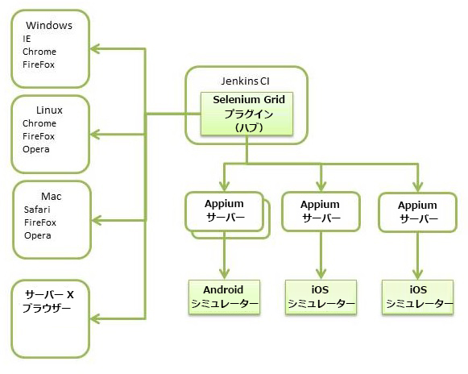

# モバイルアプリのテスト{#testing-mobile-apps}

{{ue-over-mobile}}

Given the wide range of devices on the market and devices being released, testing your Apps has become imperative. This is an area where functionality and usability may garner low reviews on an app store, but a single defect can result in your app being uninstalled. Careful attention must be made in your testing plans and quality assurance. The following link covers many of the topics that must be addressed in general, such as identifying your environment, defining test cases, types of testing, assumptions, and customer involvement. Also discussed are tools to help in the testing effort. Internal tools, like [Hobbes](/help/sites-developing/hobbes.md), can help with web-based UI testing. [Tough Day](/help/sites-developing/tough-day.md) can stress your instances with a simulated load. If your testing environment already has experience with 3rd-party tools, like Selenium, these too can be used.

When developing a mobile app, there are many new concerns specific to devices that have to be addressed along with those of traditional testing.

* Functional - Are all requirements met by your app?
* Usability - Is the app easy to use and understand by your customer?
* Performance - What happens during a spike in usage? Are the app elements, like swipes and carousels, quick and do not detract away from the experience?
* Failure or Interrupts - What happens when there is an incoming call or notification while your app is running? What happens if there is a network outage or power off?
* Installation and Updates - How is the installation experience? How are updates pushed out?
* Technical - Is your app consuming too much power from a device?
* ローカライズ – アプリ内のすべての領域が翻訳されていますか？
* 認定 – あなたのアプリは認定を受けていますか？ 顧客は、データプライバシーの法的要件をすべて満たしていると信頼できますか？

これらの質問は、自動テストと手動テストで回答する必要があります。

## テストの自動化 {#automated-testing}

画面サイズ、メモリの制約、入力方法、オペレーティングシステムなど、さまざまなデバイスに対応するために、ある程度の自動テストを実行する必要があります。 多くのテストケースをカバーしているだけでなく、新しい機能やデバイスが導入されたときに、回帰テストを迅速化することができます。 自動化ツールは、作業の重複を減らすか、制限することが理想的です。 ツールやフレームワークを利用して、テスト作業があらゆるプラットフォームに対応できるようにします。 次のグラフは、web ベースのUI テストとモバイルアプリテストの両方のテスト環境の簡略化された構造を示しています。 グラフの左側には、ブラウザーを持つ一連のSelenium ノードが表示されます。 SeleniumGridは、web ベースの一般的なUI テストをこれらのノードのいずれかにファームアウトできます。 Selenium ハブは、クロスプラットフォームのアプリテストのためにAppiumに接続することもできます。 シミュレータのみが表示されますが、adb、Android™およびXcodeの各ユーティリティをiOS デバイスに組み込むことができます。 このドキュメントの後半でリンクが提供され、前述のツールの具体的な詳細を確認できます。

## 手動テスト {#manual-testing}

自動テストに加えて、アプリは手動テストのサイクルを経る必要があります。 実際のデバイスでアプリを実行しているお客様は、スクリプトによって複製することはできません。 ここでも、多くのオプションがあります。 HockeyAppなどのプラットフォームを使用して、アクセスできるユーザーを定義し、フィードバックを収集できます。 また、UTest、ElusiveStars、Testinなどのサービスに、プロセス全体をアウトソーシングすることもできます。 内部テスターのグループが存在するが、デバイスのバリエーションが不足している場合は、クラウドサービスを使用して、それらのデバイスプールで手動テストを実行できます。 これを提供するサービスの1つがSauceLabsです。 また、PhoneGap Enterpriseにリモートでアプリを構築し、受け入れテストやデモのレベルとしてローカルデバイスにインストールすることもできます。 最新の機能とドキュメントについては、PhoneGap （`https://phonegap.com/`）のweb サイトを参照してください。 どのようなアプローチであれ、手作業によるテストでは次のことをおこなう必要があります。

* テスターを大量に獲得し，
* デバイスの大きなプールに対してテストします（理想的には実際のデバイスですが、実際のデバイスが利用できない場合はシミュレータ/エミュレータ）。
* 有益なフィードバックの提供：

   * クラッシュレポート，
   * 分析/トラッキング，
   * ユーザビリティ，
   * 注目すべき領域，
   * パフォーマンス，
   * データや電力の消費などを行います。

## ツール {#tools}

モバイルアプリのテストに使用できるツールは多岐にわたります。 機能、価格、サポート、カバー範囲など、特定の状況に応じて選択する必要があります。 次に、利用可能なツールとサービスの一部を簡単に説明します。

**Selenium**

* WebDriverをフィードし、さまざまなブラウザーを制御するためのテストスクリプト用APIを含むフレームワーク。
* Appiumで実際のデバイスでテストする場合に使用できます。
* SeleniumGridは、並列テスト用にノード間でテストを指示します。
* Selenium IDEは、テストケースの書き込みを減らすのに役立ちます。

詳しくは、[https://www.selenium.dev/](https://www.selenium.dev/) を参照してください。

**Testdroid**

* 継続的な統合フックとリアルデバイステストを備えたクラウドベースのテストサービス。
* デバイスの互換性をチェックし、ログを分析し、ビューをトラバースし、スクリーンショットを撮り、パフォーマンスをモニターするアプリWeb クローラーが含まれています。

詳しくは、[https://testdroid.com/](https://testdroid.com/)を参照してください。

**Appium**

* Appiumは、モバイルテストを自動化するための人気のあるクロスプラットフォームフレームワークです。
* また、インスペクターには、コードテストケースを支援する記録機能が含まれています。

詳しくは、[https://appium.io/](https://appium.io/)を参照してください。

**SauceLabs**

* SauceLabsは、クラウドベースのテストを提供し、継続的な統合と統合しています。
* テストは、クラウド環境で自動的に実行されるか、特定のデバイスやプラットフォームを開始して手動テストを実行し、問題のデバッグに役立てることができます。

詳しくは、[https://saucelabs.com/](https://saucelabs.com/)を参照してください。

<!--
**AppTestNow**

* An outsourcing service that tests your mobile apps.
* Included is a large pool of devices and offers a wide range of types of testing: performance, quality, functional, certification, localization, data consumption, and so on.

For more information, see [https://apptestnow.com/](https://apptestnow.com/).
-->

**HockeyApp**

* HockeyAppは手作業によるテストに該当し、モバイルアプリは個人用アプリストアにプッシュされ、テスターがダウンロードして試すことができます。

詳しくは、[https://hockeyapp.net/features/](https://hockeyapp.net/features/)を参照してください。

**ジェンキンス**

* テストツールではありませんが、Jenkinsは自動テスト用のバックボーンを提供する継続的な統合フレームワークです。 機能を拡張するために、数多くの3rd パーティのプラグインを利用できます。 例えば、SeleniumGrid プラグインは、Selenium ハブとノードの管理に役立つUIを提供します。

詳しくは、[https://www.jenkins.io/](https://www.jenkins.io/)および[https://plugins.jenkins.io/](https://plugins.jenkins.io/)を参照してください。
