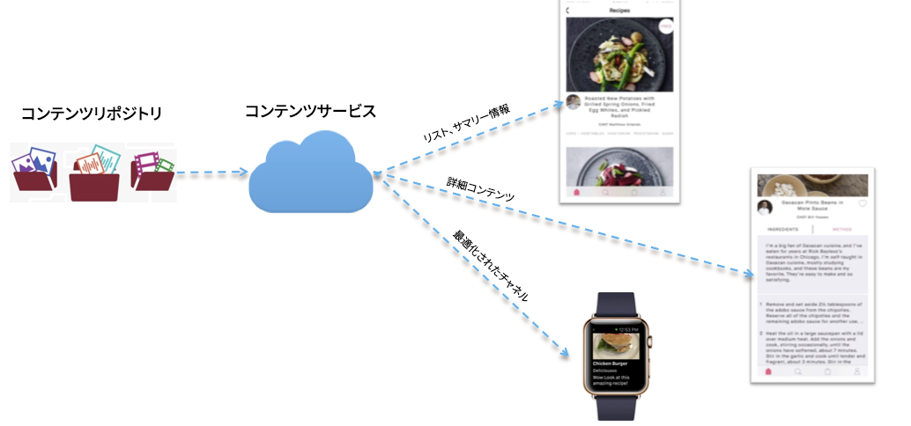

# コンテンツサービス{#content-services}

>[!NOTE]
>
>単一ページアプリケーションフレームワークを基にしたクライアント側レンダリング（React など）が必要なプロジェクトでは、SPA エディターを使用することをお勧めします。[詳細情報](/help/sites-developing/spa-overview.md)

>[!CAUTION]
>
>コンテンツサービス機能は、プレビューのみを目的として文書化されています。
>
>6.3 GA Service Pack 1 のリリースで変更されることがあります。

AEM MobileContent Servicesは、AEMで管理されるコンテンツをリクエストするための軽量な機能です。 これにより、AEMコンテンツリポジトリ(JCR)やWebフレームワーク(Sling)に関する深い知識を持つことなく、すべてのアプリ開発者がコンテンツを取得できる高パフォーマンスの方法を提供します。 これにより、リクエスト元のアプリケーションとコンテンツリポジトリとの切り離しが可能になります。

コンテンツサービスで導入されるいくつかの新しい AEM 構成要素を使用して、開発者は、コンテンツのリポジトリ構造を知らなくても AEM の管理対象アセットにアクセスできます。

これらの構成要素は、柔軟性を維持し、今後の拡張を可能にするために必要なもので、AEM の管理対象アセットと、コンテンツを使用するモバイルアプリとの間に抽象レイヤーを提供します。これにより、AEM コンテンツサービスは、ネイティブアプリケーションのコンテンツ要件と AEM コンテンツリポジトリの間の抽象レイヤーとして機能できます。

コンテンツサービスは、コンテンツをアセット、パッケージド HTML（HTML／CSS／JS）またはチャネル独立コンテンツとして配信できます。

>[!CAUTION]
>
>**前提条件:**
>
>コンテンツサービスの使用を始める前に、コンテンツサービスのフラグを有効にしてください。アプリ内でモデルの作成および管理を有効にするには、設定ブラウザーでデータモデルを有効にする必要があります。
>
>詳細は、『 **[Content Services](/help/mobile/developing-content-services.md)** の [管理](/help/sites-administering/configurations.md) 』および『設定ブラウザのドキュメント』を参照してください。

コンテンツサービスのフラグを設定し、設定ブラウザーでデータモデルを有効にしたら、以下のリソースを参照してください。これらのリソースで、AEM Mobile コンテンツサービスの使用と、モデル管理やエンティティ管理、AEM Mobile コンテンツサービスのコンテンツ配信／レンダリングなどのコンテンツサービスの概念について学習することができます。

* リポジトリ内のモデル
* レンダリングと配信
