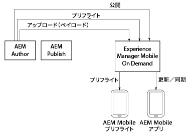

# AEM Mobile On-Demand{#aem-mobile-on-demand}

>[!NOTE]
>
>単一ページアプリケーションフレームワークを基にしたクライアント側レンダリング（React など）が必要なプロジェクトでは、SPA エディターを使用することをお勧めします。[詳細情報](/help/sites-developing/spa-overview.md)を参照してください。

>[!NOTE]
>
>If you are not using AEM as your content managment source, see [AEM Mobile On-Demand Services Help](https://helpx.adobe.com/jp/digital-publishing-solution/topics.html).

AEM には、コンテンツをモバイルアプリに統合するための複数のツールがあります。

以下の図に、AEM Mobile と On-Demand Services の様々なコンポーネントがどのように連携してモバイルアプリにコンテンツを配信するかを示します。

AEM Preflight アプリは、アプリおよびコンテンツを公開前にプレビューするテスト環境です。AEM Mobile アプリは、配信用に最終的にビルドされるアプリです。

>[!NOTE]
>
>To learn in-depth about Preflight app, see [Using the AEM Preflight app](https://helpx.adobe.com/jp/digital-publishing-solution/help/preflight-app.html) in AEM Mobile On-Demand Services Help.

>[!NOTE]
>
>上の図の AEM パブリッシュインスタンスは、AEM Mobile On-Demand Services への通常のデプロイシナリオでは必要ありません。

## 新しい Mobile アプリの開始 {#starting-a-new-mobile-app}

AEM Mobile は、完全な AEM プラットフォームを構成する 1 つの柱に過ぎません。

新しい AEM Mobile アプリエクスペリエンスを開始し、コンテンツを編集できるようになるまでには、複数の役割を持つメンバーが一体となって作業することが必要です。以下の役割は、新しい AEM Mobile アプリケーションを作成する開始点となります。

* **管理者**
* **開発者**
* **作成者**

>[!NOTE]
>
>AEM Mobile を操作して、この使用の手引きに記載された手順を実行する前に、ユーザーは AEM について十分に理解しておく必要があります。AEM の基本については[こちら](/help/sites-deploying/deploy.md)を参照してください。

### AEM Mobile アプリケーションダッシュボードについて {#understanding-the-aem-mobile-application-dashboard}

Before understanding the roles and responsibilities, the user should have throrough knowledge of **AEM Mobile Control Center** or the **Application Dashboard**. 詳しくは、[こちら](/help/mobile/mobile-apps-ondemand-application-dashboard.md)を参照してください。

### AEM 管理者 {#aem-administrator}

An ***AEM administrator*** is responsible for adding a new application to the AEM Mobile catalog, either by creating a new app using the creation wizard, or by importing an existing application. AEM administrators who create a new app using AEM Mobile&#39;s *creation wizard* typically select one of the desired app templates either from our out-of-the-box reference samples or (in most cases) a custom app template created by *AEM developers.*

AEM 管理者は、AEM Mobile On-Demand Services を使用してアプリを作成する際に以下のタスクを担当します。

* [AEM Mobile の設定](/help/mobile/aem-mobile-setup.md)
* [ユーザーとユーザーグループの設定](/help/mobile/aem-mobile-configure-users.md)
* [プリフライトによるプレビュー](/help/mobile/aem-mobile-manage-ondemand-services.md)
* [コンテンツサービスの管理](/help/mobile/developing-content-services.md)

To get started with an Administrator&#39;s roles and responsibilities, See [Administering Content to Use AEM Mobile On-Demand Services](/help/mobile/aem-mobile.md).

## AEM 開発者 {#aem-developer}

An **AEM developer** extends and creates custom web templates and components to enable the *AEM Author *to create beautiful and engaging mobile experiences. これらのテンプレートとコンポーネントは、モバイルアプリの世界向けに最適化されているだけではありません。ただし、デバイスとAEMサーバ（任意のリモートサーバ）の両方に対して、オムニチャネルサービスエンドポイントと通信します。 AEM&#39;s built-in content editor is used by *AEM Authors* to create rich and relevent experiences within the app, including integration with the rest of the Adobe Marketing Cloud.

AEM 開発者は、AEM Mobile On-Demand Services を使用してアプリを作成するときに以下のタスクを担当します。

* [アプリのテンプレートとコンポーネント](/help/mobile/app-templates-and-components1.md)
* [モバイルとコンテンツ同期](/help/mobile/mobile-ondemand-contentsync.md)
* [コンテンツプロパティとコンテンツの書き出し](/help/mobile/on-demand-content-properties-exporting.md)
* [AEM Mobile コンテンツサービスの開発](//help/mobile/developing-content-services.md)

To get started with Developer&#39;s roles and responsibilities, See [Developing AEM Content for AEM Mobile On-Demand Services](/help/mobile/aem-mobile-on-demand.md).

>[!NOTE]
>
>An *AEM developer&#39;s* role does not start and end with the development of templates and components. An *AEM developer* can create an entirely new app rather than simply extend the out-of-the-box reference implementation sample.

## AEM 作成者 {#aem-author}

***AEM作成者* (または *Marketer*)**は、カスタムの開発済みまたは標準搭載のテンプレートとコンポーネントを使用して、ページの追加と編集、コンポーネントのドラッグ&amp;ドロップ、DAMからのすべてのタイプのメディアの追加を行います。 AEM&#39;s built-in content editor is then used by *AEM Authors* to create rich and relevent experiences within the app, including integration with the rest of the Adobe Marketing Cloud.

AEM 作成者は、AEM Mobile On-Demand Services を使用してアプリを作成する場合、以下のトピックについて理解しておく必要があります。

* [AEM Mobile アプリケーションダッシュボード](/help/mobile/mobile-apps-ondemand-application-dashboard.md)
* [アプリケーションの作成および設定アクション](/help/mobile/mobile-apps-ondemand-application-create-configure-action.md)
* [クラウド設定](/help/mobile/mobile-on-demand-associating-an-on-demand-app-to-cloud-configuration.md)
* [コンテンツ管理](/help/mobile/mobile-apps-ondemand-manage-content-ondemand.md)
* [コンテンツサービス概要](/help/mobile/develop-content-as-a-service.md)

To get started with an Author&#39;s roles and responsibilities, See [Authoring AEM Content for AEM Mobile On-Demand Services App](/help/mobile/mobile-apps-ondemand.md).

>[!NOTE]
>
>また、AEM 作成者は、権利付与の設定、カードおよびレイアウトの作成、プッシュ通知の送信も担当します。AEM Mobile でのコンテンツのオーサリング、記事およびコレクションの管理、バナー、カード、レイアウトの作成方法について詳しくは、[AEM Mobile On-Demand ポータル](https://helpx.adobe.com/jp/digital-publishing-solution/topics.html#dynamicpod_reference_2)を参照してください。

