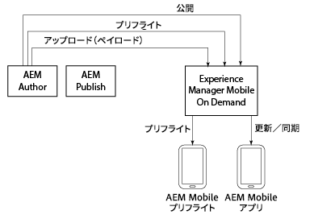

# AEM Mobile On-Demand{#aem-mobile-on-demand}

{{ue-over-mobile}}

>[!NOTE]
>
>Adobe Experience Manager（AEM）をコンテンツ管理ソースとして使用していない場合は、[AEM Mobile On-demand Services ヘルプ &#x200B;](https://helpx.adobe.com/digital-publishing-solution/topics.html)を参照してください。

AEMには、コンテンツをモバイルアプリケーションに統合するためのツールがいくつか用意されています。

次の図は、AEM Mobileとオンデマンドサービスのさまざまなコンポーネントが、モバイルアプリにコンテンツを配信するために、どのように組み合わされているかを示しています。

AEM Preflight アプリは、公開前にアプリとコンテンツをプレビューするためのテスト環境と見なすことができます。一方、AEM Mobile アプリは、配布用に構築された最終的なアプリです。

>[!NOTE]
>
>プリフライトアプリについて詳しくは、AEM Mobile On-demand Services ヘルプの「[AEM プリフライトアプリの使用](https://helpx.adobe.com/digital-publishing-solution/help/preflight-app.html)」を参照してください。

>[!NOTE]
>
>上記の図では、AEM Mobile On-demand Servicesへの一般的なデプロイメントシナリオにAEM パブリッシュインスタンスは必要ありません。

## 新しいモバイルアプリの起動 {#starting-a-new-mobile-app}

AEM Mobileは、AEMの包括的な基盤を構成する柱のひとつにすぎません。

新しいAEM Mobile アプリエクスペリエンスを開始するには、コンテンツを編集する準備が整う前に、役割の統合が必要です。 次のロールは、AEM Mobile アプリケーションを作成するための出発点となります。

* **管理者**
* **開発者**
* **作成者**

>[!NOTE]
>
>AEM Mobileを使用する前に、この入門ガイドの手順に従って、AEMに慣れ親しんでいる必要があります。 AEM [の基本については、こちらを参照してください](/help/sites-deploying/deploy.md)。

### AEM Mobile アプリケーションダッシュボードについて {#understanding-the-aem-mobile-application-dashboard}

役割と責任について理解する前に、**AEM Mobile Control Center**&#x200B;または&#x200B;**Application Dashboard**&#x200B;に関する十分な知識を持っている必要があります。 詳細については、[ここ](/help/mobile/mobile-apps-ondemand-application-dashboard.md)をクリックしてください。

### AEM 管理者 {#aem-administrator}

***AEM管理者***&#x200B;は、作成ウィザードを使用してアプリケーションを作成するか、既存のアプリケーションを読み込むか、AEM Mobile カタログにアプリケーションを追加する責任があります。 AEM Mobileの&#x200B;*creation wizard*&#x200B;を使用してアプリを作成するAEM管理者は、通常、Adobeのすぐに使える参照サンプルまたは（通常）AEM開発者&#x200B;*が作成したカスタムアプリテンプレートから、目的のアプリテンプレートのいずれかを選択します。*

AEM管理者は、AEM Mobile On-demand Servicesを使用してアプリを作成する際に、次の作業を担当します。

* [AEM Mobileの設定](/help/mobile/aem-mobile-setup.md)
* [ユーザーグループとユーザーグループの設定](/help/mobile/aem-mobile-configure-users.md)
* [プリフライトによるプレビュー](/help/mobile/aem-mobile-manage-ondemand-services.md)
* [コンテンツサービスの管理](/help/mobile/developing-content-services.md)

管理者の役割と責任を開始するには、[AEM Mobile On-demand Servicesを使用するためのコンテンツの管理](/help/mobile/aem-mobile.md)を参照してください。

## AEM Developer {#aem-developer}

**AEM開発者**&#x200B;は、カスタム web テンプレートとコンポーネントを拡張および作成して、*AEM オーサー*が美しく魅力的なモバイルエクスペリエンスを作成できるようにします。 これらのテンプレートとコンポーネントは、モバイルアプリ環境に最適化されているだけでなく、デバイスとAEM サーバー（任意のリモートサーバー）の両方をオムニチャネルサービスエンドポイントに通信します。 AEMの組み込みコンテンツエディターは、*AEM作成者*&#x200B;が使用して、他のAdobe Experience Cloudとの統合を含め、アプリ内でリッチで関連性の高いエクスペリエンスを作成します。

AEM開発者は、AEM Mobile On-demand Servicesを使用してアプリを作成する際に、次の作業を担当します。

* [アプリのテンプレートとコンポーネント](/help/mobile/app-templates-and-components1.md)
* [モバイルとコンテンツ同期](/help/mobile/mobile-ondemand-contentsync.md)
* [コンテンツのプロパティとコンテンツの書き出し](/help/mobile/on-demand-content-properties-exporting.md)
* [AEM Mobileコンテンツサービスの開発](/help/mobile/developing-content-services.md)

開発者の役割と責任について詳しくは、[AEM Mobile On-demand Services用AEM コンテンツの開発](/help/mobile/aem-mobile-on-demand.md)を参照してください。

>[!NOTE]
>
>*AEM開発者の*&#x200B;の役割は、テンプレートとコンポーネントの開発で開始および終了しません。 *AEM デベロッパー*&#x200B;は、標準の参照実装サンプルを拡張するだけで、まったく新しいアプリを作成できます。

## AEM オーサー {#aem-author}

***AEM作成者* （または&#x200B;*マーケター*） &#x200B;** は、カスタム開発された、または標準のテンプレートとコンポーネントを使用して、ページの追加と編集、コンポーネントのドラッグ&amp;ドロップ、画像、ビデオ、テキストフラグメント（コンテンツフラグメント）を含むあらゆるタイプのメディアの追加をDAMから行います。 AEMの組み込みコンテンツエディターは、*AEM作成者*によって使用され、他のAdobe Experience Cloudとの統合を含め、アプリ内でリッチで関連性の高いエクスペリエンスを作成します。

AEMの作成者は、AEM Mobile On-demand Servicesを使用してアプリを作成する際に、次のトピックを理解している必要があります。

* [AEM Mobile アプリケーションのダッシュボード](/help/mobile/mobile-apps-ondemand-application-dashboard.md)
* [アプリケーションの作成および設定アクション](/help/mobile/mobile-apps-ondemand-application-create-configure-action.md)
* [クラウド設定](/help/mobile/mobile-on-demand-associating-an-on-demand-app-to-cloud-configuration.md)
* [コンテンツ管理](/help/mobile/mobile-apps-ondemand-manage-content-ondemand.md)
* [コンテンツサービスの概要](/help/mobile/develop-content-as-a-service.md)

作成者の役割と責任を開始するには、[AEM Mobile On-demand Services アプリ用AEM コンテンツのオーサリング &#x200B;](/help/mobile/mobile-apps-ondemand.md)を参照してください。

>[!NOTE]
>
>AEMのオーサーは、使用権限の設定、カードとレイアウトの作成、プッシュ通知の送信も担当します。 また、コンテンツのオーサリング、記事やコレクションの管理、AEM Mobileでのバナー、カード、レイアウトの作成について詳しくは、[AEM Mobile オンデマンドポータル &#x200B;](https://helpx.adobe.com/digital-publishing-solution/topics.html#dynamicpod_reference_2)を参照してください。
