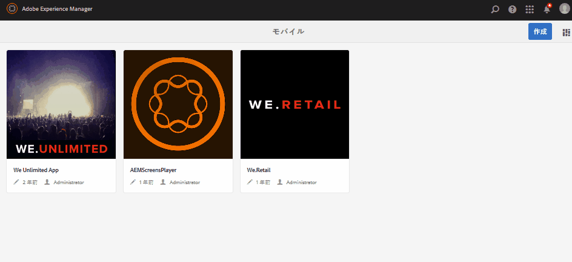

# アプリケーションの作成および設定アクション{#application-create-and-configuration-actions}

>[!NOTE]
>
>単一ページアプリケーションフレームワークを基にしたクライアント側レンダリング（React など）が必要なプロジェクトでは、SPA エディターを使用することをお勧めします。[詳細情報](/help/sites-developing/spa-overview.md)

## On-Demand アプリケーションの作成 {#creating-an-on-demand-application}

アプリを作成することは、多くの場合、AEM Mobile On-Demand コンテンツを作成および管理するための第一歩です。通常は AEM 管理者レベルで実行されます。アプリはモバイルデバイス上で表示可能なコンテンツのシェルを表し、記事、画像、コレクションなど、作成者が作成したコンテンツを表示できます。

アプリの詳細は、ダッシュボードまたは AEM Mobile コントロールセンターで表示できます。

>[!NOTE]
>
>ダッシュボードは、アプリのコンテンツ、メタデータおよび AEM Mobile On-Demand の接続ステータスの概要を把握できる一連の便利なタイルです。
>
>See [AEM Mobile Application Dashboard](/help/mobile/mobile-apps-ondemand-application-dashboard.md) for details.

**On-Demand アプリを作成するには：**

1. サイドレールから「**モバイル**」を選択します。
1. Select **Apps** from the Navigation.
1. 「**作成**」をクリックし、ドロップダウンから「**アプリ**」を選択します。
1. モバイルアプリのテンプレートを選択し、「**次へ**」をクリックします。
1. 「**タイトル**」、「**名前**」、「**説明**」など、アプリのプロパティを入力します。
1. 「**次へ**」をクリックします。
1. クラウド設定の詳細がわかっている場合は入力し、それ以外の場合は「**作成**」をクリックします。
1. 「**完了**」をクリックすると、新しい AEM モバイルアプリがカタログに表示されます。

>[!NOTE]
>
>このプロセスにより、AEM でアプリインスタンスを作成できます。

## アプリテンプレートの使用 {#using-app-templates}

アプリテンプレートにより、AEM での新しいアプリの作成に使用される、開発者が作成した既存のデザインを利用する簡単な方法が提供されます。

アプリテンプレートとはアプリのベースラインまたは基盤となるページテンプレートおよびコンポーネントをひとまとめにしたものと考えることができます。新規アプリを別のアプリのテンプレートに基づいて作成すると、作成元アプリと同じ開始点からアプリを作成することができます。

この機能を利用するには、既存のモバイルアプリテンプレートが必要です（またはアプリテンプレートを含むアプリがインストールされている必要があります）。

### 次のステップ {#the-next-step}

アプリケーションダッシュボードから On-Demand アプリを作成したら、次のステップでは、アプリをクラウド設定に関連付けます。

See [Associating your app to the Cloud Configuration](/help/mobile/mobile-on-demand-associating-an-on-demand-app-to-cloud-configuration.md) for more details.

### さらに先のステップ {#getting-ahead}

On-Demand アプリケーションの作成およびそのアプリのクラウド設定への関連付けについて学習したら、[コンテンツ管理アクション](/help/mobile/mobile-apps-ondemand-manage-content-ondemand.md)を参照してください。

**コンテンツ管理アクション**&#x200B;には、以下のコンテンツの作成と管理が含まれます。

* [記事の管理](/help/mobile/mobile-on-demand-managing-articles.md)
* [バナーの管理](/help/mobile/mobile-on-demand-managing-banners.md)
* [コレクションの管理](/help/mobile/mobile-on-demand-managing-collections.md)
* [共有リソースのアップロード](/help/mobile/mobile-on-demand-shared-resources.md)
* [コンテンツの公開／非公開](/help/mobile/mobile-on-demand-publishing-unpublishing.md)

管理者および開発者の役割と責任について詳しくは、以下のリソースを参照してください。

* [AEM Mobile On-demand Services の AEM コンテンツの開発](/help/mobile/aem-mobile-on-demand.md)
* [AEM Mobile On-demand Services を使用するためのコンテンツの管理](/help/mobile/aem-mobile.md)
