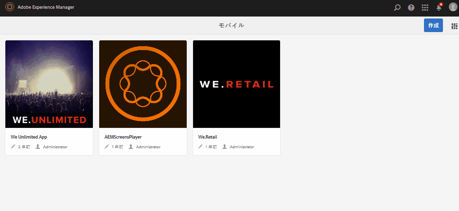

# アプリケーションの作成および設定アクション{#application-create-and-configuration-actions}

{{ue-over-mobile}}

## オンデマンドアプリケーションの作成 {#creating-an-on-demand-application}

多くの場合、アプリの作成は、AEM Mobile オンデマンドコンテンツの作成と管理の最初のステップであり、AEM管理者レベルで実行されます。 モバイルデバイスで表示できるコンテンツシェルを表し、記事、画像、コレクションなどの作成者が作成したコンテンツを表示できます。

アプリの詳細は、ダッシュボードまたはAEM Mobile Control Centerで確認できます。

>[!NOTE]
>
>ダッシュボードは、アプリのコンテンツ、メタデータ、AEM Mobile On-Demand接続ステータスの概要を示す一連の有用なタイルです。
>
>詳しくは、[AEM Mobile Application Dashboard](/help/mobile/mobile-apps-ondemand-application-dashboard.md)を参照してください。

**オンデマンド アプリを作成するには：**

1. サイドレールから「**モバイル**」を選択します。
1. ナビゲーションから「**アプリ**」を選択します。
1. **作成**&#x200B;をクリックし、ドロップダウンから&#x200B;**アプリ**&#x200B;を選択します。
1. モバイルアプリテンプレートを選択し、**次へ**&#x200B;をクリックします。
1. **タイトル**、**名前**、**説明**&#x200B;などのアプリプロパティを入力します。
1. 「**次へ**」をクリックします。
1. 分かっている場合は、クラウド設定の詳細を入力します。それ以外の場合は、**作成**&#x200B;をクリックします。
1. カタログで新しいAEM Mobile アプリを表示するには、**完了**&#x200B;をクリックします。

>[!NOTE]
>
>このプロセスにより、AEMでアプリインスタンスを作成できます。

## アプリテンプレートの使用 {#using-app-templates}

アプリテンプレートは、AEM内で新しいアプリを作成するために使用される、開発者が作成した既存のデザインを簡単に使用する方法を提供します。

アプリテンプレートとは？これは、アプリのベースラインや基盤を表すページテンプレートとコンポーネントのコレクションと考えてください。
別のアプリのテンプレートに基づいてアプリを作成する場合、作成元のアプリを表す開始点を持つアプリが表示されます。

この機能を使用するには、既存のモバイルアプリテンプレート（またはアプリテンプレートを持つアプリがインストールされている場合）が必要です。

### 次の手順 {#the-next-step}

アプリケーションダッシュボードからオンデマンドアプリを作成したら、次の手順でアプリをクラウド設定に関連付けます。

詳しくは、[&#x200B; アプリをクラウド設定に関連付ける](/help/mobile/mobile-on-demand-associating-an-on-demand-app-to-cloud-configuration.md)を参照してください。

### 一歩先を行く {#getting-ahead}

オンデマンドアプリケーションを作成し、そのアプリケーションをクラウド設定に関連付けることに慣れたら、[&#x200B; コンテンツ管理アクション &#x200B;](/help/mobile/mobile-apps-ondemand-manage-content-ondemand.md)を参照してください。

**コンテンツ管理アクション**&#x200B;には、次のコンテンツの作成と管理が含まれます。

* [記事の管理](/help/mobile/mobile-on-demand-managing-articles.md)
* [バナーの管理](/help/mobile/mobile-on-demand-managing-banners.md)
* [コレクションの管理](/help/mobile/mobile-on-demand-managing-collections.md)
* [共有リソースのアップロード](/help/mobile/mobile-on-demand-shared-resources.md)
* [コンテンツの公開／非公開](/help/mobile/mobile-on-demand-publishing-unpublishing.md)

管理者と開発者の役割と責任について詳しくは、以下のリソースを参照してください。

* [AEM Mobile On-demand Services向けAEM コンテンツの開発](/help/mobile/aem-mobile-on-demand.md)
* [AEM Mobile On-demand Servicesを使用するためのコンテンツの管理](/help/mobile/aem-mobile.md)
