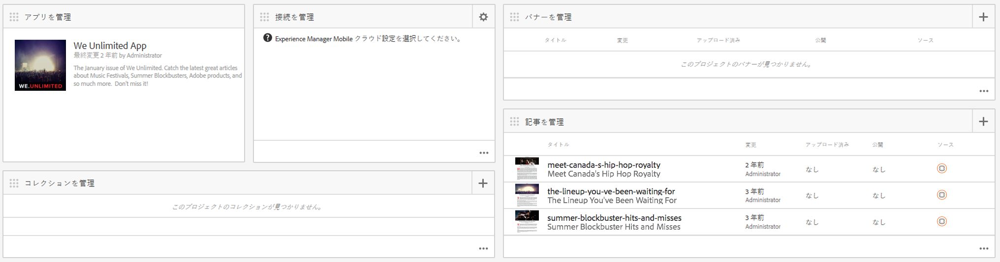
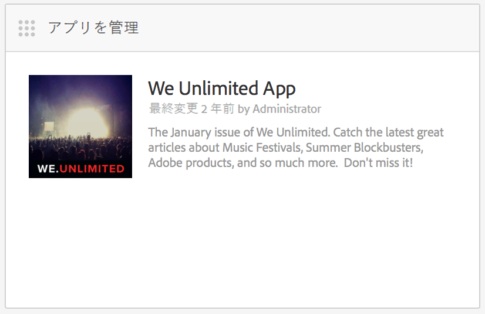
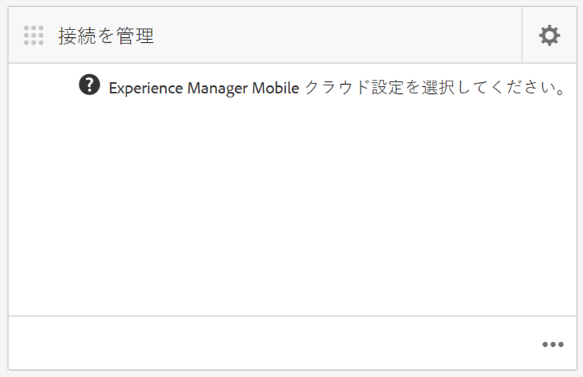
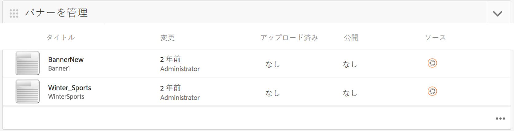
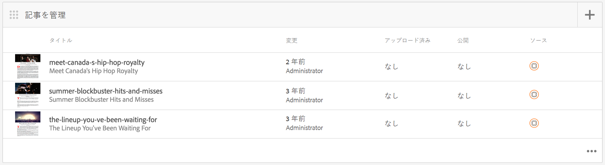
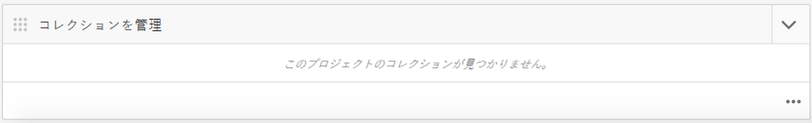

# AEM Mobile アプリケーションダッシュボード {#aem-mobile-application-dashboard}

>[!NOTE]
>
>単一ページアプリケーションフレームワークを基にしたクライアント側レンダリング（React など）が必要なプロジェクトでは、SPA エディターを使用することをお勧めします。[詳細情報](/help/sites-developing/spa-overview.md)

アプリケーションおよびモバイルアプリのコンテンツは、AEM Mobile アプリケーションダッシュボードまたはコントロールセンターから管理できます。

コントロールセンターの各タイルの右下隅にある「...」をクリックして、詳細を表示または編集できます。

>[!NOTE]
>
>タイルのグラバーアイコン（左上の 9 つのドット）をクリックすると、タイルの順序を並べ替えることができます。注文の変更はユーザーごとに異なります。

アプリコンテンツを管理するには、開発者、コンテンツ作成者および管理者が連携して作業する必要があります。作成者は、アプリ開発者が生成したテンプレートおよびコンポーネントに基づいて、ページを操作します。

最後に、管理者が更新されたアプリコンテンツを戦略的に公開します。

## アプリを管理タイル {#the-manage-app-tile}

The **Manage App** Tile displays available application information:

* タイトル
* 説明
* アイコン
* 最終変更
* 最終変更者

## 接続を管理タイル {#the-manage-connection-tile}

**接続を管理**&#x200B;タイルには、AEM Mobile On-Demand Services の接続情報が表示されます。

* クラウド設定名
* プロジェクトの名前と ID
* 接続ステータス

>[!NOTE]
>
>Mobile On-Demand のクラウド設定をセットアップするには、右上にある歯車をクリックします。
>
>詳しくは、[Mobile On-Demand Services の設定](/help/mobile/mobile-on-demand-associating-an-on-demand-app-to-cloud-configuration.md)を参照してください。

## エンティティの管理 {#managing-entities}

以下の 3 つのタイルには、アプリのコンテンツの状態の概要が表示されます。

* **バナー**
* **記事**
* **コレクション**

右下隅にある省略記号（...）をクリックすると、各タイルを展開して、より詳細なリストを表示できます。これらのリスト表示を使用すると、削除、アップロード、プロパティの編集など、一般的なMobile On Demandアクションにアクセスする代替方法を使用できます。

### バナーを管理タイル {#the-manage-banners-tile}

The **Manage Banners** tile allows you to manage the content for a banner. バナーでは以下の情報が表示されます。

* 画像
* **タイトル**：バナーの名前
* **変更**：AEM で最後に変更された日付
* **アップロード済み**：AEM から最後にアップロードされた日付
* **公開**：AEM からの最後の公開要求の日付
* **ソース**：ソース（AEM のローカル、または Mobile On Demand からのリモート）

The following image shows the **Manage Banners** tile in AEM Mobile Application Dashboard:

>[!NOTE]
>
>バナーの作成、削除または更新については、**[バナーの管理](/help/mobile/mobile-on-demand-managing-banners.md)**&#x200B;を参照してください。

### 記事を管理タイル {#the-manage-articles-tile}

**記事を管理**&#x200B;タイルでは、記事のコンテンツを管理できます。記事では以下の情報が表示されます。

* 画像
* **タイトル**：記事の名前
* **変更**：AEM で最後に変更された日付
* **アップロード済み**：AEM から最後にアップロードされた日付
* **公開**：AEM からの最後の公開要求の日付
* **ソース**：ソース（AEM ローカルまたは Mobile On-Demand からのリモート）

以下の図は、AEM Mobile アプリケーションダッシュボードの&#x200B;**記事を管理**&#x200B;タイルを示しています。

>[!NOTE]
>
>記事の作成、削除または更新については、[**記事の管理**](/help/mobile/mobile-on-demand-managing-articles.md)&#x200B;を参照してください。

### コレクションを管理タイル {#the-manage-collections-tile}

The **Manage Collections** tile allows you to manage the content for a collection. コレクションでは以下の情報が表示されます。

* 画像
* **タイトル**：コレクションの名前
* **変更**：AEM で最後に変更された日付
* **アップロード済み**：AEM から最後にアップロードされた日付
* **公開**：AEM からの最後の公開要求の日付
* **ソース**：ソース（AEM ローカルまたは Mobile On-Demand からのリモート）

The following image shows the **Manage Collections** tile in AEM Mobile Application Dashboard:

>[!NOTE]
>
>コレクションの作成、削除または更新については、**[コレクションの管理](/help/mobile/mobile-on-demand-managing-collections.md)**&#x200B;を参照してください。

### 次の手順 {#the-next-steps}

アプリケーションダッシュボードについて学習したら、モバイルアプリの作成について以下のリソースを参照してください。

* [アプリケーションの作成および設定アクション](/help/mobile/mobile-apps-ondemand-application-create-configure-action.md)
* [On-Demand アプリのクラウド設定への関連付け](/help/mobile/mobile-on-demand-associating-an-on-demand-app-to-cloud-configuration.md)
* [コンテンツ管理アクション](/help/mobile/mobile-apps-ondemand-manage-content-ondemand.md)

### その他のリソース {#additional-resources}

管理者および開発者の役割と責任について詳しくは、以下のリソースを参照してください。

* [AEM Mobile On-demand Services の AEM コンテンツの開発](/help/mobile/aem-mobile-on-demand.md)
* [AEM Mobile On-demand Services を使用するためのコンテンツの管理](/help/mobile/aem-mobile.md)

