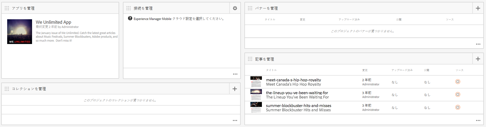
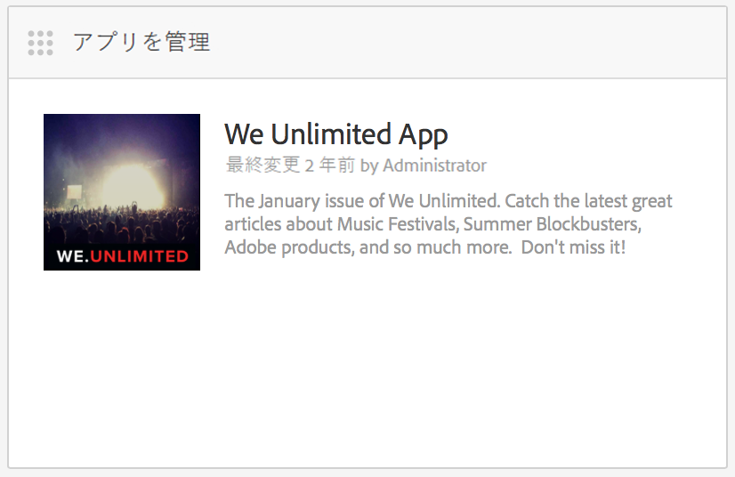
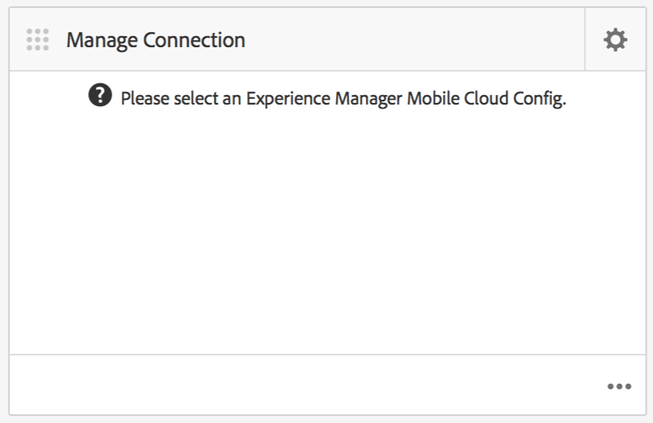
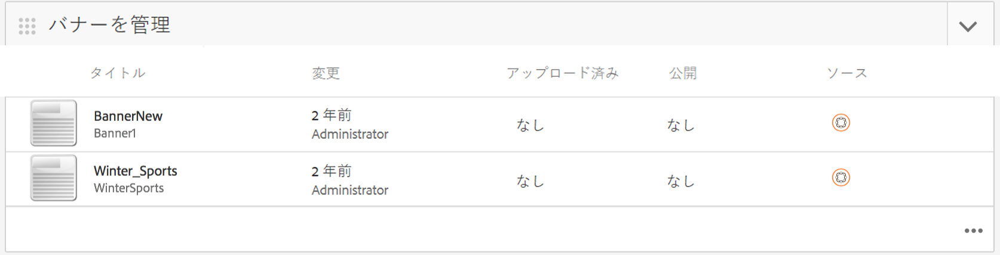
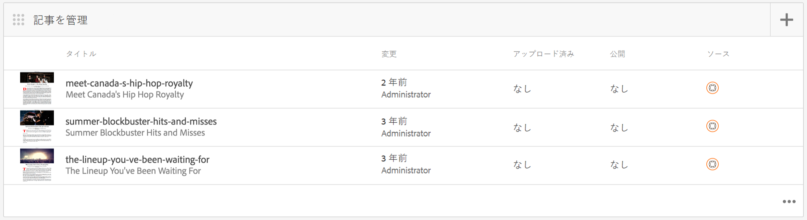
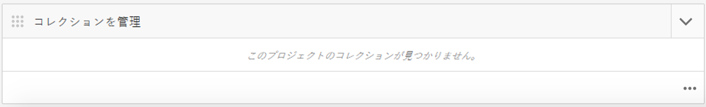

# AEM Mobile アプリケーションのダッシュボード {#aem-mobile-application-dashboard}

{{ue-over-mobile}}

AEM Mobile アプリケーションダッシュボードまたはコントロールセンターから、アプリケーションとモバイルアプリのコンテンツを管理できます。

コントロールセンターの各タイルをドリルダウンして、右下隅にある「。..」をクリックすることで、詳細を表示または編集できます。

>[!NOTE]
>
>タイルのグラバーアイコン（左上の9つのドット）をクリックすると、タイルの順序を並べ替えることができます。 注文の変更はユーザー固有であり、個々のユーザーごとに異なります。

アプリコンテンツの管理には、開発者、コンテンツ作成者、管理者などの共同作業が必要です。 作成者はページを操作します。ページは、アプリ開発者によって生成されたテンプレートとコンポーネントに基づいてオフになります。

最後に、管理者は更新されたアプリコンテンツを戦略的に公開します。

## アプリを管理タイル {#the-manage-app-tile}

**アプリの管理** タイルには、使用可能なアプリケーション情報が表示されます。

* タイトル
* 説明
* アイコン
* 最終変更日
* 最終変更者

## 接続を管理タイル {#the-manage-connection-tile}

**Manage Connection** タイルには、AEM Mobile On-demand Servicesの接続情報が表示されます。

* クラウド設定名
* プロジェクト名とID
* 接続ステータス

>[!NOTE]
>
>右上の歯車をクリックして、Mobile On-Demand Cloud設定を設定します。
>
>詳しくは、[&#x200B; モバイルオンデマンドサービスの設定](/help/mobile/mobile-on-demand-associating-an-on-demand-app-to-cloud-configuration.md)を参照してください。

## エンティティの管理 {#managing-entities}

これらの3つのタイルは、アプリのコンテンツの状態の概要を提供します。

* **バナー**
* **記事**
* **コレクション**

各タイルを展開して、省略記号（。..）をクリックすると、より詳細なリストビューを提供できます。 右下隅にあります。 これらのリストビューは、プロパティの削除、アップロード、編集など、Mobile On Demandの一般的なアクションにアクセスするための代替の方法を提供します。

### バナー管理タイル {#the-manage-banners-tile}

**バナーの管理** タイルを使用すると、バナーのコンテンツを管理できます。 バナーには次の情報が表示されます。

* 画像
* **TITLE**: バナーの名前
* **MODIFIED**：最終更新日：AEM
* **アップロード済み**：前回AEMからアップロード済み
* **公開済み**：最終公開済みリクエストフォーム AEM
* **SOURCE**: ソース （Mobile On DemandのAEM ローカルまたはリモート）

次の図は、AEM Mobile Application Dashboardの&#x200B;**Manage Banners** タイルを示しています。

>[!NOTE]
>
>バナーの作成、削除または更新については、**[バナーの管理](/help/mobile/mobile-on-demand-managing-banners.md)**&#x200B;を参照してください。

### 記事の管理タイル {#the-manage-articles-tile}

**記事の管理** タイルを使用すると、記事のコンテンツを管理できます。 記事には次の情報が表示されます。

* 画像
* **TITLE**：記事の名前
* **MODIFIED**：最終更新日：AEM
* **アップロード済み**：前回AEMからアップロード済み
* **公開済み**：最終公開済みリクエストフォーム AEM
* **SOURCE**: ソース （Mobile On-DemandのAEM ローカルまたはリモート）

次の図は、AEM Mobile Application Dashboardの&#x200B;**記事の管理** タイルを示しています。

>[!NOTE]
>
>記事の作成、削除または更新については、[**記事の管理**](/help/mobile/mobile-on-demand-managing-articles.md)&#x200B;を参照してください。

### コレクションを管理タイル {#the-manage-collections-tile}

**コレクションの管理** タイルを使用すると、コレクションのコンテンツを管理できます。 コレクションには次の情報が表示されます。

* 画像
* **TITLE**: コレクションの名前
* **MODIFIED**：最終更新日：AEM
* **アップロード済み**：前回AEMからアップロード済み
* **公開済み**：最終公開済みリクエストフォーム AEM
* **SOURCE**: ソース （Mobile On-DemandのAEM ローカルまたはリモート）

次の図は、AEM Mobile Application Dashboardの&#x200B;**Manage Collections** タイルを示しています。

>[!NOTE]
>
>コレクションの作成、削除または更新については、**[コレクションの管理](/help/mobile/mobile-on-demand-managing-collections.md)**&#x200B;を参照してください。

### 次の手順 {#the-next-steps}

アプリケーションダッシュボードについて理解したら、次のリソースを参照してモバイルアプリを作成します。

* [アプリケーションの作成および設定アクション](/help/mobile/mobile-apps-ondemand-application-create-configure-action.md)
* [オンデマンドアプリのクラウド設定への関連付け](/help/mobile/mobile-on-demand-associating-an-on-demand-app-to-cloud-configuration.md)
* [コンテンツ管理のアクション](/help/mobile/mobile-apps-ondemand-manage-content-ondemand.md)

### その他のリソース {#additional-resources}

管理者と開発者の役割と責任について詳しくは、以下のリソースを参照してください。

* [AEM Mobile On-demand Services向けAEM コンテンツの開発](/help/mobile/aem-mobile-on-demand.md)
* [AEM Mobile On-demand Servicesを使用するためのコンテンツの管理](/help/mobile/aem-mobile.md)
