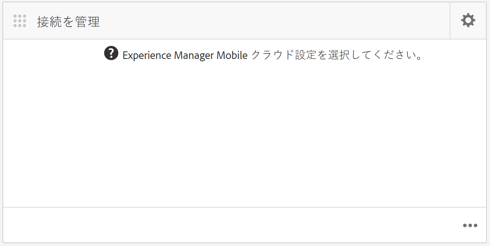
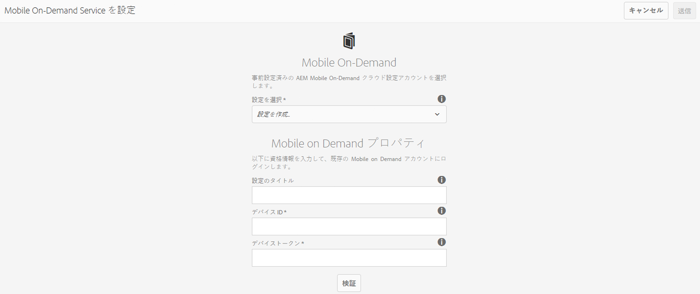
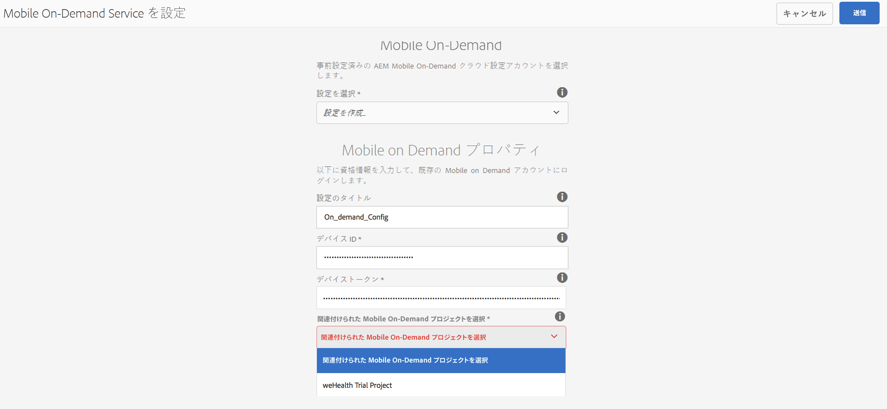
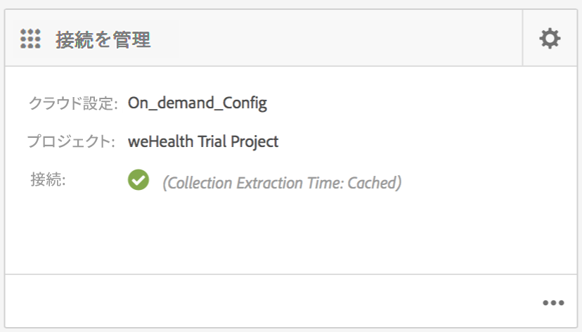
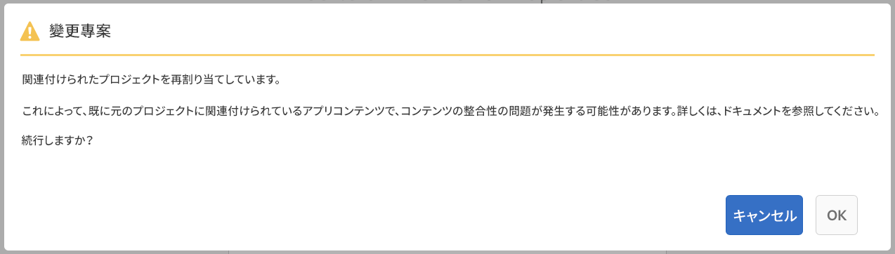

# クラウド設定{#cloud-configuration}

>[!NOTE]
>
>単一ページアプリケーションフレームワークを基にしたクライアント側レンダリング（React など）が必要なプロジェクトでは、SPA エディターを使用することをお勧めします。[詳細情報](/help/sites-developing/spa-overview.md)

On-Demand アプリをクラウド設定に関連付けることで、Adobe Experience Manager（AEM）は、双方向のリンクを確立し、Mobile On-Demand にホストされたプロジェクトと直接通信できます。アプリを Mobile On-Demand プロジェクトにリンクすることにより、記事、バナー、コレクションなどのコンテンツの作成を AEM 内で実行できるだけでなく、そのコンテンツを Mobile On-Demand に提供できます。

そこからコンテンツの公開、プレビュー、管理をおこなえます。また、既存の Mobile On-Demand コンテンツを AEM に読み込み、コンテンツの編集をおこなうこともできます。

## クラウド設定の実行 {#setting-up-cloud-configuration}

>[!CAUTION]
>
>On-Demandアプリのクラウド設定を開始する前に、「AEM MobileプロビジョニングとAEM Mobile On-demand Servicesクライアントの設定」を理解しておく必要があります。
>
>For details, See [Setting up AEM Mobile On-Demand Services](/help/mobile/aem-mobile-setup.md) in the Administering section.

Mobile On-Demand クラウドサービスを設定するには、アプリダッシュボードの&#x200B;**接続を管理**&#x200B;タイルの右上隅にある歯車をクリックします。

アプリダッシュボードや、利用できるタイルについて理解している必要があります。詳しくは、[AEM Mobile アプリケーションダッシュボード](/help/mobile/mobile-apps-ondemand-application-dashboard.md)を参照してください。

### クラウド設定へのリンクの設定 {#setting-up-link-to-cloud-configuration}

>[!CAUTION]
>
>On-Demand クライアントおよびクラウドを設定済みであることを確認します。
>
>For details, See [Setting up AEM Mobile On-Demand Services](/help/mobile/aem-mobile-setup.md) in the Administering section.

以下に、クラウド設定へのリンクの設定手順について説明します。

1. 「**モバイル**」で「**アプリ**」を選択し、カタログから Mobile On-Demand アプリを選択します。
1. Click the gear icon on the **Manage Connection** tile.

   

1. 既存の設定を入力するか、「**設定のタイトル**」、「**デバイス ID**」および「**デバイストークン**」を入力して新しい設定を作成します。

   

1. 「**デバイス ID**」および「**デバイストークン**」を確認したら、リストから On-Demand プロジェクトを選択します。

   「**送信**」をクリックします。

   

   **接続を管理**&#x200B;タイルにクラウド設定が表示されます。

   

   >[!CAUTION]
   >
   >ダッシュボードでプロジェクトを切り替え、このアプリを関連付けるプロジェクトを変更しようとすると、以下のようにコンテンツの整合性の問題についての警告が表示されます。

   

### 次の手順 {#the-next-steps}

アプリのクラウド設定が完了したら、コンテンツの管理について以下のリソースを参照してください。

* [記事の管理](/help/mobile/mobile-on-demand-managing-articles.md)
* [バナーの管理](/help/mobile/mobile-on-demand-managing-banners.md)
* [コレクションの管理](/help/mobile/mobile-on-demand-managing-collections.md)
* [共有リソースのアップロード](/help/mobile/mobile-on-demand-shared-resources.md)
* [コンテンツの公開／非公開](/help/mobile/mobile-on-demand-publishing-unpublishing.md)
* [プリフライトによるプレビュー](/help/mobile/aem-mobile-manage-ondemand-services.md)
