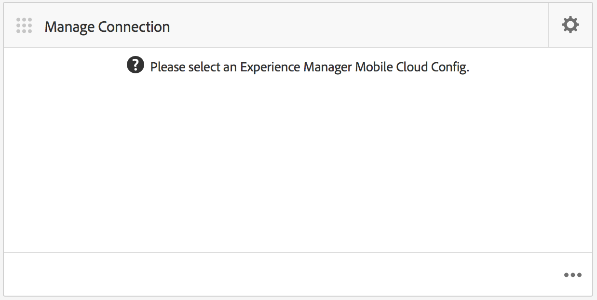
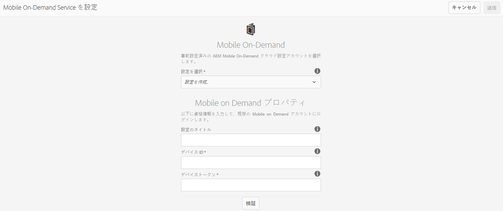
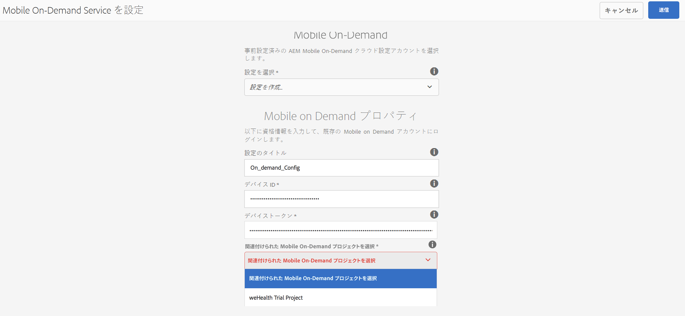
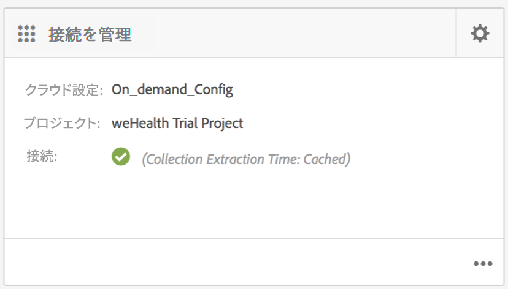
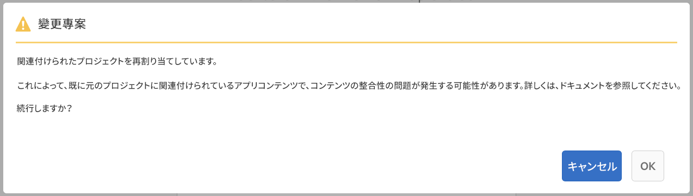

# クラウド設定{#cloud-configuration}

{{ue-over-mobile}}

オンデマンドアプリをクラウド設定に関連付けることで、Adobe Experience Manager（AEM）は、双方向リンクを確立して、モバイルオンデマンドホスティングプロジェクトと直接通信できます。 アプリをモバイルオンデマンドプロジェクトにリンクすることで、AEM内で記事、バナー、コレクションなどのコンテンツ作成を実行できるだけでなく、そのコンテンツをモバイルオンデマンドに提供することもできます。

それをもとに、コンテンツの公開、プレビュー、管理が可能になります。 また、既存のモバイルオンデマンドコンテンツをAEMに読み込んで、コンテンツ編集を実行することもできます。

## クラウド設定の設定 {#setting-up-cloud-configuration}

>[!CAUTION]
>
>オンデマンドアプリのクラウド設定を開始する前に、AEM MobileのプロビジョニングとAEM Mobile On-demand Services クライアントの設定に関する知識が必要です。
>
>詳しくは、「管理」セクションの「[AEM Mobile On-demand Servicesの設定](/help/mobile/aem-mobile-setup.md)」を参照してください。

モバイルオンデマンドクラウドサービスを設定するには、アプリダッシュボードの&#x200B;**接続を管理** タイルの右上隅にある上部の歯車をクリックします。

アプリダッシュボードと使用可能なタイルについて理解しておく必要があります。 詳しくは、[AEM Mobile Application Dashboard](/help/mobile/mobile-apps-ondemand-application-dashboard.md)を参照してください。

### クラウド設定へのリンクの設定 {#setting-up-link-to-cloud-configuration}

>[!CAUTION]
>
>既存のオンデマンドクライアントとクラウド設定があることを確認します。
>
>詳しくは、「管理」セクションの「[AEM Mobile On-demand Servicesの設定](/help/mobile/aem-mobile-setup.md)」を参照してください。

次の手順では、クラウド設定へのリンクの設定について説明します。

1. **モバイル**&#x200B;から、**アプリ**&#x200B;を選択し、カタログからモバイルオンデマンドアプリを選択します。
1. **接続を管理** タイルの歯車アイコンをクリックします。

   

1. 既存の設定を入力するか、**設定タイトル**、**デバイス ID**、**デバイストークン**&#x200B;を入力して設定を作成します。

   

1. **デバイス ID**&#x200B;と&#x200B;**デバイストークン**&#x200B;が確認されたら、リストからオンデマンドプロジェクトを選択します。

   「**送信**」をクリックします。

   

   **接続を管理** タイルにクラウド設定が表示されます。

   

   >[!CAUTION]
   >
   >ダッシュボードでプロジェクトを切り替える際に、このアプリが関連付けられているプロジェクトを変更しようとすると、次の図に示すように、コンテンツの整合性の問題に関する警告が表示されます。

   

### 次の手順 {#the-next-steps}

アプリのクラウド設定を設定したら、コンテンツの管理に関する次のリソースを参照してください。

* [記事の管理](/help/mobile/mobile-on-demand-managing-articles.md)
* [バナーの管理](/help/mobile/mobile-on-demand-managing-banners.md)
* [コレクションの管理](/help/mobile/mobile-on-demand-managing-collections.md)
* [共有リソースのアップロード](/help/mobile/mobile-on-demand-shared-resources.md)
* [コンテンツの公開/非公開](/help/mobile/mobile-on-demand-publishing-unpublishing.md)
* [プリフライトによるプレビュー](/help/mobile/aem-mobile-manage-ondemand-services.md)
