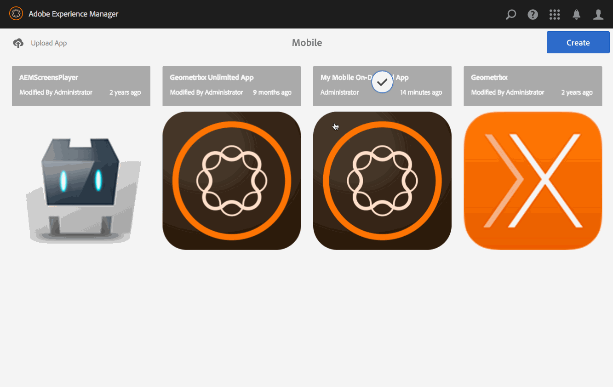
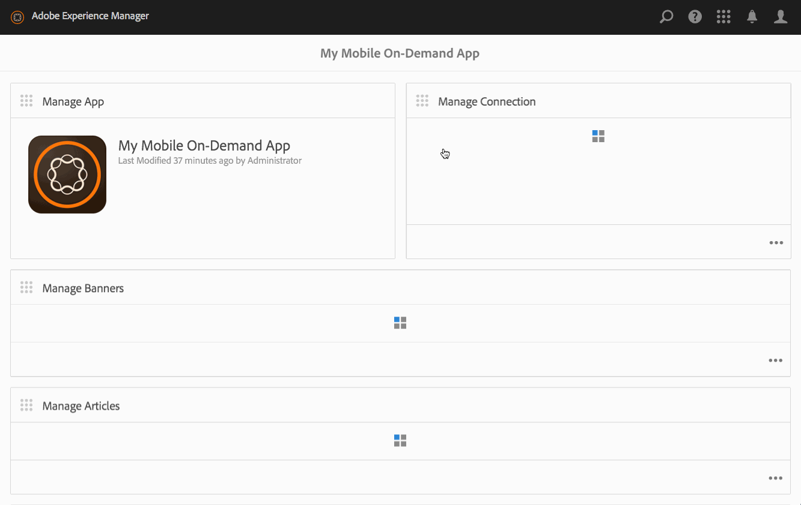

# 記事の管理{#managing-articles}

{{ue-over-mobile}}

コンテンツ管理アクションは、アプリケーション内で記事を作成および管理するのに役立つ構成要素です。 アプリケーション内の記事に対して、次のアクションが実行されます。

## 記事の概要 {#articles-overview}

記事は、情報を伝えるためにアートと一緒にテキストを表します。

>[!NOTE]
>
>AEM Mobile アプリケーションの次のトピックについて詳しくは、オンラインヘルプの次の資料を参照してください。
>
>* [&#x200B; デザインに関する考慮事項](https://helpx.adobe.com/digital-publishing-solution/help/design-app.html)
>
>* [記事の管理](https://helpx.adobe.com/digital-publishing-solution/help/creating-articles.html)
>

## 記事の作成 {#creating-an-article}

記事を作成する一般的なワークフローは次のとおりです。

1. サイドレールから「**モバイル**」を選択します。
1. モバイル版から、カタログからMobile On-Demand アプリを選択します。
1. **記事を管理** タイルの右上隅にある下向き矢印をクリックします。
1. 記事テンプレートを選択し、**次へ**&#x200B;をクリックします。
1. ウィザードの各ステップを実行して、新しい記事の作成を続行します。
1. 準備ができたら、**作成**&#x200B;をクリックします。
1. 新しい記事が&#x200B;**記事の管理** タイルに表示されます。

## 新しい記事の読み込み {#importing-a-new-article}

既存のモバイルオンデマンドコンテンツは、モバイルオンデマンドからAEMにダウンロード（インポート）できます。 これにより、ローカルコンテンツの編集と表示が可能になります。

>[!NOTE]
>
>読み込みには画像は含まれません。

新しい記事を読み込むワークフロー

1. モバイル版から、カタログからMobile On-Demand アプリを選択します。
1. **記事を管理** タイルの右上隅にある下向き矢印をクリックし、「記事を読み込む」を選択します。
1. ダイアログで「**記事を読み込み**」をクリックし、「閉じる」をクリックします。
1. モバイルオンデマンド記事が&#x200B;**記事の管理** タイルに表示されるようになりました。

>[!CAUTION]
>
>まずモバイルオンデマンド接続を関連付けます。

## 記事の編集 {#editing-an-article}

AEMのドラッグ&amp;ドロップエディターを使用して、記事を追加または変更します。 テキストや画像などのコンポーネントを追加または削除できます。 DAM Assetsの画像を挿入できます。

>[!CAUTION]
>
>AEMで作成された記事のみがエディターで開くことができます。

記事を編集するワークフロー：

1. モバイル版から、カタログからMobile On-Demand アプリを選択します。
1. **記事を管理** タイルからAEM ソースの記事を選択します。
1. リスト表示からハイライト表示された記事をクリックして、コンテンツエディターで開きます。
1. コンテンツエディターを使用して、記事コンテンツ（原稿、画像、テキストなど）をドラッグします。

### アーティクル内のメタデータの表示と編集 {#viewing-and-editing-the-metadata-within-an-article}

記事やバナーなどのコンテンツには、タイトル、説明、画像などの多数のプロパティがあります。 このアクションは、このようなプロパティを表示および変更するために使用されます。 オプションで、これらの変更は保存時にMobile On-Demandにアップロードできます。

記事を表示/編集するための一般的なワークフロー：

1. モバイル版から、カタログからMobile On-Demand アプリを選択します。
1. **記事を管理** タイルから記事を選択します。

1. アクションバーから「**プロパティを表示**」を選択します。
1. その記事で利用可能なすべてのメタデータを表示します。
1. 必要に応じてメタデータを編集し、完了したら「**保存**」をクリックします。
1. 必要に応じて、変更をすぐにMobile On-Demandにアップロードします。

## 記事のアップロード {#uploading-an-article}

アップロードアクションは、選択したコンテンツをコピーし、Mobile On-Demand プロジェクトに追加します。 既存のモバイルオンデマンドコンテンツは、新しいバージョンに置き換えられます。

記事をアップロードするための一般的なワークフロー：

1. **Mobile**&#x200B;から、カタログからMobile On-Demand アプリを選択します。
1. **記事を管理** タイルで、Mobile On-Demandにアップロードする記事を選択します。
1. 必要に応じて、リストビューからさらに記事を追加します。
1. アクションバーから「**アップロード**」を選択し、ダイアログの「アップロード」をクリックします。
1. これで、記事がMobile On-Demandにアップロードされました。

## 記事の削除 {#deleting-an-article}

この操作は、選択したコンテンツをMobile On-Demandから、またオプションでローカルのAEM インスタンスから削除します。

記事を削除する一般的なワークフロー：

1. モバイル版から、カタログからMobile On-Demand アプリを選択します。
1. **記事を管理** タイルで削除する記事を選択します。
1. リストで選択されていることを確認します。必要に応じて、他のユーザーを選択して削除します。
1. アクションバーから「**削除**」をクリックします。
1. AEMおよびMobile On-Demandから削除するかどうかを確認します。
1. 「**削除**」をクリックします。
1. 記事がリストから削除されました。

### 次の手順 {#the-next-steps}

記事の管理について学んだら、を参照してください。

* [バナーの管理](/help/mobile/mobile-on-demand-managing-banners.md)
* [コレクションの管理](/help/mobile/mobile-on-demand-managing-collections.md)
* [共有リソースのアップロード](/help/mobile/mobile-on-demand-shared-resources.md)
* [コンテンツの公開/非公開](/help/mobile/mobile-on-demand-publishing-unpublishing.md)
* [プリフライトによるプレビュー](/help/mobile/aem-mobile-manage-ondemand-services.md)
