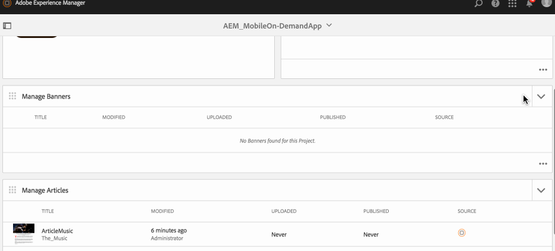
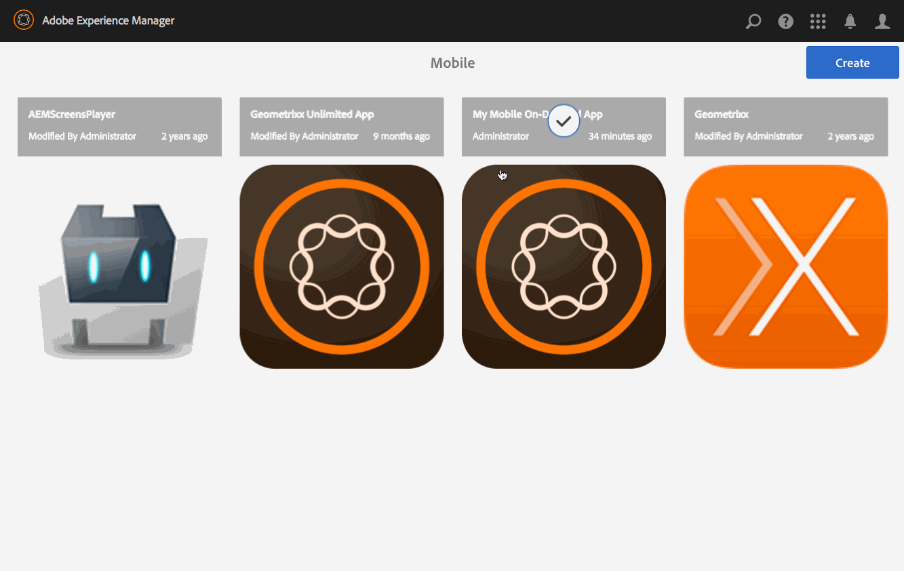

# バナーの管理{#managing-banners}

{{ue-over-mobile}}

コンテンツ管理アクションは、アプリケーション内でコンテンツを作成および管理するのに役立つ構成要素です。 アプリケーション内のコンテンツに対して、次のアクションが実行されます。

## バナーの概要 {#banners-overview}

バナーは、通常、プロモーションリンクのグラフィックを表します。

>[!NOTE]
>
>AEM Mobile アプリケーションの次のトピックについて詳しくは、オンラインヘルプの次の資料を参照してください。
>
>* [&#x200B; デザインに関する考慮事項](https://helpx.adobe.com/digital-publishing-solution/help/design-app.html)
>
>* [&#x200B; バナーの作成](https://helpx.adobe.com/digital-publishing-solution/help/creating-banners.html)
>

## バナーの作成 {#creating-a-banner}

記事を作成する一般的なワークフローは次のとおりです。

1. サイドレールから「**モバイル**」を選択します。
1. モバイル版から、カタログからMobile On-Demand アプリを選択します。
1. **バナーを管理** タイルの右上隅にある下向き矢印をクリックします。
1. ウィザードの各ステップを実行して、新しいバナーの作成を続行します。
1. 準備ができたら、**作成**&#x200B;をクリックします。
1. 新しいバナーが&#x200B;**バナーを管理** タイルに表示されます。

## 新しいバナーの読み込み {#importing-a-new-banner}

既存のモバイルオンデマンドコンテンツは、モバイルオンデマンドからAEMにダウンロード（インポート）できます。 これにより、ローカルコンテンツの編集と表示が可能になります。

>[!NOTE]
>
>読み込みには画像は含まれません。

新しい記事を読み込むワークフロー

1. モバイル版から、カタログからMobile On-Demand アプリを選択します。
1. **バナーを管理** タイルの右上隅にある下向き矢印をクリックし、「バナーを読み込む」を選択します。
1. ダイアログで「**バナーを読み込み**」をクリックし、「閉じる」をクリックします。
1. モバイルオンデマンド記事が&#x200B;**バナーの管理** タイルに表示されるようになりました。

>[!CAUTION]
>
>まずモバイルオンデマンド接続を関連付けます。

## バナーの編集 {#editing-a-banner}

AEMのドラッグ&amp;ドロップエディターを使用して、記事を追加または変更します。 テキストや画像などのコンポーネントを追加または削除できます。 DAM Assetsの画像を挿入できます。

>[!CAUTION]
>
>AEMで作成されたバナーのみがエディターで開くことができます。

記事を編集するワークフロー：

1. モバイル版から、カタログからMobile On-Demand アプリを選択します。
1. 「バナーを管理&#x200B;**」タイルからAEMのソース**&#x200B;バナーを選択します。
1. リストビューでハイライト表示されているバナーをクリックして、コンテンツエディターで開きます。
1. コンテンツエディターを使用して、バナーコンテンツ（原稿、画像、テキストなど）をドラッグします。

### バナー内のメタデータの表示と編集 {#viewing-and-editing-the-metadata-within-a-banner}

バナーには、タイトル、説明、画像などの多数のプロパティがあります。 このアクションは、このようなプロパティを表示および変更するために使用されます。 オプションで、これらの変更は保存時にMobile On-Demandにアップロードできます。

記事を表示/編集するための一般的なワークフロー：

1. モバイル版から、カタログからMobile On-Demand アプリを選択します。
1. 「**バナーを管理**」タイルからバナーを選択します。

1. アクションバーから「**プロパティ**」を選択します。
1. その記事で利用可能なすべてのメタデータを表示します。
1. 必要に応じてメタデータを編集し、完了したら「**保存**」をクリックします。
1. 必要に応じて、変更をすぐにMobile On-Demandにアップロードします。

## バナーのアップロード {#uploading-a-banner}

アップロードアクションは、選択したコンテンツをコピーし、Mobile On-Demand プロジェクトに追加します。 既存のモバイルオンデマンドコンテンツは、新しいバージョンに置き換えられます。

バナーをアップロードするための一般的なワークフロー：

1. **Mobile**&#x200B;から、カタログからMobile On-Demand アプリを選択します。
1. **バナーを管理** タイルで、Mobile On-Demandにアップロードするバナーを選択します。
1. 必要に応じて、リストビューからさらにバナーを追加します。
1. アクションバーから「**アップロード**」を選択し、ダイアログの「アップロード」をクリックします。
1. これで、バナーがMobile On-Demandにアップロードされました。

## バナーの削除 {#deleting-a-banner}

この操作は、選択したバナーをMobile On-Demandから、またオプションでローカルのAEM インスタンスから削除します。

バナーを削除する一般的なワークフロー：

1. モバイル版から、カタログからMobile On-Demand アプリを選択します。
1. **バナーを管理** タイルで削除するバナーを選択します。
1. リストで選択されていることを確認します（必要に応じて削除する他のユーザーを選択します）。
1. アクションバーから「**削除**」をクリックします。
1. AEMおよびMobile On-Demandから削除するかどうかを確認します。
1. 「**削除**」をクリックします。
1. これで、バナーがリストから削除されました。

### 次の手順 {#the-next-steps}

バナーの管理に関する情報については、を参照してください。

* [記事の管理](/help/mobile/mobile-on-demand-managing-articles.md)
* [コレクションの管理](/help/mobile/mobile-on-demand-managing-collections.md)
* [共有リソースのアップロード](/help/mobile/mobile-on-demand-shared-resources.md)
* [コンテンツの公開/非公開](/help/mobile/mobile-on-demand-publishing-unpublishing.md)
* [プリフライトによるプレビュー](/help/mobile/aem-mobile-manage-ondemand-services.md)
