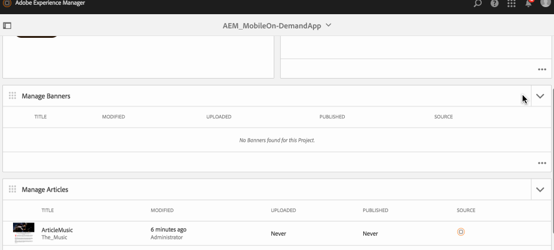

# バナーの管理{#managing-banners}

>[!NOTE]
>
>単一ページアプリケーションフレームワークを基にしたクライアント側レンダリング（React など）が必要なプロジェクトでは、SPA エディターを使用することをお勧めします。[詳細情報](/help/sites-developing/spa-overview.md)

コンテンツ管理アクションは、アプリケーション内でコンテンツを作成および管理するのに役立つ構築ブロックです。アプリケーション内のコンテンツに対して以下のアクションを実行します。

## バナーの概要 {#banners-overview}

バナーは、通常、グラフィカルなプロモーションリンクです。

>[!NOTE]
>
>AEM Mobile アプリの以下のトピックについては、オンラインヘルプの以下のリソースを参照してください。
>
>* [デザインに関する考慮事項](https://helpx.adobe.com/jp/digital-publishing-solution/help/design-app.html)
   >
   >
* [バナーの作成](https://helpx.adobe.com/jp/digital-publishing-solution/help/creating-banners.html)

>

## バナーの作成 {#creating-a-banner}

記事を作成する一般的なワークフローは以下のとおりです。

1. サイドレールから「**モバイル**」を選択します。
1. モバイルで、カタログから Mobile On-Demand アプリを選択します。
1. **バナーを管理**&#x200B;タイルの右上隅にある下矢印をクリックします。
1. ウィザードの各ステップで必要な情報を入力して、新しいバナーの作成を続行します。
1. 準備ができたら、「**作成**」をクリックします。
1. **バナーを管理**&#x200B;タイルに新しいバナーが表示されます。

## 新しいバナーの読み込み {#importing-a-new-banner}

既存の Mobile On-Demand コンテンツを Mobile On-Demand から AEM にダウンロードする（読み込む）ことができます。これにより、ローカルのコンテンツを編集および表示できます。

>[!NOTE]
>
>読み込みには画像は含まれません。

新しい記事を読み込むワークフローは以下のとおりです。

1. Mobileで、カタログからMobile On-Demand Appを選択します。
1. **バナーを管理**&#x200B;タイルの右上隅にある下矢印をクリックして、「バナーを読み込む」を選択します。
1. ダイアログで「**バナーを読み込む**」をクリックし、「閉じる」をクリックします。
1. Your Mobile On-Demand articles now appear in the **Manage Banners** tile.

>[!CAUTION]
>
>最初に Mobile On-Demand の接続を関連付ける必要があります。

## バナーの編集 {#editing-a-banner}

記事を追加または変更するには、組み込みの AEM ドラッグ＆ドロップエディターを使用します。テキストや画像などのコンポーネントを追加したり、削除したりすることができます。DAM アセットの画像を挿入することもできます。

>[!CAUTION]
>
>エディターで開くことができるのは、AEM で作成されたバナーのみです。

バナーを編集するワークフローは以下のとおりです。

1. モバイルで、カタログから Mobile On-Demand アプリを選択します。
1. 「**バナーの管理**」タイルからAEMのソースバナーを選択します。
1. リスト表示で、ハイライトされたバナーをクリックし、コンテンツエディターで開きます。
1. コンテンツエディターを使用して、バナーの内容（原稿、画像、テキストなど）をドラッグします。

### バナー内のメタデータの表示および編集 {#viewing-and-editing-the-metadata-within-a-banner}

バナーには、タイトル、説明、画像など多くのプロパティがあります。このようなプロパティを表示および変更するには、この操作を使用します。オプションで、保存時に Mobile On-Demand に変更内容をアップロードすることもできます。

記事を表示／編集する一般的なワークフローは以下のとおりです。

1. モバイルで、カタログから Mobile On-Demand アプリを選択します。
1. Choose a banner from the **Manage Banners** tile.

1. アクションバーから「**プロパティ**」を選択します。
1. コレクションの使用可能なすべてのメタデータを確認します。
1. 必要に応じてメタデータを編集し、終わったら「**保存**」をクリックします。
1. 必要に応じて、変更内容を即座にMobile On-Demandにアップロードします。

## バナーのアップロード {#uploading-a-banner}

アップロード操作では、選択したコンテンツがコピーされ、 Mobile On-Demand プロジェクトに追加されます。既存の Mobile On-Demand コンテンツは新しいバージョンに置き換えられます。

バナーをアップロードする一般的なワークフローは以下のとおりです。

1. From **Mobile**, choose your Mobile On-Demand app from the catalog.
1. In the **Manage Banners** tile, select a banner for upload to Mobile On-Demand.
1. 必要に応じて、リスト表示からさらにバナーを追加します。
1. アクションバーから「**アップロード**」を選択し、ダイアログで「アップロード」をクリックします。
1. これで、バナーがMobile On-Demandにアップロードされました。

## バナーの削除 {#deleting-a-banner}

この操作により、選択したバナーがMobile On-Demandから削除されます。また、オプションでローカルのAEMインスタンスからも削除されます。

バナーを削除する一般的なワークフローは以下のとおりです。

1. モバイルで、カタログから Mobile On-Demand アプリを選択します。
1. **バナーを管理**&#x200B;タイルで、削除するバナーを選択します。
1. 削除するバナーがリスト内で選択されていることを確認します（必要に応じて、削除する他のバナーを選択します）。
1. アクションバーから「**削除**」をクリックします。
1.  Mobile On-Demand だけでなく、AEM からも削除するかどうかを確認します。
1. 「**削除**」をクリックします。
1. バナーがリストから削除されます。

### 次の手順 {#the-next-steps}

バナーの管理について学習したら、以下を参照してください。

* [記事の管理](/help/mobile/mobile-on-demand-managing-articles.md)
* [コレクションの管理](/help/mobile/mobile-on-demand-managing-collections.md)
* [共有リソースのアップロード](/help/mobile/mobile-on-demand-shared-resources.md)
* [コンテンツの公開／非公開](/help/mobile/mobile-on-demand-publishing-unpublishing.md)
* [プリフライトによるプレビュー](/help/mobile/aem-mobile-manage-ondemand-services.md)
