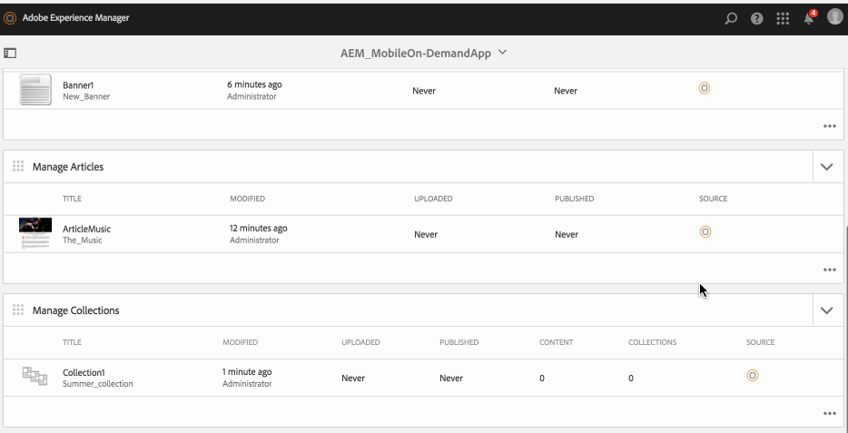

# コレクションの管理{#managing-collections}

{{ue-over-mobile}}

コンテンツ管理アクションは、アプリケーション内でコンテンツを作成および管理するのに役立つ構成要素です。 アプリケーション内のコンテンツに対して、次のアクションが実行されます。

## コレクションの概要 {#collections-overview}

コレクションは、表紙のテーマに合った記事やバナーなどのコンテンツで埋め込まれた、明確に定義された&#x200B;*バケット*&#x200B;を表します。

>[!NOTE]
>
>AEM Mobile アプリケーションの次のトピックについて詳しくは、オンラインヘルプの次の資料を参照してください。
>
>* [ デザインに関する考慮事項](https://helpx.adobe.com/digital-publishing-solution/help/design-app.html)
>
>* [ コレクションの管理](https://helpx.adobe.com/digital-publishing-solution/help/creating-collections.html)
>

## コレクションの作成 {#creating-a-collection}

コレクションを作成する一般的なワークフローは次のとおりです。

1. サイドレールから「**モバイル**」を選択します。
1. モバイル版から、カタログからMobile On-Demand アプリを選択します。
1. **コレクションを管理** タイルの右上隅にある下向き矢印をクリックします。
1. ウィザードの各ステップを実行して、新しい記事の作成を続行します。
1. 準備ができたら、**作成**&#x200B;をクリックします。
1. 新しい記事が&#x200B;**コレクションの管理** タイルに表示されます。

## 新しいコレクションの読み込み {#importing-a-new-collection}

既存のモバイルオンデマンドコンテンツは、モバイルオンデマンドからAEMにダウンロード（インポート）できます。 これにより、ローカルコンテンツの編集と表示が可能になります。

>[!NOTE]
>
>読み込みには画像は含まれません。

新しいコレクションを読み込むワークフロー

1. モバイル版から、カタログからMobile On-Demand アプリを選択します。
1. **コレクションを管理** タイルの右上隅にある下向き矢印をクリックし、「コレクションを読み込む」を選択します。
1. ダイアログで「**コレクションを読み込み**」をクリックし、「閉じる」をクリックします。
1. モバイルオンデマンドコレクションが&#x200B;**コレクションの管理** タイルに表示されるようになりました。

>[!CAUTION]
>
>まずモバイルオンデマンド接続を関連付けます。

## コレクションの編集 {#editing-a-collection}

AEMのドラッグ&amp;ドロップエディターを使用して、記事を追加または変更します。 テキストや画像などのコンポーネントを追加または削除できます。 DAM Assetsの画像を挿入できます。

コレクションを編集するワークフロー：

1. モバイル版から、カタログからMobile On-Demand アプリを選択します。
1. **コレクションを管理** タイルからAEM ソースの記事を選択します。
1. リスト表示からハイライト表示されたコレクションをクリックして、コンテンツエディターで開きます。
1. コンテンツエディターを使用して、コレクションコンテンツ（原稿、画像、テキストなど）をドラッグします。

### コレクション内のメタデータの表示と編集 {#viewing-and-editing-the-metadata-within-a-collection}

コレクションには、タイトル、説明、画像などの多数のプロパティがあります。 このアクションは、このようなプロパティを表示および変更するために使用されます。 オプションで、これらの変更は保存時にMobile On-Demandにアップロードできます。

コレクションの表示/編集の一般的なワークフロー：

1. モバイル版から、カタログからMobile On-Demand アプリを選択します。
1. **コレクションの管理** タイルからコレクションを選択します。

1. アクションバーから「**プロパティ**」を選択します。
1. その記事で利用可能なすべてのメタデータを表示します。
1. 必要に応じてメタデータを編集し、完了したら「**保存**」をクリックします。
1. 必要に応じて、変更をすぐにMobile On-Demandにアップロードします。

## コレクションのアップロード {#uploading-a-collection}

アップロードアクションは、選択したコンテンツをコピーし、Mobile On-Demand プロジェクトに追加します。 既存のモバイルオンデマンドコンテンツは、新しいバージョンに置き換えられます。

コレクションをアップロードするための一般的なワークフロー：

1. **Mobile**&#x200B;から、カタログからMobile On-Demand アプリを選択します。
1. **コレクションを管理** タイルで、Mobile On-Demandにアップロードする記事を選択します。
1. 必要に応じて、リスト表示からさらにコレクションを追加します。
1. アクションバーから「**アップロード**」を選択し、ダイアログの「アップロード」をクリックします。
1. これで、コレクションがMobile On-Demandにアップロードされました。

## コレクションの削除 {#deleting-a-collection}

この操作は、選択したコレクションをMobile On-Demandから、またオプションでローカルのAEM インスタンスから削除します。

コレクションを削除する一般的なワークフロー：

1. モバイル版から、カタログからMobile On-Demand アプリを選択します。
1. **コレクションを管理** タイルで削除する記事を選択します。
1. リストで選択されていることを確認します。必要に応じて、他のユーザーを選択して削除します。
1. アクションバーから「**削除**」をクリックします。
1. AEMおよびMobile On-Demandから削除するかどうかを確認します。
1. 「**削除**」をクリックします。
1. コレクションがリストから削除されました。

## コレクションへのコンテンツの追加 {#adding-content-to-collections}

コレクションは、基本的に関連コンテンツのカテゴリです。 記事やバナーなどのコンテンツをまとめて、アプリケーションのナビゲーション構造を定義するパッケージにします。 コレクションはネストできます。

>[!NOTE]
>
>コンテンツをコレクションに追加する前に、Mobile On-Demandにアップロードする必要があります。

コレクションは、基本的に関連コンテンツのカテゴリです。記事、バナーなどのコンテンツをまとめて、アプリケーションのナビゲーション構造を定義するパッケージに集めます。 コレクションはネストできます。

1. モバイル版から、カタログからMobile On-Demand アプリを選択します。
1. 以前アップロードした記事（またはバナー/コレクション）を選択
1. アクションバーから「追加先」を選択します。
1. ダイアログから、以前にアップロードしたコレクションを選択します。
1. 「**更新**」をクリックして、コレクションにコンテンツを追加します。

### 次の手順 {#the-next-steps}

コレクションの管理について説明する場合は、を参照してください

* [バナーの管理](/help/mobile/mobile-on-demand-managing-banners.md)
* [記事の管理](/help/mobile/mobile-on-demand-managing-articles.md)
* [共有リソースのアップロード](/help/mobile/mobile-on-demand-shared-resources.md)
* [コンテンツの公開/非公開](/help/mobile/mobile-on-demand-publishing-unpublishing.md)
* [プリフライトによるプレビュー](/help/mobile/aem-mobile-manage-ondemand-services.md)
