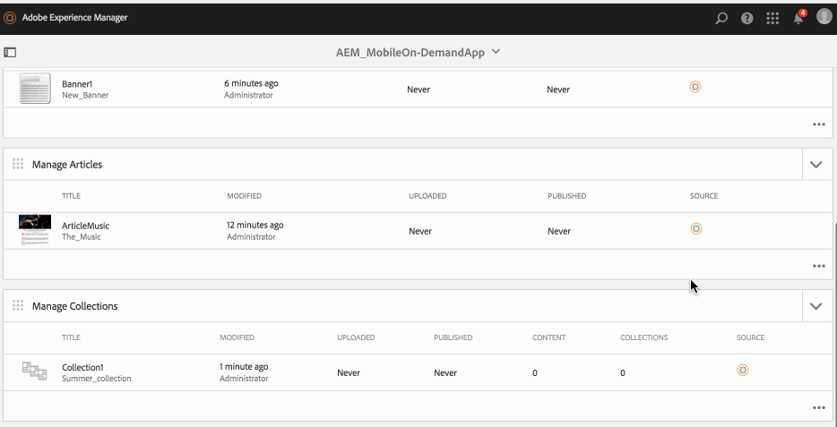

# コレクションの管理{#managing-collections}

{{ue-over-mobile}}

コンテンツ管理アクションは、アプリケーション内のコンテンツの作成と管理に役立つ構築ブロックです。 アプリケーション内のコンテンツに対して、次のアクションが実行されます。

## コレクションの概要 {#collections-overview}

コレクションは、表紙のテーマに合った記事やバナーなどのコンテンツで満たされた、明確に定義された *バケット* を表します。

>[!NOTE]
>
>AEM Mobile アプリケーションの以下のトピックについては、オンラインヘルプの以下のリソースを参照してください。
>
>* [ 設計上の考慮事項 ](https://helpx.adobe.com/jp/digital-publishing-solution/help/design-app.html)
>
>* [ 回収の管理 ](https://helpx.adobe.com/jp/digital-publishing-solution/help/creating-collections.html)
>

## コレクションの作成 {#creating-a-collection}

コレクションを作成する一般的なワークフローを次に示します。

1. サイドパネルから **モバイル** を選択します。
1. モバイルから、カタログのモバイルオンデマンドアプリを選択します。
1. **コレクションを管理** タイルの右上隅にある下矢印をクリックします。
1. ウィザードの各ステップを実行して、新しい記事の作成を続行します。
1. 準備ができたら、「**作成** をクリックします。
1. 新しい記事が **コレクションの管理** タイルに表示されます。

## 新しいコレクションのインポート {#importing-a-new-collection}

既存のモバイルオンデマンドコンテンツは、モバイルオンデマンドからAEMにダウンロード（読み込み）できます。 これにより、ローカルコンテンツの編集と表示が可能になります。

>[!NOTE]
>
>読み込みには、画像は含まれません。

新しいコレクションを読み込むワークフロー

1. モバイルから、カタログからモバイルオンデマンドアプリを選択します。
1. **コレクションを管理** タイルの右上隅にある下向き矢印をクリックし、「コレクションを読み込み」を選択します。
1. ダイアログの「**コレクションをインポート**」をクリックして、「閉じる」を選択します。
1. これで、モバイルオンデマンドのコレクションが **コレクションを管理** タイルに表示されます。

>[!CAUTION]
>
>最初にモバイルオンデマンド接続を関連付けます。

## コレクションの編集 {#editing-a-collection}

組み込みのAEM ドラッグ&amp;ドロップエディターを使用して、記事を追加または変更します。 テキストや画像などのコンポーネントを追加または削除できます。 DAM Assetsの画像を挿入できます。

コレクションを編集するワークフローを次に示します。

1. モバイルから、カタログのモバイルオンデマンドアプリを選択します。
1. **コレクションを管理** タイルからAEM ソースの記事を選択します。
1. ハイライト表示されたコレクションをリスト表示からクリックして、コンテンツエディターで開きます。
1. コンテンツエディターを使用して、コレクションのコンテンツ（原稿、画像、テキストなど）をドラッグします。

### コレクション内のメタデータの表示と編集 {#viewing-and-editing-the-metadata-within-a-collection}

コレクションには、タイトル、説明、画像など、多数のプロパティがあります。 このようなプロパティを表示および変更するには、このアクションを使用します。 オプションで、保存時にこれらの変更を Mobile On-Demand にアップロードできます。

コレクションを表示/編集するための一般的なワークフローを以下に示します。

1. モバイルから、カタログのモバイルオンデマンドアプリを選択します。
1. **コレクションを管理** タイルからコレクションを選択します。

1. アクションバーから「**プロパティ**」を選択します。
1. その記事で使用可能なすべてのメタデータを表示します。
1. 必要に応じてメタデータを編集し、完了したら **保存** をクリックします。
1. 必要に応じて、変更をモバイルオンデマンドにすぐにアップロードします。

## コレクションのアップロード {#uploading-a-collection}

アップロードアクションは、選択したコンテンツをコピーし、モバイルオンデマンドのプロジェクトに追加します。 既存の Mobile On-Demand コンテンツは、新しいバージョンに置き換えられます。

コレクションをアップロードするための一般的なワークフローを以下に示します。

1. **モバイル** から、カタログからモバイルオンデマンドアプリを選択します。
1. **コレクションを管理** タイルで、Mobile On-Demand にアップロードする記事を選択します。
1. 必要に応じて、リスト表示からさらにコレクションを追加します。
1. アクションバーから **アップロード** を選択し、ダイアログで「アップロード」をクリックします。
1. これで、コレクションが Mobile On-Demand にアップロードされました。

## コレクションの削除 {#deleting-a-collection}

この操作により、選択したコレクションが Mobile On-Demand から、およびオプションでローカル AEM インスタンスから削除されます。

コレクションを削除するための一般的なワークフローを次に示します。

1. モバイルから、カタログのモバイルオンデマンドアプリを選択します。
1. **コレクションを管理** タイルで、削除する記事を選択します。
1. リストで選択されていることを確認し、必要に応じて削除する他の項目を選択します。
1. アクションバーの **削除** をクリックします。
1. AEMおよび Mobile On-Demand から削除するかどうかを確認します。
1. 「**削除**」をクリックします。
1. これで、コレクションがリストから削除されました。

## コレクションへのコンテンツの追加 {#adding-content-to-collections}

コレクションは基本的に、関連コンテンツのカテゴリです。 記事、バナーなどのコンテンツを 1 つのパッケージにまとめて、アプリケーションのナビゲーション構造を定義します。 コレクションはネストできます。

>[!NOTE]
>
>コンテンツをコレクションに追加する前に、コンテンツをモバイルオンデマンドにアップロードする必要があります。

コレクションは、基本的に関連コンテンツのカテゴリで、記事やバナーなどのコンテンツを、アプリケーションのナビゲーション構造を定義するパッケージにまとめたものです。 コレクションはネストできます。

1. モバイルから、カタログのモバイルオンデマンドアプリを選択します。
1. 以前にアップロードした記事（またはバナー/コレクション）を選択
1. アクションバーから「追加先」を選択します。
1. ダイアログから、以前にアップロードしたコレクションを選択します。
1. 「**更新**」をクリックして、コレクションにコンテンツを追加します。

### 次の手順 {#the-next-steps}

コレクションの管理について詳しくは、

* [バナーの管理](/help/mobile/mobile-on-demand-managing-banners.md)
* [記事の管理](/help/mobile/mobile-on-demand-managing-articles.md)
* [共有リソースのアップロード](/help/mobile/mobile-on-demand-shared-resources.md)
* [コンテンツの公開/非公開](/help/mobile/mobile-on-demand-publishing-unpublishing.md)
* [プリフライトによるプレビュー](/help/mobile/aem-mobile-manage-ondemand-services.md)
