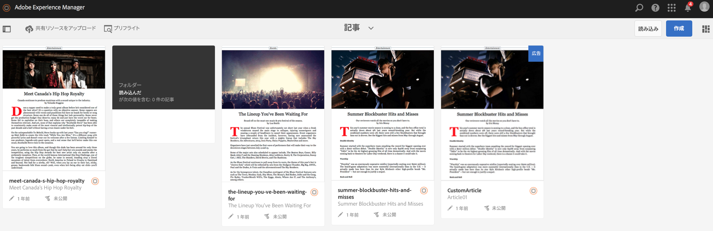

# 共有リソースのアップロード {#uploading-shared-resources}

>[!NOTE]
>
>単一ページアプリケーションフレームワークを基にしたクライアント側レンダリング（React など）が必要なプロジェクトでは、SPA エディターを使用することをお勧めします。[詳細情報](/help/sites-developing/spa-overview.md)

コンテンツ管理アクションは、アプリケーション内でコンテンツを作成および管理するのに役立つ構築ブロックです。アプリケーション内のコンテンツに対して以下のアクションを実行します。

>[!NOTE]
>
>To learn more on design considerations for AEM Mobile apps, see [Design considerations for AEM Mobile apps](https://helpx.adobe.com/jp/digital-publishing-solution/help/design-app.html) in Online Help.

>[!CAUTION]
>
>最初に Mobile On-Demand の接続を関連付ける必要があります。

## 共有リソースのアップロード {#uploading-shared-resources-1}

通常、記事などのコンテンツは、作成者およびアプリを問わず常に同じ外観と操作性である必要があります。したがって、スクリプト、CSS およびフォントをすべての作成者およびアプリに対して利用可能にすることが必要です。このように運用すると、こうした共有リソースが Mobile On-Demand に送信されるので、後で必要に応じて利用できます。

アプリを設定してクラウド設定に関連付けると、共有リソースをアップロードできます。For detailed steps on associating your app to a cloud configuration, click [here](/help/mobile/mobile-apps-ondemand-application-create-configure-action.md).

>[!NOTE]
>
>共有リソースでは、コンテンツ同期を使用して様々なリソースを収集します。See [Mobile with ContentSync](/help/mobile/mobile-ondemand-contentsync.md) for more details.

以下の手順に従って、記事の共有リソースをアップロードします。

1. Select the article from **Manage Articles** tile.
1. Click **Upload Shared Resources** to upload your shared HTML resources.

   

### 次のステップ {#the-next-step}

コンテンツの作成と公開について学習したら、以下を参照してください。

* [AEM Mobile On-demand Services の AEM コンテンツの開発](/help/mobile/aem-mobile-on-demand.md)
* [AEM Mobile On-demand Services を使用するためのコンテンツの管理](/help/mobile/aem-mobile.md)

または、さらにオーサリングについてのトピックを学習する必要がある場合は、以下を参照します。

[AEM Mobile On-demand Services アプリの AEM コンテンツのオーサリング](/help/mobile/mobile-apps-ondemand.md)
