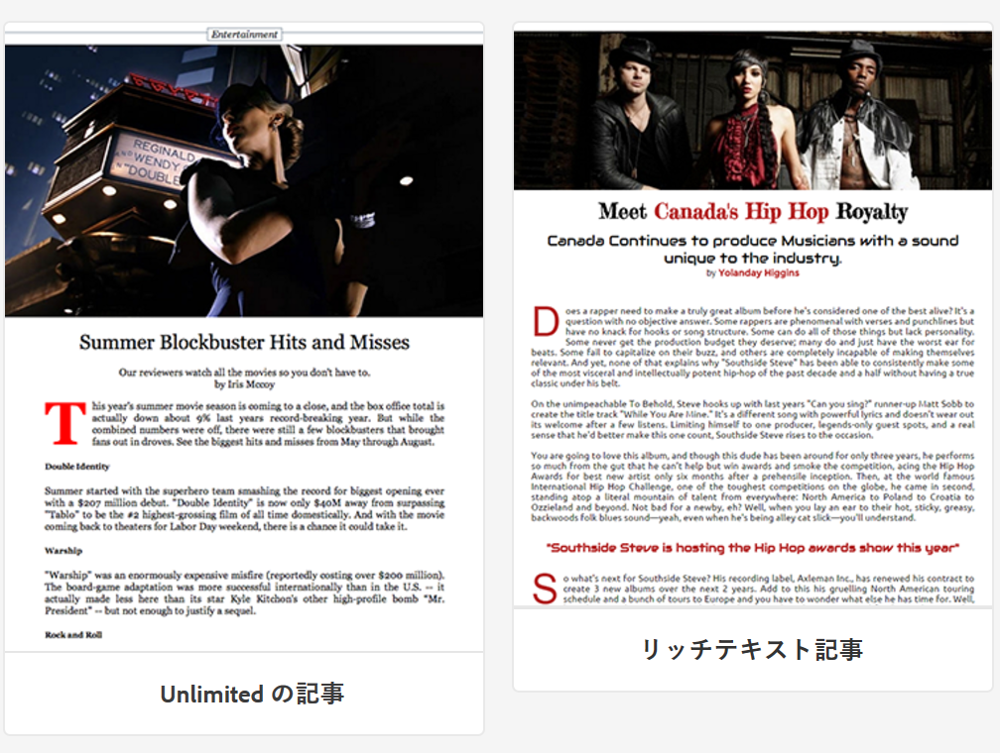
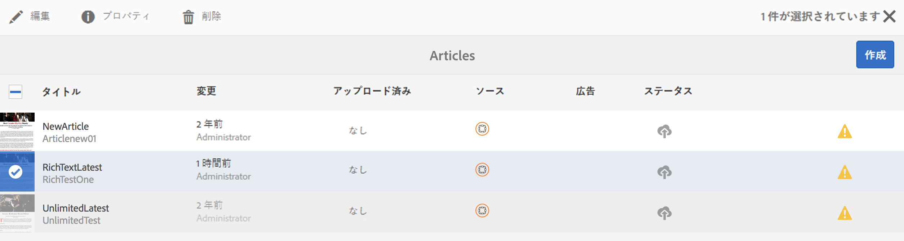
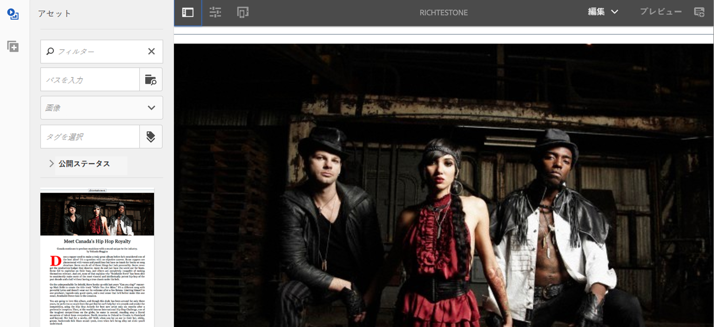
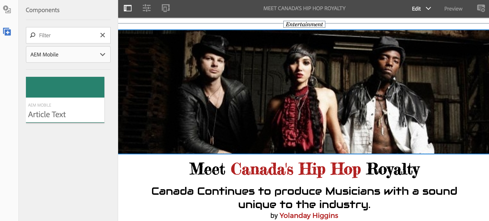
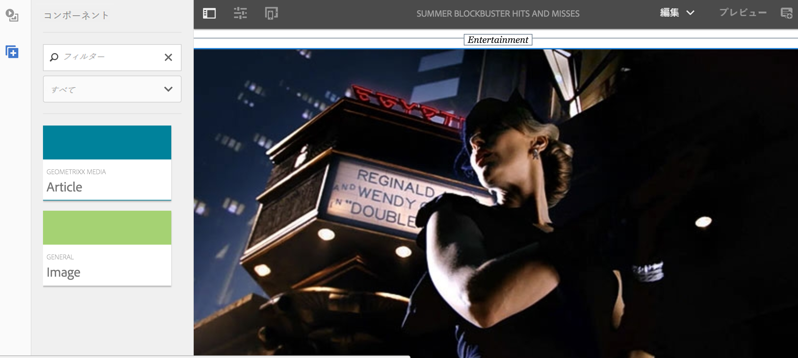

# テンプレートとコンポーネントの作成および追加 {#creating-and-adding-templates-and-components}

{{ue-over-mobile}}

AEM Mobile On-Demandには、完全に設定されたアプリテンプレート、記事テンプレート、記事コンポーネントが用意されています。

We.Unlimited アプリは、完全に設定可能で管理可能なAEM Mobile On-Demand アプリケーションのシェルを表すサンプルテンプレートです。

アプリの作成時にこのサンプルテンプレートを選択すると、AEM Mobile機能の豊富なダッシュボードが提供されます。

>[!NOTE]
>
>AEM Mobile Apps Control Centerからアプリケーションとモバイルアプリのコンテンツを管理するには、[AEM Mobile アプリケーションダッシュボード ](/help/mobile/mobile-apps-ondemand-application-dashboard.md)を参照してください。

## アプリテンプレートの作成 {#creating-app-templates}

アプリテンプレートは、アプリの作成に使用され、アプリのベースラインまたは基盤を表すページテンプレートとコンポーネントのコレクションとして機能します。 テンプレートは、アプリを適切な方法で導くために、いくつかの基本的なプロパティをスタンプ付けします。 一般的に、顧客はアプリを合計して作成しすぎることはありません。

アプリテンプレートは、AEM内で新しいアプリを作成するために使用される、開発者が作成した既存のデザインを簡単に使用する方法を提供します。

別のアプリのテンプレートに基づいてアプリを作成する場合、作成元のアプリを代表する開始点を持つアプリが表示されます。

アプリテンプレートに基づいてアプリを作成する手順：

1. AEM Mobile アプリカタログに移動します：*&lt;server-url>/aem/apps.html/content/mobileapps*
1. 次に示すように、**Create** > **App**&#x200B;を選択します

このテンプレートを使用してアプリを作成したら、記事、バナー、コレクションをアプリに追加できます。 再訪問、記事、バナー、コレクションの作成については、[ コンテンツ管理アクション ](/help/mobile/mobile-apps-ondemand-manage-content-ondemand.md)を参照してください。

>[!NOTE]
>
>または、AEM開発者が提供する&#x200B;**We.Unlimited** アプリなどのサンプルアプリテンプレートを選択することもできます。 このサンプルテンプレートをアプリに使用すると、いくつかのサンプル記事とコレクションを使用できます。 サンプルテンプレートとコンポーネントを使用するか、既存のテンプレートをカスタマイズするか、アプリ用に新しいテンプレートを作成するかを選択できます。

>[!CAUTION]
>
>***redirectTarget*** プロパティを設定しています
>
>開発者は、アプリテンプレートの1つを使用する際に、アプリケーションのコンテンツを定義します。 ただし、開発者は、jcrでアプリケーションが作成される場所と&#x200B;***redirectTarget*** プロパティの値を認識する必要があります。
>
>***redirectTarget***&#x200B;は、アプリの作成操作の一部として計算され、アプリ テンプレートの一部として利用可能なredirectTarget プロパティがあり、redirectTargetの値が相対パスとして定義されている場合に、パスの解決を試みます。 アプリ作成プロセスがアプリテンプレート内のredirectTargetの相対値を見つけると、その値がアプリの作成場所の解決済み場所に追加されます。
>
>例えば、アプリテンプレートが値「*lanugage-masters/en*」で&#x200B;***redirectTarget***&#x200B;を定義し、アプリが「*/content/mobileapps/fooApp*」で作成された場合、アプリ作成後のredirectTargetの最終値は「*/content/mobileapps/fooApp/language-masters/en*」になります。
>

## コンテンツテンプレートの作成 {#creating-content-templates}

各エンティティタイプには、2つの標準テンプレートがあります。 以下の項目が該当します。

* **デフォルトテンプレート：**&#x200B;は、適用可能なデフォルトプロパティ/構造を持つコンテンツ作成に使用されます
* **インポートされたテンプレート：**&#x200B;は、適用できるデフォルトのプロパティや構造を持つAEM Mobileからコンテンツをインポートするために使用されます

### 記事テンプレート {#article-templates}

「無制限の記事」は、AEM Mobile On-Demandの一般的な記事レイアウトを表すサンプルテンプレートです。

1. **記事の管理**&#x200B;で、**+**&#x200B;を選択して記事を作成します。 **無制限の記事**&#x200B;または&#x200B;**リッチテキスト記事**&#x200B;のいずれかを選択できます。 以下の画像は、これら2つの記事テンプレートのいずれかを選択できるオプションを示しています。

1. 「**次へ**」をクリックして、アーティクル名/タイトル、説明、作成者、抽象、部署、サムネイル画像、アーティクルアクセスなどのアーティクルメタデータを定義します。
1. 「**次へ**」をクリックして、広告プロパティを入力します。
1. **次へ**&#x200B;をクリックして、記事の画像またはソーシャルメディアの画像を入力します
1. **次へ**&#x200B;をクリックして、この新しい記事のコレクション リンクを選択します。
1. 「**次へ**」をクリックして、ソーシャル共有の詳細を入力します。
1. 「**作成**」をクリックして、サンプルを使用して記事を作成するプロセスを終了します。 **完了**&#x200B;または&#x200B;**記事を編集**&#x200B;をクリックして、この記事のプロパティを編集します。

### 記事へのコンポーネントの追加 {#adding-components-to-article}

作成者は、テキストや画像などのコンポーネントを追加することで、記事のコンテンツを編集できます。 記事は、AEM ページテンプレートの拡張機能です。

編集する記事を選択し、**編集**&#x200B;をクリックして記事にコンポーネントを追加します。

 

左側のパネルで「**+**」を選択して、記事にコンポーネントを追加します。

### すぐに使用できるテンプレートの作成 {#creating-out-of-the-box-templates}

すぐに使える記事テンプレートはありませんが、カスタムテンプレートを拡張するデフォルトテンプレートがあります。詳しくは、Geometrixx Unlimited アプリの[記事テンプレートサンプル ](http://localhost:4502/crx/de/index.jsp#/apps/geometrixx-unlimited-app/templates/article)を参照してください。

通常のAEM テンプレートに必要なプロパティを超える主要なプロパティには、次のものが含まれます。

***dps-resourceType=&quot;dps:Article&quot;***

このプロパティを指定すると、AEM ページがAEM Mobile ターゲットアーティクルページとして認識されます。

AEM テンプレートに従って、テンプレートの&#x200B;***jcr:content***&#x200B;に任意のデフォルトのプロパティまたは子ノードを追加できます。

### バナーとコレクションのテンプレート {#banner-and-collection-templates}

>[!CAUTION]
>
>バナーとコレクションにはコンテンツがないため、作成でカスタムテンプレートがサポートされません。

## コンポーネントの作成と追加 {#creating-and-adding-components}

コンポーネントでは、を使用してウィジェットへのアクセスを許可し、これらはコンテンツのレンダリングに使用されます。

コードリポジトリにはシンプルなコンポーネントが含まれており、そのソースはAEMにあります。 その後、CRXDE Liteでローカルに開くこともできます。

>[!NOTE]
>
>現在、AEM Mobileに提供されているすぐに使えるコンポーネントはありません。
>

ページにコンポーネントを追加できます。 AEM Mobile アプリでは任意のコンポーネントを使用できますが、適用すると、適切にレンダリングされない場合があります。

ただし、カスタムコンポーネントは、AEMでレンダリングされるカスタム書き出しコンテンツ同期ハンドラーがなければ、AEM Mobile On-demand Servicesに正しく書き出してアップロードできない場合があります。

コンポーネントが既にAEM ページに含まれていれば、他のいくつかの構成要素コンポーネントと共に、ページに別のコンポーネントを追加したり、既存のコンポーネントを編集したりできます。

**ページに別のコンポーネントを追加するには：**

1. そのページを選択し、エディターのヘッダーの右上にあるドロップダウンから、編集モードであることを確認します
1. エディターのヘッダーの左端のアイコンを使用して、サイドパネルを切り替えます
1. 「**コンポーネント**」タブを選択します
1. 使用可能なコンポーネントのひとつをページにドラッグ&amp;ドロップします

**既存のコンポーネントを編集するには：**

1. このページを選択し、**編集** モードであることを確認して、コンポーネントを選択します
1. レンチアイコンを選択して、コンポーネントを設定します

>[!NOTE]
>
>AEMでコンポーネントを作成し、[CRXDE Liteを使用した開発](/help/sites-developing/developing-with-crxde-lite.md)を使用してカスタマイズできます。 既存のコンポーネントを要件としてカスタマイズしたら、上の図に示すように、**記事の管理**&#x200B;の下の&#x200B;**編集** オプションを使用してページに追加できます。

>[!NOTE]
>
>AEM Mobileの[ テンプレートとコンポーネントの開発に関するベストプラクティス ](/help/mobile/best-practices-aem-mobile.md)を参照してください。

### 次の手順 {#the-next-steps}

* [コンテンツのプロパティを使用したコンテンツのエクスポート](/help/mobile/on-demand-content-properties-exporting.md)
* [モバイルとコンテンツ同期](/help/mobile/mobile-ondemand-contentsync.md)
