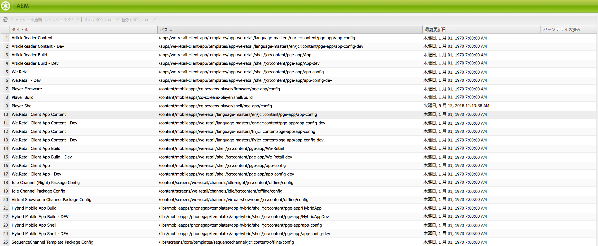

# モバイルとコンテンツ同期{#mobile-with-content-sync}

>[!NOTE]
>
>単一ページアプリケーションフレームワークを基にしたクライアントサイドレンダリング（React など）が必要なプロジェクトでは、SPA エディターを使用することをお勧めします。[詳細情報](/help/sites-developing/spa-overview.md)。

コンテンツ同期を使用して、ネイティブモバイルアプリケーションで使用できるようにコンテンツをパッケージ化します。 Adobe Experience Manager（AEM）で作成されたページは、デバイスがオフラインでも、アプリコンテンツとして使用できます。 さらに、AEM ページは web 標準に基づいているので、クロスプラットフォームで機能し、任意のネイティブラッパーに埋め込むことができます。 この戦略により、開発作業が軽減され、アプリのコンテンツを簡単に更新できます。

コンテンツ同期フレームワークは、web コンテンツを含むアーカイブファイルを作成します。 コンテンツには、単純なページ、画像、PDFファイルなど、何でも構いません。また、Web アプリケーション全体でも構いません。 コンテンツ同期 API を使用すると、モバイルアプリやビルドプロセスからアーカイブファイルにアクセスして、コンテンツを取得してアプリに含めることができます。

次の一連の手順は、コンテンツ同期の一般的なユースケースを示しています。

1. AEM開発者は、含めるコンテンツを指定するコンテンツ同期設定を作成します。
1. コンテンツ同期フレームワークは、コンテンツを収集してキャッシュします。
1. モバイルデバイス上で、モバイルアプリケーションが起動し、サーバーにコンテンツを要求して、そのコンテンツが ZIP ファイルで配信されます。
1. クライアントが ZIP コンテンツをローカルファイルシステムに解凍します。 ZIP ファイルのフォルダー構造は、クライアント（ブラウザーなど）が通常サーバーからリクエストするパスをシミュレートします。
1. クライアントは、埋め込みブラウザーでコンテンツを開くか、他の方法で使用します。
1. その後、クライアントはサーバーに更新されたコンテンツを要求します。 コンテンツ同期フレームワークは増分更新を提供して、ダウンロードのサイズと時間を短縮します。これは、帯域幅やデータ量が限られているので、モバイルデバイスにとって重要になる場合があります。

## コンテンツ同期ハンドラーの開発 {#developing-the-content-sync-handlers}

コンテンツ同期ハンドラーの開発ガイドラインの一部を次に示します。

* ハンドラーによる実装 *com.day.cq.contentsync.handler.ContentUpdateHandler* （直接または拡張するクラス）
* ハンドラーによる拡張 *com.adobe.cq.mobile.platform.impl.contentsync.handler.AbstractSlingResourceUpdateHandler*
* ハンドラーは、ContentSync キャッシュを更新する場合にのみ true をレポートする必要があります。 誤って true とレポートすると、実際には更新が行われなかった場合にAEMによって更新が作成されます。
* ハンドラーは、コンテンツが変更された場合にのみキャッシュを更新する必要があります。 白が不要な場合は、キャッシュに書き込まないでください。 その結果、不要な更新が作成されます。

>[!NOTE]
>
>Enable （有効） *ContentSync デバッグログ* パッケージの OSGI ロガー設定を使用 *com.day.cq.contentsync*. これにより、実行されたハンドラーと、ハンドラーがキャッシュを更新したかどうか、およびキャッシュの更新をレポートしたかどうかを追跡できます。

## コンテンツ同期コンテンツの設定 {#configuring-the-content-sync-content}

コンテンツ同期設定を作成して、クライアントに配信する ZIP ファイルのコンテンツを指定します。 任意の数のコンテンツ同期設定を作成できます。 各設定には、識別のために名前が付けられています。

コンテンツ同期設定を作成するには、以下を追加します `cq:ContentSyncConfig` ノードからリポジトリに移動し、 `sling:resourceType` プロパティの設定 `contentsync/config`. この `cq:ContentSyncConfig` ノードはリポジトリ内のどこにでも配置できますが、AEM パブリッシュインスタンスのユーザーからノードにアクセスできる必要があります。 そのため、の下にノードを追加する必要があります `/content`.

コンテンツ同期 ZIP ファイルのコンテンツを指定するには、子ノードを cq:ContentSyncConfig ノードに追加します。 各子ノードの次のプロパティは、含めるコンテンツ項目と、追加時の処理方法を特定します。

* `path`：コンテンツの場所。
* `type`：コンテンツの処理に使用する設定タイプの名前。 複数のタイプを使用できます。これらのタイプについては、を参照してください *設定タイプ*.

参照： *コンテンツ同期設定の例* を参照してください。

コンテンツ同期設定を作成すると、その設定がコンテンツ同期コンソールに表示されます。

>[!NOTE]
>
>コンテンツ同期フレームワークは、アセットの依存関係およびデザイン関連ファイルがコンテンツ同期パッケージに含まれているかどうかを確認しません。 必ず、必要なファイルをすべて ZIP ファイルに含めてください。

### コンテンツ同期のダウンロードへのアクセスの設定 {#configuring-access-to-content-sync-downloads}

コンテンツ同期からダウンロードできるユーザーまたはグループを指定してください。 すべてのコンテンツ同期キャッシュからダウンロードできるデフォルトのユーザーまたはグループを設定し、デフォルトを上書きして、特定のコンテンツ同期設定のアクセスを設定できます。

AEMがインストールされている場合、デフォルトでは、管理者グループのメンバーはコンテンツ同期からダウンロードできます。

#### コンテンツ同期ダウンロードのデフォルトアクセスの設定 {#setting-the-default-access-for-content-sync-downloads}

Day CQ Content Sync Manager サービスは、コンテンツ同期へのアクセスを制御します。 このサービスを設定して、デフォルトでコンテンツ同期からダウンロードできるユーザーまたはグループを指定します。

次の場合： [web コンソールを使用したサービスの設定](/help/sites-deploying/configuring-osgi.md#osgi-configuration-with-the-web-console)で、ユーザーまたはグループの名前をフォールバックキャッシュの許可可能プロパティの値として入力します。

次の場合： [リポジトリでの設定](/help/sites-deploying/configuring-osgi.md#osgi-configuration-in-the-repository)は、サービスに関する次の情報を使用します。

* PID:com.day.cq.contentsync.impl.ContentSyncManagerImpl
* プロパティ名：contentsync.fallback.authorizable

#### コンテンツ同期キャッシュのダウンロードアクセスの上書き {#overriding-download-access-for-a-content-sync-cache}

特定のコンテンツ同期設定に対してダウンロードアクセスを設定するには、次のプロパティをに追加します。 `cq:ContentSyncConfig` ノード：

* 名前：authorizable
* タイプ：String
* 値：ダウンロードできるユーザーまたはグループの名前。

例えば、アプリを使用すると、ユーザーはコンテンツ同期から直接アップデートをインストールできます。 すべてのユーザーが更新をダウンロードできるようにするには、認証可能プロパティの値をに設定します。 `everyone`.

次の場合 `cq:ContentSyncConfig` ノードに認証可能なプロパティがありません。Day CQ Content Sync Manager サービスの Fallback Cache Authorizable プロパティに設定されているデフォルトのユーザーまたはグループによって、ダウンロードできるユーザーが決まります。

### コンテンツ同期キャッシュを更新するためのユーザーの設定 {#configuring-the-user-for-updating-a-content-sync-cache}

ユーザーがコンテンツ同期キャッシュを更新すると、そのユーザーの代わりに特定のユーザーアカウントがアクションを実行します。 デフォルトでは、匿名ユーザーがすべてのコンテンツ同期キャッシュを更新します。

デフォルトユーザーを上書きして、特定のコンテンツ同期キャッシュを更新するユーザーまたはグループを指定できます。

デフォルトユーザーをオーバーライドするには、次のプロパティを cq:ContentSyncConfig ノードに追加して、特定のコンテンツ同期設定の更新を実行するユーザーまたはグループを指定します。

* 名前：`updateuser`
* 型：`String`
* 値：更新を実行できるユーザーまたはグループの名前。

次の場合 `cq:ContentSyncConfig` ノードにがありません `updateuser` プロパティ（デフォルト） `anonymous` ユーザーがキャッシュを更新します。

### 設定タイプ {#configuration-types}

処理は、単純な JSON のレンダリングから、参照アセットを含むページの本格的なレンダリングまで、多岐にわたります。 この節では、使用可能な設定タイプとその固有のパラメーターを示します。

**コピー** - ファイルおよびフォルダーをコピーします。

* **パス** - パスが 1 つのファイルを指している場合、ファイルのみがコピーされます。 フォルダー（ページノードを含む）を指している場合、の下のすべてのファイルとフォルダーがコピーされます。

**コンテンツ** 標準を使用したコンテンツのレンダリング [Sling のリクエスト処理](/help/sites-developing/the-basics.md#sling-request-processing).

* **パス**  – 出力するリソースへのパス。
* **拡張子** - リクエストで使用する必要がある拡張機能。 一般的な例を以下に示します *html* および *json*&#x200B;ただし、他の拡張も可能です。

* **セレクター** - ドットで区切られたオプションのセレクター。 一般的な例を以下に示します *接触* （ページのモバイルバージョンのレンダリング用） *無限大* JSON 出力用。

**clientlib** - JavaScript または CSS クライアントライブラリをパッケージ化します。

* **パス** - クライアントライブラリのルートのパス。
* **拡張子** - クライアントライブラリのタイプ。 次のいずれかに設定してください *js* または *css* 現時点では。

**アセット**

アセットのオリジナルレンディションの収集

* **パス** - /content/dam の下のアセットフォルダーへのパス。

**画像**  – 画像を収集します。

* **パス**  – 画像リソースへのパス。

画像タイプは、zip ファイルに We Retail ロゴを含めるために使用されます。

**ページ** - AEM ページをレンダリングし、参照されるアセットを収集します。

* **パス** - ページへのパス。
* **拡張子** - リクエストで使用する必要がある拡張機能。 ページの場合、これはほとんど常に当てはまります *html*&#x200B;しかし、他の方法も可能です。

* **セレクター** - ドットで区切られたオプションのセレクター。 一般的な例を以下に示します *接触* （ページのモバイルバージョンのレンダリング用）。

* **ディープ**  – 子ページを含めるかどうかを決定するオプションのブール値プロパティ。 デフォルト値はです *はい。*

* **includeImages**  – 画像を含めるかどうかを指定するオプションのブール値プロパティ。 デフォルト値はです *true*.

  デフォルトでは、リソースタイプが foundation/components/image の画像コンポーネントのみが組み込み対象と見なされます。 以下を設定して、さらにリソースタイプを追加できます **Day CQ WCM Pages Update Handler** web コンソールで以下を行います。

**書換え**  – 書き換えノードは、書き出したページでリンクを書き換える方法を定義します。 書き換えられたリンクは、zip ファイルに含まれるファイルを指すか、サーバー上のリソースを指します。

この `rewrite` ノードはの下に配置する必要があります `page` ノード。

この `rewrite` ノードには、次の 1 つ以上のプロパティを設定できます。

* `clientlibs`:clientlibs パスを書き換えます。

* `images`：画像のパスを書き換えます。
* `links`：リンクのパスを書き換えます。

各プロパティは、次のいずれかの値を持つことができます。

* `REWRITE_RELATIVE`：ファイルシステム上のページ .html ファイルへの相対位置でパスを書き換えます。

* `REWRITE_EXTERNAL`:AEMを使用してサーバー上のリソースを指すことにより、パスを書き換えます [Externalizer サービス](/help/sites-developing/externalizer.md).

という名前のAEM サービス **PathRewriterTransformerFactory** 書き換えられる特定の html 属性を設定できます。 このサービスは web コンソールで設定でき、の各プロパティの設定を持ちます `rewrite` ノード： `clientlibs`, `images`、および `links`.

この機能はAEM 5.5 で追加されました。

### コンテンツ同期設定の例 {#example-content-sync-configuration}

以下のリストに、コンテンツ同期の設定例を示します。

```xml
+ weretail_go [cq:ContentSyncConfig]
  - sling:resourceType = "contentsync/config"

  + etc.designs.default [nt:unstructured]
    - path = "/etc/designs/default"
    - type = "copy"

  + etc.designs.mobile [nt:unstructured]
    - path = "/etc/designs/mobile"
    - type = "copy"

  + events.plist [nt:unstructured]
    - path = "/content/weretail_mobile/en/events/jcr:content/par/events"
    - type = "content"
    - extension = "plist"

  + events.touch.html [nt:unstructured]
    - path = "/content/weretail_mobile/en/events"
    - type = "pages"
    - extension = "html"
    - selector = "touch"

  + logo [nt:unstructured]
    - path = "/etc/designs/mobile/jcr:content/mobilecontentpage/logo"
    - type = "logo"

  + manifest [nt:unstructured]
    - indexPage = "/content/weretail_mobile/en/events.touch.html"
    - metadataPlist = "/content/weretail_mobile/en/events/_jcr_content/par/events.plist"

  + ...
```

**etc.designs.default および etc.designs.mobile**  – 設定の最初の 2 つのエントリは明らかです。 複数のモバイルページを含める場合は、/etc/designs の下に関連するデザインファイルが必要です。 また、追加の処理が必要ないので、コピーするだけで十分です。

**events.plist**  – このエントリは少し特殊です。 概要で説明したように、アプリケーションはイベントの場所のマーカーを持つマップビューを提供する必要があります。 必要な場所情報は、PLIST 形式の別のファイルとして提供されます。 これを機能させるために、インデックスページで使用するイベントリストコンポーネントには、plist.jsp というスクリプトがあります。 このスクリプトは、コンポーネントのリソースが `.plist` 拡張機能。 通常どおり、コンポーネントのパスはパスプロパティに指定され、タイプは、を使用するので、content に設定されます。 [Sling のリクエスト処理](/help/sites-developing/the-basics.md#sling-request-processing).

**events.touch.html**  – 次に、アプリに表示される実際のページが表示されます。 パスプロパティはイベントのルートページに設定されます。 deep プロパティのデフォルト値が true なので、そのページより下のすべてのイベントページも含まれます。 ページを設定タイプとして使用して、ページ上の画像またはダウンロードコンポーネントから参照される可能性のあるすべての画像またはその他のファイルを含めます。 また、タッチセレクターを設定すると、ページのモバイルバージョンが提供されます。 機能パック内の設定には、この種のエントリがさらに含まれていますが、ここでは簡単にするために除外しています。

**ロゴ** - ロゴ設定タイプは今まで言及されておらず、ビルトインタイプではありません。 ただし、コンテンツ同期フレームワークはある程度拡張可能です。次の節で、この例について説明します。

**manifest**  – 多くの場合、コンテンツの開始ページなど、何らかのメタデータを zip ファイルに含めることが推奨されます。 ただし、このような情報をハードコーディングすると、後で簡単に変更できなくなります。 コンテンツ同期フレームワークは、設定でマニフェストノードを探すことで、このユースケースをサポートします。このノードは名前で識別され、設定タイプを必要としません。 その特定のノードで定義されたすべてのプロパティはファイルに追加されます。このファイルはマニフェストとも呼ばれ、zip ファイルのルートに存在します。

この例では、イベント一覧ページが最初のページになります。 この情報は、 **indexPage** そのため、いつでも簡単に特性を変更できます。 2 つ目のプロパティは、のパスを定義します *events.plist* ファイル。 後で見るように、クライアントアプリケーションはマニフェストを読み取り、それに従って動作できるようになりました。

設定が完了すると、コンテンツをブラウザーやその他の HTTP クライアントを使用してダウンロードできます。iOS用に開発している場合は、専用の WAppKitSync クライアントライブラリを使用することもできます。 ダウンロードの場所は、設定のパスと *.zip* 例えば、ローカル AEM インスタンスを操作する場合の拡張機能は次のとおりです。 *http://localhost:4502/content/weretail_go.zip*

### コンテンツ同期コンソール {#the-content-sync-console}

コンテンツ同期コンソールには、リポジトリ内のすべてのコンテンツ同期設定（タイプのすべてのノード）がリストされます `cq:ContentSyncConfig`）に設定し、各設定で次の操作を実行できます。

* キャッシュを更新します。
* キャッシュをクリアします。
* 完全な zip ファイルをダウンロードします。
* 今すぐと特定の日時の差分 zip をダウンロードします。

開発やトラブルシューティングに役立ちます。

コンソールには、次の場所からアクセスできます。

`http://localhost:4502/libs/cq/contentsync/content/console.html`

次のようなコンソールが表示されます。



### コンテンツ同期フレームワークの拡張 {#extending-the-content-sync-framework}

設定オプションの数は既に多数ありますが、特定のユースケースの要件をすべてカバーしているとは限りません。 ここでは、コンテンツ同期フレームワークの拡張ポイントと、カスタム設定タイプの作成方法について説明します。

設定タイプごとに、次の条件があります *コンテンツ更新ハンドラー*：その特定のタイプに登録されている OSGi コンポーネントファクトリです。 これらのハンドラーは、コンテンツを収集して処理し、コンテンツ同期フレームワークによって維持管理されるキャッシュに追加します。 次のインターフェイスまたは抽象基本クラスを実装します。

* `com.day.cq.contentsync.handler.ContentUpdateHandler`  – すべての更新ハンドラーが実装する必要があるインターフェイス
* `com.day.cq.contentsync.handler.AbstractSlingResourceUpdateHandler` - Sling を使用したリソースのレンダリングを簡素化する抽象クラス

クラスを OSGi コンポーネントファクトリとして登録し、バンドルの OSGi コンテナにデプロイします。 これを行うには [Maven SCR プラグイン](https://felix.apache.org/documentation/subprojects/apache-felix-maven-scr-plugin/apache-felix-maven-scr-plugin-use.html) javascript タグまたは注釈を使用します。 次の例は、JavaDoc のバージョンを示しています。

```java
/*
 * @scr.component metatype="no"
 * factory="com.day.cq.contentsync.handler.ContentUpdateHandler/customtype"
 */
public class CustomTypeUpdateHandler implements ContentUpdateHandler {
    // add your code here
}

/*
 * @scr.component metatype="no" inherit="true"
 * factory="com.day.cq.contentsync.handler.ContentUpdateHandler/othertype"
 */
public class OtherTypeUpdateHandler extends AbstractSlingResourceUpdateHandler {
    // add your code here
}
```

次のことに注意してください *工場* 定義には、共通のインターフェイスと、スラッシュで区切られたカスタムタイプが含まれています。 この方法により、設定エントリのカスタムタイプを認識するカスタムクラスのインスタンスをコンテンツ同期フレームワークで検索して作成できます。 次のセクションでは、カスタム更新ハンドラーの具体的な例を示します。

>[!CAUTION]
>
>AbstractSlingResourceUpdateHandler 基本クラスを構築する場合は、 *inherit* 定義。 それ以外の場合、OSGi コンテナは、基本クラスで宣言されている必要な参照を設定しません。

### カスタム更新ハンドラーの実装 {#implementing-a-custom-update-handler}

すべての We.Retail モバイルページの左上隅に、zip ファイルに含める必要があるロゴが含まれています。 ただし、キャッシュの最適化のため、AEMはリポジトリー内の画像ファイルの実際の場所を参照しません。そのため、単に「 **コピー** 設定タイプ。 その代わりにすべきことは、私たち自身のものを提供することです **ロゴ** AEMからリクエストされた場所で画像を使用できるようにする設定タイプ。 次のコードリストは、ロゴ更新ハンドラーの完全な実装を示しています。

#### LogoUpdateHandler.java {#logoupdatehandler-java}

```java
package com.day.cq.wcm.apps.weretail.impl;

import javax.jcr.Node;
import javax.jcr.RepositoryException;
import javax.jcr.Session;

import org.apache.sling.api.resource.Resource;
import org.apache.sling.api.resource.ResourceResolver;
import org.apache.sling.jcr.resource.JcrResourceResolverFactory;

import com.day.cq.commons.jcr.JcrUtil;
import com.day.cq.contentsync.config.ConfigEntry;
import com.day.cq.contentsync.handler.ContentUpdateHandler;
import com.day.cq.wcm.foundation.Image;
import com.day.text.Text;

/**
 * The <code>LogoUpdateHandler</code> is used to update the content sync cache
 * with a page logo added using a logo component.
 *
 * @scr.component metatype="no"
 * factory="com.day.cq.contentsync.handler.ContentUpdateHandler/logo"
 */
public class LogoUpdateHandler implements ContentUpdateHandler {

    private static final Logger log = LoggerFactory.getLogger(LogoUpdateHandler.class);

    /** @scr.reference policy="static" */
    protected JcrResourceResolverFactory resolverFactory;

    public boolean updateCacheEntry(ConfigEntry configEntry, Long lastUpdated, String configCacheRoot, Session admin, Session session) {
        ResourceResolver resolver = resolverFactory.getResourceResolver(admin);
        Resource resource = resolver.getResource(configEntry.getContentPath());

        Image img = new Image(resource);
        img.setItemName(Image.NN_FILE, "image");
        img.setItemName(Image.PN_REFERENCE, "imageReference");
        img.setSelector("img");

        try {
            if(img.getLastModified() == null || lastUpdated < img.getLastModified().getTime().getTime()) {
                String src = img.getSrc();
                String parentPath = configCacheRoot + Text.getRelativeParent(src, 1);

                Node parent = JcrUtil.createPath(parentPath, "sling:Folder", admin);
                Node image = resolver.getResource(resource.getPath() + "/image").adaptTo(Node.class);
                JcrUtil.copy(image, parent, Text.getName(src));

                admin.save();

                return true;
            }
        } catch (RepositoryException e) {
            log.error("Unexpected error while updating logo: ", e);
        }

        return false;
    }
}
```

この `LogoUpdateHandler` クラスはを実装します `ContentUpdateHandler` インターフェイスの `updateCacheEntry(ConfigEntry, Long, String, Session, Session)` メソッドは複数の引数を取ります。

* A `ConfigEntry` このハンドラーが呼び出される設定エントリとそのプロパティへのアクセスを提供するインスタンス。
* A `lastUpdated` コンテンツ同期がキャッシュを最後に更新した時刻を示すタイムスタンプ。 そのタイムスタンプ以降に変更されていないコンテンツは、ハンドラーによって更新しないでください。
* A `configCacheRoot` キャッシュのルートパスを指定する引数。 更新されたすべてのファイルを zip ファイルに追加するには、このパスの下に保存する必要があります。
* すべてのキャッシュ関連リポジトリ操作に使用する管理セッション。
* 特定のユーザーのコンテキストでコンテンツを更新して、一種のパーソナライズされたコンテンツを提供するために使用できるユーザーセッション。

カスタムハンドラーを実装するには、まず設定エントリで指定されたリソースに基づいて画像クラスのインスタンスを作成します。 これは、ページ上の実際のロゴコンポーネントが行うのと同じ手順です。 画像のターゲットパスが、ページから参照されたものと同じになるようにします。

次に、最後の更新以降にリソースが変更されたかどうかを確認します。 カスタム実装では、キャッシュの不要な更新を避け、変更がない場合は false を返す必要があります。 リソースが変更されている場合は、キャッシュルートを基準とした期待されるターゲットの場所に画像をコピーします。 最後に `true` は、キャッシュが更新されたことをフレームワークに示すために返されます。

## クライアント上のコンテンツの使用 {#using-the-content-on-the-client}

コンテンツ同期で提供されるモバイルアプリでコンテンツを使用するには、HTTP または HTTPS 接続を介してコンテンツをリクエストする必要があります。 その結果、取得したコンテンツ（ZIP ファイルにパック）を抽出して、モバイルデバイス上でローカルに保存できます。 コンテンツはデータだけでなく、完全な web アプリケーションであるロジックも指すため、ネットワーク接続がなくても、取得した web アプリケーションと対応するデータをモバイルユーザーが実行できます。

コンテンツ同期は、インテリジェントな方法でコンテンツを配信します。最後に成功したデータ同期以降のデータ変更のみが配信されるので、データ転送に必要な時間が短縮されます。 アプリケーションの初回実行時には、1970 年 1 月 1 日以降にデータの変更がリクエストされ、それ以降は、最後に成功した同期以降に変更されたデータのみがリクエストされます。 AEMでは、iOSのクライアント通信フレームワークを使用して、データ通信と転送を簡素化するので、iOS ベースの web アプリケーションを有効にするために必要なネイティブコードの量は最小限になります。

転送されたすべてのデータは同じディレクトリ構造に抽出でき、データを抽出する際に追加の手順（依存関係の確認など）は必要ありません。 iOSがある場合、すべてのデータはiOS アプリケーションのドキュメント フォルダー内のサブフォルダーに保存されます。

iOS ベースのAEM Mobile アプリの一般的な実行パス：

* ユーザーがiOS デバイスでアプリを起動します。
* アプリはAEM バックエンドへの接続を試み、前回の実行以降に行われたデータ変更をリクエストします。
* サーバーは、問題のデータを取得し、それらをファイルに圧縮します。
* データはクライアントデバイスに返され、ドキュメントフォルダーに抽出されます。
* UIWebView コンポーネントの開始/更新。

以前に接続を確立できなかった場合は、ダウンロードされたデータが表示されます。

### その他のリソース {#additional-resources}

管理者と作成者の役割と責任については、以下のリソースを参照してください。

* [AEM Mobile On-demand Services用AEM コンテンツのオーサリング](/help/mobile/mobile-apps-ondemand.md)
* [AEM Mobile On-demand Servicesを使用するコンテンツの管理](/help/mobile/aem-mobile.md)
