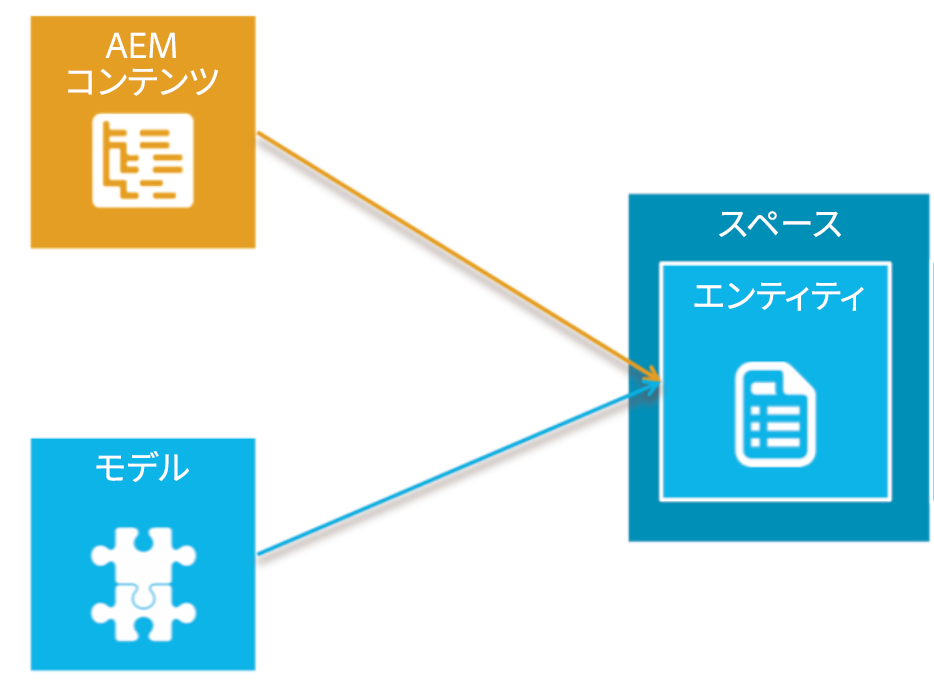
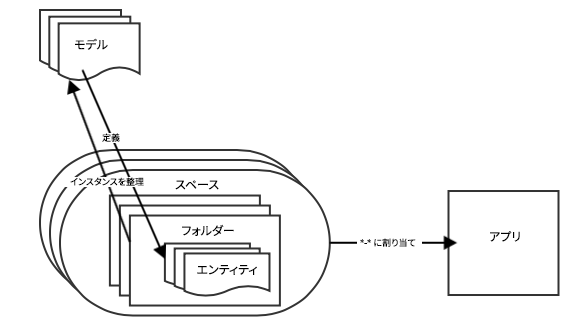

# モデルの概要{#models-overview}

>[!NOTE]
>
>単一ページアプリケーションフレームワークを基にしたクライアント側レンダリング（React など）が必要なプロジェクトでは、SPA エディターを使用することをお勧めします。[詳細情報](/help/sites-developing/spa-overview.md)

モデル管理では、最終的なデータオブジェクトに関連付けることを目的として、モデルの作成および管理をおこなう必要があります。各モデルは、オブジェクトの作成とレンダリングを促進するために必要なすべてのプロパティとフィールドの定義を含みます。

モデル管理では、**モデル**、**エンティティ**&#x200B;および&#x200B;**スペース**&#x200B;を作成する必要があります。次の図に、AEM コンテンツと各モデルとの関係を示します。

## コンテンツモデル {#the-content-model}

モデルは、コンテンツのタイプを定義し、ネイティブアプリケーションで使用可能な情報を示します。これは、コンテンツの構成要素に関する説明です。 コンテンツモデルは、コンテンツのパーツの構築方法を定めるルールです。コンテンツモデルには、利用可能なデータ、使用可能なアセット、アセットとデータの関係、他のコンテンツモデルとの関係、利用可能なメタデータが含まれます。

また、モデルは、既存の AEM コンテンツを、ネイティブモバイルアプリで簡単に使用できるオブジェクトに変換する方法も提供します。

コンテンツサービスは、アセットやアセットコレクション、HTML ページ、アプリ設定、チャネル独立ページなどの一般的なオブジェクトに対して、いくつかの既製のモデルを提供します。これらは設定可能であり、AEMの開発作業を必要とせずに、特定のお客様のニーズに対応できます。

ユーザーは、自分独自のモデルを作成できます。したがって、AEM によってまだ管理されていない新しいコンテンツタイプの作成が可能です。モデルの作成は、既存のプリミティブタイプを使用した UI でおこないます。

次の図に、AEM Mobile アプリのコンテンツモデルと、アプリへのエンティティ、フォルダーおよびスペースの割り当て方法を示します。

### モデル {#the-models}

モデルは、エンティティの作成方法を決めるために使用します。エンティティで使用できるものと、AEMコンテンツからデータを生成する方法を定義します。 スペース、フォルダーおよびエンティティの操作を開始する前に、モデルの作成と管理に習熟する必要があります。

>[!NOTE]
>
>モデルは、複数のアプリで使用できるので、アプリの外側に存在します。

ダッシュボードとリポジトリでのモデルの作成および管理について詳しくは、**[モデル](/help/mobile/administer-mobile-apps.md)**&#x200B;を参照してください。

### コンテンツモデルのエンティティ {#entities-in-content-model}

エンティティは、コンテンツモデルのインスタンスです。エンティティは、Content Services APIを介してクライアント側ライブラリに公開され、ネイティブアプリがチャネルに依存しない方法でコンテンツにアクセスする方法を提供します。

既存の AEM コンテンツの場合、エンティティは、モデルと AEM コンテンツソースを使用して生成されます。例えば、ページエンティティは、AEMページとページモデルから生成されるチャネルとレイアウトに依存しないオブジェクトです。

エンティティの参照先コンテンツが変更されると、そのエンティティも変更されます。For example, if a *cq:page* is updated, then any entities that are based on that page will be updated as well.

See **[Working with Entities](/help/mobile/spaces-and-entities.md)** to create custom entities from models.

>[!NOTE]
>
>ユーザーが新しいモデルを作成するなどして、モデルが既存の AEM コンテンツに一致しなくなった場合は、UI で新しいエンティティを作成できます。

### コンテンツモデルのスペース {#spaces-in-content-model}

スペースを使用すると、エンティティを整理してアクセスを容易にできます。スペースは、1 つ以上のエンティティタイプと、サブフォルダーを含むことができます。

AEM の側から見ると、スペースは、関連するエンティティを管理するのに役立ちます。また、スペースは、認証権限の割り当てにも使用できます。スペースに認証を行うことができます。その後、スペース内のエンティティが保護されます。

*例*：

ユーザーが、エンティティを汎用的な 3 つのグループに分類しています。1つは内部での使用のみを目的とし、もう1つは公開での使用が承認されます。もう1つは、多くのアプリで使用される一般的なエンティティ用です。 To make it easy to manage, the user creates three spaces namely *internal*, *public* (with both english and french content), and *common* for managing the appropriate entities as mentioned below:

* /content/entities/internal
* /content/entities/public/en
* /content/entities/public/fr
* /content/entities/common

スペースにサービスエンドポイントが提供されるので、ネイティブクライアントライブラリで、スペースのコンテンツのリストをリクエストできます。この「リスト」は、JSON オブジェクトとして返されます。

See **[Spaces and Entities](/help/mobile/spaces-and-entities.md)** for creating and publishing spaces.

>[!NOTE]
>
>1 つのスペースを多数のアプリで使用できます。また、1 つのアプリで多数のスペースを使用できます。

### コンテンツモデルのフォルダー {#folders-in-content-model}

フォルダーを使用すると、必要に応じてエンティティを整理し、より細かな ACL コントロールを促進できます。スペース内にフォルダーを含めると、コンテンツやアセットを簡単に整理できます。ユーザーは、スペース下に自分独自のフォルダー階層を作成できます。

See **[Working with Folders in a Space](/help/mobile/spaces-and-entities.md)** to create and manage folders within a space.
