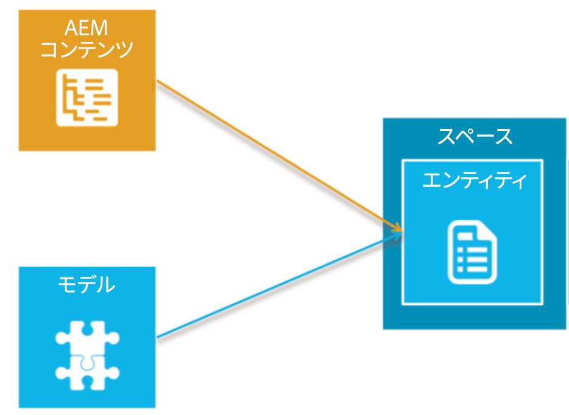
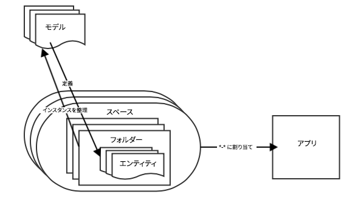

# モデルの概要{#models-overview}

{{ue-over-mobile}}

モデル管理では、最終的なデータオブジェクトに関連付けるためのモデルの作成と管理を行います。 各モデルには、オブジェクトの作成とレンダリングを容易にするために必要なあらゆるプロパティとフィールド定義が含まれています。

モデル管理では、**モデル**、**エンティティ**、**スペース**&#x200B;を作成します。 次の図は、AEM コンテンツとモデルの関係を示しています。

## コンテンツモデル {#the-content-model}

モデルは、コンテンツのタイプを記述し、ネイティブアプリケーションで使用可能な情報を示します。 これは、コンテンツの構成要素を示す説明です。 コンテンツモデルとは、コンテンツをどのように制作するかについてのルールです。 コンテンツモデルには、利用可能なデータ、使用できるアセット、アセットとデータの関係、他のコンテンツモデルとの関係、利用可能なメタデータが含まれます。

また、モデルは、既存のAEMコンテンツを、ネイティブのモバイルアプリが簡単に使用できるオブジェクトに変換する手段としても機能します。

Content Servicesでは、アセット、アセットコレクション、HTMLページ、アプリ設定、チャネルに依存しないページなど、一般的なオブジェクト用に、すぐに使用できるいくつかのモデルを提供しています。 これらのテンプレートは設定可能であり、AEMの開発に依頼することなく、お客様の特定のニーズに対応できます。

利用者は独自のモデルを構築できます。 これにより、AEMで管理されていない新しいコンテンツタイプを作成できます。 モデルの作成は、既存のプリミティブタイプを使用したUIを通じて行われます。

次の図は、AEM Mobile アプリのコンテンツモデルと、エンティティ、フォルダー、スペースがアプリに割り当てられる方法を示しています。

### モデル {#the-models}

モデルは、エンティティの作成方法を決定するために使用されます。 エンティティで利用可能なデータと、そのデータがAEM コンテンツからどのように生成されるかを定義します。 スペース、フォルダー、およびエンティティの操作を開始する前に、モデルの作成と管理について理解しておく必要があります。

>[!NOTE]
>
>1つのモデルは、複数のアプリが使用できるため、そのアプリの外部に存在します。
>

ダッシュボードとリポジトリでモデルを作成および管理するには、**[モデル](/help/mobile/administer-mobile-apps.md)**&#x200B;を参照してください。

### コンテンツモデルのエンティティ {#entities-in-content-model}

エンティティとは、コンテンツモデルのインスタンスのことです。 エンティティは、Content Services APIを介してクライアントサイドライブラリに公開され、ネイティブアプリがチャネルに依存しない方法でコンテンツにアクセスする方法を提供します。

既存のAEM コンテンツがある場合、エンティティはモデルとAEM コンテンツソースを使用して生成されます。 例えば、ページエンティティは、AEM ページとページモデルから生成される、チャネルとレイアウトに依存しないオブジェクトです。

エンティティの参照コンテンツに変更を加えると、エンティティが変更されます。 例えば、*cq:page*&#x200B;が更新された場合、そのページに基づくすべてのエンティティも更新されます。

モデルからカスタムエンティティを作成するには、**[エンティティの操作](/help/mobile/spaces-and-entities.md)**&#x200B;を参照してください。

>[!NOTE]
>
>モデルが、お客様がモデルを作成したなどの既存のAEM コンテンツに対応していない場合は、UIを使用してエンティティを作成できます。
>

### コンテンツモデル内のスペース {#spaces-in-content-model}

スペースは、簡単にアクセスできるようにエンティティを整理するために使用されます。 スペースには、1つまたは複数のエンティティタイプを含めることができ、サブフォルダーを含めることができます。

AEM側では、スペースは関連するエンティティを管理する便利な方法です。 また、認証権限の割り当てにも使用できます。 スペースに対して認証を行うことで、そのスペース内のエンティティを保護できます。

*例*：

ユーザーには、エンティティの一般的な分類が3つあります。 1つは内部使用のみを目的としたもので、もう1つはパブリック使用が承認されており、3分の1は多くのアプリで使用されている一般的なエンティティを対象としています。 管理しやすくするために、ユーザーは、次に示すように、適切なエンティティを管理するために、*internal*、*public* （英語とフランス語のコンテンツの両方を含む）、*common*&#x200B;という3つのスペースを作成します。

* /content/entities/internal
* /content/entities/public/en
* /content/entities/public/fr
* /content/entities/common

ネイティブクライアントライブラリがスペースのコンテンツのリストを要求できるように、スペースにサービスエンドポイントが提供される。 この「リスト」はJSON オブジェクトとして返されます。

スペースの作成と公開については、**[スペースとエンティティ](/help/mobile/spaces-and-entities.md)**&#x200B;を参照してください。

>[!NOTE]
>
>スペースは多くのアプリで使用でき、アプリは多くのスペースを使用できます。

### コンテンツモデル内のフォルダー {#folders-in-content-model}

フォルダーを使用すると、必要に応じてエンティティを整理でき、より細かいACL制御が容易になります。 スペースには、スペースのコンテンツとアセットをさらに整理するためのフォルダーを含めることができます。 ユーザーは、スペースの下に独自の階層を作成できます。

スペース内のフォルダーを作成および管理するには、**[スペース内のフォルダーの操作](/help/mobile/spaces-and-entities.md)**&#x200B;を参照してください。
