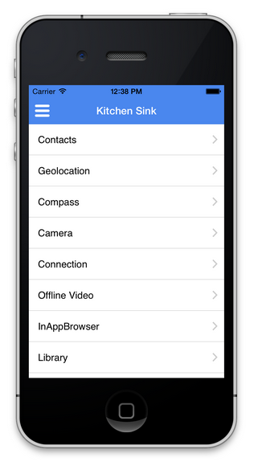

# デバイス機能へのアクセス{#access-device-features}

>[!NOTE]
>
>Adobeは、単一ページアプリケーションのフレームワークベースのクライアントサイドレンダリング（React など）を必要とするプロジェクトでは、SPA Editor を使用することをお勧めします。 [詳細情報](/help/sites-developing/spa-overview.md)。

## デバイス機能にアクセスするAdobe Experience Manager(AEM) コンポーネントの構築 {#building-aem-components-that-access-device-features}

この [AEM PhoneGap Kitchen Sink](https://github.com/blefebvre/aem-phonegap-kitchen-sink) GitHub リポジトリは、いくつかのコア Cordova API の使用方法を説明する機能AEMアプリを開発者に提供します。 PhoneGap CLI を使用してiOSまたは Android™で実行すると、アプリは次のページに開き、次の例で示す各デバイス API へのリンクを含みます。

これらの各デバイス API コンポーネントのソースコードは、 [GitHub で入手可能](https://github.com/blefebvre/aem-phonegap-kitchen-sink/tree/master/content/src/main/content/jcr_root/apps/brucelefebvre/kitchen-sink/components).

各 API の使用方法について詳しくは、 Cordova プラグインのドキュメント (`https://docs.phonegap.com/en/4.0.0/cordova_plugins_pluginapis.md.html`) をクリックします。

## 次の手順 {#the-next-steps}

詳しくは、 [Mobile Analytics を使用したAdobeのパフォーマンスの追跡](/help/mobile/phonegap-intro-to-app-analytics.md).
